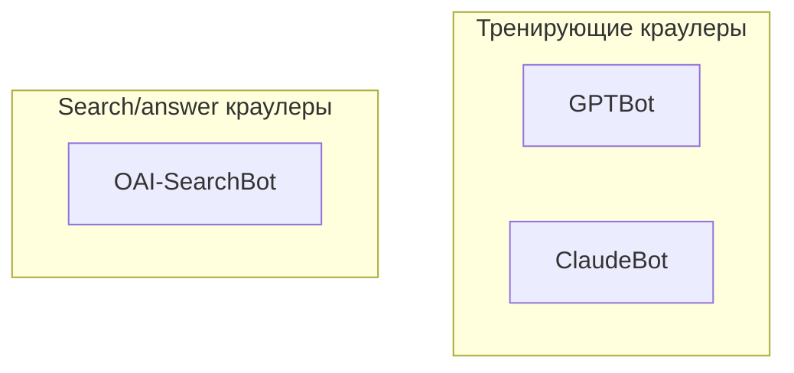

# Новый пост в блог artka.dev

Этот skill — рецепт: source → research → черновик в стиле автора → валидный
`src/content/posts/<slug>.md`. Цель — чтобы Артём мог взять файл и опубликовать
без редактирования.

## 1. Когда вызывать

- «напиши пост по [URL]» / «сделай статью про [тему]»
- «вот два твита, оформи как статью»
- «черновик в блог про [...]»
- «опубликуй разбор [сабжа]»

Если из реплики не понятно — формат, угол, длина, язык — **запроси уточнение
у пользователя одним сообщением, до начала работы**. Перечисли варианты и
жди ответ. Минимум, что нужно подтвердить:

1. **Угол подачи**: технический разбор / эссе-размышление / личный опыт +
   инструкция / гибрид. (Дефолт — гибрид «новость → разбор → как использовать
   → что значит».)
2. **Объём**: короткая (3–5 мин, ~700 слов) / средняя (8–12 мин, ~1800–2200) /
   длинная (15+ мин, ~3000+).
3. **Что значит «как использовать»**: интеграция в TS/Astro-стек / просто curl
   /Python-примеры / подключение как coding agent / ничего из этого.

Не пиши пост без понимания источника. Прочитай источник целиком (`WebFetch` /
`Read`) и сформулируй явный план в первом сообщении пользователю — что за пост,
какие секции, какие данные подтверждены источником, чего не хватает. Только
после согласия пользователя — пиши файл.

## 2. Процесс (по шагам)

### 2.1. Извлеки факты из источника

- Если URL — `WebFetch` сначала, потом `WebSearch` для контекста и кросс-проверки.
- Если у тебя только заголовок/идея — `WebSearch` с year-фильтром (текущий месяц
  есть в `<env>` системного промпта).
- Если источник — твит/X-пост: `WebFetch` часто возвращает пустоту (JS-only).
  В таком случае ищи зеркала / threadreaderapp / поиск по фразе из твита /
  цитируемые материалы (HN-обсуждения, GitHub-репы, оф. блог-посты).
- Если источник — GitHub-репозиторий: читай README через `WebFetch`, ищи
  benchmarks, API-конфиги, готовые рецепты. Не выдумывай цифры.

**Критически:** не сочиняй численные данные (t/s, % качества, размеры моделей).
Если в источнике их нет — пиши «по заявлению автора», «согласно README», или
прямо «нужно перепроверить на своём железе» (это реальный приём из стиля
автора, см. §4).

### 2.2. Подбери slug

- Короткий, kebab-case, `/^[a-z0-9][a-z0-9-]*$/`, до 100 символов.
- Без слов «как», «что», «почему» в начале — длинно и SEO-плохо.
- Хорошо: `local-coding-agent`, `robots-txt-ai-crawlers-2026`, `mermaid-svg-playwright-build-time`.
- Плохо: `как-запустить-deepseek-локально`, `pro-deepseek-na-mac-2026`.

Если slug совпадает с существующим в `src/content/posts/` — добавь модификатор
(`-2026-may`, `-quickstart`).

### 2.3. Прочти 1–2 эталонных поста для стиля

Не пиши «свежим листом» — открой и пробеги:

- `src/content/posts/robots-txt-ai-crawlers-2026.md` — образец тех-разбора
  (нумерованные секции, таблица решений, готовый шаблон, FAQ).
- `src/content/posts/local-coding-agent.md` — образец «новость + разбор +
  инструкция» (личный опыт, бенчмарки, конфиги).

См. §4 — выжимка приёмов.

### 2.4. Напиши файл

Используй `TEMPLATE.md` рядом со SKILL'ом как скелет. Полный конструктор
frontmatter в §3.

### 2.5. Самопроверка перед сдачей

Прогоняй чек-лист из §6. Проверяй длины полей программно через `wc -m`
или короткий Python-сниппет (см. чек-лист) — не на глаз. Опубликованный
пост `local-coding-agent` уже один раз сломался из-за того, что summary
оказалась 292 символа, не 280.

### 2.6. Покажи результат и подскажи следующий шаг

В конце даёшь:

- `[Открыть файл](computer:///Users/izual/astro-blog/src/content/posts/<slug>.md)` —
  ссылку на готовый файл.
- 2-3 строки: что это за пост, какие угол + поля заполнены, длина в словах.
- Напоминание про `pnpm translate` для генерации EN-зеркала.

## 3. Frontmatter — точная схема

**Источник истины:** `src/content.config.ts` (collection `posts`). Ниже —
актуальные лимиты на момент 2026-05-10. Если будешь править — сначала
сверься с файлом.

| Поле          | Обязат. | Тип                                                | Лимит                       | Пример                               |
| ------------- | ------- | -------------------------------------------------- | --------------------------- | ------------------------------------ |
| `title`       | ✅      | string                                             | 3..120                      | `"ds4 от antirez: …"`                |
| `description` | ✅      | string                                             | 10..200                     | для SEO/OG, под `<title>` страницы   |
| `summary`     | ⚠️      | string                                             | 60..280                     | TL;DR-карточка под обложкой          |
| `keywords`    | ➖      | array of strings                                   | 0..40 (каждый 1..80)        | `["harness", "prompt caching"]`      |
| `faq`         | ➖      | array of `{question,answer}`                       | 0..20; q 5..200; a 20..2000 | вопрос-ответ блок + JSON-LD FAQPage  |
| `pubDate`     | ✅      | YYYY-MM-DD                                         | —                           | `2026-05-09`                         |
| `updatedDate` | ➖      | YYYY-MM-DD                                         | —                           | при обновлении старого поста         |
| `tags`        | ➖      | array of strings                                   | —                           | `[ai, local-inference]` (slug-стиль) |
| `draft`       | ➖      | boolean                                            | default false               | `true` пока не готово к публикации   |
| `cover`       | ➖      | string (URL под `/uploads/` или `/og-default.svg`) | —                           | `/og-default.svg`                    |
| `coverAlt`    | ➖      | string                                             | —                           | alt для обложки                      |
| `lang`        | ➖      | `"ru"` \| `"en"`                                   | —                           | `"ru"` (RU — source of truth)        |

⚠️ **`summary` обязательна** для постов с `pubDate ≥ 2026-05-02` —
проверяется тестом `tests/unit/content/schema.test.ts`. Поле в Zod-схеме
помечено `.optional()`, но тест валит билд.

➖ — опционально, но почти всегда стоит заполнять `keywords` (для
семантического поиска и LLM-цитирования) и `faq` (для JSON-LD FAQPage —
добавляется в `@graph` страницы автоматически).

**Различие `tags` vs `keywords`:** теги — slug-style рубрики (`ai`, `seo`,
`local-inference`), агрегируются на главной через `groupPostsByTag` и
формируют `/tags/<slug>` архивы. keywords — свободные семантические
фразы для retrieval, не slug.

**Шаблон стартового frontmatter:**

```yaml
---
title: "" # 3..120
description: "" # 10..200, под SEO/OG
summary: "" # 60..280, TL;DR-карточка
keywords: # 0..40 семантических фраз
  - ""
faq: # JSON-LD FAQPage внизу поста
  - question: ""
    answer: ""
pubDate: 2026-MM-DD
tags: # slug-style рубрики
  - ""
cover: "/og-default.svg" # или путь под /uploads/
coverAlt: ""
lang: "ru"
draft: false
---
```

## 4. Стиль автора (Артём, artka.dev)

Прочти `src/content/posts/robots-txt-ai-crawlers-2026.md` целиком хотя бы один
раз. Ниже — приёмы, которые автор использует регулярно. Имитируй структуру и
интонацию, **не** копируй фразы дословно.

### 4.1. Открывающий блок

- Начинается с `>` blockquote-параграфа, который ставит тезис всей статьи в
  3-5 предложений: «вот что произошло, вот почему это важно, вот что в этом
  посте». Без заголовка `#` — он берётся из `title`.
- Сразу после blockquote — `---` (тематический разрыв).

Пример:

```markdown
> Garry Tan и Bindu Reddy 9 мая 2026 одновременно расшарили одну и ту же
> новость: создатель Redis Salvatore Sanfilippo (antirez) выложил [`ds4`](...)
> — инференс-движок на C+Metal, который запускает DeepSeek V4 Flash на
> ноутбуке. Не «технически возможно», а «работает с coding-агентами на 26 t/s».
> Я разобрался, что под капотом, и как использовать это как локальный backend
> для Claude Code.

---
```

### 4.2. Нумерованные секции с двойными точками

Заголовки секций пронумерованы и имеют тире/двоеточие:

```markdown
## 1. Что произошло за две недели

## 2. Три инженерных трюка, которые делают это возможным

### 2.1. Асимметричное 2-битное квантование
```

Между крупными секциями — `---` separator. Это даёт читаемый ритм.

### 4.3. Таблицы для всего, что сравнимо

Если есть >2 строк сопоставимых данных — таблица. Не bullet-list.

```markdown
| Машина                      | Квант | Generation |
| --------------------------- | ----- | ---------- |
| MacBook Pro M3 Max, 128 GB  | q2    | 26.68 t/s  |
| Mac Studio M3 Ultra, 512 GB | q4    | 35.50 t/s  |
```

### 4.4. Блок-цитаты для аргумента из источника

Когда цитируешь README/twitter/другой пост — `>` blockquote, после него своя
интерпретация:

```markdown
Из README:

> The KV cache **is actually a first class disk citizen**.

На практике это означает...
```

### 4.5. Mermaid-диаграммы — активно искать места, где они полезны

**Установка по умолчанию: на каждый пост — 1–2 диаграммы.** Это не «можно
если хочется», это «по умолчанию должны быть, и нужно специально обосновать
их отсутствие». Пост без диаграмм — норма только если предмет настолько
линейный, что схема не добавляет смысла (короткое эссе, отзыв, размышление).
Тех-разбор без диаграммы — пробел.

Где искать места:

- **Поток данных** — есть какой-то pipeline? Source → Process → Output → Sink.
  `flowchart LR` отлично работает.
- **Таксономия / классификация** — посты про классы ботов, типы моделей,
  категории чего-то. `flowchart TB` с `subgraph`-ами.
- **Жизненный цикл** — что-то проходит через состояния? `stateDiagram-v2`.
- **Взаимодействие** — клиент-сервер, агент-LLM, сервис-сервис. `sequenceDiagram`.
- **Иерархия** — слои абстракции, зависимости пакетов, дерево решений.
  `flowchart TD` или `mindmap`.
- **Сравнение архитектур до/после** — две `subgraph`-ы рядом.

Синтаксис:

````markdown

````

Mermaid рендерится через `rehype-mermaid` (img-svg) на этапе сборки —
тестируй синтаксис на mermaid.live до коммита. Если диаграмма больше 8–10
узлов — она не помогает, она перегружает; разбивай на две.

### 4.5bis. LaTeX-формулы — где это ускоряет понимание

Если в посте появляется численная зависимость, метрика, скорость, рост —
**формула короче, чем абзац**. Не пиши «генерация падает примерно в N раз
при увеличении контекста в M раз» — пиши $t_{\text{gen}} \propto 1/L_{\text{ctx}}$.

KaTeX подключён, поддерживается:

- **Inline:** `$E = mc^2$` — внутри предложения.
- **Block:** `$$\text{throughput} = \frac{\text{tokens}}{\text{wall-time}}$$` —
  отдельная строка для важных формул.

Где почти всегда уместно:

- Производительность / scaling: $\mathcal{O}(n \log n)$, $\propto$, $\Theta$.
- Бенчмарки и метрики: `t/s`, `p95`, размеры моделей.
- Статистика: $\mu$, $\sigma$, $p$-value, доли.
- Любые «X в Y раз больше Z» — превращай в формулу.

Используй LaTeX **только когда формула реально читабельнее текста**. Не пиши
$2 + 2 = 4$ ради красоты.

### 4.6. Code-блоки с языком

Всегда указывай язык: ` ```bash`, ` ```ts`, ` ```yaml`, ` ```sql`, ` ```mermaid`.
Без языка shiki не подсветит. Для Bash-сессий ставь `$` префикс.

### 4.7. «Моя политика», «owner to fill» — допустимая разметка субъективности

Автор честно маркирует:

- субъективные решения: «моя политика для artka.dev — все 9 ботов на Allow»;
- неготовое: `(owner to fill: после следующего ревью разобрать топ-20 UA)`;
- источник цифр: «по бенчмаркам автора», «согласно README».

### 4.8. Голос — только сделанное, никаких планов и «я разверну»

**Категорическое правило: пост описывает то, что УЖЕ произошло или РАБОТАЕТ
сейчас. Не то, что автор планирует / собирается / разберётся / перепроверит,
когда приедет железо.**

❌ Так писать нельзя:

- «Я планирую развернуть это на MacBook Pro M3 Max…»
- «Когда у меня будет железо, я перепроверю эти цифры…»
- «В этом разделе — честный план, что я буду делать…»
- «Я попробую это на следующей неделе и обновлю пост…»
- «Если получится — расскажу в следующем посте…»
- «У меня его пока нет, но я хочу попробовать…»

✅ Если автор не имеет личного опыта — пиши **от имени источника**, без
обещаний от себя:

- «По бенчмаркам автора, на M3 Max генерация идёт 26 t/s.»
- «Согласно README, сборка занимает две недели.»
- «В README прямо написано: ‹цитата›.»
- «Авторские цифры (которые имеет смысл проверить на своём железе): …»

Эта рамка делает пост сильнее: читатель не упирается в «когда-нибудь
автор расскажет», а получает законченное описание чужого результата с
ссылками на первоисточник.

Если личный опыт правда есть — пиши в **прошедшем** или **настоящем**
времени: «развернул на M3 Max, генерация 26 t/s», «у меня в проде это
уже два месяца». Не «я разверну», не «я попробую».

### 4.8. Источники в конце поста

Списком, последний раздел перед закрытием:

```markdown
**Источники:**

- [github.com/owner/repo](https://github.com/owner/repo) — README, бенчмарки
- [Garry Tan @ X](https://x.com/garrytan/status/...) — пост от 9 мая 2026
- [HN-обсуждение](https://news.ycombinator.com/item?id=...)
```

После мержа PR `feat/admin-post-editor-frontmatter-fix` все внешние ссылки
автоматически получают `rel="nofollow noopener noreferrer" target="_blank"` —
не пиши это вручную, это работа `rehype-external-links`.

### 4.9. Итог

Закрывающий раздел `## Итог` (не «Заключение», не «Выводы») — 1-2 абзаца,
которые **дублируют тезис из открывающего блокквота, но с накопленным
контекстом**. Не «коротко повторим всё», а «вот к чему мы пришли».

### 4.10. Чего автор НЕ делает

- Эмодзи в тексте — нет (исключение: 🚨/⚠️ в FAQ-ответах когда уместно).
- «Дорогой читатель», «давайте разберёмся», «как мы видим» — нет.
- Восклицательные знаки в утверждениях — нет.
- Маркетинговый тон — нет. Автор пишет как инженер инженеру.

### 4.11. Запрещённые конструкции (речевой чёрный список)

Эти штампы делают текст вязким и одинаковым; если они повторяются — пост
звучит как машинный пересказ. Удаляй / переписывай.

**Штамп «это про X / это не про Y».** Особенно убиваем, когда два
предложения подряд начинаются с этой конструкции.

❌ Плохо:

> Это про инженерную практичность, не про маркетинг. Это про то, как
> один человек делает узкий движок, не про универсальный фреймворк.

✅ Хорошо — выкинуть «это про» и сказать конкретно:

> Antirez делает узкий движок под одну модель, не универсальный фреймворк
> под все. Цена решения — переписывать с нуля при смене модели; выгода —
> прирост, который универсальному раннеру технически недоступен.

**Другие штампы, которые автор не использует** (всё это — сигнал, что
надо переписать):

- «Стоит отметить», «нельзя не обратить внимание», «как мы уже сказали».
- «По сути», «в принципе», «по большому счёту» — пустые филлеры.
- «Действительно», «реально», «на самом деле» — почти всегда лишние.
- «Каждый разработчик знает», «всем известно», «очевидно, что».
- «Самое главное», «самое важное», «ключевой момент» — выбор за читателем,
  не подсказывай.
- «Не секрет, что».
- Канцелярит: «осуществляется», «производится», «является» — заменяй на
  активный глагол.

**Структурный маркер:** если два соседних абзаца начинаются с одной и
той же конструкции (`Это про…` / `Это не про…` / `Стоит отметить…` /
`По сути…`) — переписать оба. Один из них — точно лишний.

## 5. Body — что должно быть и в каком порядке

```
> Открывающий blockquote (тезис в 3-5 предложений)

---

## 1. <первая секция: контекст, "что произошло">

## 2. <вторая секция: разбор / как устроено>

### 2.1. <подсекция>

### 2.2. <подсекция>

## 3. <третья секция: что нужно / какие требования>

## 4. <четвёртая секция: пошагово / инструкция>

## 5. <пятая секция: грабли / ограничения>

## 6. <шестая секция: что это значит / тренд>

---

## Итог

<2 абзаца — закрытие тезиса>

---

**Источники:**

- ссылка 1
- ссылка 2
```

Адаптируй количество секций под объём:

- Короткая (700 слов): 3 секции + Итог.
- Средняя (1800–2200): 5–7 секций + Итог.
- Длинная (3000+): 7–9 секций + Итог.

## 6. Финальный чек-лист (запусти перед сдачей)

```bash
# 1. Длины полей frontmatter — программно, не на глаз.
python3 << 'EOF'
import yaml, re
with open("src/content/posts/<slug>.md") as f: c = f.read()
m = re.match(r"^---\n(.*?)\n---\n", c, re.DOTALL)
fm = yaml.safe_load(m.group(1))
print(f"title: {len(fm['title'])} (3..120)")
print(f"description: {len(fm['description'])} (10..200)")
if fm.get('summary'): print(f"summary: {len(fm['summary'])} (60..280)")
for i, q in enumerate(fm.get('faq') or [], 1):
    print(f"FAQ#{i} Q: {len(q['question'])} (5..200), A: {len(q['answer'])} (20..2000)")
EOF

# 2. Слов в теле — соответствует ли запрошенному объёму.
wc -w src/content/posts/<slug>.md
```

Содержательная проверка:

- [ ] Slug подходит под `^[a-z0-9][a-z0-9-]*$`, нет конфликта с существующим
- [ ] `pubDate` — сегодня (или явно указанная дата)
- [ ] `description` ≤ 200, не обрывается на пол-слове
- [ ] `summary` — 60..280, выражает главное в одном предложении-двух
- [ ] `keywords` 5–10 фраз, не дублируют `tags`
- [ ] `faq` — 4–6 вопросов; каждый ответ ≥ 20 символов; вопросы реально
      возникающие, не «зачем существует X»
- [ ] `tags` — 3–5 slug-style; новые теги — окей, агрегатор подхватит
- [ ] `cover: "/og-default.svg"` если нет специальной обложки;
      `coverAlt` непустой
- [ ] `lang: "ru"`, `draft: false`
- [ ] В body **первый** элемент после frontmatter — это `>` blockquote
      (тезис), потом `---`, потом нумерованные `## N.` секции
- [ ] Никаких `# Заголовок` в body (он из frontmatter `title`)
- [ ] **Mermaid: ≥1 диаграмма на пост** (или явная причина почему её нет —
      см. §4.5). Проверена на mermaid.live.
- [ ] **LaTeX**: проверь, есть ли в посте численные зависимости / метрики /
      пропорции. Если есть — формула вместо абзаца (см. §4.5bis).
- [ ] Code-блоки с указанием языка
- [ ] Внешние ссылки — markdown-style `[text](url)`, без ручного `target`/`rel`
- [ ] `## Итог` в конце + раздел `**Источники:**` ниже
- [ ] Body чистый, **без** ведущего YAML-блока (это убьёт парсер)

**Голос и штампы — ручной грep по тексту:**

```bash
# Запрещённые конструкции — должно быть 0 совпадений
grep -niE 'это про |это не про |стоит отметить|нельзя не обратит|по сути|по большому счёт|на самом деле|каждый (разработчик|инженер) знает|очевидно, что|самое главное|самое важное|не секрет, что|осуществл|производится|является ' src/content/posts/<slug>.md

# Спекулятивный голос — должно быть 0 совпадений
grep -niE 'я планиру|я разверну|когда у меня|если получится|я попробую|я перепровер|я обновлю пост|у меня его пока нет|когда железо приедет|собираюсь развернуть' src/content/posts/<slug>.md
```

Каждое совпадение — переписать. Если grep возвращает что-то — пост ещё не
готов.

## 7. Типичные грабли

- **Двойной фронтматтер**: если по ошибке вставил `---…---` в начало body —
  опубликованный пост покажет `faq:` плоским текстом. После мержа PR
  `feat/admin-post-editor-frontmatter-fix` админка санитизирует. Но в
  файлах напрямую — не дублируй.
- **`description.max(300)` в action vs 200 в content schema**: уже
  синхронизировано до 200 в обоих после фикса. Если поле длиннее 200 —
  Zod в action отшибёт сохранение, и/или билд упадёт на content-валидации.
- **Mermaid-блок без языка**: ` ```mermaid` обязателен. Без него shiki
  попробует подсветить и сломает рендер.
- **`#` в начале body**: дубль с `title`, дальше всё съедет на один уровень
  заголовков.
- **FAQ-ответ короче 20 символов**: Zod зарубит. Если нечего ответить —
  не добавляй вопрос.
- **Внешние ссылки на `artka.dev`**: пишем как относительные `/blog/foo`,
  не как `https://artka.dev/blog/foo`. Иначе rehype не пропустит и
  отметит как external.

## 8. Финальная сдача — формат

В конце реплики покажи:

```
[Открыть файл](computer:///Users/izual/astro-blog/src/content/posts/<slug>.md)

**О чём статья:** 1-2 предложения.

**Структура:** N секций + Итог + Источники, ~XXXX слов, ~YY минут чтения.

**Что заполнено:** title, description, summary (NN символов), keywords (N),
faq (N вопросов), tags (N), cover, coverAlt, lang=ru.

**Дальше:** запустить `pnpm translate` для генерации EN-зеркала перед
коммитом, иначе CI упадёт на `pnpm translate:check`.
```

Никаких длинных постамбул или объяснений «почему я выбрал такую структуру» —
файл говорит сам за себя.

## 9. Импорты

См. файл `TEMPLATE.md` рядом — готовый skeleton для копирования и заполнения.
