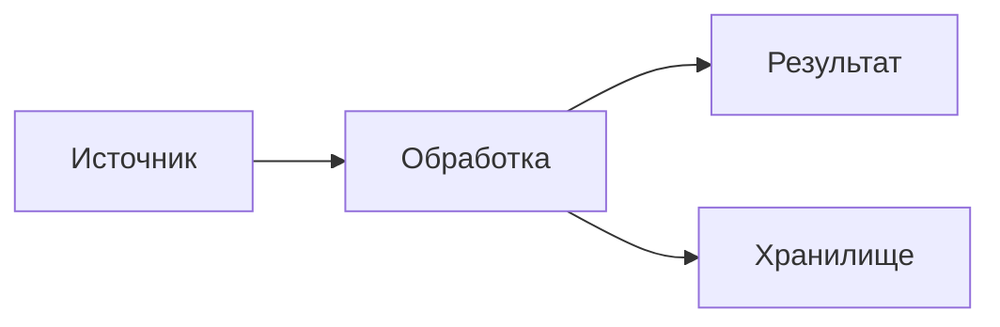

> Открывающий тезис в 3-5 предложений: что произошло, почему важно, что в этом
> посте. Не «введение», а готовая мини-новость для читателя, который
> остановится только на этом блокквоте. Заголовок `#` НЕ ставим — он
> возьмётся из поля Title в админке. Голос — от первого лица Артёма,
> только сделанное / то, что работает сейчас, никаких «я планирую» / «когда
> получится — расскажу».

---

## 1. Контекст: что произошло

Раздел-затравка. Кто, что, когда, какие масштабы. 1-2 абзаца. Если есть
быстрая таблица численных данных — здесь её и поставить.

| Что        | Значение | Источник        |
| ---------- | -------- | --------------- |
| Параметр 1 | 42       | по README       |
| Параметр 2 | 26 t/s   | бенчмарк автора |

## 2. Как это устроено

Технический разбор. Делим на подсекции `### 2.1.`, `### 2.2.` — по одной
идее в каждой.

### 2.1. Поток данных или таксономия — даём диаграмму

**По умолчанию каждый пост содержит 1–2 mermaid-диаграммы.** Если предмет
позволяет показать поток / классификацию / жизненный цикл / взаимодействие —
делаем здесь.



### 2.2. Численные зависимости — даём формулу

Если в разборе появляется метрика / пропорция / scaling — формула короче,
чем абзац. Пример inline: время до первого токена $t_{\text{ttft}}$ растёт
линейно от длины контекста $L$ при первом запросе и падает к константе при
повторных за счёт KV-cache:

$$t_{\text{ttft}} = \begin{cases} \alpha \cdot L & \text{первый запрос} \\ \text{const} & \text{с диска KV} \end{cases}$$

Используем LaTeX только когда формула реально читабельнее текста — не пишем
$2+2=4$ ради красоты.

## 3. Что нужно: требования / окружение

| Что     | Минимум | Комментарий        |
| ------- | ------- | ------------------ |
| Node.js | 24      | LTS                |
| RAM     | 16 GB   | для базовой сборки |

## 4. Шаги: как воспроизвести

```bash
git clone https://github.com/example/repo.git
cd repo
pnpm install
pnpm build
```

## 5. Грабли: где это сломается

**Грабли первые.** Описание: что происходит, почему, как обойти.

**Грабли вторые.** Описание.

## 6. Что это значит: контекст и тренд

Аналитика. Не «выводы», а развёрнутая мысль про индустрию или практику.
Личное мнение допустимо — отметь маркером «на мой взгляд». Конкретные
суждения, не штампы вида «это про X / это не про Y». Никаких «по словам
автора треда» — голос свой.

---

## Итог

Закрывающий абзац. Не «коротко повторим всё», а возврат к тезису из
открывающего блокквота с накопленным контекстом. 1-2 абзаца, без
маркетинга.

---

**Источники:**

- [Первоисточник 1](https://example.com/source) — что там
- [Первоисточник 2](https://github.com/owner/repo) — README, бенчмарки

> Пересказчиков и третьих рук в Sources не упоминаем — только первоисточники
> (см. §4.12 в SKILL.md).
