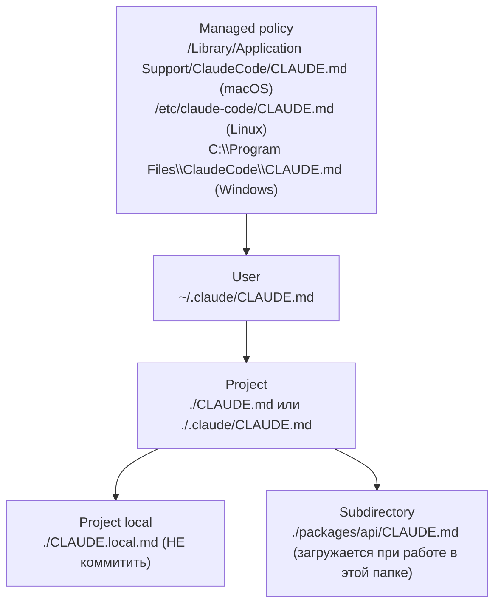

# 03. CLAUDE.md: уровни, импорты, авто-память

> CLAUDE.md — это «paste this every time» в красивой обёртке. Файл, который автоматически вклеивается в system prompt каждой сессии. Используется правильно — экономит десятки тысяч токенов и делает модель внезапно умной про ваш проект. Используется неправильно — раздувает контекст и противоречит сам себе.

---

## 3.1. Что это и зачем

📘 Из docs (`memory`): «CLAUDE.md files are markdown files that give Claude persistent instructions. Claude reads them at the start of every session».

Если у вас в проекте есть нюансы («у нас Hono, а не Express», «мы используем pnpm», «pg-схема в `db/migrations/`») — без CLAUDE.md модель будет каждый раз заново ходить читать файлы и угадывать. С CLAUDE.md — она знает это с первого хода.

⚠️ Утверждение «снижает число обращений к файлам» — здравая практика, но в самих docs так напрямую не сформулировано. Документация говорит про «persistent instructions» и «context guidance». Эффект — да, обращений меньше; но это следствие, а не цитата.

---

## 3.2. Все уровни CLAUDE.md и их приоритет

В Claude Code есть **четыре уровня** + **subdirectory** уровень:



📘 Из docs: «More specific locations take precedence over broader ones, all discovered files are concatenated rather than overriding».

То есть **более специфичные не перезаписывают, а добавляются сверху**. Если в user CLAUDE.md написано «всегда используй TypeScript strict», а в project — «у нас strictNullChecks выключен» — модель увидит обе фразы, и более локальная (project) будет восприниматься как более авторитетная просто из-за позиции и контекста.

---

## 3.3. Как Claude обнаруживает CLAUDE.md

При старте сессии в директории `cwd` harness ищет:

1. `./CLAUDE.md`
2. `./.claude/CLAUDE.md`
3. `./CLAUDE.local.md` (если есть)
4. По всем родительским директориям до корня файловой системы — все найденные тоже подхватываются.

**Subdirectory CLAUDE.md** загружается **по требованию** — когда модель начинает работать в этой папке (читает файлы из неё, делает Bash в её корне). Это позволяет иметь огромную monorepo с локальными «памятками» в каждом пакете без раздувания базового контекста.

🔧 **Для Travel Agent** (monorepo):

```
travel-agent/
├── CLAUDE.md                  # глобальные правила проекта
├── .claude/
│   └── settings.json          # шеры настройки команды
├── apps/
│   ├── web/
│   │   └── CLAUDE.md          # подгружается при работе во frontend
│   └── api/
│       └── CLAUDE.md          # подгружается при работе в backend
├── packages/
│   ├── mcp-flights/
│   │   └── CLAUDE.md          # специфика MCP-сервера для авиа
│   └── shared/
│       └── CLAUDE.md          # типы, валидаторы
└── CLAUDE.local.md            # личные заметки разработчика (в .gitignore)
```

---

## 3.4. Импорты через `@`

📘 Из docs: «Imports use `@path/to/import` (relative or absolute, recursive up to 5 hops)».

Внутри CLAUDE.md можно подтягивать другие файлы:

```markdown
# Travel Agent: глобальные правила

## Стек
- Backend: @docs/architecture/backend-stack.md
- Frontend: @docs/architecture/frontend-stack.md

## Команды
@docs/dev/commands.md

## Соглашения по коду
@.editorconfig
@docs/conventions/typescript.md
@docs/conventions/git-commits.md
```

Когда Claude читает этот CLAUDE.md, он автоматически инлайнит содержимое всех импортов (рекурсивно, до 5 уровней вложенности). Для модели всё это выглядит как один большой документ.

💡 **Зачем так делать:**

1. Декомпозиция большого CLAUDE.md на тематические куски.
2. Переиспользование одних и тех же документов в нескольких CLAUDE.md.
3. Можно держать «настоящие» документы (`docs/architecture/...`) для людей и просто ссылаться из CLAUDE.md.

⚠️ Ограничение в 5 hops: если у вас A → B → C → D → E → F, то F уже не подхватится. И модель об этом не предупредит.

---

## 3.5. Что класть в CLAUDE.md (и чего не класть)

**Класть:**

✅ Стек (Hono, не Express. Vite, не Webpack. pnpm, не npm.)
✅ Структура репо в одной диаграмме (mermaid или ASCII).
✅ Команды для основных задач (`pnpm dev`, `pnpm test`, `pnpm db:migrate`).
✅ Соглашения по коду, которые специфичны для проекта (как именовать handlers, где лежат миграции).
✅ Запреты («не трогай файлы в `legacy/`», «не используй `console.log`, у нас pino»).
✅ Подсказки для частых tasks («перед изменением API — обнови `packages/shared/types`»).

**Не класть:**

❌ README. Если нужен контекст — линкуйте через `@README.md`.
❌ Лицензию.
❌ Длинные ADR'ы целиком. Лучше «у нас выбран Postgres, обоснование в @docs/adr/0003-postgres.md» — модель сама прочитает, если будет надо.
❌ Полный список зависимостей с версиями. Это меняется часто, и `package.json` всё равно есть.
❌ Истории «почему было так и стало эдак». Зашумляет.

💡 **Эвристика по размеру:** один CLAUDE.md на уровне — не больше **300 строк** или **5000 токенов** (`/context` покажет). Большее — выносите в импорты или в subdirectory CLAUDE.md.

---

## 3.6. Шаблон для Travel Agent (project-level)

🔧 `./CLAUDE.md`:

```markdown
# Travel Agent

AI-сервис планирования путешествий. Backend на Node + Hono + TS, frontend на React + Vite + TS, агент использует Anthropic SDK + 4 MCP-сервера.

## Структура репозитория

travel-agent/
├── apps/
│   ├── web/        — React SPA (Vite)
│   └── api/        — Hono backend, эндпоинты /chat, /trips
├── packages/
│   ├── mcp-flights/   — MCP server (Amadeus)
│   ├── mcp-hotels/    — MCP server (Duffel)
│   ├── mcp-weather/   — MCP server (OpenMeteo)
│   ├── mcp-docs/      — MCP server для нашей wiki
│   └── shared/        — типы, zod-схемы, общие утилиты
├── infra/             — docker-compose, k8s манифесты
└── docs/

## Команды

- `pnpm dev` — поднять api + web одновременно
- `pnpm test` — vitest для всех пакетов
- `pnpm typecheck` — tsc --noEmit по всему монорепо
- `pnpm lint` — eslint + prettier --check
- `pnpm db:migrate` — применить миграции drizzle

## Соглашения

- TypeScript strict, никаких `any`. Если нужно — `unknown` + type guard.
- React: только функциональные компоненты, hooks. Без классов.
- Backend: Hono routers в `apps/api/src/routes/`, бизнес-логика в `apps/api/src/services/`.
- MCP-серверы в `packages/mcp-*` следуют единому шаблону: `src/server.ts` экспортирует `createServer()`.
- Импортируем через workspace: `@travel/shared`, `@travel/mcp-flights`.

## Запреты

- Не трогать `apps/api/src/legacy/` — старая интеграция, удаляется в Q2.
- Не использовать `console.*` — везде `logger` из `@travel/shared/logger` (pino).
- Не писать сырой SQL — только через drizzle query builder.

## Перед коммитом

@docs/dev/precommit-checklist.md

## Конкретика по подсистемам

@docs/architecture/mcp-servers.md
```

И в подпапках:

🔧 `./apps/api/CLAUDE.md`:

```markdown
# Backend (api)

Hono + TS, минимальный middleware-стек.

## Точки входа
- `src/index.ts` — startup, регистрация роутов.
- `src/routes/chat.ts` — основной чат-эндпоинт со стримингом (SSE).
- `src/routes/trips.ts` — CRUD сохранённых маршрутов.

## Anthropic SDK

Использовать `@anthropic-ai/sdk` с моделью `claude-opus-4-7` для агентного цикла.
MCP-серверы подключаются через локальный stdio-transport — конфиг в `src/mcp/config.ts`.

## База

drizzle + postgres-js. Схема в `src/db/schema.ts`. Все запросы через `src/db/repositories/`.

## Тесты

vitest + supertest. Каждый роут должен иметь happy path + 1 ошибочный сценарий.
```

🔧 `./apps/web/CLAUDE.md`:

```markdown
# Frontend (web)

React 19 + Vite + Tailwind + shadcn/ui + TanStack Query.

## Структура

- `src/pages/` — top-level страницы (router-aware).
- `src/components/` — shadcn-обёртки и доменные компоненты.
- `src/lib/api.ts` — типизированный клиент к /api (источник истины — типы из `@travel/shared`).
- `src/hooks/` — переиспользуемые hooks.

## SSE для чата

Используем `@microsoft/fetch-event-source` — пример в `src/hooks/useChatStream.ts`.

## Стилизация

Только Tailwind utility-классы. Кастомный CSS — только в `src/index.css` для глобальных переменных.
shadcn/ui компоненты копируем через CLI, лежат в `src/components/ui/`.
```

---

## 3.7. CLAUDE.local.md и приватные настройки

📘 `CLAUDE.local.md` — для **личных** заметок разработчика. Не коммитится (его лучше добавить в `.gitignore`).

Что там может быть:

```markdown
# Личное

## Мои текущие тикеты
- TRV-145 — рефакторинг хука useChatStream, без изменения API
- TRV-152 — добавить retry в mcp-flights при 503 от Amadeus

## Окружение
- Использую pnpm 9.x, node 22.
- Postgres локальный, миграции через `pnpm db:migrate:dev`.

## Заметки
- При работе с mcp-flights: тестовый ключ Amadeus в `.env.local`, прод-ключ — только в Vault.
```

Это та самая «4-я редакция» — она есть только у вас. Очень удобно, чтобы Claude знал ваш текущий контекст без необходимости каждый раз ему рассказывать.

---

## 3.8. Авто-память

📘 Из docs: «Claude also creates auto memory as it works, persisting knowledge … across sessions».

Помимо CLAUDE.md, harness может **сам** добавлять заметки в специальный файл памяти. Это нужно, например, чтобы запомнить «у пользователя я уже проверял конкретный edge case». Эти заметки тоже попадают в системный префикс.

⚠️ Авто-память — относительно молодая фича, поведение может меняться от версии к версии. Если вам важна детерминированность контекста — выключите её в настройках или явно ревьюте.

---

## 3.9. Команды для работы с CLAUDE.md

| Команда | Что делает |
|---------|-----------|
| `/init` | Создать стартовый CLAUDE.md в текущей директории, проанализировав репо |
| `/memory` | Открыть CLAUDE.md в редакторе для правки |
| `/context` | Увидеть, сколько токенов занимает CLAUDE.md и его импорты |

💡 `/init` — реально хорошая отправная точка для нового проекта. Запустите, посмотрите что Claude сам предложил, отредактируйте под свои реалии.

---

## 3.10. Антипаттерны, которые встречаются чаще всего

❌ **«CLAUDE.md как README»** — туда копируют README со всеми рекламными разделами и changelog. → Раздувает префикс, модель видит лишний шум.

❌ **«CLAUDE.md как ADR-репозиторий»** — туда сваливают все архитектурные решения с обоснованиями. → Лучше: коротко «выбрали Postgres из-за X, детали в @docs/adr/...» и линк.

❌ **Противоречия между уровнями** — в user CLAUDE.md «используй tabs», в project — «используй spaces», в subdirectory — «у нас mixed». → Модель путается. Унифицируйте, держите project как единственный источник истины по проекту.

❌ **Отсутствие subdirectory CLAUDE.md в монорепо** — один огромный root CLAUDE.md на 800 строк. → Вынесите специфику пакетов в `apps/*/CLAUDE.md` и `packages/*/CLAUDE.md`.

❌ **Игнорирование `/context`** — никогда не смотрите, сколько весит ваш memory. Прозрите, когда столкнётесь с проблемой кэша.

---

**Дальше →** [04. Skills: SKILL.md, scripts, references](./04-skills.md)
