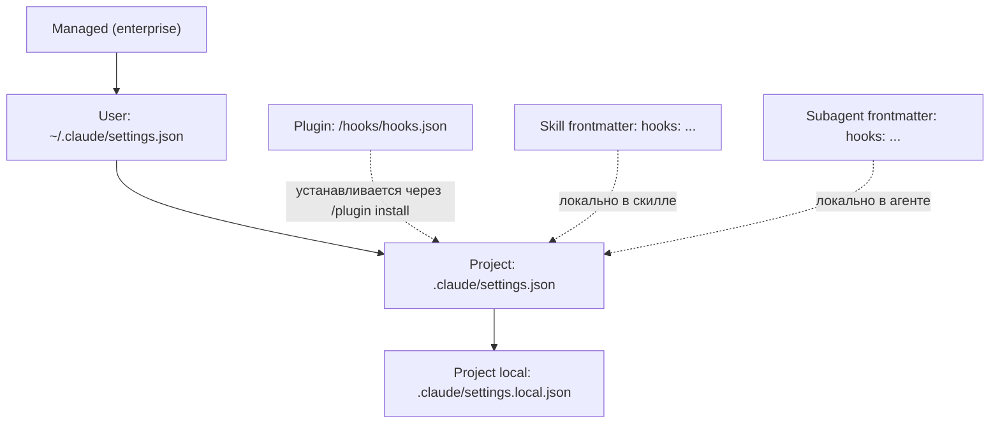

# 05. Hooks: детерминированный контроль над agent loop

> Hooks — это git hooks, но для Claude Code. Точки в lifecycle, в которые harness исполняет ваш скрипт. Если skill — это рекомендация модели, hook — это обязательный шаг harness'а, который **гарантированно** случится.

---

## 5.1. Зачем нужны hooks

📘 Из docs (`hooks-guide`): «Hooks provide deterministic control over Claude Code's behavior, ensuring certain actions always happen rather than relying on the LLM to choose to run them».

Сравнение «то же самое через skill vs hook»:

| Задача | Через skill | Через hook |
|--------|-------------|-----------|
| Запустить линтер после правки | Скилл «после Edit запусти `pnpm lint`», описание в CLAUDE.md | `PostToolUse` matcher: `Edit\|Write` → bash-команда |
| Запретить редактировать `secrets/` | «Не трогай папку secrets» в CLAUDE.md | `PreToolUse` matcher: `Edit\|Write` → exit 2 при `secrets/*` |
| Засинхронить с CI после Stop | Скилл «после задачи запусти CI» | `Stop` hook → bash «push branch + open PR» |
| Уведомить Slack о завершении | Это вообще не скилл, это операция | `Stop` или `Notification` hook → curl webhook |

⚠️ Skills модель *может* проигнорировать. Hooks — нет. Это и плюс, и минус: hooks дают железную дисциплину, но и тормозят, если их повесить на каждый чих.

---

## 5.2. Где определяются hooks



Все источники объединяются. Если несколько hooks матчатся на одно событие — выполняются **все** в порядке регистрации.

---

## 5.3. Полный список событий

📘 Реальный список в Claude Code v2.1.89 значительно богаче, чем перечисляют в большинстве туториалов:

| Событие | Когда срабатывает |
|---------|-------------------|
| `SessionStart` | При старте сессии |
| `SessionEnd` | При завершении сессии |
| `UserPromptSubmit` | Пользователь отправил сообщение |
| `UserPromptExpansion` | Раскрытие шорткатов в промпте |
| `InstructionsLoaded` | После загрузки CLAUDE.md / skills / agents |
| `PreToolUse` | Перед вызовом любого tool |
| `PostToolUse` | После успешного вызова tool |
| `PostToolUseFailure` | После неуспешного вызова tool |
| `PermissionRequest` | Когда tool требует подтверждения |
| `PermissionDenied` | Когда пользователь отказал |
| `SubagentStart` | Перед запуском subagent |
| `SubagentStop` | После завершения subagent |
| `TaskCreated` | Создана задача (TaskCreate) |
| `TaskCompleted` | Задача выполнена |
| `TeammateIdle` | Teammate в Agent Team простаивает |
| `Notification` | Системное уведомление |
| `Stop` | Конец цикла «модель ↔ tools» (модель закончила отвечать) |
| `StopFailure` | Сессия завершилась с ошибкой |
| `PreCompact` | Перед автокомпакцией |
| `PostCompact` | После автокомпакции |
| `ConfigChange` | Изменилась конфигурация |
| `CwdChanged` | Сменилась рабочая директория |
| `FileChanged` | Файл изменился (filesystem watch) |
| `WorktreeCreate` | Создан git worktree |
| `WorktreeRemove` | Удалён git worktree |
| `Elicitation` | MCP elicitation запрос |
| `ElicitationResult` | MCP elicitation ответ |

---

## 5.4. Структура hooks.json

📘 Каноничный пример из docs:

```json
{
  "hooks": {
    "PreToolUse": [
      {
        "matcher": "Write|Edit|MultiEdit",
        "hooks": [
          {
            "type": "command",
            "command": "bash ${CLAUDE_PLUGIN_ROOT}/scripts/scan-secrets.sh",
            "timeout": 30
          }
        ]
      },
      {
        "matcher": "Bash",
        "hooks": [
          {
            "type": "prompt",
            "prompt": "Evaluate if this bash command is safe for production. Check destructive ops, missing safeguards, security issues.",
            "timeout": 20
          }
        ]
      }
    ],
    "PostToolUse": [
      {
        "matcher": "Edit|Write",
        "hooks": [
          {
            "type": "command",
            "command": "bash ${CLAUDE_PLUGIN_ROOT}/scripts/run-linter.sh"
          }
        ]
      }
    ],
    "Stop": [
      {
        "matcher": ".*",
        "hooks": [
          {
            "type": "command",
            "command": "bash ${CLAUDE_PLUGIN_ROOT}/scripts/notify-team.sh",
            "timeout": 30
          }
        ]
      }
    ]
  }
}
```

**Поля:**

- **`matcher`** — regex по имени tool'а (для `PreToolUse`/`PostToolUse`) или паттерн по контексту. `.*` или `*` означает «всё».
- **`type`** — `command` (запуск shell-команды) или `prompt` (отдельный prompt модели как «второе мнение»).
- **`command`** / **`prompt`** — что исполнять.
- **`timeout`** — секунды; если hook не уложился, он падает.

---

## 5.5. Тип `command`: что получает скрипт и что должен вернуть

**Stdin:** JSON с информацией о событии:

```json
{
  "session_id": "...",
  "transcript_path": "/tmp/claude-session-xxx/transcript.jsonl",
  "cwd": "/home/me/travel-agent",
  "tool_name": "Edit",
  "tool_input": {
    "file_path": "apps/api/src/routes/trips.ts",
    "old_string": "...",
    "new_string": "..."
  }
}
```

**Stdout:** обычный вывод. Для `PostToolUse` — может быть фидбэк, который добавится в контекст модели.

**Exit code:**

| Код | Эффект |
|-----|--------|
| `0` | OK, продолжать |
| `2` | Блокировка действия. **Stderr показывается модели** как причина. Используется для `PreToolUse`, чтобы запретить вызов tool. |
| другое | Hook упал, harness сообщит ошибку, но действие продолжится |

**JSON-протокол** (для тонкого контроля):

```json
{
  "hookSpecificOutput": {
    "permissionDecision": "deny",
    "permissionDecisionReason": "File matches deny rule for secrets/*"
  }
}
```

Возможные `permissionDecision`: `allow`, `deny`, `ask`, `defer`.

⚠️ `PreToolUse` hook с `deny` блокирует действие **даже в `bypassPermissions` mode**. Это не «можно обойти, если очень хочется» — это финальный гейт.

---

## 5.6. Тип `prompt`: hook как отдельный запрос к модели

📘 Пример:

```json
{
  "type": "prompt",
  "prompt": "Analyze edit result for potential issues: syntax errors, security vulnerabilities, breaking changes. Provide feedback.",
  "timeout": 20
}
```

Что происходит: harness делает дополнительный запрос к модели с этим prompt'ом и tool result. Ответ возвращается в основную сессию как «inspector says ...».

💡 Это удобно для AI-second-opinion. Минус: каждый такой hook — это дополнительные токены.

---

## 5.7. Конкретные примеры для Travel Agent

### 5.7.1. Auto-format после правки кода

🔧 `.claude/settings.json`:

```json
{
  "hooks": {
    "PostToolUse": [
      {
        "matcher": "Edit|Write",
        "hooks": [
          {
            "type": "command",
            "command": "bash .claude/hooks/format.sh"
          }
        ]
      }
    ]
  }
}
```

🔧 `.claude/hooks/format.sh`:

```bash
#!/bin/bash
input=$(cat)
file_path=$(echo "$input" | jq -r '.tool_input.file_path')

# Только TS/TSX/JS/JSON
if [[ "$file_path" =~ \.(ts|tsx|js|jsx|json|md)$ ]]; then
  pnpm prettier --write "$file_path" 2>&1 || true
  if [[ "$file_path" =~ \.(ts|tsx)$ ]]; then
    pnpm eslint --fix "$file_path" 2>&1 || true
  fi
fi
```

Эффект: после каждой правки кода Claude'ом запускается prettier/eslint. Модель не может «забыть» — гарантировано.

### 5.7.2. Запретить редактирование секретов

🔧 `.claude/settings.json`:

```json
{
  "hooks": {
    "PreToolUse": [
      {
        "matcher": "Edit|Write|MultiEdit",
        "hooks": [
          {
            "type": "command",
            "command": "bash .claude/hooks/no-secrets.sh"
          }
        ]
      }
    ]
  }
}
```

🔧 `.claude/hooks/no-secrets.sh`:

```bash
#!/bin/bash
input=$(cat)
file_path=$(echo "$input" | jq -r '.tool_input.file_path')

case "$file_path" in
  *.env*|*secrets/*|*credentials*|*.pem|*.key)
    echo "Edits to secret files are blocked by policy: $file_path" >&2
    exit 2
    ;;
esac
exit 0
```

Эффект: модель никогда не отредактирует `.env`, секреты, ключи. Даже если очень захочет.

### 5.7.3. Sanity-check Bash команд

🔧 `.claude/settings.json`:

```json
{
  "hooks": {
    "PreToolUse": [
      {
        "matcher": "Bash",
        "hooks": [
          {
            "type": "command",
            "command": "bash .claude/hooks/bash-guard.sh"
          }
        ]
      }
    ]
  }
}
```

🔧 `.claude/hooks/bash-guard.sh`:

```bash
#!/bin/bash
input=$(cat)
cmd=$(echo "$input" | jq -r '.tool_input.command')

# Запрет деструктивных команд
if echo "$cmd" | grep -qE '(rm -rf /|:(){ :|:& };:|dd if=/dev/zero|mkfs\.|drop database)'; then
  echo "Destructive command blocked: $cmd" >&2
  exit 2
fi

# Предупреждение про прод-окружение
if echo "$cmd" | grep -q 'NODE_ENV=production'; then
  echo "Warning: command uses production env" >&2
  # exit 0 — пропускаем, но в логах остаётся
fi

exit 0
```

### 5.7.4. Slack-уведомление в конце сессии

🔧 `.claude/settings.json`:

```json
{
  "hooks": {
    "Stop": [
      {
        "matcher": ".*",
        "hooks": [
          {
            "type": "command",
            "command": "bash .claude/hooks/notify-stop.sh",
            "timeout": 10
          }
        ]
      }
    ]
  }
}
```

🔧 `.claude/hooks/notify-stop.sh`:

```bash
#!/bin/bash
[[ -z "$SLACK_WEBHOOK_URL" ]] && exit 0

input=$(cat)
session_id=$(echo "$input" | jq -r '.session_id')
cwd=$(echo "$input" | jq -r '.cwd')

curl -s -X POST -H 'Content-type: application/json' \
  --data "{\"text\":\"Claude session done in \`$cwd\` (id: $session_id)\"}" \
  "$SLACK_WEBHOOK_URL" > /dev/null
```

### 5.7.5. Авто-коммит чек-поинтов

🔧 Скрипт, который после каждых 3 успешных PostToolUse делает `git add . && git commit -m "wip: claude checkpoint"`:

```bash
#!/bin/bash
COUNT_FILE="/tmp/claude-checkpoint-$(echo "$CLAUDE_SESSION_ID" | head -c 8)"
count=$(cat "$COUNT_FILE" 2>/dev/null || echo 0)
count=$((count + 1))
echo "$count" > "$COUNT_FILE"

if (( count % 3 == 0 )); then
  git add -A
  git commit -m "wip: claude checkpoint #$count" --no-verify > /dev/null 2>&1 || true
fi
```

💡 Полезно для долгих сессий — есть к чему откатиться.

---

## 5.8. Hooks внутри plugin

📘 Когда упаковываете hook в плагин — добавьте `hooks/hooks.json` в плагин:

```
travel-agent-plugin/
├── .claude-plugin/plugin.json
├── hooks/
│   ├── hooks.json              # маппинг событий
│   └── scripts/
│       ├── format.sh
│       └── no-secrets.sh
└── ...
```

В hooks.json внутри плагина используется `${CLAUDE_PLUGIN_ROOT}` — это переменная, указывающая на корень установленного плагина:

```json
{
  "PostToolUse": [
    {
      "matcher": "Edit|Write",
      "hooks": [{
        "type": "command",
        "command": "bash ${CLAUDE_PLUGIN_ROOT}/hooks/scripts/format.sh"
      }]
    }
  ]
}
```

См. главу [07-plugins.md](./07-plugins.md) для полной структуры плагина.

---

## 5.9. Hooks vs slash-команды vs MCP tools

| Механизм | Когда вызывается | Кто вызывает |
|----------|------------------|--------------|
| Hook | На lifecycle-событии | Harness автоматически |
| Slash-команда | Пользователем `/cmd` | Пользователь вручную |
| Skill | По match'у description | Модель решает |
| Tool (MCP/built-in) | По решению модели | Модель в agent loop |

Hooks — единственный из этих механизмов, который **гарантированно** срабатывает без участия модели.

---

## 5.10. Как отлаживать hooks

```bash
# Включить debug-логи hooks
export CLAUDE_HOOKS_DEBUG=1
claude

# Логи hooks
tail -f ~/.claude/logs/hooks.log
```

💡 В bash-скрипте hook'а полезно дублировать stdin в файл для разбора:

```bash
#!/bin/bash
input=$(cat)
echo "$input" >> /tmp/claude-hook-input.jsonl
# ...
```

---

## 5.11. Антипаттерны

❌ **Hook на каждом `Read`.** Вы повесили хук на `PostToolUse: .*` и теперь после каждого чтения файла дёргается shell. Тормоза.

❌ **Hook без timeout.** Ваш скрипт зависает — сессия зависает.

❌ **`exit 2` без stderr.** Hook блокирует действие, но модель не понимает почему. Всегда пишите причину в `stderr`.

❌ **Долгие операции в hook.** Hook на `Stop`, который запускает деплой на 5 минут — это анти-UX. Запускайте в фоне (`&`) или через очередь.

❌ **Hook, ломающий permissions.** `PreToolUse` с `permissionDecision: allow` — обход всех проверок. Опасно.

❌ **Дублирование skill'ов hook'ами.** Если процедура многошаговая и зависит от ситуации — это skill. Hook — для атомарного «всегда так».

---

**Дальше →** [06. MCP-серверы: stdio/SSE/HTTP, scope](./06-mcp.md)
