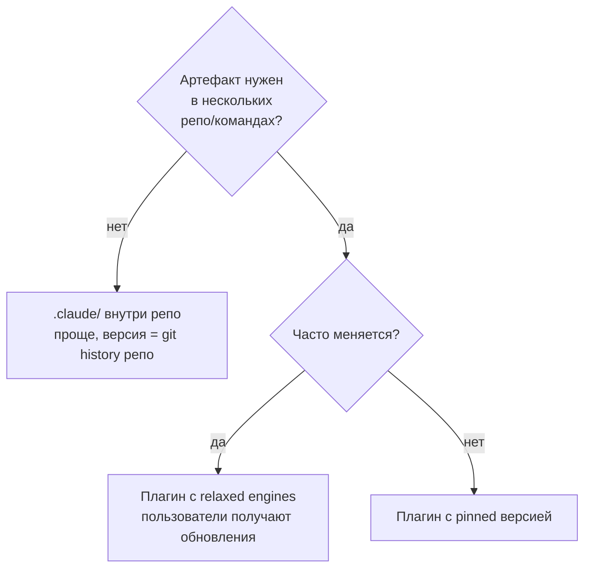

# 07. Plugins: упаковка skills + hooks + agents + MCP

> Plugin — это «npm package для Claude Code». Если у вас несколько связанных артефактов (скиллы + hooks + агенты + MCP-конфиг), которыми хочется делиться между проектами или с командой — упакуйте в плагин.

---

## 7.1. Зачем плагины

📘 Из docs (`plugins`): «Plugins are packages that extend Claude Code with custom commands, hooks, MCP servers, agents, and skills».

Без плагинов вы пишете всё в `.claude/` каждого проекта и копипастите между репозиториями. С плагинами:

✅ Один источник истины.
✅ Версионирование через семвер.
✅ Установка через `/plugin install`.
✅ Marketplace (внутренний или публичный).
✅ Обновление в один клик.

---

## 7.2. Структура плагина

```
travel-agent-plugin/
├── .claude-plugin/
│   └── plugin.json              # обязательный manifest
├── skills/
│   ├── prepare-pr/SKILL.md
│   ├── debug-mcp/SKILL.md
│   └── deploy-staging/SKILL.md
├── agents/
│   ├── trip-architect.md         # subagent: планирует структуру маршрута
│   └── policy-checker.md         # subagent: проверяет regulations
├── commands/
│   └── trip-status.md            # slash-command /trip-status
├── hooks/
│   ├── hooks.json
│   └── scripts/
│       ├── format.sh
│       └── no-secrets.sh
├── .mcp.json                     # рекомендуемые MCP для пользователей плагина
├── settings.json                 # дефолтные настройки (модель, TTL, и т.д.)
├── bin/                          # CLI-утилиты (если нужны)
└── README.md
```

---

## 7.3. plugin.json

Минимальный manifest:

```json
{
  "$schema": "https://claude.com/schemas/plugin.json",
  "name": "travel-agent-toolkit",
  "version": "0.4.0",
  "description": "Skills, agents, hooks and MCP configs for the Travel Agent monorepo",
  "author": {
    "name": "Travel Agent Team",
    "email": "team@travel-agent.local"
  },
  "homepage": "https://github.com/travel-agent/claude-plugin",
  "repository": {
    "type": "git",
    "url": "https://github.com/travel-agent/claude-plugin.git"
  },
  "license": "MIT",
  "engines": {
    "claude-code": ">=2.1.0"
  }
}
```

📘 Опциональные поля: `homepage`, `repository`, `license`, `keywords`, `engines`. Все они помогают marketplace'у показать ваш плагин и предотвратить установку на несовместимые версии.

---

## 7.4. Плагины и marketplaces

📘 Marketplaces — это репозитории-каталоги плагинов. Бывают:

- **Anthropic Official** — `anthropics/claude-plugins-official` на GitHub.
- **Community** — публичные репо со списком community-плагинов.
- **Internal/private** — ваш корпоративный реестр (например, GitHub Enterprise repo с listing-файлом).

**Анатомия marketplace:**

```
my-corp-marketplace/
├── marketplace.json           # листинг плагинов
└── plugins/
    ├── travel-agent-toolkit/
    │   └── (манифест плагина)
    └── another-plugin/
```

🔧 `marketplace.json`:

```json
{
  "name": "Travel Agent Internal",
  "description": "Plugins for the travel-agent platform team",
  "plugins": [
    {
      "name": "travel-agent-toolkit",
      "ref": "github:travel-agent/claude-plugin@v0.4.0",
      "description": "Core toolkit"
    },
    {
      "name": "travel-agent-staging-helpers",
      "ref": "github:travel-agent/staging-plugin@latest",
      "description": "Staging-only helpers (db reset, seed)"
    }
  ]
}
```

---

## 7.5. Установка плагина

```bash
# Из marketplace
/plugin install travel-agent-toolkit

# Напрямую из git
/plugin install github:travel-agent/claude-plugin@v0.4.0

# Локально (для разработки)
claude --plugin-dir ./travel-agent-plugin
```

После установки:
- скиллы видны в `/skills`,
- агенты — в `/agents`,
- hooks — активны,
- MCP-серверы — в `/mcp` (если в плагине есть `.mcp.json`).

Плагины устанавливаются в `~/.claude/plugins/<name>/`.

---

## 7.6. Особенности плагинных hooks

Внутри плагина в `hooks/hooks.json` используется переменная `${CLAUDE_PLUGIN_ROOT}`:

```json
{
  "PostToolUse": [
    {
      "matcher": "Edit|Write",
      "hooks": [{
        "type": "command",
        "command": "bash ${CLAUDE_PLUGIN_ROOT}/hooks/scripts/format.sh"
      }]
    }
  ]
}
```

Это путь до корня установленного плагина. Используйте всегда — пути будут работать вне зависимости от того, куда плагин установлен.

---

## 7.7. Плагин vs project-level `.claude/`



💡 Тревел-эвристика: пока артефактов меньше 5 и работа в одном репо — `.claude/`. Как только появляется второй проект, который хочет то же самое — пора в плагин.

---

## 7.8. Версионирование

Используйте semver (`MAJOR.MINOR.PATCH`):

- **MAJOR** — breaking change в каком-то скилле, hook'е, агенте.
- **MINOR** — новый артефакт.
- **PATCH** — фикс / описание / docs.

Указывайте `engines.claude-code` — иначе обновление CLI может сломать ваш плагин и вы не поймёте почему.

---

## 7.9. Что положить в плагин Travel Agent

Если у вас Travel Agent — единственный проект на этом стеке, можно жить в `.claude/`. Но как только вы захотите второй проект использующий те же подходы (например, Booking Agent или Cargo Logistics Agent) — есть смысл сделать **`travel-stack-toolkit`** плагин, в котором:

- Скиллы по типичным паттернам (Hono+drizzle backend, React+TanStack frontend, MCP-server template).
- Агент `code-reviewer` с заточкой на ваш стиль.
- Hooks для format / lint / typecheck.
- Slash-команды `/scaffold-mcp <name>`, `/migration <description>`.

Тогда новый проект просто делает `/plugin install travel-stack-toolkit` и получает всю инфраструктуру разом.

---

## 7.10. Команды для работы с плагинами

| Команда | Что делает |
|---------|-----------|
| `/plugin list` | Все установленные плагины |
| `/plugin install <ref>` | Установить |
| `/plugin uninstall <name>` | Удалить |
| `/plugin update <name>` | Обновить до latest |
| `/plugin info <name>` | Детали + список содержимого |
| `/plugin search <query>` | Поиск в подключённых marketplaces |

---

## 7.11. Анти-паттерны

❌ **Кладёте в плагин секреты.** Плагин — open code. Секреты — в env, в local config.

❌ **Один гигантский плагин на всё.** Лучше несколько узких.

❌ **Плагин без `engines`.** Через полгода CLI обновится, плагин сломается без диагностики.

❌ **Плагин с MCP-конфигом, который требует ваш приватный API.** Опубликовали — никто кроме вас использовать не сможет. Делайте такие MCP опциональными.

❌ **Плагин без README.** Никто не поймёт, как им пользоваться.

---

**Дальше →** [08. Tool calls и agent loop под капотом](./08-tool-calls-and-loop.md)
