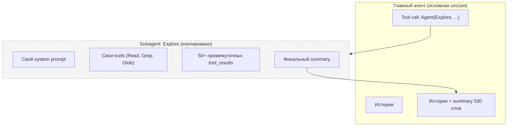
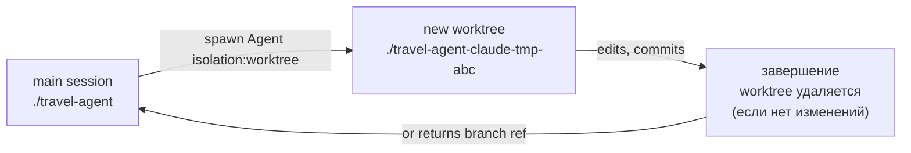
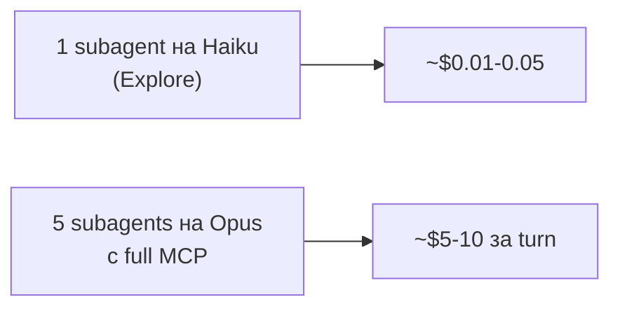

# 09. Subagents: изолированные агентные циклы

> Subagent — это мини-сессия Claude Code, запущенная из основной. Со своим контекстом, своим system prompt, своим набором tools. В основной контекст возвращается только финальный результат. Это и спасение от переполнения окна, и причина неожиданных счетов.

---

## 9.1. Что это такое и зачем

📘 Из docs (`sub-agents`): «Each subagent runs in its own context window with a custom system prompt, specific tool access, and independent permissions».

Главный кейс: **изоляция browse-heavy задач**.

Пример из Travel Agent: вы спрашиваете Claude Code «найди все места, где мы используем Amadeus API, и скажи, какие из них надо отрефакторить под их новый v3-эндпоинт».

Без subagent: модель `Grep` по репо → 200 совпадений → читает 30 файлов → анализирует → решение. Все промежуточные tool_results остаются в основном контексте. После такой задачи окно заполнено на 60%.

Со subagent: основной агент делает один tool call `Agent(subagent_type="Explore", prompt="...")`. Subagent сам всё ищет и читает в **своём** окне, возвращает summary на 500 слов. Основной контекст вырос на 500 слов.



---

## 9.2. Как Claude вызывает subagent

Через built-in tool **`Agent`** (раньше назывался `Task`).

Внутри agent loop модель делает:

```json
{
  "type": "tool_use",
  "name": "Agent",
  "input": {
    "subagent_type": "Explore",
    "description": "Find Amadeus usages",
    "prompt": "Find all places in the repo that import or call the Amadeus client, list them with line numbers and short context. Return as a markdown table."
  }
}
```

Harness:

1. Создаёт новую сессию с `subagent_type` system prompt + tools.
2. Передаёт `prompt` как user message.
3. Гоняет agent loop subagent'а до `end_turn`.
4. Возвращает финальный текст в `tool_result` основной сессии.

Основная сессия видит только `tool_result`. **Не видит** ни одного промежуточного шага subagent'а.

---

## 9.3. Где определяются subagents

📘 Markdown-файлы в:

- `~/.claude/agents/<name>.md` — пользовательские (доступны во всех проектах)
- `.claude/agents/<name>.md` — проектные (коммитятся в репо)
- `<plugin>/agents/<name>.md` — упакованные в плагин
- В managed settings — корпоративные

Имя файла = имя агента (используется как `subagent_type`).

---

## 9.4. Frontmatter subagent'а

📘 Полный список полей (Claude Code v2.1.89):

```markdown
---
name: trip-architect
description: |
  Use this agent when the user asks to plan a multi-city trip or design an itinerary.

  <example>
  Context: User wants a 10-day Europe trip
  user: "Спланируй мне маршрут Рим → Париж → Амстердам на 10 дней с бюджетом $3000"
  assistant: "I'll use trip-architect to design the itinerary."
  <commentary>Multi-city trip planning is exactly this agent's job.</commentary>
  </example>
model: opus
color: cyan
tools: ["Read", "Grep", "mcp__flights__*", "mcp__hotels__*", "mcp__weather__*"]
disallowedTools: ["Bash", "Write", "Edit"]
permissionMode: ask
mcpServers: ["flights", "hotels", "weather"]
maxTurns: 30
skills: ["budget-optimizer"]
memory: read-only
effort: high
isolation: worktree
background: false
initialPrompt: |
  Always start by clarifying budget, dates, and pace preference (relaxed/intense).
hooks:
  PostToolUse:
    - matcher: "mcp__flights__*"
      hooks:
        - type: command
          command: "bash .claude/hooks/cache-flight.sh"
---

You are a senior travel architect. Your job is to compose multi-city itineraries...

## Methodology

1. Clarify constraints (dates, budget, pace, must-have cities).
2. Build skeleton (city → days → vibe).
3. For each leg: search flights / trains, find lodging in desired neighborhood,
   note 2-3 anchor activities + 1 free evening.
4. Sanity check budget across all legs.
5. Return a markdown itinerary with: per-day plan, transit list with prices, total cost.

## Output format

Markdown table per day + cost breakdown. No prose-style narratives.
```

| Поле | Что значит |
|------|-----------|
| `name` | Идентификатор (slug) |
| `description` | По нему модель решает, кого позвать |
| `model` | `sonnet` / `opus` / `haiku` / `claude-opus-4-7` / `inherit` |
| `color` | UI-цвет в `/agents` менеджере |
| `tools` | Whitelist built-in/MCP tools |
| `disallowedTools` | Blacklist (применяется поверх tools) |
| `permissionMode` | `default` / `ask` / `bypassPermissions` |
| `mcpServers` | Какие MCP-серверы поднять для этого subagent'а |
| `hooks` | Inline hooks только для subagent'а |
| `maxTurns` | Лимит итераций agent loop |
| `skills` | Дополнительные скиллы, доступные subagent'у |
| `memory` | `none` / `read-only` / `read-write` (доступ к CLAUDE.md) |
| `effort` | `low` / `medium` / `high` |
| `background` | Запускать в фоне (без блокировки основного агента) |
| `isolation` | `none` / `worktree` (создать git worktree-копию репо) |
| `initialPrompt` | Доп. сообщение, которое harness добавляет к prompt'у |

---

## 9.5. Built-in subagents

📘 Из коробки в Claude Code v2.1.89:

| Subagent | Модель | Что делает | Когда использовать |
|----------|--------|-----------|---------------------|
| **Explore** | Haiku | Read-only поиск/анализ кодовой базы | Browse-heavy задачи: «найди все вхождения X», «как устроен модуль Y» |
| **Plan** | inherits | Составление плана (read-only) | Перед сложным изменением — спланировать шаги |
| **General-purpose** | inherits | Универсальный, все tools | Долгие multi-step задачи, которые не подходят под другие |
| **statusline-setup** | Sonnet | Настраивает statusline в CLI | Только когда юзер просит конфиг statusline |
| **Claude Code Guide** | Haiku | Отвечает на вопросы про сам Claude Code | Когда юзер спрашивает «как сделать X в Claude Code» |

📘 Пример вызова из чата:

«Используй Explore чтобы найти все места, где мы шлём запросы в Amadeus».

Модель сделает `Agent(subagent_type="Explore", prompt="...")`.

---

## 9.6. Параллельные subagents

📘 Из docs: «Subagents only report results back to the main agent and never talk to each other».

Можно запустить несколько subagents в одном assistant turn:

```json
{
  "content": [
    {"type": "tool_use", "name": "Agent", "input": {"subagent_type": "Explore", "prompt": "find frontend usages"}},
    {"type": "tool_use", "name": "Agent", "input": {"subagent_type": "Explore", "prompt": "find backend usages"}}
  ]
}
```

Они исполнятся параллельно. Основной агент получит **два** независимых summary.

⚠️ Они **не общаются**. Если задача требует обмена информацией — это уже **agent team** (см. [10-agent-teams.md](./10-agent-teams.md)).

---

## 9.7. Изоляция через `worktree`

📘 `isolation: worktree` создаёт временный git worktree — изолированную копию вашей рабочей директории на отдельной ветке. Subagent работает в ней, не трогая основной workspace.



💡 Use case: вы хотите чтобы subagent попробовал большой рефакторинг — но без риска поломать основной workspace. Если subagent ничего не закоммитил — worktree удалится автоматически. Если закоммитил — вернёт branch name, и вы сами решите, мержить или нет.

---

## 9.8. Экономика subagents

⚠️ Это место, где новички теряют деньги.

**Каждый subagent — это отдельная сессия с собственным префиксом.** У него:

- Свой system prompt subagent'а (часто меньше чем у основного, но всё ещё токены).
- Своя CLAUDE.md (если `memory != none`).
- Свои tools (включая MCP, если задано).
- Свой agent loop = ещё один префикс на каждый turn.

📘 Утверждение «у subagent'а нет кэшированного префикса основной сессии — все базовые токены тарифицируются заново» — **верно по сути**: subagent стартует с собственным префиксом, который при первом запуске идёт как cache write. **Но** внутри самого subagent'а кэш работает нормально на повторных turn'ах.

**Расчёт:** subagent на Haiku (Explore) с system_prompt 3k токенов делает 5 turn'ов:

- Turn 1: 3k cache write + 2k input + N output → cache write по $1.25/M = $0.004.
- Turn 2-5: 3k cache read + N input + N output → дешёво.

Итого один subagent ≈ $0.01-0.05 в зависимости от объёма работы. Не «копейки», но и не банкротство.

⚠️ Опасная ситуация: вы запускаете **5 subagents параллельно** на Opus с большими CLAUDE.md и кучей MCP. Каждый — $0.50-2 → итого $5-10 за один assistant turn. Считайте перед пуском.



💡 Правила экономии:

- Browse-задачи → **Explore** (Haiku) или **General-purpose** (Sonnet).
- Архитектурные размышления → **Plan** (inherits) или субагент с `model: opus`.
- Не подключайте к subagent'у все MCP-серверы — только нужные через `mcpServers: [...]`.
- Если subagent нужен часто — закрепите ему `model: haiku`, `effort: low`.

---

## 9.9. Subagents для Travel Agent

🔧 Минимальный набор кастомных агентов:

```
.claude/agents/
├── trip-architect.md       # планирование маршрутов (opus, MCP-only)
├── code-reviewer.md         # ревью PR (sonnet, read-only)
├── policy-checker.md        # проверка regulations (haiku)
└── cost-analyzer.md         # анализ цен flight/hotel (sonnet)
```

🔧 `code-reviewer.md`:

```markdown
---
name: code-reviewer
description: |
  Review a pull request, branch diff, or set of recent changes for code quality, type safety, security, and adherence to Travel Agent conventions. Use when user says "review PR", "check my changes", "проверь PR".
model: sonnet
color: blue
tools: ["Read", "Grep", "Glob", "Bash(git:*)", "Bash(gh:*)"]
disallowedTools: ["Write", "Edit", "Bash(rm:*)"]
permissionMode: default
maxTurns: 25
effort: high
memory: read-only
---

You are a senior code reviewer for the Travel Agent monorepo. Be specific, prioritize issues, and don't repeat what tests already enforce.

## Workflow

1. Identify the diff: either branch vs main (`git diff main...HEAD`) or PR (`gh pr diff <num>`).
2. For each changed file:
   - Type safety: any `any`, missing return types, schema mismatches.
   - API contract: changes to public types in `@travel/shared` are breaking unless versioned.
   - DB: any new query missing index? unbounded LIMIT?
   - Security: input validation, SQL injection (we use drizzle, but check raw SQL paths).
   - Performance: N+1 queries, large `Read`-heavy operations.
   - Tests: are happy paths + 1 error path covered for new logic?
3. Output sections: Critical / Important / Nit / Praise.
4. End with a 1-line verdict: APPROVE / REQUEST CHANGES.

## Style

- One bullet = one concrete issue with `file:line`.
- No "consider this" — say "do this" or skip.
```

---

## 9.10. Команды для работы с subagents

| Команда | Что делает |
|---------|-----------|
| `/agents` | UI-менеджер агентов |
| `/agents create` | Гайд по созданию нового |
| `/agents list` | Список с местоположениями |
| `/agents test <name>` | Прогнать агента на тестовом prompt'e |

---

## 9.11. Антипаттерны

❌ **Subagent на каждую задачу.** Если задача короткая (5-10 turn'ов) — это перерасход. Subagent оправдан, когда browse-объём большой.

❌ **Передача всех tools subagent'у.** Жаль контекста и денег. Дайте только то, что реально нужно.

❌ **Дублирование основного агента.** Делать `general-purpose` subagent с теми же CLAUDE.md и MCP — это просто два инстанса того же. Используйте только если действительно нужна изоляция.

❌ **Subagent с `permissionMode: bypassPermissions` на opus.** Если он что-то сломает — никто не остановит.

❌ **Игнорирование `maxTurns`.** Без лимита subagent может уйти в бесконечный цикл если запутается.

❌ **Использование subagents там, где нужен agent team.** Если задача требует обмена между исполнителями — это team. См. следующую главу.

---

**Дальше →** [10. Agent Teams: координация нескольких агентов](./10-agent-teams.md)
