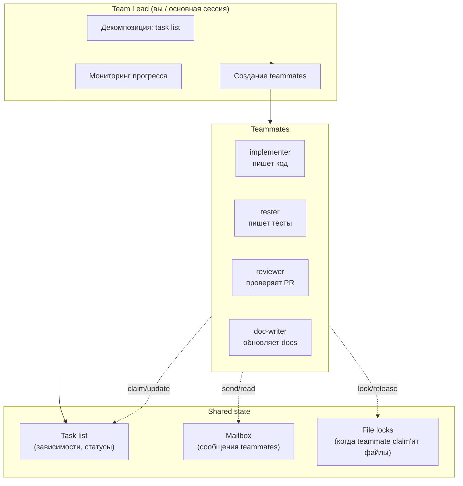
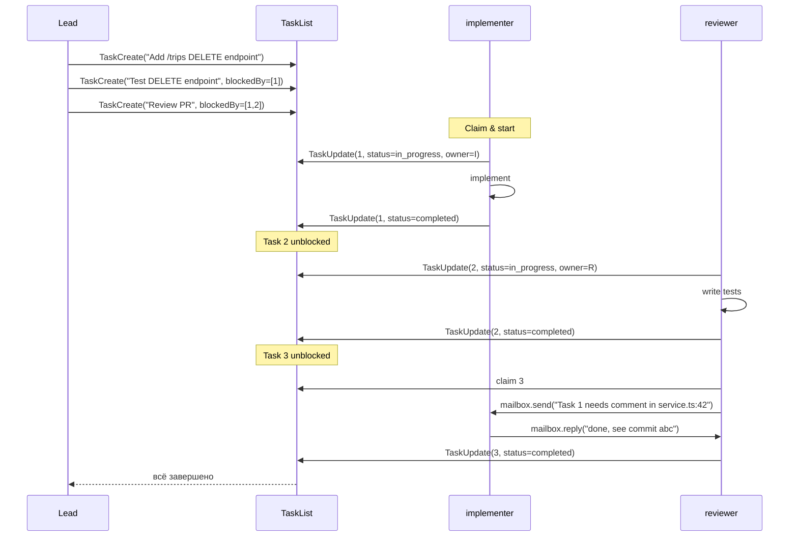

# 10. Agent Teams (экспериментально)

> Если subagents — это «отправил помощника в командировку, дождался результата», то Agent Teams — это «собрал команду из нескольких разработчиков, дал им task list и они работают параллельно, общаясь между собой». Принципиально другая архитектура. На апрель 2026 — экспериментальная фича Claude Code.

---

## 10.1. Что это и чем отличается от subagents

🧪 Из docs (`agent-teams`): «Agent teams let you coordinate multiple Claude Code instances working together. One session acts as the team lead … Teammates work independently … and communicate directly with each other».

| | Subagents | Agent Teams |
|---|-----------|-------------|
| Кто кого запускает | Главный → subagent (один направление) | Lead создаёт teammates, teammates общаются друг с другом |
| Контекст | Изолирован, возвращается только summary | У каждого teammate свой, но есть **shared task list** и **mailbox** |
| Длительность | Одна задача → ответ → конец | Долгоживущие, до выполнения всего task list |
| Коммуникация | Нет | Mailbox (адресные сообщения) + общий task list |
| Параллелизм | Да, но независимо | Да, со зависимостями (Task A blocks Task B) |
| Стоимость | Средняя | Высокая (каждый teammate — отдельный Claude instance) |
| Релиз | Stable | Экспериментально (`CLAUDE_CODE_EXPERIMENTAL_AGENT_TEAMS=1`) |

📘 Версия: появилось в Claude Code v2.1.32 (релиз вместе с Opus 4.6, февраль 2026).

⚠️ Это **реальная фича**, не выдумка. В исходном твиттер-треде она названа правильно. Но статус — экспериментальный, поведение и API могут поменяться.

---

## 10.2. Как включить

```bash
export CLAUDE_CODE_EXPERIMENTAL_AGENT_TEAMS=1
claude
```

После этого появляется команда `/team`.

---

## 10.3. Архитектура



---

## 10.4. Жизненный цикл задачи



---

## 10.5. Как создаются teammates

В Lead-сессии команда:

```bash
/team add implementer --description "writes code per spec"
/team add tester --description "writes vitest"
/team add reviewer --description "code review"
```

Каждый teammate — это **отдельный Claude Code процесс** с собственной сессией, model, MCP, tools. Lead инициирует их через специальный механизм harness'а, передаёт ссылку на shared state (task list, mailbox).

Teammates могут быть основаны на subagent-определениях (использовать существующие `.claude/agents/*.md` как профиль).

---

## 10.6. Mailbox: коммуникация между teammates

📘 Каждый teammate имеет «inbox». Через UpdateMailbox (внутренний tool) могут отправлять адресные сообщения:

```text
implementer → tester:
  "Я закончил DELETE-эндпоинт в apps/api/src/routes/trips.ts:120.
   Идемпотентность не реализована — намеренно, обсудили в PR."

tester → implementer:
  "Тест 'returns 404 on missing id' падает: возвращается 500.
   Можешь глянуть?"
```

Hook `TeammateIdle` срабатывает когда teammate ждёт сообщения (нет open tasks). Lead может вмешаться, переназначить или добавить задачу.

---

## 10.7. File locks

Чтобы избежать конфликтов, teammate может «лочить» файлы перед редактированием:

```text
implementer.lock(["apps/api/src/routes/trips.ts"])
implementer.edit(...)
implementer.unlock(["apps/api/src/routes/trips.ts"])
```

Если другой teammate попробует Edit залоченный файл — получит ошибку и должен либо подождать, либо отправить mailbox-запрос.

---

## 10.8. Hooks для team

Появляются дополнительные lifecycle-события:

- `TaskCreated` — кто-то создал задачу.
- `TaskCompleted` — задача готова.
- `TeammateIdle` — teammate простаивает.

Можно использовать для уведомлений, авто-перераспределения, метрик.

---

## 10.9. Стоимость

⚠️ Каждый teammate — отдельный Claude instance со своим префиксом. 4 teammates на Opus с большим CLAUDE.md = 4× стоимость subagent'а × N turn'ов каждого.

📘 Документация прямо предупреждает: «token usage scales with the number of active teammates … For routine tasks, a single session is more cost-effective».

💡 Когда команда оправдана:

✅ Большая фича с явно параллельными частями (frontend + backend + миграция + тесты).
✅ Долгий рефакторинг, разбиваемый на независимые блоки.
✅ Нужно реально много рук одновременно (например, мигрировать 30 файлов по одному паттерну).

❌ **Не оправдана:**

- Маленькая правка («добавь поле в форму») — обычной сессии хватит.
- Browse / анализ — это subagent.
- Когда вы не понимаете, как декомпозировать — Lead вынужден гонять все teammates по очереди, теряя смысл.

---

## 10.10. Пример: фича для Travel Agent через team

Задача: «добавить функцию шаринга маршрута через короткие ссылки (`/t/abc123`)».

Декомпозиция Lead'ом на task list:

```
Task 1: schema migration "shareable_links" table
Task 2: backend endpoints POST/GET /share, POST /trips/:id/share, blockedBy=[1]
Task 3: frontend share button + modal, blockedBy=[]
Task 4: e2e test для шаринга, blockedBy=[2,3]
Task 5: PR description + changelog, blockedBy=[2,3,4]
```

Teammates:
- `db-eng` — Task 1 (модель: sonnet, tools: Read/Edit/Bash для drizzle).
- `backend-eng` — Task 2 (sonnet, MCP: postgres, hooks: format).
- `frontend-eng` — Task 3 (sonnet, не нужны MCP для авиа/отелей).
- `qa` — Task 4 (sonnet, доступ к Bash для playwright).
- `pr-writer` — Task 5 (haiku, только Read + git).

```mermaid
gantt
  title Параллельное исполнение
  dateFormat HH:mm
  axisFormat %H:%M

  section db-eng
  Migration :a1, 10:00, 5m
  section backend-eng
  Endpoints :a2, after a1, 25m
  section frontend-eng
  UI :a3, 10:00, 30m
  section qa
  E2E test :a4, after a2, 15m
  section pr-writer
  PR + changelog :a5, after a4, 5m
```



Lead мониторит, при простое (`TeammateIdle`) даёт мелкие follow-up задачи. По завершении Task 5 — `gh pr create` готов.

⚠️ Для такой фичи в обычной сессии можно потратить 15-20 минут на ~$2-5. Через team — те же 15-20 минут реального времени, но $10-20 счёт. Покупаете распараллеливание людей, а не машинного времени.

---

## 10.11. Отладка team-сценариев

| Команда | Что показывает |
|---------|---------------|
| `/team status` | Живые teammates, их текущие задачи, mailbox-инбоксы |
| `/team tasks` | Полный task list со статусами |
| `/team logs <name>` | Транскрипт сессии конкретного teammate |
| `/team kill <name>` | Завершить teammate (если завис) |
| `/team disband` | Распустить команду (но сохранить артефакты) |

---

## 10.12. Best practices

✅ **Декомпозиция от Lead.** Lead использует `opus` (или включите `opusplan` в Lead-сессии) — он лучше всех планирует.

✅ **Teammates на `sonnet` или `haiku`.** Они исполнители, дорогая модель — overkill.

✅ **Задавайте зависимости.** Без `blockedBy` все стартуют параллельно и могут конфликтовать на общем стейте.

✅ **Малые задачи.** Чем атомарнее, тем меньше конфликтов локов и меньше потерь при ошибке teammate'а.

✅ **Используйте `TeammateIdle` hook** для логирования / метрик.

✅ **Лочьте файлы.** Без локов два teammate могут переписать друг друга.

❌ **Не используйте teams для browse/анализа** — для этого subagent'ы дешевле.

❌ **Не давайте всем teammates `bypassPermissions`** — это «5 рук с правом писать что угодно». Минимум одна должна быть с `ask`.

❌ **Не запускайте >4-5 teammates** — координация становится дороже работы.

---

**Дальше →** [11. Модели и pricing](./11-models-and-pricing.md)
