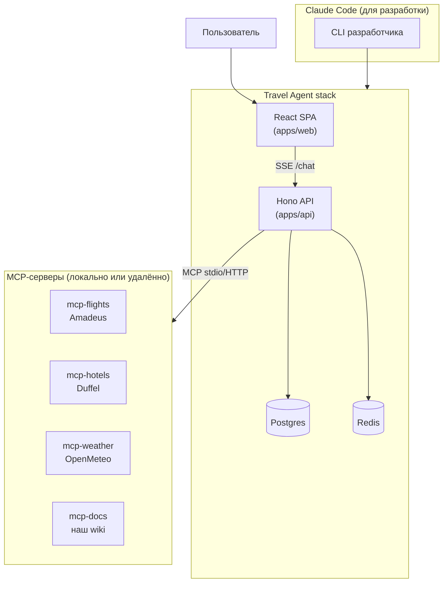
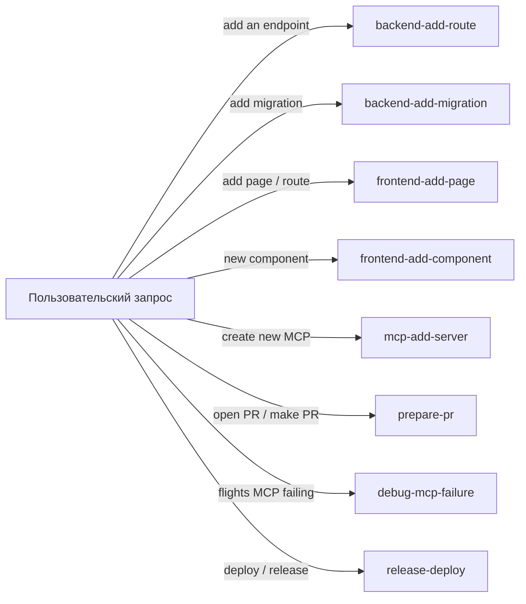
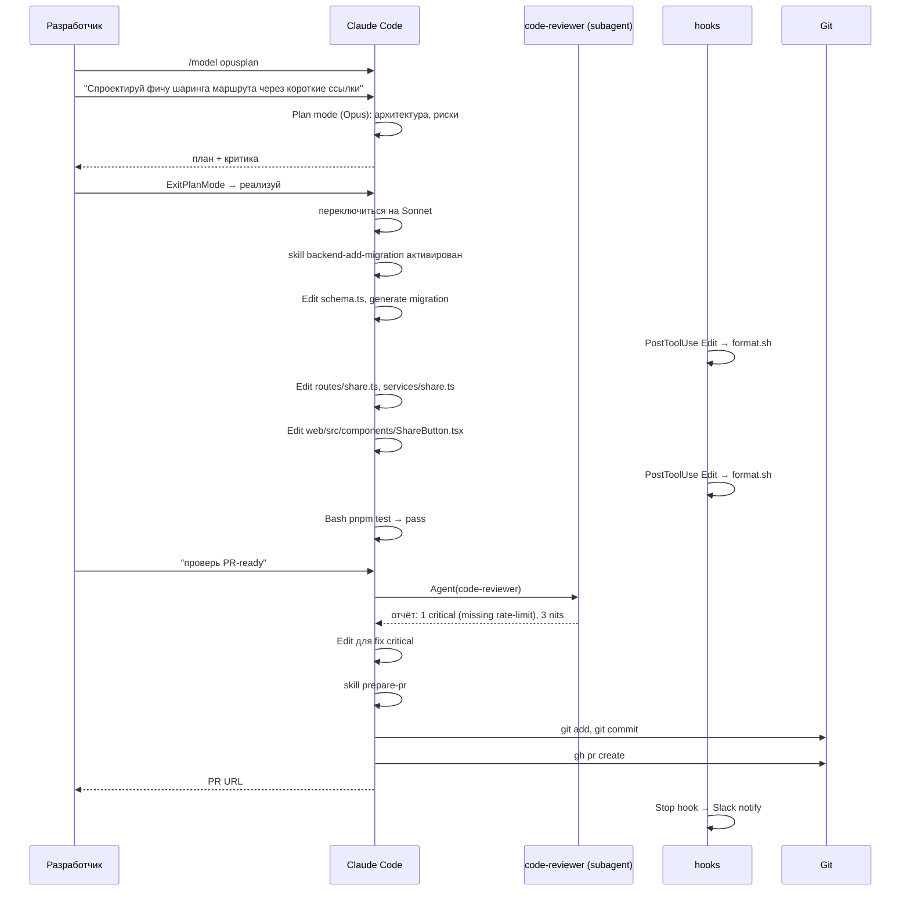

# 12. Travel Agent с нуля: blueprint

> Сводим всё вместе. Один реальный проект. Один монорепо. Конкретные файлы, конфиги, структура. Дальше уже копипастите и адаптируете.

---

## 12.1. Что мы строим

**Travel Agent** — AI-сервис, который помогает спланировать поездку. Архитектурно:



В **разработке** мы используем Claude Code (CLI) для написания кода, тестов, миграций. В **рантайме** наш бэкенд (apps/api) общается с Anthropic API напрямую через SDK, переиспользуя те же MCP-серверы.

---

## 12.2. Структура репозитория

```
travel-agent/
├── .claude/                              # ВСЁ для Claude Code разработки
│   ├── settings.json                     # permissions, hooks
│   ├── settings.local.json               # ваши локальные tweaks (gitignored)
│   ├── agents/
│   │   ├── trip-architect.md
│   │   ├── code-reviewer.md
│   │   ├── policy-checker.md
│   │   └── cost-analyzer.md
│   ├── skills/
│   │   ├── backend-add-route/SKILL.md
│   │   ├── backend-add-migration/SKILL.md
│   │   ├── frontend-add-page/SKILL.md
│   │   ├── frontend-add-component/SKILL.md
│   │   ├── mcp-add-server/SKILL.md
│   │   ├── prepare-pr/SKILL.md
│   │   ├── debug-mcp-failure/SKILL.md
│   │   └── release-deploy/SKILL.md
│   ├── hooks/
│   │   ├── format.sh
│   │   ├── no-secrets.sh
│   │   ├── bash-guard.sh
│   │   └── notify-stop.sh
│   └── commands/
│       └── trip-status.md                # /trip-status slash command
├── CLAUDE.md                             # глобальный контекст репо
├── CLAUDE.local.md                       # ваши заметки (gitignored)
├── .mcp.json                             # MCP-серверы для CC и для прода
├── apps/
│   ├── web/
│   │   ├── CLAUDE.md                     # frontend-специфика
│   │   ├── src/
│   │   ├── package.json
│   │   └── vite.config.ts
│   └── api/
│       ├── CLAUDE.md                     # backend-специфика
│       ├── src/
│       │   ├── index.ts                  # Hono entry
│       │   ├── routes/
│       │   ├── services/
│       │   ├── agent/                    # Anthropic SDK + MCP-клиенты
│       │   ├── db/
│       │   └── mcp/                      # обвязка для подключения MCP
│       └── package.json
├── packages/
│   ├── mcp-flights/
│   │   ├── CLAUDE.md
│   │   └── src/server.ts
│   ├── mcp-hotels/
│   ├── mcp-weather/
│   ├── mcp-docs/
│   └── shared/                           # types, zod schemas
├── docs/
│   ├── adr/
│   ├── architecture/
│   │   ├── backend-stack.md
│   │   ├── frontend-stack.md
│   │   └── mcp-servers.md
│   └── dev/
│       ├── commands.md
│       ├── precommit-checklist.md
│       └── runbook.md
├── infra/
│   ├── docker-compose.yml
│   └── k8s/
├── scripts/
│   ├── seed-db.ts
│   └── route-template.ts                 # шаблон для skill backend-add-route
├── package.json                          # workspaces
├── pnpm-workspace.yaml
├── tsconfig.base.json
├── .env.example
└── .gitignore
```

---

## 12.3. Корневой CLAUDE.md (готовый шаблон)

🔧 `./CLAUDE.md`:

```markdown
# Travel Agent

AI-сервис планирования путешествий. Backend на Node + Hono + TypeScript, frontend на React + Vite + TypeScript, агент использует Anthropic SDK + 4 MCP-сервера (Amadeus / Duffel / OpenMeteo / wiki).

## Структура

```
travel-agent/
├── apps/web/           — React SPA
├── apps/api/           — Hono backend (entry в src/index.ts)
├── packages/mcp-*/     — MCP-серверы
├── packages/shared/    — общие типы/zod-схемы (workspace: @travel/shared)
├── infra/              — docker-compose, k8s
└── docs/               — ADR, architecture, dev guides
```

## Команды

- `pnpm dev` — поднять api + web одновременно (turbo)
- `pnpm dev:api`, `pnpm dev:web` — раздельно
- `pnpm test` — vitest для всех пакетов
- `pnpm test --filter=@travel/api` — только api
- `pnpm typecheck` — tsc --noEmit по всему монорепо
- `pnpm lint` — eslint + prettier --check
- `pnpm db:migrate` — drizzle migrations
- `pnpm seed` — заполнить тестовыми данными
- `pnpm build` — продакшн-сборка
- `pnpm dev:mcp:flights` — поднять только mcp-flights отдельно

## Соглашения

- TypeScript strict, никаких `any`. `unknown` + type guard.
- React: только функциональные компоненты + hooks. Без классов.
- Backend routers в `apps/api/src/routes/`, бизнес-логика в `apps/api/src/services/`.
- Database: drizzle ORM, никакого raw SQL.
- Логирование: pino через `@travel/shared/logger`. Никакого `console.*`.
- MCP-серверы следуют шаблону `src/server.ts` экспортирует `createServer()`.
- Импортируем через workspace alias: `@travel/shared`, `@travel/mcp-flights`.

## Запреты

- Не редактируй `apps/api/src/legacy/` — старый код, удаляется.
- Не используй `console.*` — везде `logger`.
- Не пиши raw SQL — drizzle query builder.
- Не коммить `.env`, `secrets/*`, `*.local.json`.

## Перед коммитом

@docs/dev/precommit-checklist.md

## Архитектура подсистем

@docs/architecture/backend-stack.md
@docs/architecture/frontend-stack.md
@docs/architecture/mcp-servers.md
```

---

## 12.4. .claude/settings.json (готовый)

🔧 `./.claude/settings.json`:

```json
{
  "$schema": "https://claude.com/schemas/settings.json",
  "permissions": {
    "allow": [
      "Read",
      "Grep",
      "Glob",
      "WebFetch",
      "WebSearch",
      "Bash(pnpm test*)",
      "Bash(pnpm typecheck)",
      "Bash(pnpm lint*)",
      "Bash(pnpm build*)",
      "Bash(pnpm dev:*)",
      "Bash(git status)",
      "Bash(git diff*)",
      "Bash(git log*)",
      "Bash(git branch*)",
      "Bash(gh pr*)",
      "Bash(gh issue*)",
      "Edit(apps/**)",
      "Edit(packages/**)",
      "Edit(docs/**)",
      "Edit(scripts/**)",
      "Write(apps/**)",
      "Write(packages/**)",
      "Write(docs/**)",
      "Write(scripts/**)",
      "mcp__flights__*",
      "mcp__hotels__*",
      "mcp__weather__*",
      "mcp__docs__*"
    ],
    "ask": [
      "Bash(pnpm db:migrate*)",
      "Bash(pnpm seed*)",
      "Bash(git push*)",
      "Bash(git commit*)",
      "Bash(gh pr create*)",
      "Edit(packages/shared/**)",
      "Edit(.claude/**)"
    ],
    "deny": [
      "Edit(.env*)",
      "Edit(secrets/**)",
      "Edit(infra/k8s/secrets/**)",
      "Bash(rm -rf *)",
      "Bash(curl * | sh)",
      "Bash(curl * | bash)",
      "Bash(NODE_ENV=production *)"
    ]
  },
  "hooks": {
    "PreToolUse": [
      {
        "matcher": "Edit|Write|MultiEdit",
        "hooks": [{
          "type": "command",
          "command": "bash .claude/hooks/no-secrets.sh"
        }]
      },
      {
        "matcher": "Bash",
        "hooks": [{
          "type": "command",
          "command": "bash .claude/hooks/bash-guard.sh"
        }]
      }
    ],
    "PostToolUse": [
      {
        "matcher": "Edit|Write",
        "hooks": [{
          "type": "command",
          "command": "bash .claude/hooks/format.sh"
        }]
      }
    ],
    "Stop": [
      {
        "matcher": ".*",
        "hooks": [{
          "type": "command",
          "command": "bash .claude/hooks/notify-stop.sh",
          "timeout": 10
        }]
      }
    ]
  },
  "model": "sonnet",
  "outputStyle": "default"
}
```

---

## 12.5. .mcp.json (готовый, и для CC, и для прода-агента)

🔧 `./.mcp.json`:

```json
{
  "mcpServers": {
    "flights": {
      "type": "stdio",
      "command": "node",
      "args": ["packages/mcp-flights/dist/server.js"],
      "env": {
        "AMADEUS_API_KEY": "${AMADEUS_API_KEY}",
        "AMADEUS_API_SECRET": "${AMADEUS_API_SECRET}",
        "AMADEUS_BASE_URL": "${AMADEUS_BASE_URL:-https://test.api.amadeus.com}"
      }
    },
    "hotels": {
      "type": "stdio",
      "command": "node",
      "args": ["packages/mcp-hotels/dist/server.js"],
      "env": {
        "DUFFEL_API_KEY": "${DUFFEL_API_KEY}"
      }
    },
    "weather": {
      "type": "stdio",
      "command": "node",
      "args": ["packages/mcp-weather/dist/server.js"]
    },
    "docs": {
      "type": "stdio",
      "command": "node",
      "args": ["packages/mcp-docs/dist/server.js"],
      "env": {
        "DOCS_INDEX_PATH": "./docs"
      }
    }
  }
}
```

---

## 12.6. Минимальный набор скиллов (с примерами)

Полный список — в [04-skills.md](./04-skills.md). Здесь — диаграмма какой когда срабатывает:



🔧 `.claude/skills/backend-add-migration/SKILL.md`:

```markdown
---
name: backend-add-migration
description: Add a drizzle database migration for the Travel Agent Postgres schema. Use when user asks to "add migration", "alter table", "create table", "add column", "rename field", or any DB schema change.
allowed-tools: ["Read", "Write", "Edit", "Bash(pnpm db:*)", "Grep"]
model: sonnet
effort: medium
---

# Add migration

Procedure for safely adding a database migration.

## Steps

1. Read `apps/api/src/db/schema.ts` to understand current schema.
2. Modify schema.ts to reflect the desired change (use drizzle types).
3. Run `pnpm db:generate` to scaffold a migration file in `apps/api/src/db/migrations/`.
4. Inspect the generated SQL — confirm:
   - No `DROP TABLE` / `DROP COLUMN` unless user explicitly approved.
   - For `NOT NULL` adds — provide a default or backfill strategy.
   - For renames — drizzle generates DROP + CREATE; manually edit to use `RENAME` if data preservation needed.
5. Update repository layer in `apps/api/src/db/repositories/` if needed.
6. Update affected services if shape changed.
7. Add at least one test in `apps/api/test/db/<migration-name>.test.ts`.
8. Run `pnpm typecheck && pnpm test --filter=@travel/api`.

## Verification

- Migration applied locally: `pnpm db:migrate`.
- All tests pass.
- Schema diff matches intent.

## References

- @docs/architecture/db.md
- @scripts/migration-checklist.md
```

🔧 `.claude/skills/mcp-add-server/SKILL.md`:

```markdown
---
name: mcp-add-server
description: Scaffold a new MCP server in the packages/mcp-* structure following Travel Agent conventions. Use when user asks to "add MCP", "create new MCP server", "add integration with X via MCP".
allowed-tools: ["Read", "Write", "Edit", "Bash"]
model: sonnet
effort: medium
---

# Scaffold MCP server

## Inputs

- Server name (e.g. "trains") → directory `packages/mcp-trains`.
- Provider URL (the upstream API).
- Auth type (API key / OAuth / none).

## Steps

1. Copy template:
   ```bash
   cp -r packages/_template-mcp packages/mcp-{name}
   ```
2. Update `packages/mcp-{name}/package.json` — name, deps.
3. Implement provider client in `src/{name}.ts` (use undici).
4. Define tools in `src/server.ts`:
   - `{name}_search` — поиск.
   - `{name}_get_details` — детали.
   - При необходимости — `{name}_book`, `{name}_cancel`.
5. Each tool: zod schema → JSON Schema → register in `setRequestHandler(ListToolsRequestSchema, ...)`.
6. Build: `pnpm --filter=@travel/mcp-{name} build`.
7. Add server to `.mcp.json` (stdio config).
8. Add to `apps/api/src/mcp/config.ts` so production agent picks it up too.
9. Add a smoke test in `packages/mcp-{name}/test/smoke.test.ts`.

## Verification

- `claude mcp test {name}` returns OK.
- `pnpm --filter=@travel/mcp-{name} test` passes.
- `/mcp` shows the new server.

## References

- @docs/architecture/mcp-servers.md
- @packages/_template-mcp/README.md
```

---

## 12.7. Полный agents/ набор

Полные frontmatter в [09-subagents.md](./09-subagents.md). Карта по ролям:

| Агент | Модель | Tools | Когда зовут |
|-------|--------|-------|-------------|
| `trip-architect` | opus | Read + flights/hotels/weather MCP | Многосоставные маршруты |
| `code-reviewer` | sonnet | Read + Grep + git/gh Bash | Перед мержем |
| `policy-checker` | haiku | Read | Проверка регуляторных требований (GDPR, кэшинг данных) |
| `cost-analyzer` | sonnet | Read + flights/hotels MCP | Сверка цен по нескольким датам/направлениям |

---

## 12.8. Production agent (apps/api/src/agent)

🔧 `apps/api/src/agent/index.ts`:

```typescript
import Anthropic from "@anthropic-ai/sdk";
import { connectAllMcp } from "../mcp/connect.js";
import { logger } from "@travel/shared/logger";

const anthropic = new Anthropic({ apiKey: process.env.ANTHROPIC_API_KEY });

const SYSTEM_PROMPT = `Ты — Travel Agent. Помогаешь планировать поездки.
Используй tools для поиска рейсов, отелей, погоды, проверки правил.
Возвращай ответы на языке пользователя. Будь лаконичен.`;

export async function* chatStream(
  userMessage: string,
  history: Anthropic.MessageParam[],
  signal: AbortSignal
) {
  const mcp = await connectAllMcp();
  const tools = await mcp.buildAnthropicTools();

  const messages = [...history, { role: "user", content: userMessage } as const];

  outer: while (true) {
    const stream = await anthropic.messages.stream(
      {
        model: "claude-opus-4-7",
        max_tokens: 4096,
        system: [
          { type: "text", text: SYSTEM_PROMPT, cache_control: { type: "ephemeral" } },
        ],
        tools,
        messages,
      },
      { signal }
    );

    let finalMessage: Anthropic.Message | null = null;

    for await (const event of stream) {
      if (event.type === "content_block_delta" && event.delta.type === "text_delta") {
        yield { type: "text", value: event.delta.text };
      }
      if (event.type === "message_stop") {
        finalMessage = await stream.finalMessage();
      }
    }

    if (!finalMessage) break outer;

    if (finalMessage.stop_reason === "end_turn") {
      messages.push({ role: "assistant", content: finalMessage.content });
      yield { type: "done", message: finalMessage };
      break outer;
    }

    if (finalMessage.stop_reason === "tool_use") {
      messages.push({ role: "assistant", content: finalMessage.content });
      const toolResults: Anthropic.ToolResultBlockParam[] = [];

      // Параллельно исполняем все tool_use из этого turn
      const calls = finalMessage.content.filter(
        (b): b is Anthropic.ToolUseBlock => b.type === "tool_use"
      );

      const results = await Promise.allSettled(
        calls.map(async (block) => {
          yield_event({ type: "tool_call", name: block.name, input: block.input });
          try {
            const result = await mcp.callTool(block.name, block.input as Record<string, unknown>);
            return { id: block.id, result };
          } catch (err) {
            logger.warn({ err, name: block.name }, "MCP tool error");
            return { id: block.id, result: { error: String(err) } };
          }
        })
      );

      for (const r of results) {
        if (r.status === "fulfilled") {
          toolResults.push({
            type: "tool_result",
            tool_use_id: r.value.id,
            content: JSON.stringify(r.value.result),
          });
        }
      }

      messages.push({ role: "user", content: toolResults });
      continue outer;
    }

    break outer;
  }
}

function yield_event(_e: unknown) {
  // helper if you wire SSE callbacks separately
}
```

🔧 `apps/api/src/mcp/connect.ts`:

```typescript
import { ClientSession } from "@modelcontextprotocol/sdk/client/session.js";
import { StdioClientTransport } from "@modelcontextprotocol/sdk/client/stdio.js";
import { readFile } from "node:fs/promises";

type McpConfig = {
  mcpServers: Record<
    string,
    { type: "stdio"; command: string; args: string[]; env?: Record<string, string> }
  >;
};

export async function connectAllMcp() {
  const cfg = JSON.parse(await readFile(".mcp.json", "utf8")) as McpConfig;
  const sessions: Record<string, ClientSession> = {};

  for (const [name, server] of Object.entries(cfg.mcpServers)) {
    if (server.type !== "stdio") continue;
    const env = { ...process.env, ...substituteEnv(server.env ?? {}) };
    const transport = new StdioClientTransport({ command: server.command, args: server.args, env });
    const session = new ClientSession(transport);
    await session.initialize();
    sessions[name] = session;
  }

  async function buildAnthropicTools() {
    const all: Anthropic.Tool[] = [];
    for (const [name, session] of Object.entries(sessions)) {
      const list = await session.listTools();
      for (const t of list.tools) {
        all.push({
          name: `mcp__${name}__${t.name}`,
          description: t.description ?? "",
          input_schema: t.inputSchema as any,
        });
      }
    }
    return all;
  }

  async function callTool(fullName: string, args: Record<string, unknown>) {
    const [, server, tool] = fullName.split("__");
    const session = sessions[server];
    if (!session) throw new Error(`unknown server: ${server}`);
    return session.callTool({ name: tool, arguments: args });
  }

  return { sessions, buildAnthropicTools, callTool };
}

function substituteEnv(record: Record<string, string>): Record<string, string> {
  const out: Record<string, string> = {};
  for (const [k, v] of Object.entries(record)) {
    out[k] = v.replace(/\$\{([A-Z0-9_]+)(?::-([^}]+))?\}/g, (_, name, def) => {
      return process.env[name] ?? def ?? "";
    });
  }
  return out;
}

import type Anthropic from "@anthropic-ai/sdk";
```

---

## 12.9. День из жизни разработчика

Сценарий: «добавь функцию шаринга маршрута через короткие ссылки».



---

## 12.10. Что коммитить в репо, что нет

✅ В репо:
- `CLAUDE.md`
- `.claude/settings.json`
- `.claude/agents/*.md`
- `.claude/skills/**/SKILL.md` + scripts/references/templates
- `.claude/hooks/**` (скрипты)
- `.claude/commands/*.md`
- `.mcp.json`

❌ НЕ в репо (`.gitignore`):
- `CLAUDE.local.md`
- `.claude/settings.local.json`
- `.mcp.local.json`
- `.env*` (кроме `.env.example`)

---

## 12.11. Bootstrap нового разработчика

Когда новый разработчик клонирует репо:

```bash
git clone git@github.com:travel-agent/monorepo
cd monorepo
pnpm install
cp .env.example .env.local
# Заполнить ANTHROPIC_API_KEY, AMADEUS_*, DUFFEL_*

pnpm build:mcp                    # компилируем все MCP-серверы

claude                            # стартует CC, подхватывает CLAUDE.md, settings, MCP
# /context — увидеть стартовое заполнение
# /skills — список всех скиллов
# /agents — список всех агентов
# /mcp — статус MCP-серверов

# Готов к работе. Первая задача:
# /init                          # обновить корневой CLAUDE.md под свой setup, если нужно
```

---

## 12.12. Опциональный шаг: упаковать всё в плагин

Если ваша компания собирается делать **несколько** travel-проектов на этом стеке, имеет смысл вынести `.claude/` + `.mcp.json` в плагин `travel-stack-toolkit` (см. [07-plugins.md](./07-plugins.md)).

Тогда в новом проекте:

```bash
/plugin install github:travel-agent/claude-plugin@v0.4.0
```

И вся инфраструктура (skills, agents, hooks, дефолтный MCP-конфиг) появляется одной командой.

---

**Дальше →** [13. Best practices: ежедневная рутина и антипаттерны](./13-best-practices.md)
