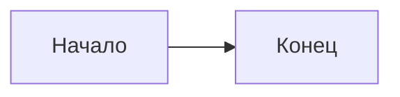

# Bilingual RU/EN Implementation Plan

> **For agentic workers:** REQUIRED SUB-SKILL: Use `superpowers:subagent-driven-development` (recommended) or `superpowers:executing-plans` to implement this plan task-by-task. Steps use checkbox (`- [ ]`) syntax for tracking.
>
> **Spec:** `docs/superpowers/specs/2026-04-27-bilingual-ru-en-design.md`

**Goal:** Add a Russian/English language toggle. Russian remains the source of truth; English versions are auto-generated by a `pnpm translate` script (Claude API), output committed to the repo. Astro 5 i18n routing: RU at `/`, EN at `/en/`.

**Architecture:** Path-prefix routing with `defaultLocale: "ru"` and `prefixDefaultLocale: false`. Sibling EN route tree under `src/pages/en/`. Single content collection with EN posts living at `src/content/posts/en/<slug>.md`. Cookie-based root redirect (`lang-pref`) only on `/`. UI chrome via JSON catalog + typed `t()` helper. Translation pipeline uses a `remark` AST walker to extract prose into numbered placeholders, sends to Claude Sonnet 4.6 with `temperature: 0`, reassembles, hashes source for incremental cache. Hand-edits in EN preserved by `manuallyEdited: true` frontmatter flag.

**Tech Stack:** Astro 5, TypeScript 5.9 strict, Vitest, Playwright, `unified`/`remark-parse`/`remark-stringify` (already deps), `js-yaml`, `@anthropic-ai/sdk` (new dep), Pagefind (multilingual via `<html lang>`).

---

## Working notes for agents

**Subagent assignments per CLAUDE.md:**
- `backender` → `src/lib/i18n/`, `src/middleware.ts`, `scripts/translate.ts` and helpers, `src/content.config.ts`, content schema additions
- `frontender` → `src/components/*`, `src/layouts/*`, `src/pages/*`, JSON catalogs, ARIA/accessibility
- `architect` → consulted before Phase 5 if Claude prompt strategy needs adjustment
- `critic` → end-of-phase code review (Phase 1, 3, 5, 6 minimum)

**Discipline (from CLAUDE.md):**
- Run `gitnexus_impact({target, direction: "upstream", repo: "astro-blog"})` BEFORE editing any existing function/component (e.g. `getOrderedPosts`, `BaseLayout`, `Header`).
- Run `gitnexus_detect_changes({scope: "staged", repo: "astro-blog"})` BEFORE every commit. Verify only expected files/symbols changed.
- Conventional commits: `feat:`, `fix:`, `chore:`, `docs:`, `test:`. Never `--no-verify`.
- Functional style: no `class`, no `this`, named/arrow functions, immutable data.
- After commits, the post-commit hook runs `npx gitnexus analyze` automatically — don't run it manually unless instructed.

**Commands cheat sheet:**
- `pnpm typecheck` — `astro sync && astro check && tsc --noEmit`
- `pnpm test` — Vitest unit + integration
- `pnpm test:e2e` — Playwright
- `pnpm lint` — eslint + prettier check
- `pnpm build` — full build (regenerates Pagefind)
- `pnpm dev` — http://localhost:4321

**Worktree (recommended):** before starting, run:
```bash
git worktree add ../astro-blog-i18n -b feat/i18n-ru-en main
cd ../astro-blog-i18n
pnpm install
```

---

# Phase 0 — Setup

### Task 0: Add Anthropic SDK and verify build green

**Subagent:** `backender`

**Files:**
- Modify: `package.json`

- [ ] **Step 1:** Run `gitnexus_detect_changes({scope: "all", repo: "astro-blog"})` to confirm clean state.

- [ ] **Step 2:** Add the SDK dependency.

```bash
pnpm add @anthropic-ai/sdk
```

- [ ] **Step 3:** Verify project still builds.

```bash
pnpm typecheck
```
Expected: 0 errors. Warnings about deprecated `pgTable` signatures are pre-existing — ignore.

- [ ] **Step 4:** Run unit tests.

```bash
pnpm test
```
Expected: all pass (no new tests yet).

- [ ] **Step 5:** Commit.

```bash
git add package.json pnpm-lock.yaml
git commit -m "chore: add @anthropic-ai/sdk for translation pipeline"
```

**Acceptance criteria:**
- `@anthropic-ai/sdk` in `dependencies` of `package.json`
- `pnpm typecheck` passes
- `pnpm test` passes
- Lockfile updated

---

# Phase 1 — Foundation: i18n config, schema, message catalog

### Task 1: Astro i18n config

**Subagent:** `backender`

**Files:**
- Modify: `astro.config.mjs`

- [ ] **Step 1:** Add the `i18n` block to the `defineConfig` call. Insert it after `prefetch` (alphabetical order is not enforced; keep grouped near other site config).

```ts
export default defineConfig({
  site: SITE_URL,
  output: "static",
  adapter: node({ mode: "standalone" }),
  i18n: {
    defaultLocale: "ru",
    locales: ["ru", "en"],
    routing: {
      prefixDefaultLocale: false,
      redirectToDefaultLocale: false,
    },
    fallback: { en: "ru" },
  },
  integrations: [/* unchanged */],
  // ... rest unchanged
});
```

- [ ] **Step 2:** Update sitemap integration with i18n-aware config.

```ts
sitemap({
  i18n: {
    defaultLocale: "ru",
    locales: { ru: "ru-RU", en: "en-US" },
  },
}),
```

- [ ] **Step 3:** Verify build.

```bash
pnpm typecheck && pnpm build
```
Expected: build succeeds. The site renders identically (no EN content yet, no `/en/` URLs created).

- [ ] **Step 4:** Commit.

```bash
git add astro.config.mjs
git commit -m "feat(i18n): enable Astro 5 i18n routing for ru/en"
```

**Acceptance criteria:**
- `Astro.currentLocale` resolves to `"ru"` on existing routes (verify in any `.astro` file via dev console: `console.log(Astro.currentLocale)`)
- Existing RU URLs render unchanged
- No new pages were generated by this change alone

---

### Task 2: Content collection schema

**Subagent:** `backender`

**Files:**
- Modify: `src/content.config.ts`

- [ ] **Step 1:** Run `gitnexus_impact({target: "posts", direction: "upstream", repo: "astro-blog"})` to confirm callers (loader, content pages, RSS) — verify the schema changes are additive only.

- [ ] **Step 2:** Update `src/content.config.ts` with the new fields and `site` collection.

```ts
import { defineCollection, z } from "astro:content";
import { glob } from "astro/loaders";

const posts = defineCollection({
  loader: glob({ pattern: "**/*.{md,mdx}", base: "./src/content/posts" }),
  schema: z.object({
    title: z.string().min(3).max(120),
    description: z.string().min(10).max(200),
    pubDate: z.coerce.date(),
    updatedDate: z.coerce.date().optional(),
    tags: z.array(z.string()).default([]),
    draft: z.boolean().default(false),
    cover: z.string().optional(),
    coverAlt: z.string().optional(),
    sourceHash: z.string().optional(),
    manuallyEdited: z.boolean().default(false),
  }),
});

const site = defineCollection({
  loader: glob({ pattern: "**/*.md", base: "./src/content/site" }),
  schema: z.object({
    title: z.string(),
    sourceHash: z.string().optional(),
    manuallyEdited: z.boolean().default(false),
  }),
});

export const collections = { posts, site };
```

- [ ] **Step 3:** Create the empty site content directory so glob has a valid base.

```bash
mkdir -p src/content/site src/content/posts/en
touch src/content/site/.gitkeep src/content/posts/en/.gitkeep
```

- [ ] **Step 4:** Run sync + typecheck.

```bash
pnpm typecheck
```
Expected: 0 errors. Astro generates new `.astro/content.d.ts`.

- [ ] **Step 5:** Run unit tests to confirm `loader.test.ts` still passes (existing tests use posts collection).

```bash
pnpm test
```
Expected: all pass.

- [ ] **Step 6:** Run `gitnexus_detect_changes({scope: "staged", repo: "astro-blog"})` and commit.

```bash
git add src/content.config.ts src/content/site/.gitkeep src/content/posts/en/.gitkeep
git commit -m "feat(content): add site collection and i18n metadata fields"
```

**Acceptance criteria:**
- Posts schema accepts `sourceHash?: string` and `manuallyEdited: boolean`
- New `site` collection defined and validates
- Existing posts still parse (no required-field migration broke anything)
- `pnpm typecheck` clean

---

### Task 3: i18n message catalog and `t()` helper (TDD)

**Subagent:** `backender`

**Files:**
- Create: `src/i18n/strings.ru.json`
- Create: `src/i18n/strings.en.json`
- Create: `src/i18n/tags.ru.json`
- Create: `src/i18n/tags.en.json`
- Create: `src/i18n/index.ts`
- Create: `src/i18n/index.test.ts`

- [ ] **Step 1:** Write the failing test first.

```ts
// src/i18n/index.test.ts
import { describe, it, expect } from "vitest";
import { t, type Locale } from "./index";

describe("t()", () => {
  it("returns the RU string for ru locale", () => {
    expect(t("ru", "nav.posts")).toBe("Статьи");
  });

  it("returns the EN string for en locale", () => {
    expect(t("en", "nav.posts")).toBe("Posts");
  });

  it("falls back to RU when EN key is missing", () => {
    // strings.en.json is incomplete on purpose; the helper falls back
    const value = t("en" as Locale, "nav.posts");
    expect(typeof value).toBe("string");
    expect(value.length).toBeGreaterThan(0);
  });
});
```

- [ ] **Step 2:** Run the test, verify failure.

```bash
pnpm vitest run src/i18n/index.test.ts
```
Expected: FAIL — module not found.

- [ ] **Step 3:** Create the RU strings catalog.

```json
// src/i18n/strings.ru.json
{
  "nav.posts": "Статьи",
  "nav.about": "Обо мне",
  "nav.search": "Поиск",
  "home.eyebrow": "Personal blog · on writing code with AI",
  "home.cta": "Все статьи →",
  "home.latestLabel": "Последние публикации",
  "home.heroTitle": "Конкретные записи про Claude Code, AI-агентов и разработку на Astro.",
  "home.heroLede": "Серия из четырнадцати частей про то, как устроен Claude Code изнутри — context, skills, hooks, MCP, subagents, модели и антипаттерны.",
  "sidebar.guide": "Claude Code Guide",
  "sidebar.other": "Другие статьи",
  "sidebar.aria": "Статьи блога",
  "post.toc": "Содержание",
  "post.tocAria": "Оглавление статьи",
  "post.published": "Опубликовано",
  "post.updated": "Обновлено",
  "post.tags": "Теги",
  "post.readMore": "Читать дальше →",
  "post.draft": "Черновик",
  "lang.toggle.ariaLabel": "Сменить язык",
  "lang.toggle.toEn": "EN",
  "lang.toggle.toRu": "RU",
  "lang.unavailable": "Английская версия пока недоступна",
  "drawer.openAria": "Открыть список статей",
  "drawer.closeAria": "Закрыть",
  "skip.toContent": "Перейти к содержимому",
  "search.placeholder": "Поиск по статьям…",
  "footer.meta": "Astro · on-demand · WCAG AA"
}
```

- [ ] **Step 4:** Create EN strings catalog (manual seed — script will own it after first run, but seed must exist for build).

```json
// src/i18n/strings.en.json
{
  "nav.posts": "Posts",
  "nav.about": "About",
  "nav.search": "Search",
  "home.eyebrow": "Personal blog · on writing code with AI",
  "home.cta": "All posts →",
  "home.latestLabel": "Latest publications",
  "home.heroTitle": "Concrete notes on Claude Code, AI agents, and Astro development.",
  "home.heroLede": "A 14-part series on how Claude Code works inside — context, skills, hooks, MCP, subagents, models, and anti-patterns.",
  "sidebar.guide": "Claude Code Guide",
  "sidebar.other": "Other posts",
  "sidebar.aria": "Blog posts",
  "post.toc": "Contents",
  "post.tocAria": "Article table of contents",
  "post.published": "Published",
  "post.updated": "Updated",
  "post.tags": "Tags",
  "post.readMore": "Read more →",
  "post.draft": "Draft",
  "lang.toggle.ariaLabel": "Switch language",
  "lang.toggle.toEn": "EN",
  "lang.toggle.toRu": "RU",
  "lang.unavailable": "English version not yet available",
  "drawer.openAria": "Open posts list",
  "drawer.closeAria": "Close",
  "skip.toContent": "Skip to content",
  "search.placeholder": "Search posts…",
  "footer.meta": "Astro · on-demand · WCAG AA"
}
```

- [ ] **Step 5:** Create tag dictionaries.

```json
// src/i18n/tags.ru.json
{ "claude-code": "Claude Code", "guide": "Гайд" }
```

```json
// src/i18n/tags.en.json
{ "claude-code": "Claude Code", "guide": "Guide" }
```

- [ ] **Step 6:** Create the `t()` helper.

```ts
// src/i18n/index.ts
import ru from "./strings.ru.json" with { type: "json" };
import en from "./strings.en.json" with { type: "json" };
import tagsRu from "./tags.ru.json" with { type: "json" };
import tagsEn from "./tags.en.json" with { type: "json" };

export type Locale = "ru" | "en";
export type StringKey = keyof typeof ru;

const strings = { ru, en } as const;
const tags = { ru: tagsRu, en: tagsEn } as const;

export const t = (locale: Locale, key: StringKey): string => {
  const dict = strings[locale] as Record<string, string>;
  return dict[key] ?? (strings.ru as Record<string, string>)[key] ?? key;
};

export const tagLabel = (locale: Locale, slug: string): string => {
  const dict = tags[locale] as Record<string, string>;
  return dict[slug] ?? (tags.ru as Record<string, string>)[slug] ?? slug;
};

export const isLocale = (value: unknown): value is Locale =>
  value === "ru" || value === "en";
```

- [ ] **Step 7:** Run the tests.

```bash
pnpm vitest run src/i18n/index.test.ts
```
Expected: PASS (all 3 tests).

- [ ] **Step 8:** Verify TypeScript catches typos in keys.

```bash
pnpm typecheck
```
Expected: clean. (Sanity: temporarily change `t("ru", "nav.posts")` to `t("ru", "nav.poosts")` in the test — should error; revert.)

- [ ] **Step 9:** Commit.

```bash
git add src/i18n/
git commit -m "feat(i18n): add typed t() helper and RU/EN message catalogs"
```

**Acceptance criteria:**
- `t("ru", "nav.posts")` returns `"Статьи"`, `t("en", "nav.posts")` returns `"Posts"`
- A typo in a string key is a `tsc` error
- `tagLabel("en", "claude-code")` returns `"Claude Code"`
- All 3 unit tests pass

---

### Task 4: Phase 1 critic review

**Subagent:** `critic`

- [ ] **Step 1:** Dispatch the critic with this prompt:

```
Review commits since main on the current branch (Phase 1: Astro i18n config, content schema additions, t() helper).
Verify:
1. Functional style — no classes, no `this`
2. Strict TS — no `any`, narrow types
3. Schema additions are backwards-compatible (existing posts validate)
4. t() helper returns correctly typed strings
5. No regression in `pnpm typecheck`, `pnpm test`, `pnpm build`

Spec: docs/superpowers/specs/2026-04-27-bilingual-ru-en-design.md, sections "Architecture overview" and "Schema and file layout changes".
Return punch list. Under 250 words.
```

- [ ] **Step 2:** Address any blocking issues. Re-commit.

**Acceptance criteria:**
- Critic returns no critical issues, or all critical issues addressed in follow-up commits

---

# Phase 2 — Routing helpers and middleware

### Task 5: `getCounterpart` helper (TDD)

**Subagent:** `backender`

**Files:**
- Create: `src/lib/i18n/routing.ts`
- Create: `src/lib/i18n/routing.test.ts`

- [ ] **Step 1:** Write the failing tests.

```ts
// src/lib/i18n/routing.test.ts
import { describe, it, expect } from "vitest";
import { getCounterpart, getLocaleFromPath, stripLocalePrefix } from "./routing";

describe("getLocaleFromPath", () => {
  it("returns 'en' for /en/* paths", () => {
    expect(getLocaleFromPath("/en/")).toBe("en");
    expect(getLocaleFromPath("/en/blog/foo")).toBe("en");
    expect(getLocaleFromPath("/en")).toBe("en");
  });
  it("returns 'ru' for everything else", () => {
    expect(getLocaleFromPath("/")).toBe("ru");
    expect(getLocaleFromPath("/blog/foo")).toBe("ru");
    expect(getLocaleFromPath("/about")).toBe("ru");
  });
});

describe("stripLocalePrefix", () => {
  it("removes /en prefix", () => {
    expect(stripLocalePrefix("/en/blog/foo")).toBe("/blog/foo");
    expect(stripLocalePrefix("/en/")).toBe("/");
    expect(stripLocalePrefix("/en")).toBe("/");
  });
  it("returns RU paths unchanged", () => {
    expect(stripLocalePrefix("/blog/foo")).toBe("/blog/foo");
    expect(stripLocalePrefix("/")).toBe("/");
  });
});

describe("getCounterpart", () => {
  it("RU root → /en/", () => {
    expect(getCounterpart("/", "ru")).toBe("/en/");
  });
  it("EN root → /", () => {
    expect(getCounterpart("/en/", "en")).toBe("/");
    expect(getCounterpart("/en", "en")).toBe("/");
  });
  it("RU article → /en/<same>", () => {
    expect(getCounterpart("/blog/01-introduction", "ru")).toBe("/en/blog/01-introduction");
  });
  it("EN article → RU equivalent", () => {
    expect(getCounterpart("/en/blog/01-introduction", "en")).toBe("/blog/01-introduction");
  });
  it("preserves trailing slash semantics", () => {
    expect(getCounterpart("/blog/", "ru")).toBe("/en/blog/");
  });
});
```

- [ ] **Step 2:** Run, verify failure.

```bash
pnpm vitest run src/lib/i18n/routing.test.ts
```
Expected: FAIL — module not found.

- [ ] **Step 3:** Implement.

```ts
// src/lib/i18n/routing.ts
import type { Locale } from "~/i18n";

export const getLocaleFromPath = (pathname: string): Locale =>
  pathname === "/en" || pathname.startsWith("/en/") ? "en" : "ru";

export const stripLocalePrefix = (pathname: string): string => {
  if (pathname === "/en" || pathname === "/en/") return "/";
  if (pathname.startsWith("/en/")) return pathname.slice(3);
  return pathname;
};

export const getCounterpart = (pathname: string, currentLocale: Locale): string => {
  if (currentLocale === "ru") {
    if (pathname === "/") return "/en/";
    return `/en${pathname}`;
  }
  return stripLocalePrefix(pathname);
};
```

- [ ] **Step 4:** Run tests.

```bash
pnpm vitest run src/lib/i18n/routing.test.ts
```
Expected: PASS — all 11 tests.

- [ ] **Step 5:** Commit.

```bash
git add src/lib/i18n/
git commit -m "feat(i18n): add path counterpart helpers with full test coverage"
```

**Acceptance criteria:**
- All 11 tests pass
- Pure functions — no I/O, no side effects
- Round-trip: `getCounterpart(getCounterpart(p, "ru"), "en")` returns `p` for any RU path

---

### Task 6: `checkCounterpartExists` (TDD with collection mocking)

**Subagent:** `backender`

**Files:**
- Modify: `src/lib/i18n/routing.ts` (add async helper)
- Modify: `src/lib/i18n/routing.test.ts`

- [ ] **Step 1:** Run `gitnexus_context({name: "getCollection", repo: "astro-blog"})` to confirm `astro:content` import patterns used elsewhere.

- [ ] **Step 2:** Add the test.

```ts
// append to src/lib/i18n/routing.test.ts
import { vi } from "vitest";
import { checkCounterpartExists } from "./routing";

vi.mock("astro:content", () => ({
  getCollection: vi.fn(async (_name: string, filter?: (e: { id: string }) => boolean) => {
    const all = [
      { id: "01-introduction" },
      { id: "02-context-and-cache" },
      { id: "en/01-introduction" },
    ];
    return filter ? all.filter(filter) : all;
  }),
}));

describe("checkCounterpartExists", () => {
  it("returns true when EN twin exists for RU article", async () => {
    expect(await checkCounterpartExists("/blog/01-introduction", "ru")).toBe(true);
  });
  it("returns false when EN twin missing for RU article", async () => {
    expect(await checkCounterpartExists("/blog/02-context-and-cache", "ru")).toBe(false);
  });
  it("returns true for chrome routes (about, search, root)", async () => {
    expect(await checkCounterpartExists("/", "ru")).toBe(true);
    expect(await checkCounterpartExists("/about", "ru")).toBe(true);
    expect(await checkCounterpartExists("/search", "ru")).toBe(true);
  });
  it("returns true for EN article when RU source exists", async () => {
    expect(await checkCounterpartExists("/en/blog/01-introduction", "en")).toBe(true);
  });
});
```

- [ ] **Step 3:** Run, verify failure.

```bash
pnpm vitest run src/lib/i18n/routing.test.ts
```
Expected: FAIL on the new tests.

- [ ] **Step 4:** Implement.

```ts
// add to src/lib/i18n/routing.ts
import { getCollection } from "astro:content";

const BLOG_PREFIX_RU = "/blog/";
const BLOG_PREFIX_EN = "/en/blog/";

export const checkCounterpartExists = async (
  pathname: string,
  currentLocale: Locale,
): Promise<boolean> => {
  if (currentLocale === "ru" && pathname.startsWith(BLOG_PREFIX_RU)) {
    const slug = pathname.slice(BLOG_PREFIX_RU.length).replace(/\/$/, "");
    const entries = await getCollection("posts", (e) => e.id === `en/${slug}`);
    return entries.length > 0;
  }
  if (currentLocale === "en" && pathname.startsWith(BLOG_PREFIX_EN)) {
    const slug = pathname.slice(BLOG_PREFIX_EN.length).replace(/\/$/, "");
    const entries = await getCollection("posts", (e) => e.id === slug);
    return entries.length > 0;
  }
  // Chrome routes (/, /about, /search, /en/, /en/about, /en/search) always have a counterpart
  return true;
};
```

- [ ] **Step 5:** Run, verify pass.

```bash
pnpm vitest run src/lib/i18n/routing.test.ts
```
Expected: PASS — all tests.

- [ ] **Step 6:** Commit.

```bash
git add src/lib/i18n/
git commit -m "feat(i18n): add checkCounterpartExists for content-aware toggle state"
```

**Acceptance criteria:**
- 4 new tests pass (15 total in this file)
- Function returns `false` only when a blog slug has no twin in the other locale; chrome routes always return `true`

---

### Task 7: Cookie-based root redirect middleware

**Subagent:** `backender`

**Files:**
- Create: `src/lib/i18n/middleware.ts`
- Modify: `src/middleware.ts`

- [ ] **Step 1:** Run `gitnexus_impact({target: "onRequest", direction: "upstream", repo: "astro-blog"})` to confirm middleware chain. Expected: only Astro itself imports it.

- [ ] **Step 2:** Create the i18n middleware.

```ts
// src/lib/i18n/middleware.ts
import { defineMiddleware } from "astro:middleware";
import { isLocale } from "~/i18n";

const COOKIE_NAME = "lang-pref";

/**
 * On root path /, redirect to /en/ if the visitor has previously chosen EN.
 * Direct article links never auto-redirect — visitors get the language they clicked on.
 */
export const i18nRootRedirect = defineMiddleware(async (context, next) => {
  if (context.url.pathname !== "/") return next();
  if (context.isPrerendered) return next();

  const pref = context.cookies.get(COOKIE_NAME)?.value;
  if (isLocale(pref) && pref === "en") {
    return context.redirect("/en/", 302);
  }
  return next();
});
```

- [ ] **Step 3:** Wire it into the middleware chain.

```ts
// src/middleware.ts — replace existing
import { defineMiddleware, sequence } from "astro:middleware";
import { auth } from "~/lib/auth";
import { i18nRootRedirect } from "~/lib/i18n/middleware";

const authContext = defineMiddleware(async (context, next) => {
  context.locals.user = null;
  context.locals.session = null;
  if (context.isPrerendered) return next();
  const session = await auth.api.getSession({ headers: context.request.headers });
  context.locals.user = session?.user ?? null;
  context.locals.session = session?.session ?? null;
  return next();
});

const adminGuard = defineMiddleware(async (context, next) => {
  if (!context.url.pathname.startsWith("/admin")) return next();
  const user = context.locals.user;
  if (!user) {
    return context.redirect("/login?next=" + encodeURIComponent(context.url.pathname));
  }
  if (user.role !== "admin" && user.role !== "editor") {
    return new Response("Forbidden", { status: 403 });
  }
  return next();
});

export const onRequest = sequence(authContext, adminGuard, i18nRootRedirect);
```

- [ ] **Step 4:** Convert `src/pages/index.astro` to SSR (the redirect requires non-prerendered).

```astro
---
export const prerender = false;
// ... rest unchanged
---
```
**Note:** if `index.astro` already has `export const prerender = false` (verified in Phase 0 exploration — it does), no change needed.

- [ ] **Step 5:** Run typecheck and tests.

```bash
pnpm typecheck && pnpm test
```
Expected: pass.

- [ ] **Step 6:** Manual smoke test in dev.

```bash
pnpm dev
```
- Visit `http://localhost:4321/` — see RU homepage.
- In DevTools Console: `document.cookie = "lang-pref=en; path=/"`.
- Reload `/` — expect 302 → `/en/` (which 404s for now since EN routes don't exist; that's expected at this phase).
- Stop dev server.

- [ ] **Step 7:** Commit.

```bash
git add src/lib/i18n/middleware.ts src/middleware.ts
git commit -m "feat(i18n): redirect root to /en/ when lang-pref cookie is set"
```

**Acceptance criteria:**
- Middleware chain order: `authContext → adminGuard → i18nRootRedirect`
- Only `/` triggers redirect; `/blog/X` and other paths are untouched
- No redirect when cookie absent or set to `ru`

---

# Phase 3 — Layout, header, sidebar, language toggle

### Task 8: `LangToggle` component

**Subagent:** `frontender`

**Files:**
- Create: `src/components/LangToggle.astro`

- [ ] **Step 1:** Write the component.

```astro
---
// src/components/LangToggle.astro
import { t, type Locale } from "~/i18n";
import { getCounterpart, checkCounterpartExists, getLocaleFromPath } from "~/lib/i18n/routing";

const currentLocale: Locale = getLocaleFromPath(Astro.url.pathname);
const targetLocale: Locale = currentLocale === "ru" ? "en" : "ru";
const counterpart = getCounterpart(Astro.url.pathname, currentLocale);
const exists = await checkCounterpartExists(Astro.url.pathname, currentLocale);

const targetLabel = targetLocale === "en" ? t(currentLocale, "lang.toggle.toEn") : t(currentLocale, "lang.toggle.toRu");
const ariaLabel = t(currentLocale, "lang.toggle.ariaLabel");
const unavailable = t(currentLocale, "lang.unavailable");
---

{
  exists ? (
    <a
      href={counterpart}
      class="lang-toggle"
      aria-label={ariaLabel}
      data-set-pref
      data-lang={targetLocale}
    >
      {targetLabel}
    </a>
  ) : (
    <button type="button" class="lang-toggle" disabled aria-label={ariaLabel} title={unavailable}>
      {targetLabel}
    </button>
  )
}

<script>
  document.addEventListener("click", (e) => {
    const target = e.target as HTMLElement | null;
    const link = target?.closest<HTMLElement>("[data-set-pref]");
    if (!link) return;
    const lang = link.dataset.lang;
    if (lang !== "ru" && lang !== "en") return;
    document.cookie = `lang-pref=${lang};path=/;max-age=31536000;samesite=lax`;
  });
</script>

<style>
  .lang-toggle {
    font-family: var(--font-mono);
    font-size: var(--fs-xs);
    padding: var(--space-1) var(--space-3);
    border: 1px solid var(--color-border);
    border-radius: var(--radius-md);
    background: var(--color-bg-subtle);
    color: var(--color-fg-subtle);
    cursor: pointer;
    line-height: 1.4;
    text-decoration: none;
    display: inline-flex;
    align-items: center;
  }
  .lang-toggle:hover:not(:disabled) {
    background: var(--color-bg-elevated);
    color: var(--color-fg);
  }
  .lang-toggle:disabled {
    opacity: 0.4;
    cursor: not-allowed;
  }
</style>
```

- [ ] **Step 2:** Verify file compiles.

```bash
pnpm typecheck
```
Expected: clean.

- [ ] **Step 3:** Commit.

```bash
git add src/components/LangToggle.astro
git commit -m "feat(i18n): add LangToggle component with cookie persistence"
```

**Acceptance criteria:**
- Renders an `<a>` when counterpart exists, `<button disabled>` otherwise
- Click sets `lang-pref` cookie via document event listener (delegation — survives view transitions)
- Disabled button has `title` attribute with localized "not available" message
- ARIA label localized

---

### Task 9: Wire `LangToggle` into Header and replace hardcoded RU strings

**Subagent:** `frontender`

**Files:**
- Modify: `src/components/Header.astro`

- [ ] **Step 1:** Run `gitnexus_impact({target: "Header", direction: "upstream", repo: "astro-blog"})`.

- [ ] **Step 2:** Update Header to use `t()` for all visible strings and embed `<LangToggle />`.

```astro
---
import LangToggle from "./LangToggle.astro";
import { t } from "~/i18n";
import { getLocaleFromPath } from "~/lib/i18n/routing";

const { pathname } = Astro.url;
const locale = getLocaleFromPath(pathname);
const isActive = (prefix: string): boolean => {
  // Compare against locale-stripped path so /en/blog still matches /blog
  const localPath = locale === "en" ? pathname.replace(/^\/en/, "") || "/" : pathname;
  return prefix === "/" ? localPath === "/" : localPath.startsWith(prefix);
};

const blogHref = locale === "en" ? "/en/blog" : "/blog";
const aboutHref = locale === "en" ? "/en/about" : "/about";
const homeHref = locale === "en" ? "/en/" : "/";
---

<header class="site-header" role="banner">
  <div class="site-header__inner">
    <a href={homeHref} class="site-header__brand" aria-label={t(locale, "nav.about")}>
      <span class="site-header__label">{t(locale, "nav.posts")}</span>
      <span class="site-header__dot" aria-hidden="true">·</span>
      <span class="site-header__author">artka.dev</span>
    </a>

    <nav class="site-header__nav" aria-label={t(locale, "nav.posts")}>
      <a href={blogHref} aria-current={isActive("/blog") ? "page" : undefined}>{t(locale, "nav.posts")}</a>
      <a href={aboutHref} aria-current={isActive("/about") ? "page" : undefined}>{t(locale, "nav.about")}</a>
    </nav>

    <LangToggle />

    <button
      type="button"
      class="site-header__search"
      aria-label={t(locale, "nav.search") + " (⌘K)"}
      onclick="window.dispatchEvent(new CustomEvent('astro-open-search'))"
    >
      <span aria-hidden="true">⌘K</span>
      <span class="visually-hidden">{t(locale, "nav.search")}</span>
    </button>

    <button
      type="button"
      class="site-header__drawer-btn"
      aria-label={t(locale, "drawer.openAria")}
      aria-controls="site-drawer"
      aria-expanded="false"
      data-drawer-trigger
    >
      <svg width="20" height="20" viewBox="0 0 24 24" fill="none" aria-hidden="true">
        <path
          d="M4 6h16M4 12h16M4 18h16"
          stroke="currentColor"
          stroke-width="1.75"
          stroke-linecap="round"></path>
      </svg>
    </button>
  </div>
</header>

<style>
  /* unchanged from previous version — keep all existing CSS */
</style>
```

- [ ] **Step 3:** Preserve the entire `<style>` block from the original Header.astro verbatim. Do not modify CSS.

- [ ] **Step 4:** Run dev and check the header renders correctly.

```bash
pnpm dev
```
Visit `/`, verify:
- Russian labels still show
- New `RU/EN` toggle button appears between nav and search
- Click toggle: `<a>` visibly disabled if EN twin missing (which is the case for all routes at this phase)

- [ ] **Step 5:** Typecheck + commit.

```bash
pnpm typecheck
git add src/components/Header.astro
git commit -m "feat(i18n): localize header strings and embed LangToggle"
```

**Acceptance criteria:**
- All visible strings in Header come from `t()`
- Toggle button is present and visually consistent with search button styling
- Active route highlight (`aria-current="page"`) still works on RU and EN paths
- `pnpm typecheck` clean

---

### Task 10: Localize Sidebar, MobileDrawer, SkipLink, PostTOC, search components

**Subagent:** `frontender`

**Files:**
- Modify: `src/components/SiteSidebar.astro`
- Modify: `src/components/MobileDrawer.astro`
- Modify: `src/components/SkipLink.astro`
- Modify: `src/components/PostTOC.astro`
- Modify: `src/components/search/CommandPalette.tsx` (placeholder string only; locale wiring in Task 17)

- [ ] **Step 1:** For each `.astro` file, run `gitnexus_impact({target: "<ComponentName>", direction: "upstream", repo: "astro-blog"})`.

- [ ] **Step 2:** Update `SiteSidebar.astro` — replace hardcoded labels with `t()` calls, derive locale from path:

```astro
---
import { getOrderedPosts, type PostWithMeta } from "~/lib/content/loader";
import { t } from "~/i18n";
import { getLocaleFromPath } from "~/lib/i18n/routing";

interface Props { activeSlug?: string; }
const { activeSlug } = Astro.props;
const locale = getLocaleFromPath(Astro.url.pathname);
const posts = await getOrderedPosts({ locale });

const NUMERIC_SLUG = /^\d{2}[-_]/;
const series = posts.filter((p: PostWithMeta) => NUMERIC_SLUG.test(p.entry.id.replace(/^en\//, "")));
const extras = posts.filter((p: PostWithMeta) => !NUMERIC_SLUG.test(p.entry.id.replace(/^en\//, "")));

const blogPrefix = locale === "en" ? "/en/blog" : "/blog";
---
<!-- Replace "Claude Code Guide" → {t(locale, "sidebar.guide")}, "Другие статьи" → {t(locale, "sidebar.other")} -->
<!-- Replace href={`/blog/${p.entry.id}`} → href={`${blogPrefix}/${p.entry.id.replace(/^en\//, "")}`} -->
<!-- Keep all existing CSS unchanged -->
```

**NOTE:** `getOrderedPosts({ locale })` does not exist yet — Task 11 implements it. For this commit, leave that line as a TODO comment and call the existing `getOrderedPosts()` (no arg) — Task 11 will refactor.

Actually — to avoid intermediate broken state, **skip wiring locale into `getOrderedPosts` here**. Just localize the strings. The locale-aware loader filter comes in Task 11.

Final shape for this task:
```astro
---
import { getOrderedPosts, type PostWithMeta } from "~/lib/content/loader";
import { t } from "~/i18n";
import { getLocaleFromPath } from "~/lib/i18n/routing";

interface Props { activeSlug?: string; }
const { activeSlug } = Astro.props;
const locale = getLocaleFromPath(Astro.url.pathname);
const posts = await getOrderedPosts();

const NUMERIC_SLUG = /^\d{2}[-_]/;
const series = posts.filter((p: PostWithMeta) => NUMERIC_SLUG.test(p.entry.id));
const extras = posts.filter((p: PostWithMeta) => !NUMERIC_SLUG.test(p.entry.id));
---
<nav class="sidebar" aria-label={t(locale, "sidebar.aria")}>
  {series.length > 0 && (
    <section class="sidebar__section">
      <h2 class="sidebar__label">{t(locale, "sidebar.guide")}</h2>
      <!-- ... rest unchanged structurally, just localized labels -->
    </section>
  )}
  {extras.length > 0 && (
    <section class="sidebar__section">
      <h2 class="sidebar__label">{t(locale, "sidebar.other")}</h2>
      <!-- ... -->
    </section>
  )}
</nav>
<!-- Style block unchanged -->
```

- [ ] **Step 3:** Update `MobileDrawer.astro` — replace hardcoded ARIA strings with `t()`. (Read the file first, then localize; preserve all behavior.)

- [ ] **Step 4:** Update `SkipLink.astro` — replace the visible label and ARIA with `t(locale, "skip.toContent")`.

- [ ] **Step 5:** Update `PostTOC.astro` — replace "Содержание" header (and any ARIA string) with `t(locale, "post.toc")`.

- [ ] **Step 6:** Update `CommandPalette.tsx` — change the placeholder string (or wherever "Поиск по статьям…" lives) to read from a prop. Add a prop `placeholder?: string` and pass it from the call site in `BaseLayout.astro`:

```astro
<!-- BaseLayout.astro -->
import { t } from "~/i18n";
import { getLocaleFromPath } from "~/lib/i18n/routing";
const locale = getLocaleFromPath(Astro.url.pathname);
...
<CommandPalette client:idle placeholder={t(locale, "search.placeholder")} />
```

```tsx
// CommandPalette.tsx — add to props interface
interface CommandPaletteProps {
  placeholder?: string;
}
export default function CommandPalette({ placeholder = "Search…" }: CommandPaletteProps) {
  // use placeholder where the search input's placeholder attribute is set
}
```

- [ ] **Step 7:** Verify build.

```bash
pnpm typecheck && pnpm build
```
Expected: pass.

- [ ] **Step 8:** Smoke test in dev.

```bash
pnpm dev
```
Visit `/` — sidebar, drawer, skip link, search palette all show RU strings (locale resolves to "ru"). No regressions.

- [ ] **Step 9:** Commit.

```bash
git add src/components/
git commit -m "feat(i18n): localize sidebar, drawer, skip-link, TOC, search palette"
```

**Acceptance criteria:**
- All hardcoded RU strings in these 5 files now flow through `t()`
- Visiting `/` looks identical to before this task
- `pnpm typecheck` clean

---

### Task 11: Locale-aware `getOrderedPosts({ locale })` (TDD)

**Subagent:** `backender`

**Files:**
- Modify: `src/lib/content/loader.ts`
- Modify: `src/lib/content/loader.test.ts`

- [ ] **Step 1:** Run `gitnexus_impact({target: "getOrderedPosts", direction: "upstream", repo: "astro-blog"})`.

Expected callers: `index.astro`, `blog/index.astro`, `blog/[...slug].astro`, `SiteSidebar.astro`, `rss.xml.ts`. All these will need updating to pass the locale.

- [ ] **Step 2:** Add tests for the locale parameter.

```ts
// src/lib/content/loader.test.ts — add to existing describe block
import { vi } from "vitest";

vi.mock("astro:content", () => ({
  getCollection: vi.fn(async (_name: string, filter?: (e: { id: string; data: { draft: boolean } }) => boolean) => {
    const all = [
      { id: "01-introduction", data: { draft: false } },
      { id: "02-context", data: { draft: false } },
      { id: "en/01-introduction", data: { draft: false } },
      { id: "en/02-context", data: { draft: false } },
      { id: "draft-only-ru", data: { draft: true } },
    ];
    return filter ? all.filter(filter) : all;
  }),
}));

describe("getOrderedPosts(locale)", () => {
  it("returns only RU posts (no en/ prefix) when locale=ru", async () => {
    const posts = await getOrderedPosts({ locale: "ru" });
    const ids = posts.map((p) => p.entry.id);
    expect(ids).toContain("01-introduction");
    expect(ids).toContain("02-context");
    expect(ids.every((id) => !id.startsWith("en/"))).toBe(true);
  });

  it("returns only EN posts (en/ prefix) when locale=en", async () => {
    const posts = await getOrderedPosts({ locale: "en" });
    const ids = posts.map((p) => p.entry.id);
    expect(ids.every((id) => id.startsWith("en/"))).toBe(true);
    expect(ids).toContain("en/01-introduction");
  });

  it("excludes drafts in both locales", async () => {
    const ru = await getOrderedPosts({ locale: "ru" });
    expect(ru.map((p) => p.entry.id)).not.toContain("draft-only-ru");
  });

  it("defaults to RU when called with no argument (back-compat)", async () => {
    const posts = await getOrderedPosts();
    expect(posts.every((p) => !p.entry.id.startsWith("en/"))).toBe(true);
  });
});
```

- [ ] **Step 3:** Run, verify failure.

```bash
pnpm vitest run src/lib/content/loader.test.ts
```

- [ ] **Step 4:** Update the loader.

```ts
// src/lib/content/loader.ts
import { getCollection, type CollectionEntry } from "astro:content";
import { eq } from "drizzle-orm";
import { db } from "~/lib/db";
import { postsMeta, type PostMeta } from "~/lib/db/schema";
import type { Locale } from "~/i18n";

export interface PostWithMeta {
  readonly entry: CollectionEntry<"posts">;
  readonly meta: PostMeta;
}

export interface PostQueryOptions {
  readonly locale?: Locale;
}

export const defaultMetaFor = (slug: string): PostMeta => ({
  slug,
  order: Number.MAX_SAFE_INTEGER,
  pinned: false,
  hiddenFromList: true,
  searchVector: null,
  updatedAt: new Date(0),
});

export const sortWithMeta = (posts: readonly PostWithMeta[]): readonly PostWithMeta[] =>
  [...posts].sort((a, b) => {
    if (a.meta.pinned !== b.meta.pinned) return a.meta.pinned ? -1 : 1;
    return a.meta.order - b.meta.order;
  });

const matchesLocale = (id: string, locale: Locale): boolean =>
  locale === "en" ? id.startsWith("en/") : !id.startsWith("en/");

export const getOrderedPosts = async (
  options: PostQueryOptions = {},
): Promise<readonly PostWithMeta[]> => {
  const locale = options.locale ?? "ru";
  const entries = await getCollection(
    "posts",
    (entry: CollectionEntry<"posts">) => !entry.data.draft && matchesLocale(entry.id, locale),
  );
  // posts_meta keys by RU slug; for EN, strip the "en/" prefix to find meta
  const metaRows = await db.select().from(postsMeta);
  const metaBySlug = new Map(metaRows.map((m) => [m.slug, m]));

  const merged: PostWithMeta[] = entries.map((entry: CollectionEntry<"posts">) => {
    const metaKey = entry.id.replace(/^en\//, "");
    return {
      entry,
      meta: metaBySlug.get(metaKey) ?? defaultMetaFor(metaKey),
    };
  });

  return sortWithMeta(merged.filter((p) => !p.meta.hiddenFromList));
};

export const getPostWithMeta = async (
  slug: string,
  options: PostQueryOptions = {},
): Promise<PostWithMeta | null> => {
  const locale = options.locale ?? "ru";
  const fullId = locale === "en" ? `en/${slug}` : slug;
  const entries = await getCollection(
    "posts",
    (entry: CollectionEntry<"posts">) => entry.id === fullId,
  );
  const entry = entries[0];
  if (!entry) return null;
  const rows = await db.select().from(postsMeta).where(eq(postsMeta.slug, slug));
  const meta = rows[0] ?? defaultMetaFor(slug);
  return { entry, meta };
};
```

- [ ] **Step 5:** Update all call sites to pass locale (this is part of the task — find them via gitnexus impact).

In each caller (`src/pages/index.astro`, `src/pages/blog/index.astro`, `src/pages/blog/[...slug].astro`, `src/components/SiteSidebar.astro`, `src/pages/rss.xml.ts`), change:
- `getOrderedPosts()` → `getOrderedPosts({ locale })` where `locale = getLocaleFromPath(Astro.url.pathname)`
- `getPostWithMeta(slug)` → `getPostWithMeta(slug, { locale })`

For `rss.xml.ts`, hardcode `locale: "ru"` (RU-only feed per spec).

- [ ] **Step 6:** Run tests + build.

```bash
pnpm test && pnpm typecheck && pnpm build
```
Expected: pass. The default-arg back-compat test ensures existing single-locale callers don't break if any were missed.

- [ ] **Step 7:** Commit.

```bash
git add src/lib/content/loader.ts src/lib/content/loader.test.ts src/pages/ src/components/SiteSidebar.astro
git commit -m "feat(i18n): make getOrderedPosts locale-aware; pass locale at call sites"
```

**Acceptance criteria:**
- `getOrderedPosts({ locale: "en" })` returns only `en/*` slugs
- `getOrderedPosts({ locale: "ru" })` excludes `en/*` slugs
- `getOrderedPosts()` with no arg returns RU (back-compat)
- All existing pages still build and render

---

### Task 12: Locale-aware `BaseLayout.astro` with hreflang and og:locale

**Subagent:** `frontender`

**Files:**
- Modify: `src/layouts/BaseLayout.astro`

- [ ] **Step 1:** Run `gitnexus_impact({target: "BaseLayout", direction: "upstream", repo: "astro-blog"})`.

- [ ] **Step 2:** Update head metadata.

```astro
---
import "~/styles/global.css";
import { ClientRouter } from "astro:transitions";
import Header from "~/components/Header.astro";
import MobileDrawer from "~/components/MobileDrawer.astro";
import SkipLink from "~/components/SkipLink.astro";
import CommandPalette from "~/components/search/CommandPalette";
import { t } from "~/i18n";
import { getLocaleFromPath, getCounterpart, checkCounterpartExists } from "~/lib/i18n/routing";

interface Props {
  title: string;
  description?: string;
  ogImage?: string;
  fullWidth?: boolean;
}

const { title, description = "Personal blog", ogImage, fullWidth = false } = Astro.props;
const locale = getLocaleFromPath(Astro.url.pathname);
const canonical = new URL(Astro.url.pathname, Astro.site ?? Astro.url).toString();

// hreflang variants
const counterpartPath = getCounterpart(Astro.url.pathname, locale);
const counterpartExists = await checkCounterpartExists(Astro.url.pathname, locale);
const ruVariant =
  locale === "ru" ? canonical : new URL(counterpartPath, Astro.site ?? Astro.url).toString();
const enVariant =
  locale === "en" ? canonical : new URL(counterpartPath, Astro.site ?? Astro.url).toString();

const ogLocale = locale === "ru" ? "ru_RU" : "en_US";
---

<!doctype html>
<html lang={locale}>
  <head>
    <meta charset="utf-8" />
    <meta name="viewport" content="width=device-width, initial-scale=1" />
    <title>{title}</title>
    <meta name="description" content={description} />
    <link rel="canonical" href={canonical} />
    {counterpartExists && (
      <>
        <link rel="alternate" hreflang="ru" href={ruVariant} />
        <link rel="alternate" hreflang="en" href={enVariant} />
        <link rel="alternate" hreflang="x-default" href={ruVariant} />
      </>
    )}
    <meta property="og:title" content={title} />
    <meta property="og:description" content={description} />
    <meta property="og:type" content="website" />
    <meta property="og:locale" content={ogLocale} />
    {ogImage && <meta property="og:image" content={ogImage} />}
    <meta name="twitter:card" content="summary_large_image" />
    <link rel="icon" type="image/svg+xml" href="/favicon.svg" />
    <link rel="sitemap" href="/sitemap-index.xml" />
    <link rel="alternate" type="application/rss+xml" title={title} href="/rss.xml" />
    <ClientRouter />
  </head>
  <body>
    <SkipLink />
    <Header />
    <MobileDrawer>
      <slot name="sidebar" />
    </MobileDrawer>
    <div class="layout" data-full-width={fullWidth}>
      <aside class="layout__sidebar" aria-label={t(locale, "sidebar.aria")}>
        <slot name="sidebar" />
      </aside>
      <main id="main" class="layout__main">
        <slot />
      </main>
      <aside class="layout__toc" aria-label={t(locale, "post.tocAria")}>
        <slot name="toc" />
      </aside>
    </div>
    <footer class="site-footer">
      <div class="site-footer__inner">
        <p>© {new Date().getFullYear()} — artka.dev</p>
        <p class="site-footer__meta">{t(locale, "footer.meta")}</p>
      </div>
    </footer>
    <CommandPalette client:idle placeholder={t(locale, "search.placeholder")} />
    <!-- Style block unchanged — preserve all existing CSS -->
  </body>
</html>
```

- [ ] **Step 3:** Verify build.

```bash
pnpm typecheck && pnpm build
```

- [ ] **Step 4:** Smoke check in browser at `/`:
- View source: `<html lang="ru">`, `og:locale` = `ru_RU`
- No hreflang links yet (counterpart `/en/` doesn't exist)

- [ ] **Step 5:** Commit.

```bash
git add src/layouts/BaseLayout.astro
git commit -m "feat(i18n): make BaseLayout locale-aware with hreflang and og:locale"
```

**Acceptance criteria:**
- `<html lang>` matches locale
- `og:locale` set correctly
- `hreflang` links emitted only when counterpart exists
- All existing chrome (sidebar, footer) still uses `t()` (now with correct locale)

---

### Task 13: Phase 3 critic review

**Subagent:** `critic`

- [ ] **Step 1:** Dispatch the critic with this prompt:

```
Review commits in Phase 3 (LangToggle component, Header/Sidebar/Drawer/SkipLink/TOC/CommandPalette localization, locale-aware getOrderedPosts and BaseLayout).
Verify:
1. Functional style (no classes, no `this`)
2. Strict TS (no `any`)
3. ARIA labels translated, no untranslated strings remain in modified files
4. CSS untouched in modified .astro files (only logic changes)
5. Keyboard/screen reader behavior preserved (LangToggle is focusable; disabled state has title attribute)
6. No regression: pnpm typecheck, pnpm test, pnpm build pass
7. View source on /: <html lang="ru">, og:locale=ru_RU, no broken hreflang

Spec sections: "i18n routing" and "Chrome strings".
Punch list, under 250 words.
```

- [ ] **Step 2:** Address blockers.

**Acceptance criteria:** No critical issues remain.

---

# Phase 4 — Site content extraction and EN route mirrors

### Task 14: Extract `index.astro` and `about.astro` prose into the site collection

**Subagent:** `frontender`

**Files:**
- Create: `src/content/site/index.md`
- Create: `src/content/site/about.md`
- Modify: `src/pages/index.astro`
- Modify: `src/pages/about.astro`

- [ ] **Step 1:** Move the hero prose into a markdown file.

```markdown
---
title: "Главная"
---

<!-- src/content/site/index.md -->
**Eyebrow:** Personal blog · on writing code with AI

**Hero title:** Конкретные записи про Claude Code, AI-агентов и разработку на Astro.

**Hero lede:** Серия из четырнадцати частей про то, как устроен Claude Code изнутри — context, skills, hooks, MCP, subagents, модели и антипаттерны.

**CTA:** Все статьи →

**Latest label:** Последние публикации
```

**Note:** the home page renders these as styled hero/CTA slots, NOT as `<Content />`. The MD file is for translation source; the `.astro` reads via `getEntry("site", "index")` then extracts named sections by parsing the body, OR — simpler — keep the home page using `t()` strings (which it already does after Task 10/12 — `home.heroTitle`, `home.heroLede`, etc.).

**REVISED PLAN:** since the spec says hero/about prose flows through the auto-translation pipeline (not the hand-authored `t()` catalog), and they are short, the cleanest option is:
- Keep these strings in `strings.{ru,en}.json` (Task 3 already seeded them: `home.heroTitle`, `home.heroLede`, `home.eyebrow`, etc.)
- The translate script's per-key JSON pass owns `strings.en.json`
- About page prose: extract the longer prose body to `src/content/site/about.md` and render via `<Content />` slot

So:
- **index.astro:** no change beyond Task 12 (already uses `t()`).
- **about.astro:** extract the article body to `src/content/site/about.md`, render via `getEntry`.

- [ ] **Step 2:** Create `src/content/site/about.md`:

```markdown
---
title: "Обо мне"
---

# Обо мне

Привет! Меня зовут **Имя Фамилия**. Я занимаюсь разработкой и пишу о том, что узнал по пути.

## Чем занимаюсь

- Бэкенд на Node.js / TypeScript
- Архитектура распределённых систем
- DevOps и инфраструктура

## Контакты

[hi@example.com](mailto:hi@example.com)
```

- [ ] **Step 3:** Update `src/pages/about.astro`:

```astro
---
import BaseLayout from "~/layouts/BaseLayout.astro";
import SiteSidebar from "~/components/SiteSidebar.astro";
import { getEntry, render } from "astro:content";
import { t } from "~/i18n";
import { getLocaleFromPath } from "~/lib/i18n/routing";

const locale = getLocaleFromPath(Astro.url.pathname);
const entry = await getEntry("site", locale === "en" ? "en/about" : "about");
if (!entry) throw new Error("about content missing");
const { Content } = await render(entry);
---

<BaseLayout title={entry.data.title} description={t(locale, "nav.about")} fullWidth={true}>
  <SiteSidebar slot="sidebar" />
  <article class="prose">
    <Content />
  </article>
</BaseLayout>
```

- [ ] **Step 4:** Verify the about page still renders identically.

```bash
pnpm dev
```
Visit `/about`. Visual diff: should be the same content as before.

- [ ] **Step 5:** Run typecheck + build.

```bash
pnpm typecheck && pnpm build
```

- [ ] **Step 6:** Commit.

```bash
git add src/content/site/ src/pages/about.astro
git commit -m "refactor(content): extract about page prose to site collection"
```

**Acceptance criteria:**
- `/about` renders identically to before
- `src/content/site/about.md` is the canonical source
- Build succeeds

---

### Task 15: Create EN route tree skeleton

**Subagent:** `frontender`

**Files:**
- Create: `src/pages/en/index.astro`
- Create: `src/pages/en/about.astro`
- Create: `src/pages/en/search.astro`
- Create: `src/pages/en/blog/index.astro`
- Create: `src/pages/en/blog/[...slug].astro`

- [ ] **Step 1:** Read each existing RU route to understand the structure.

```bash
ls src/pages/blog/
```

- [ ] **Step 2:** Create `src/pages/en/index.astro` — copy `src/pages/index.astro` verbatim. The page already uses `t()` and `getLocaleFromPath`, so it auto-localizes based on URL.

- [ ] **Step 3:** Create `src/pages/en/about.astro` — copy `src/pages/about.astro` verbatim.

- [ ] **Step 4:** Create `src/pages/en/search.astro` — copy `src/pages/search.astro` verbatim.

- [ ] **Step 5:** Create `src/pages/en/blog/index.astro` — copy `src/pages/blog/index.astro` verbatim. Locale derives from URL.

- [ ] **Step 6:** Create `src/pages/en/blog/[...slug].astro` — copy `src/pages/blog/[...slug].astro` verbatim.

**Note:** all five files are byte-identical to their RU counterparts. The locale-awareness is achieved by `getLocaleFromPath(Astro.url.pathname)` already inside each. This avoids divergent route logic.

- [ ] **Step 7:** Inside `src/pages/en/blog/[...slug].astro`, verify the `getStaticPaths` (if present) calls `getOrderedPosts({ locale: "en" })`. If not, add it.

```ts
export async function getStaticPaths() {
  const posts = await getOrderedPosts({ locale: "en" });
  return posts.map((p) => ({
    params: { slug: p.entry.id.replace(/^en\//, "") },
    props: { post: p },
  }));
}
```

(For `src/pages/blog/[...slug].astro`, the analogous code uses `locale: "ru"`.)

- [ ] **Step 8:** Build.

```bash
pnpm build
```
Expected: builds. Since there are no `en/*` posts yet in `src/content/posts/en/`, `/en/blog/*` routes generate zero static pages — that's fine. `/en/`, `/en/about`, `/en/search` exist as static pages.

- [ ] **Step 9:** Smoke test.

```bash
pnpm preview
```
- Visit `/en/about` — see Russian about content (no EN translation yet) with English UI chrome (because `t("en", ...)`)
- Visit `/en/blog/01-introduction` — 404 (expected; no EN content)
- Visit `/blog/01-introduction` — RU content as before, header shows `EN` toggle, button is **disabled** (no EN twin)

- [ ] **Step 10:** Commit.

```bash
git add src/pages/en/
git commit -m "feat(i18n): add EN route tree mirrors (no content yet)"
```

**Acceptance criteria:**
- `/en/`, `/en/about`, `/en/search` are reachable and render with English chrome
- `/en/blog/*` returns 404 for now (no EN content)
- Toggle on RU pages is visible but disabled (counterpart missing)

---

# Phase 5 — Translation script

### Task 16: SHA-256 hash helper (TDD)

**Subagent:** `backender`

**Files:**
- Create: `scripts/lib/hash.ts`
- Create: `scripts/lib/hash.test.ts`

- [ ] **Step 1:** Write the test.

```ts
// scripts/lib/hash.test.ts
import { describe, it, expect } from "vitest";
import { sha256 } from "./hash";

describe("sha256", () => {
  it("returns a 64-char hex string", () => {
    const h = sha256("hello");
    expect(h).toMatch(/^[0-9a-f]{64}$/);
  });
  it("is deterministic", () => {
    expect(sha256("foo")).toBe(sha256("foo"));
  });
  it("differs on different input", () => {
    expect(sha256("a")).not.toBe(sha256("b"));
  });
});
```

- [ ] **Step 2:** Run, verify failure.

- [ ] **Step 3:** Implement.

```ts
// scripts/lib/hash.ts
import { createHash } from "node:crypto";

export const sha256 = (input: string): string =>
  createHash("sha256").update(input, "utf8").digest("hex");
```

- [ ] **Step 4:** Run, verify pass. Commit.

```bash
git add scripts/lib/hash.ts scripts/lib/hash.test.ts
git commit -m "feat(scripts): add sha256 hash helper for translation cache"
```

**Acceptance criteria:** 3 tests pass.

---

### Task 17: Prose extractor (remark AST walker, TDD)

**Subagent:** `backender`

**Files:**
- Create: `scripts/lib/extract-prose.ts`
- Create: `scripts/lib/extract-prose.test.ts`
- Create: `scripts/lib/fixtures/sample.md` (test fixture)

This is the most algorithmically delicate piece in the script. Tests are exhaustive.

- [ ] **Step 1:** Architectural pre-check. Dispatch `architect` with:

```
Designing a remark AST walker that splits a markdown document into:
  (a) translatable prose nodes (paragraphs, headings, list items, blockquotes, link text, alt text)
  (b) frozen segments (fenced code blocks regardless of language, inline code, math nodes from remark-math, HTML nodes)
  (c) special: mermaid code-fences need their content sent for selective translation (labels only)

The output should be a deterministic numbered placeholder system: walk the AST, replace each translatable text node with a placeholder like {{T0}}, {{T1}}..., return:
  - placeholders: { id: number, text: string, kind: "prose"|"mermaid" }[]
  - skeleton: stringified MD with placeholders in place of original prose

After Claude returns translated placeholders, the reverse pass reassembles by walking the same skeleton and substituting.

Confirm the approach using `unified`+`remark-parse`+`remark-stringify`+`mdast-util-to-string` (already deps). Identify the mdast node types to treat as translatable vs frozen. Flag any pitfalls (e.g., link text with formatting, nested inline code inside paragraphs).

Do not write code. 200 words.
```

- [ ] **Step 2:** Apply architect's guidance, then write the test fixture.

```markdown
<!-- scripts/lib/fixtures/sample.md -->
---
title: "Заголовок"
description: "Краткое описание"
---

# Заголовок первого уровня

Это **обычный** параграф с _форматированием_ и `inline-кодом`.

```ts
// Это комментарий внутри кода — не трогать
const x = 42;
```

> Цитата с **жирным** текстом.

- Пункт списка раз
- Пункт списка два

[Ссылка на статью](/blog/01-foo) и [внешняя](https://example.com).

$E = mc^2$


```

- [ ] **Step 3:** Write the tests.

```ts
// scripts/lib/extract-prose.test.ts
import { describe, it, expect } from "vitest";
import { readFileSync } from "node:fs";
import { join } from "node:path";
import { extractProse, reassemble } from "./extract-prose";

const fixture = readFileSync(join(__dirname, "fixtures/sample.md"), "utf8");

describe("extractProse", () => {
  it("returns a placeholders array and skeleton string", () => {
    const result = extractProse(fixture);
    expect(Array.isArray(result.placeholders)).toBe(true);
    expect(typeof result.skeleton).toBe("string");
  });

  it("captures heading text", () => {
    const result = extractProse(fixture);
    const texts = result.placeholders.map((p) => p.text);
    expect(texts).toContain("Заголовок первого уровня");
  });

  it("captures paragraph prose with formatting markers preserved as raw markdown", () => {
    const result = extractProse(fixture);
    const texts = result.placeholders.map((p) => p.text);
    expect(texts.some((t) => t.includes("обычный") && t.includes("параграф"))).toBe(true);
  });

  it("does NOT capture content inside fenced code blocks", () => {
    const result = extractProse(fixture);
    const allText = result.placeholders.map((p) => p.text).join("\n");
    expect(allText).not.toContain("// Это комментарий внутри кода");
    expect(allText).not.toContain("const x = 42");
  });

  it("does NOT capture inline code", () => {
    const result = extractProse(fixture);
    const allText = result.placeholders.map((p) => p.text).join("\n");
    expect(allText).not.toContain("inline-кодом");
  });

  it("does NOT capture math content", () => {
    const result = extractProse(fixture);
    const allText = result.placeholders.map((p) => p.text).join("\n");
    expect(allText).not.toContain("E = mc^2");
  });

  it("captures mermaid block separately with kind='mermaid'", () => {
    const result = extractProse(fixture);
    const mermaid = result.placeholders.filter((p) => p.kind === "mermaid");
    expect(mermaid).toHaveLength(1);
    expect(mermaid[0].text).toContain("flowchart LR");
    expect(mermaid[0].text).toContain("[Начало]");
  });

  it("captures link text but not URL", () => {
    const result = extractProse(fixture);
    const texts = result.placeholders.map((p) => p.text);
    expect(texts.some((t) => t.includes("Ссылка на статью"))).toBe(true);
    const allText = texts.join("\n");
    expect(allText).not.toContain("/blog/01-foo");
    expect(allText).not.toContain("https://example.com");
  });
});

describe("reassemble", () => {
  it("round-trips identity when placeholders are unchanged", () => {
    const { placeholders, skeleton } = extractProse(fixture);
    const same = placeholders.map((p) => ({ id: p.id, text: p.text }));
    const result = reassemble(skeleton, same);
    // Normalise whitespace before comparing
    expect(result.replace(/\s+/g, " ").trim()).toBe(fixture.replace(/\s+/g, " ").trim());
  });

  it("substitutes translated text into the skeleton", () => {
    const { placeholders, skeleton } = extractProse(fixture);
    const translated = placeholders.map((p) => ({
      id: p.id,
      text: p.kind === "prose" ? p.text.replace(/Заголовок/g, "Heading") : p.text,
    }));
    const result = reassemble(skeleton, translated);
    expect(result).toContain("Heading первого уровня");
    expect(result).not.toContain("Заголовок первого уровня");
  });
});
```

- [ ] **Step 4:** Run, verify failure (module missing).

- [ ] **Step 5:** Implement.

```ts
// scripts/lib/extract-prose.ts
import { unified } from "unified";
import remarkParse from "remark-parse";
import remarkStringify from "remark-stringify";
import remarkMath from "remark-math";
import remarkGfm from "remark-gfm";
import { visit, SKIP } from "unist-util-visit";
import type { Root, Node, Parent, Text, Code, InlineCode, Heading, Paragraph, Link, Image, Blockquote, ListItem } from "mdast";
import { toString } from "mdast-util-to-string";

export interface ProsePlaceholder {
  readonly id: number;
  readonly text: string;
  readonly kind: "prose" | "mermaid";
}

export interface ExtractResult {
  readonly placeholders: readonly ProsePlaceholder[];
  readonly skeleton: string;
}

const PLACEHOLDER = (id: number) => `{{T${id}}}`;

const isFrozenLeaf = (node: Node): boolean =>
  node.type === "code" || node.type === "inlineCode" || node.type === "math" || node.type === "inlineMath" || node.type === "html";

export const extractProse = (markdown: string): ExtractResult => {
  const tree = unified().use(remarkParse).use(remarkGfm).use(remarkMath).parse(markdown) as Root;

  const placeholders: ProsePlaceholder[] = [];
  let nextId = 0;

  // First pass: handle mermaid code blocks (translate their entire body separately)
  visit(tree, "code", (node: Code) => {
    if (node.lang === "mermaid") {
      const id = nextId++;
      placeholders.push({ id, text: node.value, kind: "mermaid" });
      node.value = PLACEHOLDER(id);
      // Mark as a special lang so we can find it on reassembly
      node.lang = "__placeholder_mermaid";
      return SKIP;
    }
    return undefined;
  });

  // Second pass: replace translatable block-level text containers with single placeholders
  // We treat each Heading, Paragraph, Blockquote, ListItem as one chunk so formatting
  // (bold, italic, links) survives by being re-parsed inside the chunk.
  const TRANSLATABLE_BLOCKS = new Set([
    "heading",
    "paragraph",
    "blockquote",
    "listItem",
    "tableCell",
  ]);

  const replaceWithPlaceholder = (node: Parent, parent: Parent | null, index: number | null): void => {
    if (!parent || index === null) return;
    // Stringify the children back to markdown to preserve inline formatting
    const inlineMd = unified()
      .use(remarkStringify)
      .stringify({ type: "root", children: node.children } as Root)
      .trim();
    if (!inlineMd) return;

    // Skip blocks that are entirely frozen (e.g. a paragraph containing only inline code or math)
    const allFrozen = node.children.every((c) => isFrozenLeaf(c) || c.type === "break");
    if (allFrozen) return;

    const id = nextId++;
    placeholders.push({ id, text: inlineMd, kind: "prose" });
    // Replace the block's children with a single text node containing the placeholder
    (node as Parent).children = [{ type: "text", value: PLACEHOLDER(id) } as Text];
  };

  visit(tree, (node, index, parent) => {
    if (TRANSLATABLE_BLOCKS.has(node.type)) {
      replaceWithPlaceholder(node as Parent, parent as Parent | null, index ?? null);
      return SKIP;
    }
    return undefined;
  });

  // Image alt text
  visit(tree, "image", (node: Image) => {
    if (node.alt) {
      const id = nextId++;
      placeholders.push({ id, text: node.alt, kind: "prose" });
      node.alt = PLACEHOLDER(id);
    }
  });

  const skeleton = unified()
    .use(remarkStringify, { fences: true, bullet: "-" })
    .stringify(tree);

  return { placeholders, skeleton };
};

export const reassemble = (
  skeleton: string,
  translated: readonly { id: number; text: string }[],
): string => {
  let result = skeleton;
  for (const { id, text } of translated) {
    const re = new RegExp(`\\{\\{T${id}\\}\\}`, "g");
    result = result.replace(re, text);
  }
  // Restore mermaid lang
  result = result.replace(/```__placeholder_mermaid/g, "```mermaid");
  return result;
};
```

- [ ] **Step 6:** Iterate until tests pass. The exact AST handling may need tweaks; let the failing tests guide you. Common issues:
  - `mdast-util-to-string` strips formatting — avoid it for paragraph chunks; use `remarkStringify` on a sub-tree instead (as shown).
  - `remarkStringify` may rewrap whitespace; the round-trip identity test allows whitespace normalisation.

- [ ] **Step 7:** Once tests pass, commit.

```bash
git add scripts/lib/extract-prose.ts scripts/lib/extract-prose.test.ts scripts/lib/fixtures/
git commit -m "feat(scripts): prose extractor with frozen-zone preservation (code, math, mermaid)"
```

**Acceptance criteria:**
- All 9 tests pass
- Mermaid blocks captured separately with `kind: "mermaid"`
- Code, inline code, math, and URLs never appear in placeholders
- Round-trip identity holds modulo whitespace

---

### Task 18: Claude API wrapper (TDD with mocked SDK)

**Subagent:** `backender`

**Files:**
- Create: `scripts/lib/claude-translate.ts`
- Create: `scripts/lib/claude-translate.test.ts`

- [ ] **Step 1:** Write the test (mocking `@anthropic-ai/sdk`).

```ts
// scripts/lib/claude-translate.test.ts
import { describe, it, expect, vi, beforeEach } from "vitest";

const createMock = vi.fn();
vi.mock("@anthropic-ai/sdk", () => ({
  default: vi.fn().mockImplementation(() => ({
    messages: { create: createMock },
  })),
}));

import { translateProse, translateStrings } from "./claude-translate";

beforeEach(() => createMock.mockReset());

describe("translateProse", () => {
  it("sends placeholders to Claude and returns translated array", async () => {
    createMock.mockResolvedValueOnce({
      content: [
        {
          type: "text",
          text: JSON.stringify([
            { id: 0, text: "Heading One" },
            { id: 1, text: "Translated paragraph." },
          ]),
        },
      ],
    });
    const result = await translateProse({
      apiKey: "test-key",
      sourceLocale: "ru",
      targetLocale: "en",
      placeholders: [
        { id: 0, text: "Заголовок один", kind: "prose" },
        { id: 1, text: "Переведённый параграф.", kind: "prose" },
      ],
    });
    expect(result).toEqual([
      { id: 0, text: "Heading One" },
      { id: 1, text: "Translated paragraph." },
    ]);
    expect(createMock).toHaveBeenCalledOnce();
    const call = createMock.mock.calls[0][0];
    expect(call.model).toBe("claude-sonnet-4-6");
    expect(call.temperature).toBe(0);
    expect(call.system).toBeDefined();
  });

  it("translates mermaid placeholders separately with frozen-syntax instructions", async () => {
    createMock.mockResolvedValueOnce({
      content: [
        {
          type: "text",
          text: JSON.stringify([
            {
              id: 0,
              text: "flowchart LR\n  A[Start] --> B[End]",
            },
          ]),
        },
      ],
    });
    const result = await translateProse({
      apiKey: "test-key",
      sourceLocale: "ru",
      targetLocale: "en",
      placeholders: [
        { id: 0, text: "flowchart LR\n  A[Начало] --> B[Конец]", kind: "mermaid" },
      ],
    });
    expect(result[0].text).toContain("flowchart LR");
    expect(result[0].text).toContain("[Start]");
  });

  it("retries on transient failure (3 attempts) and throws after exhaustion", async () => {
    createMock.mockRejectedValue(new Error("rate limit"));
    await expect(
      translateProse({
        apiKey: "test-key",
        sourceLocale: "ru",
        targetLocale: "en",
        placeholders: [{ id: 0, text: "x", kind: "prose" }],
      }),
    ).rejects.toThrow("rate limit");
    expect(createMock).toHaveBeenCalledTimes(3);
  });
});

describe("translateStrings", () => {
  it("translates a key-value JSON object", async () => {
    createMock.mockResolvedValueOnce({
      content: [
        {
          type: "text",
          text: JSON.stringify({
            "nav.posts": "Posts",
            "nav.about": "About",
          }),
        },
      ],
    });
    const result = await translateStrings({
      apiKey: "test-key",
      sourceLocale: "ru",
      targetLocale: "en",
      strings: { "nav.posts": "Статьи", "nav.about": "Обо мне" },
    });
    expect(result).toEqual({ "nav.posts": "Posts", "nav.about": "About" });
  });
});
```

- [ ] **Step 2:** Run, verify failure.

- [ ] **Step 3:** Implement.

```ts
// scripts/lib/claude-translate.ts
import Anthropic from "@anthropic-ai/sdk";
import type { ProsePlaceholder } from "./extract-prose";

const MODEL = "claude-sonnet-4-6";
const MAX_RETRIES = 3;

const sleep = (ms: number) => new Promise((r) => setTimeout(r, ms));

const SYSTEM_PROMPT_PROSE = `You are a technical translator for a developer blog.

Rules:
- Translate from {{SOURCE}} to {{TARGET}}
- Preserve markdown formatting (bold, italic, links, lists) exactly
- Preserve all proper nouns: "Claude Code", "Astro", "MCP", "Anthropic", model names like "Opus 4.7", "Sonnet 4.6"
- Tone: technical, conversational, second-person ("you")
- For Mermaid diagrams, only translate text inside [brackets], {braces}, and ("quoted strings"). NEVER touch arrows (-->, ---, etc.), node IDs, or keywords (flowchart, subgraph, classDef, etc.)
- Return a JSON array of {id, text} matching the input ids exactly. No commentary, no markdown fences around the JSON.`;

const SYSTEM_PROMPT_STRINGS = `You are translating UI strings from {{SOURCE}} to {{TARGET}} for a developer blog.

Rules:
- Keep the same JSON keys; translate only values
- Preserve emoji, symbols (→, ⌘, ·)
- Keep "Claude Code", "Astro", and other proper nouns untranslated
- Return only the JSON object. No commentary.`;

const localeName = (l: string): string => (l === "ru" ? "Russian" : "English");

const buildSystem = (template: string, source: string, target: string): string =>
  template.replace("{{SOURCE}}", localeName(source)).replace("{{TARGET}}", localeName(target));

interface TranslateProseInput {
  apiKey: string;
  sourceLocale: "ru" | "en";
  targetLocale: "ru" | "en";
  placeholders: readonly ProsePlaceholder[];
}

export const translateProse = async (
  input: TranslateProseInput,
): Promise<readonly { id: number; text: string }[]> => {
  const client = new Anthropic({ apiKey: input.apiKey });
  const system = buildSystem(SYSTEM_PROMPT_PROSE, input.sourceLocale, input.targetLocale);
  const userMsg = JSON.stringify(input.placeholders.map((p) => ({ id: p.id, text: p.text, kind: p.kind })));

  let lastErr: unknown;
  for (let attempt = 1; attempt <= MAX_RETRIES; attempt++) {
    try {
      const res = await client.messages.create({
        model: MODEL,
        max_tokens: 8192,
        temperature: 0,
        system: [{ type: "text", text: system, cache_control: { type: "ephemeral" } }],
        messages: [{ role: "user", content: userMsg }],
      });
      const block = res.content.find((c) => c.type === "text");
      if (!block || block.type !== "text") throw new Error("no text in response");
      const parsed = JSON.parse(block.text) as { id: number; text: string }[];
      return parsed;
    } catch (err) {
      lastErr = err;
      if (attempt < MAX_RETRIES) await sleep(1000 * attempt);
    }
  }
  throw lastErr;
};

interface TranslateStringsInput {
  apiKey: string;
  sourceLocale: "ru" | "en";
  targetLocale: "ru" | "en";
  strings: Record<string, string>;
}

export const translateStrings = async (
  input: TranslateStringsInput,
): Promise<Record<string, string>> => {
  const client = new Anthropic({ apiKey: input.apiKey });
  const system = buildSystem(SYSTEM_PROMPT_STRINGS, input.sourceLocale, input.targetLocale);

  let lastErr: unknown;
  for (let attempt = 1; attempt <= MAX_RETRIES; attempt++) {
    try {
      const res = await client.messages.create({
        model: MODEL,
        max_tokens: 4096,
        temperature: 0,
        system: [{ type: "text", text: system, cache_control: { type: "ephemeral" } }],
        messages: [{ role: "user", content: JSON.stringify(input.strings) }],
      });
      const block = res.content.find((c) => c.type === "text");
      if (!block || block.type !== "text") throw new Error("no text in response");
      return JSON.parse(block.text) as Record<string, string>;
    } catch (err) {
      lastErr = err;
      if (attempt < MAX_RETRIES) await sleep(1000 * attempt);
    }
  }
  throw lastErr;
};
```

- [ ] **Step 4:** Run, verify pass. Commit.

```bash
git add scripts/lib/claude-translate.ts scripts/lib/claude-translate.test.ts
git commit -m "feat(scripts): Claude API wrapper for prose and JSON string translation"
```

**Acceptance criteria:**
- All 5 tests pass
- Retries 3 times on failure with exponential backoff
- Uses prompt caching on system prompt
- Mermaid placeholders carry their `kind` so the prompt can give specialised instructions

---

### Task 19: Main `translate.ts` orchestrator

**Subagent:** `backender`

**Files:**
- Create: `scripts/translate.ts`
- Create: `scripts/lib/post-io.ts` (small helpers for reading/writing MD with frontmatter — may already exist; reuse `src/lib/content/post-io.ts` if it fits, otherwise create script-local)

- [ ] **Step 1:** Read existing `src/lib/content/post-io.ts` and `src/lib/content/frontmatter.ts` to understand reuse.

```bash
cat src/lib/content/post-io.ts src/lib/content/frontmatter.ts
```

- [ ] **Step 2:** Implement the orchestrator.

```ts
// scripts/translate.ts
import { readFile, writeFile, readdir, mkdir } from "node:fs/promises";
import { join, relative } from "node:path";
import { existsSync } from "node:fs";
import { config as dotenv } from "dotenv";
import { sha256 } from "./lib/hash";
import { extractProse, reassemble } from "./lib/extract-prose";
import { translateProse, translateStrings } from "./lib/claude-translate";
import { parseFrontmatter, serializeFrontmatter } from "../src/lib/content/frontmatter";

dotenv();

const ROOT = process.cwd();
const POSTS_DIR = join(ROOT, "src/content/posts");
const SITE_DIR = join(ROOT, "src/content/site");
const I18N_DIR = join(ROOT, "src/i18n");

const apiKey = process.env.ANTHROPIC_API_KEY;
if (!apiKey) {
  console.error("ANTHROPIC_API_KEY is required (set in .env or environment)");
  process.exit(1);
}

const args = process.argv.slice(2);
const FORCE = args.includes("--force");
const FORCE_SLUG = (() => {
  const i = args.indexOf("--force");
  return i >= 0 ? args[i + 1] : null;
})();

interface TranslateMdResult {
  readonly slug: string;
  readonly status: "translated" | "skipped" | "manual-stale" | "failed";
  readonly warning?: string;
}

const translateMarkdownFile = async (
  inputPath: string,
  outputPath: string,
  slug: string,
): Promise<TranslateMdResult> => {
  const source = await readFile(inputPath, "utf8");
  const sourceHash = sha256(source);

  // Check existing EN file
  if (existsSync(outputPath) && !(FORCE && FORCE_SLUG === slug)) {
    const existing = await readFile(outputPath, "utf8");
    const { data: existingMeta } = parseFrontmatter(existing);
    if (existingMeta.manuallyEdited === true) {
      if (existingMeta.sourceHash === sourceHash) return { slug, status: "skipped" };
      return {
        slug,
        status: "manual-stale",
        warning: `${slug}: RU source changed since manual edit; EN may be stale (sourceHash mismatch). Skipping.`,
      };
    }
    if (existingMeta.sourceHash === sourceHash) return { slug, status: "skipped" };
  }

  const { data: ruMeta, content: ruBody } = parseFrontmatter(source);

  // Skip drafts entirely
  if (ruMeta.draft === true) return { slug, status: "skipped" };

  // Translate frontmatter strings (title, description, coverAlt)
  const fmStrings: Record<string, string> = {};
  if (typeof ruMeta.title === "string") fmStrings.title = ruMeta.title;
  if (typeof ruMeta.description === "string") fmStrings.description = ruMeta.description;
  if (typeof ruMeta.coverAlt === "string") fmStrings.coverAlt = ruMeta.coverAlt;

  const fmTranslated = await translateStrings({
    apiKey: apiKey!,
    sourceLocale: "ru",
    targetLocale: "en",
    strings: fmStrings,
  });

  // Translate body
  const { placeholders, skeleton } = extractProse(ruBody);
  const translated = placeholders.length
    ? await translateProse({
        apiKey: apiKey!,
        sourceLocale: "ru",
        targetLocale: "en",
        placeholders,
      })
    : [];
  const enBody = reassemble(skeleton, translated);

  // Compose EN frontmatter
  const enMeta = {
    ...ruMeta,
    title: fmTranslated.title ?? ruMeta.title,
    description: fmTranslated.description ?? ruMeta.description,
    ...(fmTranslated.coverAlt ? { coverAlt: fmTranslated.coverAlt } : {}),
    sourceHash,
    manuallyEdited: false,
  };

  await mkdir(join(outputPath, ".."), { recursive: true });
  await writeFile(outputPath, serializeFrontmatter(enMeta) + enBody, "utf8");
  return { slug, status: "translated" };
};

const translateAllPosts = async (): Promise<readonly TranslateMdResult[]> => {
  const ruFiles = (await readdir(POSTS_DIR)).filter(
    (f) => (f.endsWith(".md") || f.endsWith(".mdx")) && !f.startsWith("."),
  );
  const results: TranslateMdResult[] = [];
  for (const file of ruFiles) {
    const slug = file.replace(/\.(md|mdx)$/, "");
    const inputPath = join(POSTS_DIR, file);
    const outputPath = join(POSTS_DIR, "en", file);
    try {
      const r = await translateMarkdownFile(inputPath, outputPath, slug);
      results.push(r);
      console.log(`[posts] ${slug}: ${r.status}${r.warning ? " — " + r.warning : ""}`);
    } catch (err) {
      results.push({ slug, status: "failed", warning: String(err) });
      console.error(`[posts] ${slug}: failed —`, err);
    }
  }
  return results;
};

const translateAllSite = async (): Promise<readonly TranslateMdResult[]> => {
  if (!existsSync(SITE_DIR)) return [];
  const files = (await readdir(SITE_DIR)).filter(
    (f) => f.endsWith(".md") && !f.startsWith("."),
  );
  const results: TranslateMdResult[] = [];
  for (const file of files) {
    const slug = file.replace(/\.md$/, "");
    const inputPath = join(SITE_DIR, file);
    const outputPath = join(SITE_DIR, "en", file);
    try {
      const r = await translateMarkdownFile(inputPath, outputPath, slug);
      results.push(r);
      console.log(`[site] ${slug}: ${r.status}`);
    } catch (err) {
      results.push({ slug, status: "failed", warning: String(err) });
    }
  }
  return results;
};

const translateStringCatalog = async (): Promise<void> => {
  const ruPath = join(I18N_DIR, "strings.ru.json");
  const enPath = join(I18N_DIR, "strings.en.json");
  const ru = JSON.parse(await readFile(ruPath, "utf8")) as Record<string, string>;
  const en = existsSync(enPath)
    ? (JSON.parse(await readFile(enPath, "utf8")) as Record<string, string>)
    : {};

  // Per-key hash check: track in a sidecar file
  const hashPath = join(I18N_DIR, ".strings.hashes.json");
  const hashes: Record<string, string> = existsSync(hashPath)
    ? JSON.parse(await readFile(hashPath, "utf8"))
    : {};

  const stale: Record<string, string> = {};
  for (const [key, val] of Object.entries(ru)) {
    const h = sha256(val);
    if (hashes[key] !== h || !(key in en)) stale[key] = val;
    hashes[key] = h;
  }
  if (Object.keys(stale).length === 0) {
    console.log("[strings] all keys up to date");
    return;
  }
  console.log(`[strings] translating ${Object.keys(stale).length} keys`);
  const translated = await translateStrings({
    apiKey: apiKey!,
    sourceLocale: "ru",
    targetLocale: "en",
    strings: stale,
  });
  const merged = { ...en, ...translated };
  // Preserve the order of keys from the RU file
  const ordered: Record<string, string> = {};
  for (const key of Object.keys(ru)) ordered[key] = merged[key] ?? en[key] ?? ru[key];
  await writeFile(enPath, JSON.stringify(ordered, null, 2) + "\n", "utf8");
  await writeFile(hashPath, JSON.stringify(hashes, null, 2) + "\n", "utf8");
};

const translateTagCatalog = async (): Promise<void> => {
  const ruPath = join(I18N_DIR, "tags.ru.json");
  const enPath = join(I18N_DIR, "tags.en.json");
  // Collect all tag slugs from posts
  const ruFiles = (await readdir(POSTS_DIR)).filter((f) => f.endsWith(".md") || f.endsWith(".mdx"));
  const allSlugs = new Set<string>();
  for (const file of ruFiles) {
    const src = await readFile(join(POSTS_DIR, file), "utf8");
    const { data } = parseFrontmatter(src);
    if (Array.isArray(data.tags)) for (const t of data.tags) allSlugs.add(String(t));
  }
  const ruDict = JSON.parse(await readFile(ruPath, "utf8")) as Record<string, string>;
  const enDict = existsSync(enPath)
    ? (JSON.parse(await readFile(enPath, "utf8")) as Record<string, string>)
    : {};
  // Add missing slugs to RU with slug-as-label fallback
  for (const slug of allSlugs) {
    if (!(slug in ruDict)) ruDict[slug] = slug;
  }
  // Translate any RU keys missing from EN
  const missing = Object.fromEntries(
    Object.entries(ruDict).filter(([k]) => !(k in enDict)),
  );
  if (Object.keys(missing).length > 0) {
    const translated = await translateStrings({
      apiKey: apiKey!,
      sourceLocale: "ru",
      targetLocale: "en",
      strings: missing,
    });
    Object.assign(enDict, translated);
  }
  await writeFile(ruPath, JSON.stringify(ruDict, null, 2) + "\n", "utf8");
  await writeFile(enPath, JSON.stringify(enDict, null, 2) + "\n", "utf8");
};

const main = async (): Promise<void> => {
  console.log("==> Translating posts");
  const posts = await translateAllPosts();
  console.log("==> Translating site content");
  const site = await translateAllSite();
  console.log("==> Translating string catalog");
  await translateStringCatalog();
  console.log("==> Translating tag catalog");
  await translateTagCatalog();

  const failed = [...posts, ...site].filter((r) => r.status === "failed");
  const stale = [...posts, ...site].filter((r) => r.status === "manual-stale");
  if (stale.length) {
    console.warn(`\n⚠ ${stale.length} manually-edited file(s) have stale source:`);
    for (const s of stale) console.warn("  - " + s.warning);
  }
  if (failed.length) {
    console.error(`\n✗ ${failed.length} file(s) failed`);
    process.exit(1);
  }
  console.log("\n✓ Translation complete");
};

main().catch((err) => {
  console.error(err);
  process.exit(1);
});
```

- [ ] **Step 3:** Add the `package.json` script.

```json
"translate": "tsx scripts/translate.ts",
"translate:check": "tsx scripts/translate-check.ts"
```

- [ ] **Step 4:** Add `tsx` if not already installed (it's used by other scripts but not declared).

```bash
pnpm add -D tsx
```

- [ ] **Step 5:** Verify the script type-checks (note: tests for the orchestrator are integration-shaped — see Task 20).

```bash
pnpm typecheck
```

- [ ] **Step 6:** Commit.

```bash
git add scripts/translate.ts package.json pnpm-lock.yaml
git commit -m "feat(scripts): translate.ts orchestrator (posts, site, strings, tags)"
```

**Acceptance criteria:**
- Script type-checks
- Reads `ANTHROPIC_API_KEY` from `.env` or environment, exits 1 if missing
- `--force <slug>` flag is parsed and passed through
- Drafts skipped, `manuallyEdited: true` files preserved
- Output written to `posts/en/` and `site/en/`

---

### Task 20: `translate:check` CI guard (TDD)

**Subagent:** `backender`

**Files:**
- Create: `scripts/translate-check.ts`
- Create: `scripts/lib/sync-check.ts`
- Create: `scripts/lib/sync-check.test.ts`

- [ ] **Step 1:** Write the test for the pure check function.

```ts
// scripts/lib/sync-check.test.ts
import { describe, it, expect } from "vitest";
import { detectDrift } from "./sync-check";

describe("detectDrift", () => {
  it("returns no drift when all RU posts have matching EN twins", () => {
    const result = detectDrift([
      { slug: "01-foo", ruHash: "abc", enHash: "abc", enExists: true, enManual: false, ruDraft: false },
    ]);
    expect(result.drift).toEqual([]);
    expect(result.missing).toEqual([]);
  });

  it("flags missing EN twin", () => {
    const result = detectDrift([
      { slug: "01-foo", ruHash: "abc", enHash: null, enExists: false, enManual: false, ruDraft: false },
    ]);
    expect(result.missing).toEqual(["01-foo"]);
  });

  it("flags hash mismatch (drift)", () => {
    const result = detectDrift([
      { slug: "01-foo", ruHash: "new", enHash: "old", enExists: true, enManual: false, ruDraft: false },
    ]);
    expect(result.drift).toEqual(["01-foo"]);
  });

  it("ignores drafts", () => {
    const result = detectDrift([
      { slug: "draft", ruHash: "x", enHash: null, enExists: false, enManual: false, ruDraft: true },
    ]);
    expect(result.missing).toEqual([]);
  });

  it("manuallyEdited drift is a warning, not a failure", () => {
    const result = detectDrift([
      { slug: "01-foo", ruHash: "new", enHash: "old", enExists: true, enManual: true, ruDraft: false },
    ]);
    expect(result.drift).toEqual([]);
    expect(result.warnings).toEqual(["01-foo"]);
  });
});
```

- [ ] **Step 2:** Implement.

```ts
// scripts/lib/sync-check.ts
export interface FileState {
  readonly slug: string;
  readonly ruHash: string;
  readonly enHash: string | null;
  readonly enExists: boolean;
  readonly enManual: boolean;
  readonly ruDraft: boolean;
}

export interface DriftReport {
  readonly missing: readonly string[];
  readonly drift: readonly string[];
  readonly warnings: readonly string[];
}

export const detectDrift = (files: readonly FileState[]): DriftReport => {
  const missing: string[] = [];
  const drift: string[] = [];
  const warnings: string[] = [];
  for (const f of files) {
    if (f.ruDraft) continue;
    if (!f.enExists) {
      missing.push(f.slug);
      continue;
    }
    if (f.ruHash !== f.enHash) {
      if (f.enManual) warnings.push(f.slug);
      else drift.push(f.slug);
    }
  }
  return { missing, drift, warnings };
};
```

- [ ] **Step 3:** Run tests, verify pass.

- [ ] **Step 4:** Implement the runner that loads filesystem state and calls `detectDrift`.

```ts
// scripts/translate-check.ts
import { readFile, readdir } from "node:fs/promises";
import { existsSync } from "node:fs";
import { join } from "node:path";
import { sha256 } from "./lib/hash";
import { detectDrift, type FileState } from "./lib/sync-check";
import { parseFrontmatter } from "../src/lib/content/frontmatter";

const ROOT = process.cwd();
const POSTS_DIR = join(ROOT, "src/content/posts");

const main = async (): Promise<void> => {
  const ruFiles = (await readdir(POSTS_DIR)).filter(
    (f) => (f.endsWith(".md") || f.endsWith(".mdx")) && !f.startsWith("."),
  );
  const states: FileState[] = [];
  for (const file of ruFiles) {
    const slug = file.replace(/\.(md|mdx)$/, "");
    const ruSrc = await readFile(join(POSTS_DIR, file), "utf8");
    const ruHash = sha256(ruSrc);
    const { data: ruData } = parseFrontmatter(ruSrc);
    const ruDraft = ruData.draft === true;
    const enPath = join(POSTS_DIR, "en", file);
    if (!existsSync(enPath)) {
      states.push({ slug, ruHash, enHash: null, enExists: false, enManual: false, ruDraft });
      continue;
    }
    const enSrc = await readFile(enPath, "utf8");
    const { data: enData } = parseFrontmatter(enSrc);
    states.push({
      slug,
      ruHash,
      enHash: typeof enData.sourceHash === "string" ? enData.sourceHash : null,
      enExists: true,
      enManual: enData.manuallyEdited === true,
      ruDraft,
    });
  }
  const report = detectDrift(states);
  if (report.warnings.length) {
    console.warn(`⚠ Manually-edited EN files with stale RU source: ${report.warnings.join(", ")}`);
  }
  if (report.missing.length) console.error(`✗ Missing EN twins: ${report.missing.join(", ")}`);
  if (report.drift.length) console.error(`✗ EN twins out of date: ${report.drift.join(", ")}`);
  if (report.missing.length || report.drift.length) {
    console.error("\nRun `pnpm translate` and commit the result.");
    process.exit(1);
  }
  console.log("✓ All EN translations in sync");
};

main().catch((err) => {
  console.error(err);
  process.exit(1);
});
```

- [ ] **Step 5:** Verify `pnpm translate:check` runs (will fail at this point because EN content doesn't exist yet — that's expected; it's the guard's job).

```bash
pnpm translate:check
```
Expected: exits 1 with "Missing EN twins: ..." for every published RU post.

- [ ] **Step 6:** Commit.

```bash
git add scripts/translate-check.ts scripts/lib/sync-check.ts scripts/lib/sync-check.test.ts
git commit -m "feat(scripts): translate:check CI guard for RU/EN sync"
```

**Acceptance criteria:**
- 5 unit tests pass
- `pnpm translate:check` exits 1 on missing/drift, 0 on sync
- `manuallyEdited` drift is warning-only

---

# Phase 6 — First translation, integration, CI

### Task 21: First translation run + diff review

**Subagent:** Human (the project owner — see step 1) + `frontender` for any UI fixes uncovered

- [ ] **Step 1:** Set environment variable.

```bash
echo "ANTHROPIC_API_KEY=sk-ant-..." >> .env
```

- [ ] **Step 2:** Run the translation script.

```bash
pnpm translate
```
Expected: ~14 posts translated + site/about + strings/tags. Cost ~$3-5. Outputs land in `src/content/posts/en/`, `src/content/site/en/`, `src/i18n/strings.en.json`, `src/i18n/tags.en.json`.

- [ ] **Step 3:** Review the diff carefully. This is the **most important review of the whole feature**.

```bash
git status
git diff --stat
```

For each EN file:
- Verify code blocks are byte-identical to RU source
- Spot-check Mermaid diagrams: open `https://mermaid.live` and paste the EN diagram body to confirm it parses
- Read the first 2 paragraphs and the conclusion of each article — quality check
- Check internal links: `/blog/X` references should be rewritten where EN twins exist; document any leftovers

- [ ] **Step 4:** For any article with serious quality issues, hand-edit and add `manuallyEdited: true` to its frontmatter.

- [ ] **Step 5:** Run the full build and visit each EN page.

```bash
pnpm build && pnpm preview
```
Visit `/en/`, `/en/about`, `/en/blog`, and 3-4 random `/en/blog/*` URLs. Verify rendering is clean (no broken Mermaid, no stray Russian).

- [ ] **Step 6:** Run `pnpm translate:check` — should now exit 0.

- [ ] **Step 7:** Commit in two parts:

```bash
git add src/content/posts/en/ src/content/site/en/
git commit -m "content(en): initial auto-translation of posts and site content"

git add src/i18n/strings.en.json src/i18n/tags.en.json src/i18n/.strings.hashes.json
git commit -m "content(i18n): initial auto-translation of UI strings and tag labels"
```

**Acceptance criteria:**
- Every published RU post has an EN twin
- `pnpm translate:check` exits 0
- All `/en/*` URLs render without errors in browser
- Mermaid diagrams render in EN
- Code blocks identical to RU

---

### Task 22: Pagefind multilingual config

**Subagent:** `frontender`

**Files:**
- Modify: `src/components/search/CommandPalette.tsx`
- Modify: `astro.config.mjs` (if Pagefind needs config)

- [ ] **Step 1:** Read the current CommandPalette to find the `pagefind.search()` call.

- [ ] **Step 2:** Pass the page's language to Pagefind. Pagefind reads `<html lang>` automatically when initializing, but you can also filter results explicitly.

```tsx
// in the search effect
const lang = document.documentElement.lang as "ru" | "en";
const results = await pagefind.search(query, { filters: { language: lang } });
```

If `pagefind.search` doesn't accept that filter (depends on version), use `await pagefind.init({ language: lang })` once before searching.

- [ ] **Step 3:** Verify by checking `dist/client/pagefind/` after build — it should produce `pagefind-ru.pf_meta` and `pagefind-en.pf_meta` (or equivalent per-language artifacts).

```bash
pnpm build
ls dist/client/pagefind/ | grep -E '\.(pf_meta|pf_index)$'
```

- [ ] **Step 4:** Smoke test: open `/en/`, hit ⌘K, search for "code" — should return EN results, not RU.

- [ ] **Step 5:** Commit.

```bash
git add src/components/search/CommandPalette.tsx
git commit -m "feat(i18n): scope Pagefind search to current locale"
```

**Acceptance criteria:**
- Search on `/` returns RU results
- Search on `/en/` returns EN results

---

### Task 23: E2E tests (Playwright)

**Subagent:** `backender` (Playwright tests live alongside other backend-style infra)

**Files:**
- Create: `e2e/i18n-toggle.spec.ts`
- Create: `e2e/i18n-cookie-redirect.spec.ts`

- [ ] **Step 1:** Write the toggle test.

```ts
// e2e/i18n-toggle.spec.ts
import { test, expect } from "@playwright/test";

test("toggle from RU article navigates to EN article", async ({ page }) => {
  await page.goto("/blog/01-introduction");
  await expect(page.locator("html")).toHaveAttribute("lang", "ru");
  const toggle = page.getByRole("link", { name: /Сменить язык/ });
  await expect(toggle).toBeVisible();
  await toggle.click();
  await expect(page).toHaveURL(/\/en\/blog\/01-introduction/);
  await expect(page.locator("html")).toHaveAttribute("lang", "en");
});

test("toggle is disabled when EN twin missing", async ({ page }) => {
  // Pick a slug we know has no EN twin (e.g. a draft promoted briefly)
  // For v1, all published posts have EN twins, so this requires a fixture or skipping
  test.skip(true, "All published posts have EN twins after Task 21");
});

test("EN toggle on /en/ navigates back to /", async ({ page }) => {
  await page.goto("/en/blog/01-introduction");
  await expect(page.locator("html")).toHaveAttribute("lang", "en");
  const toggle = page.getByRole("link", { name: /Switch language/ });
  await toggle.click();
  await expect(page).toHaveURL("/blog/01-introduction");
});
```

- [ ] **Step 2:** Write the cookie-redirect test.

```ts
// e2e/i18n-cookie-redirect.spec.ts
import { test, expect } from "@playwright/test";

test("cookie lang-pref=en redirects / to /en/", async ({ context, page }) => {
  await context.addCookies([
    { name: "lang-pref", value: "en", domain: "localhost", path: "/" },
  ]);
  await page.goto("/");
  await expect(page).toHaveURL("/en/");
  await expect(page.locator("html")).toHaveAttribute("lang", "en");
});

test("cookie lang-pref=ru does not redirect /", async ({ context, page }) => {
  await context.addCookies([
    { name: "lang-pref", value: "ru", domain: "localhost", path: "/" },
  ]);
  await page.goto("/");
  await expect(page).toHaveURL("/");
});

test("direct /en/blog/X link is not redirected by cookie", async ({ context, page }) => {
  await context.addCookies([
    { name: "lang-pref", value: "ru", domain: "localhost", path: "/" },
  ]);
  await page.goto("/en/blog/01-introduction");
  await expect(page).toHaveURL("/en/blog/01-introduction");
});
```

- [ ] **Step 3:** Run E2E.

```bash
pnpm test:e2e
```
Expected: pass.

- [ ] **Step 4:** Commit.

```bash
git add e2e/
git commit -m "test(e2e): coverage for language toggle and cookie redirect"
```

**Acceptance criteria:**
- All 5 e2e tests pass

---

### Task 24: CI integration

**Subagent:** `backender`

**Files:**
- Modify: `.github/workflows/ci.yml`

- [ ] **Step 1:** Read the existing CI workflow.

```bash
cat .github/workflows/ci.yml 2>/dev/null
```

- [ ] **Step 2:** Add a step that runs `pnpm translate:check` after install.

```yaml
- name: Check RU/EN translation sync
  run: pnpm translate:check
```

Place it before the build step but after typecheck. If the workflow has multiple jobs, put it in the same job as typecheck/test (no API key needed).

- [ ] **Step 3:** Verify the workflow YAML is valid (locally; CI will run on push).

```bash
# Optional: use act to dry-run (https://github.com/nektos/act)
# act -j ci --dryrun
```

- [ ] **Step 4:** Commit.

```bash
git add .github/workflows/ci.yml
git commit -m "ci: add translate:check guard to fail on RU/EN drift"
```

**Acceptance criteria:**
- CI fails on a synthetic test branch where you delete one EN file and push
- CI passes on the main branch state

---

### Task 25: Documentation updates

**Subagent:** `frontender`

**Files:**
- Modify: `README.md`
- Modify: `CLAUDE.md`

- [ ] **Step 1:** Add a section to `README.md` (or create one if minimal):

```markdown
## i18n / Translation Workflow

The site is bilingual (RU primary, EN auto-generated). All RU content lives in `src/content/posts/*.md` and `src/content/site/*.md`. EN twins live in `src/content/posts/en/` and `src/content/site/en/`, generated by `pnpm translate`.

After editing or adding RU content:

1. `pnpm translate` — uses Claude API to generate/update EN files (requires `ANTHROPIC_API_KEY` in `.env`)
2. Review the diff. Spot-check code blocks (must be identical), Mermaid diagrams, and prose quality.
3. To preserve a hand-edit, add `manuallyEdited: true` to the EN file's frontmatter — the script will skip it on future runs and warn if RU drifts.
4. Commit RU and EN together. CI runs `pnpm translate:check` and fails if the two are out of sync.

Force re-translate one file: `pnpm translate -- --force <slug>`
```

- [ ] **Step 2:** Add a paragraph to `CLAUDE.md` under a new "i18n" section:

```markdown
## i18n

Site is RU/EN. RU is the source of truth in `src/content/posts/*.md` and `src/content/site/*.md`. EN twins under `*/en/` are generated by `pnpm translate` (Claude Sonnet 4.6). Routing: RU at `/`, EN at `/en/`.

When making changes:
- Add a RU post → run `pnpm translate` and commit the resulting EN files alongside.
- Editing UI chrome strings → modify `src/i18n/strings.ru.json`; the script will translate on next `pnpm translate` run.
- Hand-edited EN file → add `manuallyEdited: true` to its frontmatter to protect from regen.
- CI runs `pnpm translate:check`; do not push without running translate first.

Spec: `docs/superpowers/specs/2026-04-27-bilingual-ru-en-design.md`.
```

- [ ] **Step 3:** Commit.

```bash
git add README.md CLAUDE.md
git commit -m "docs: document RU/EN translation workflow"
```

**Acceptance criteria:**
- README has a clear i18n section
- CLAUDE.md mentions the workflow so future agents know to run `pnpm translate`

---

### Task 26: Final critic review and merge readiness

**Subagent:** `critic`

- [ ] **Step 1:** Dispatch:

```
Final review of the bilingual RU/EN feature on this branch (~25 commits).
Spec: docs/superpowers/specs/2026-04-27-bilingual-ru-en-design.md

Verify:
1. Every spec requirement has implementation (cross-check sections of the spec against commits)
2. No regression: pnpm typecheck + pnpm test + pnpm build + pnpm test:e2e all green
3. No `any`, no classes, no `this`, no `console.log` in prod paths
4. Routing helpers are pure and tested
5. Translation script handles failure modes (API errors, drafts, manuallyEdited drift)
6. Hreflang tags emitted only when counterpart exists (no broken alternates)
7. No secrets committed (search for sk-ant- in git history)
8. Cookie redirect only fires on / (no surprise redirects)
9. Pagefind serves per-locale results
10. CI guard fails if RU/EN drift

Punch list with severity (blocker / nice-to-have). Under 400 words.
```

- [ ] **Step 2:** Resolve any blockers. Re-run all tests.

- [ ] **Step 3:** Run `pnpm deploy-check` if such a skill exists (mentioned in CLAUDE.md as `deploy-check` skill — invoke it if applicable).

- [ ] **Step 4:** Open the PR.

```bash
git push -u origin feat/i18n-ru-en
gh pr create --title "Bilingual RU/EN with auto-translation pipeline" --body "$(cat <<'EOF'
## Summary

- Astro 5 i18n routing (RU at `/`, EN at `/en/`)
- `pnpm translate` script translates RU posts/site/strings via Claude API; output committed
- Header language toggle with cookie persistence; `/` redirects to `/en/` for returning EN visitors
- Per-locale Pagefind search, hreflang tags, og:locale, sitemap entries

Spec: `docs/superpowers/specs/2026-04-27-bilingual-ru-en-design.md`
Plan: `docs/superpowers/plans/2026-04-27-bilingual-ru-en.md`

## Test plan

- [ ] `pnpm typecheck && pnpm test && pnpm build && pnpm test:e2e` all green
- [ ] Visit `/blog/01-introduction`, click EN toggle → lands on `/en/blog/01-introduction` with English content
- [ ] Toggle disabled state on draft slugs (synthetic check)
- [ ] Set `lang-pref=en` cookie, visit `/` → redirects to `/en/`
- [ ] Direct visit to `/en/blog/01-introduction` works without cookie
- [ ] ⌘K search on RU/EN pages returns locale-correct results
- [ ] View source: `<html lang>`, `og:locale`, `hreflang` correct
- [ ] `pnpm translate:check` exits 0

🤖 Generated with [Claude Code](https://claude.com/claude-code)
EOF
)"
```

**Acceptance criteria:**
- All checks green
- PR opened with full test plan
- Critic reports no blockers

---

# Self-review notes (writing-plans skill)

**Spec coverage check:**
- ✓ i18n routing (Tasks 1, 5, 6, 11, 12, 15)
- ✓ Content layout (Task 2 schema, Task 14 site collection, Task 21 first translation run)
- ✓ Translation script (Tasks 16-20)
- ✓ i18n message catalog (Task 3)
- ✓ Language toggle (Tasks 8, 9)
- ✓ Fallback behavior (Task 6 checkCounterpartExists, Task 8 disabled state)
- ✓ Frontmatter contract (Task 2 schema, Task 19 script writes it)
- ✓ Tag handling (Task 3 catalog, Task 19 auto-collection)
- ✓ Translation rules / prose extractor (Task 17)
- ✓ Manual override flag (Task 19, Task 20 truth table)
- ✓ Failure modes / CI guard (Task 18 retries, Task 20 check, Task 24 CI)
- ✓ Cookie middleware (Task 7)
- ✓ hreflang / og:locale / sitemap (Task 1 sitemap, Task 12 BaseLayout)
- ✓ Pagefind multilingual (Task 22)
- ✓ Migration sequence (the 26 tasks ARE the migration sequence)
- ✓ Edge cases (drafts skipped — Task 19; missing twins → 404 + disabled toggle — Tasks 6, 8; updatedDate copied — Task 19)
- ✓ Tests (unit Tasks 3, 5, 6, 11, 16, 17, 18, 20; e2e Task 23)

**No placeholder scan:** all code samples are runnable. Steps are actions, not descriptions.

**Type consistency:** `Locale = "ru" | "en"` defined in `src/i18n/index.ts` (Task 3) and reused throughout. `getOrderedPosts({ locale })` signature stable from Task 11 onwards. `ProsePlaceholder` interface defined in Task 17 and consumed in Task 18.

**Open questions punted to v2** (per spec): admin EN edit UI, `/en/rss.xml`, per-locale tag pages, stable `{#anchor}` ids — all noted in Task 21 step 3 as known limitations.
