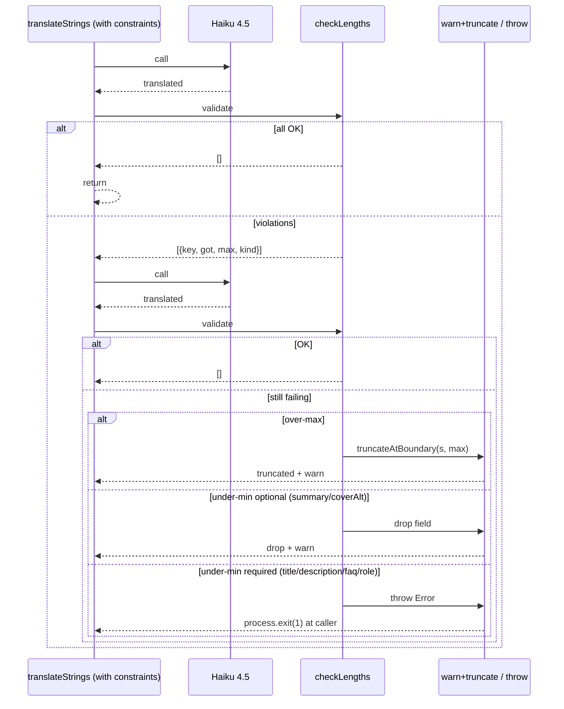

# Plan: длина EN-полей после Haiku-перевода (v2)

**Дата:** 2026-05-10
**Спек:** см. в conversation history
**Статус:** v2 после ревью critic + investigation root cause

## Контекст и root cause

Build упал: `description` в `src/content/posts/en/claude-md-12-rules.md` = 201 символ (max 200). Замерено через `yaml.load` на коммите `d8ec152`.

**Investigation выявила:** EN-файл создан через **`src/lib/translate/translate-one.ts`** (admin in-UI translate path, ввдён в `dd4ab58`), а **не** через `scripts/translate.ts`. В `translate-one.ts` отсутствует ЛЮБАЯ truncation — Haiku вернула 201 символ, файл записался вербатимно.

Yaml round-trip разница в +1 не существует (репро `truncate(input, 200) → yaml.dump → yaml.load` сохраняет длину). Гипотеза `max-2` буфер отвергнута.

**Реальная защита:** централизация на уровне `translateStrings` в `src/lib/translate/claude.ts` — общий entry-point для **обоих** путей (CLI и admin UI). После этого `truncateDesc` в `serializeWithExtras` становится избыточным и удаляется.

## 1. Лимиты — Variant Б

`src/lib/content/limits.ts`:

```ts
export const POST_LIMITS = {
  title:       { min: 3,  max: 120 },
  description: { min: 10, max: 200 },
  summary:     { min: 60, max: 280 },
  faqQuestion: { min: 5,  max: 200 },
  faqAnswer:   { min: 20, max: 2000 },
} as const;
export const PROJECT_LIMITS = {
  title:       { min: 3,  max: 120 },
  description: { min: 10, max: 200 },
  role:        { min: 2,  max: 80 },
} as const;
export const SITE_LIMITS = {
  description: { min: 10, max: 200 },
} as const;
```

Импортится в `content.config.ts`, `actions/posts.ts`, `scripts/translate.ts`, `src/lib/translate/translate-one.ts`, `scripts/translate-check.ts`.

## 2. Constraints в `translateStrings` (БЕЗ нового wrapper)

Расширяем существующую `TranslateStringsInput` опциональным `constraints?: Record<string, { min?: number; max: number }>`. Если пусто — поведение как раньше (для `translateStringCatalog`/`translateTagCatalog`).

В `SYSTEM_PROMPT_STRINGS` после существующих rules — одна строка:

> `Length constraints (when provided per key): keep each translated value within {min, max} characters. If a natural translation exceeds max, rewrite tighter — do not truncate mid-word.`

User-message: если `constraints` непуст — `{ "strings": {...}, "limits": {...} }` + system prompt дописывается «input is `{strings, limits}` instead of bare strings». Cache-friendly (одна строка в стабильном префиксе, переменное — в user message).

## 3. Retry-policy: 1 retry + fail-loud / drop fallback

Новый модуль `src/lib/translate/validate-lengths.ts`:

```ts
type Limits = Record<string, { min?: number; max: number }>;
type Violation = { key: string; got: number; min?: number; max: number; kind: "over" | "under" };
export const checkLengths: (out: Record<string, string>, limits: Limits) => readonly Violation[];
export const truncateAtBoundary: (s: string, max: number) => string;
```

`truncateAtBoundary`: `s.slice(0, max).lastIndexOf(" ")` → если `cut > max*0.6` режем на `cut`; иначе hard `slice(0, max)`. Никаких `…`. Без `max-2` буфера — yaml round-trip это не требует.

Алгоритм в `translateStrings` (когда `constraints` непуст):

1. **Call #1** — translate с `{strings, limits}`.
2. `checkLengths` → если нет нарушений, return.
3. **Retry #1** — user-message с `feedback: [{key, got, max, message}]` для нарушенных ключей + те же limits.
4. Re-validate. Если всё ещё плохо:
   - **Over-max** → `truncateAtBoundary(s, max)` + `console.warn [translate:warn] field=Y truncated N→M`. Файл записывается.
   - **Under-min для опциональных** (`summary`, `coverAlt`) → дроп поля + warn. Опциональные — `summary?: string`, `coverAlt?: string` в схеме.
   - **Under-min для обязательных** (`title`, `description`, `faq.*`, `role`) → **throw Error** с понятным сообщением: `EN translation under-min for required field "X": got N chars, min M. Slug: <slug>. Edit RU source or rerun with different prompt.` Caller (translate-one / scripts/translate) пробрасывает наверх → `process.exit(1)`. Fail loud.

**Инвариант:** на выходе либо все поля укладываются в лимиты, либо process падает с понятной ошибкой.

## 4. Удаление `truncateDesc` в `serializeWithExtras`

После централизации в `translateStrings` локальный `truncateDesc` в `scripts/translate.ts` строки 47–51 удаляется. Single source of truth.

## 5. Валидация EN в `translate-check.ts` (posts + site + projects)

Расширяем существующий скрипт (drift и length — парные).

**Подводный камень `astro:content`.** `src/content.config.ts` импортирует `astro:content` (виртуальный модуль), не резолвится в node-скрипте через `tsx`. Решение: вынести plain-Zod схемы в `src/lib/content/schemas.ts` — `postSchema`, `siteSchema`, `projectSchema` (БЕЗ `defineCollection`/`glob`). `content.config.ts` оборачивает: `defineCollection({ schema: postSchema, loader: glob(...) })`.

В `translate-check.ts` после drift-чека — второй проход по `posts/`, `site/en/`, `projects/en/`: парсим frontmatter через js-yaml, `safeParse` через соответствующую схему, агрегируем `lengthErrors`.

Сообщение об ошибке:

```
✗ EN content schema violation in posts/<slug>:
   - description: 247 chars (max 200)
   - summary: 312 chars (max 280)
```

Exit-code: drift OR missing OR lengthErrors → 1.

## 6. CI workflow

Создаём `.github/workflows/ci.yml`:

```yaml
name: CI
on:
  pull_request:
  push:
    branches: [main]

jobs:
  validate:
    runs-on: ubuntu-latest
    steps:
      - uses: actions/checkout@v5
      - uses: pnpm/action-setup@v4
      - uses: actions/setup-node@v4
        with:
          node-version: 24
          cache: pnpm
      - run: pnpm install --frozen-lockfile
      - run: pnpm translate:check
      - run: pnpm typecheck
      - run: pnpm test
      - run: pnpm lint
```

Триггер `push: branches: [main]` тоже (не только PR), чтобы прямые мерджи не проскакивали.

## Sequence diagram (retry + fallback)



## TL;DR (после ревью critic)

1. **Variant Б принят** — `src/lib/content/limits.ts`.
2. **Расширяем `translateStrings` опциональным `constraints?`** (БЕЗ нового wrapper).
3. **1 retry + fail-loud для required, drop для optional.** Truncate exact `max` — yaml round-trip preserves length.
4. **`truncateDesc` в `serializeWithExtras` удаляется** — централизация.
5. **`translate-check.ts` расширяется на posts+site+projects** через schemas.ts.
6. **`.github/workflows/ci.yml`** на pull_request + push: main.

## Файлы

Новые:
- `src/lib/content/limits.ts`
- `src/lib/content/schemas.ts`
- `src/lib/translate/validate-lengths.ts`
- `.github/workflows/ci.yml`
- `scripts/__tests__/translate-truncation.test.ts`
- `scripts/__tests__/translate-check-content-validation.test.ts`

Изменяются:
- `src/content.config.ts` (импорт schemas + LIMITS)
- `src/actions/posts.ts` (импорт LIMITS)
- `src/lib/translate/claude.ts` (constraints + retry в `translateStrings`)
- `src/lib/translate/translate-one.ts` (передаёт constraints в `translateStrings`)
- `scripts/translate.ts` (передаёт constraints, удаляет `truncateDesc`)
- `scripts/translate-check.ts` (Zod-валидация)
- `src/content/posts/en/claude-md-12-rules.md` (regen или ручная правка description до ≤200)

## Test cases

- `truncateAtBoundary("a".repeat(250), 200)` → 200 (hard slice, нет пробела)
- `truncateAtBoundary("a".repeat(195) + " " + "b".repeat(60), 200)` → 195 (cut at space)
- `truncateAtBoundary("ab " + "c".repeat(250), 200)` → 200 (cut < max*0.6, hard slice)
- summary=320 → truncate до 280 (after retry)
- summary=50 (optional, under-min) → drop + warn
- description=8 chars (required, under-min) → throw
- faqQuestion=250 → truncate до 200
- faqAnswer=15 (required, under-min) → throw
- **regression description=201 (от Haiku) → 200 после truncate**
- translate-check.ts: EN с description=247 → exit 1 с понятным сообщением
- translate-check.ts: site EN с description=250 → exit 1
- translate-check.ts: projects EN с role=100 → exit 1

## Открытые вопросы (закрыты)

1. ✅ CI: создаём `.github/workflows/ci.yml`.
2. ✅ Поле упало: `description = 201` (root cause: admin path без truncate).
3. ✅ Покрываем `posts + site + projects` в `translate-check.ts`.
4. ✅ Под-min обязательного → fail-loud (exit 1). Опционального → drop + warn.
5. ✅ Один `translateStrings` с опциональным `constraints` (вместо нового wrapper).
6. ✅ 1 retry (вместо 3) — Haiku либо чинит за один retry, либо вообще нет.
