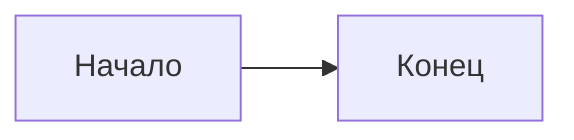

# Заголовок первого уровня

Это **обычный** параграф с _форматированием_ и `inline-кодом`.

```ts
// Это комментарий внутри кода — не трогать
const x = 42;
```

> Цитата с **жирным** текстом.

- Пункт списка раз
- Пункт списка два

[Ссылка на статью](/blog/01-foo) и [внешняя](https://example.com).

$E = mc^2$


