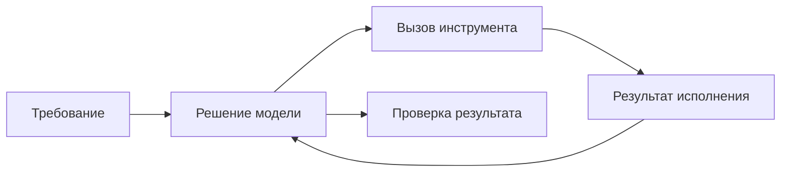

Claude Code удобно разбирать на три части: модель предлагает действия, инструменты читают и меняют среду, а приложение управляет их исполнением. Название модели само по себе не описывает весь этот процесс. Такой разбор согласуется с [документацией устройства Claude Code](https://code.claude.com/docs/en/how-claude-code-works).

## Где искать причину ошибки

Допустим, агент должен исправить расчёт даты поездки. Он может неверно понять требование, прочитать не тот файл, получить отказ инструмента или внести правку без проверки. Во всех случаях на экране будет «не сделал задачу», но исправления нужны разные.

Поэтому сохраняйте не только финальный ответ, но и существенные действия: какой файл прочитан, что изменилось, какой тест запущен и чем закончился. Не переносите в отчёт полный лог с секретами.

## Сквозной пример курса

Travel Agent здесь — учебный сервис планирования поездок. Сначала он работает с заранее подготовленными вариантами маршрутов. Поиск у внешнего поставщика, реальные бронирования и платежи требуют отдельной реализации. В курсе нет опубликованного production-репозитория этого сервиса; имена его пакетов обозначают предлагаемую структуру.

Такой пример позволяет разбирать знакомую задачу без настоящих заказов: пользователь задаёт города, даты и бюджет, сервис возвращает варианты и объясняет ограничения. Если данных не хватает, он должен обозначить неизвестное, а не придумать цену или наличие мест.

## Первое упражнение

Возьмите небольшой знакомый репозиторий. Запишите установленную версию через `claude --version`, исходный commit и доступные команды проверки из README. Попросите агента найти обработчик одной функции, объяснить её входы и предложить проверку без изменения файлов.

Сравните ответ с исходниками. Хороший результат содержит реальные пути, различает наблюдение и предположение и не сообщает о тестах, которых агент не запускал. Если в ответе есть выдуманный файл, исследуйте этот сбой до расширения задачи.

После этого дайте небольшую правку с критерием приёмки. Например: некорректный диапазон дат отклоняется, существующий корректный запрос продолжает работать. Посмотрите diff и запустите проверку самостоятельно.

## Что считать результатом

«Агент написал код» — промежуточный шаг. Результат — подтверждённое поведение и понятное ограничение: что проверено, на каких данных, что осталось за пределами задачи. Ни размер контекста, ни более дорогая модель не заменяют эту проверку.

Далее: [контекст и кэш](/courses/claude-code-guide/02-context-and-cache/).
