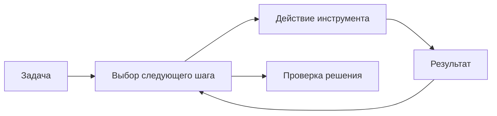

Попросите Claude Code исправить ошибку — и он начнёт читать файлы, запускать команды и менять код. Со стороны это похоже на работу одного исполнителя. Но внутри есть несколько разных частей, и понимать их полезно: так проще разобраться, почему задача не решена.

Модель выбирает следующий шаг. Инструмент выполняет конкретное действие: например, читает файл или запускает тест. Claude Code связывает эти шаги, передаёт результаты обратно модели и управляет доступом к среде. В документации эту оболочку называют _harness_. Далее нам достаточно названия «среда исполнения». Устройство системы описано в [официальном руководстве](https://code.claude.com/docs/en/how-claude-code-works).

## Что происходит после запроса

Допустим, в форме поездки можно указать дату возвращения раньше даты выезда. Вы просите исправить это. Агент ищет обработчик формы, читает проверку дат, предлагает изменение и запускает тест. Если проверка не проходит, он получает сообщение об ошибке и продолжает работу.



Здесь возможны разные сбои. Модель могла неправильно понять условие. Инструмент мог не получить доступ к файлу. Тест мог проверять другой случай. Поэтому полезно смотреть не только на итоговое «готово», но и на то, что действительно происходило.

## На каком примере будем учиться

Во всём курсе используется планировщик поездок — Travel Agent. Пользователь задаёт города, даты и бюджет, а приложение подбирает варианты из заранее подготовленных данных. Так можно проверить логику без оплаты и настоящих бронирований.

Мы будем постепенно добавлять инструкции, инструменты и помощников. Это учебный проект: готового сервиса или отдельного репозитория с ним курс не предоставляет. Структура каталогов и задания помогут собрать собственный пример.

## Попробуйте на знакомом проекте

Сначала узнайте версию клиента:

```bash
claude --version
```

Откройте небольшой репозиторий и дайте задачу без изменения файлов:

> Найди проверку дат поездки. Объясни, где она находится и какие случаи учитывает. Укажи реальные пути к файлам. Предложи проверку для даты возвращения раньше даты выезда.

Сверьте ответ с кодом. После этого попросите небольшое исправление: неверный диапазон должен отклоняться, а правильный — по-прежнему приниматься. Посмотрите изменения и запустите существующую команду проверки из README или package.json.

Упражнение закончено, когда вы можете показать оба результата. Сам по себе новый код ещё не доказывает, что ошибка исправлена. В следующем уроке разберём, [какую информацию модель видит во время работы](/courses/claude-code-guide/02-context-and-cache/).
