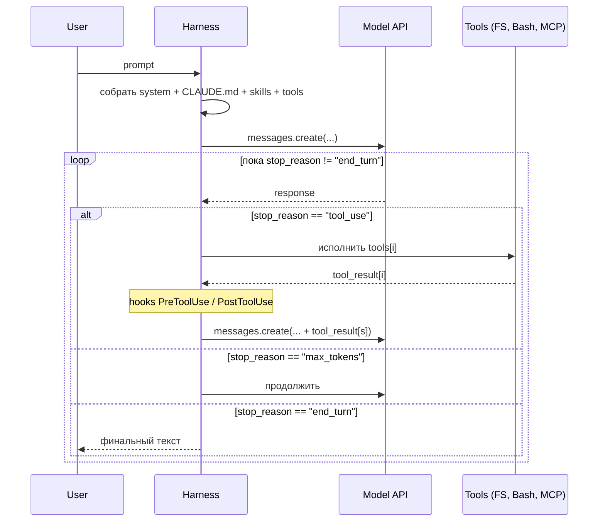
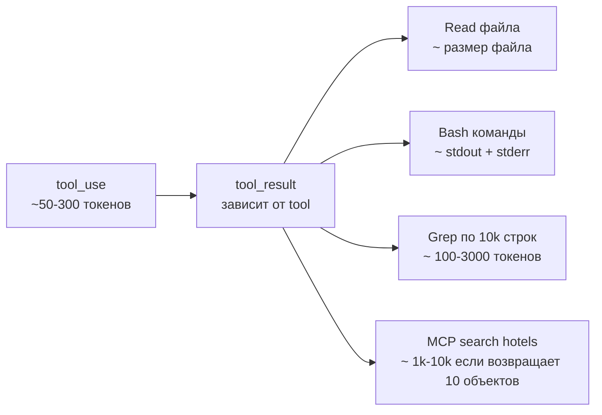

> Tool call — это не «фича Claude Code», это фундаментальный механизм, благодаря которому модель из чат-бота превращается в агента. Понимая tool loop, вы понимаете 80% того, как работает любой AI-агент.

---

## 8.1. Tool call как протокол

В Anthropic API запрос с tools выглядит так:

```python
response = client.messages.create(
    model="claude-opus-4-7",
    tools=[
        {
            "name": "read_file",
            "description": "Read a file from the local filesystem",
            "input_schema": {
                "type": "object",
                "properties": {
                    "path": {"type": "string", "description": "Absolute path"}
                },
                "required": ["path"],
            },
        }
    ],
    messages=[{"role": "user", "content": "Что в /etc/hostname?"}]
)
```

Модель видит описания tools и решает, нужно ли что-то вызвать. Если нужно — она возвращает не текст, а **`tool_use` block**:

```json
{
  "stop_reason": "tool_use",
  "content": [
    {
      "type": "tool_use",
      "id": "toolu_01ABC...",
      "name": "read_file",
      "input": { "path": "/etc/hostname" }
    }
  ]
}
```

Harness (Claude Code в нашем случае) видит это, исполняет `read_file`, и шлёт следующий запрос с `tool_result`:

```json
{
  "messages": [
    /* предыдущие сообщения... */
    {
      "role": "assistant",
      "content": [{"type": "tool_use", "id": "toolu_01ABC", ...}]
    },
    {
      "role": "user",
      "content": [{
        "type": "tool_result",
        "tool_use_id": "toolu_01ABC",
        "content": "my-laptop\n"
      }]
    }
  ]
}
```

И так пока модель не вернёт `stop_reason: "end_turn"` — это её сигнал «всё, я закончил, можно отвечать пользователю».

---

## 8.2. Полный agent loop в одном изображении



Важные нюансы:

- В одном `assistant` сообщении модель может попросить **несколько tool_use** параллельно. Harness может исполнять их параллельно (если безопасно).
- `stop_reason: "max_tokens"` означает, что модель не уложилась в `max_tokens`. Harness увеличивает лимит и продолжает.
- Каждая итерация — это **отдельный запрос к API** с **полной историей**. Поэтому prompt cache критичен.

---

## 8.3. Что harness даёт модели «бесплатно» (built-in tools)

В Claude Code предустановлены tools (без MCP):

| Tool                    | Что делает                                |
| ----------------------- | ----------------------------------------- |
| `Read`                  | Чтение файла (с offset/limit для больших) |
| `Write`                 | Создание / перезапись файла               |
| `Edit`                  | Точечная замена в файле                   |
| `MultiEdit`             | Несколько Edit за один tool call          |
| `Bash`                  | Выполнение shell-команды                  |
| `Glob`                  | Поиск файлов по pattern                   |
| `Grep`                  | Поиск содержимого (под капотом — ripgrep) |
| `WebFetch`              | Получение URL                             |
| `WebSearch`             | Поиск в вебе                              |
| `Agent` (бывший `Task`) | Запуск subagent                           |
| `TodoWrite`             | Управление встроенным task-list           |
| `NotebookEdit`          | Редактирование Jupyter-ноутбуков          |

📘 В версии **2.1.63** tool `Task` был переименован в `Agent`. Старые `Task(...)` всё ещё работают как алиас. Если в чужих гайдах видите `Task tool` — это про subagents.

---

## 8.4. Модель vs harness: кто что решает

| Решение                          | Кто принимает                                    |
| -------------------------------- | ------------------------------------------------ |
| Какой tool вызвать               | Модель                                           |
| Какие аргументы                  | Модель                                           |
| Можно ли исполнить (permissions) | Harness (по правилам + спросив пользователя)     |
| Как доставить результат обратно  | Harness (форматирует tool_result)                |
| Когда остановиться               | Модель (`end_turn`) или harness (бюджет лимитов) |
| Что попадает в контекст          | Harness (управляет окном)                        |
| Что кэшируется                   | Harness (расставляет `cache_control`)            |

⚠️ Это разделение объясняет, почему **hooks работают**: вы вмешиваетесь на уровне harness, минуя модель.

---

## 8.5. Permissions: как Claude Code решает «спросить или нет»

Каждый tool имеет permission level. По умолчанию для деструктивных (`Bash`, `Edit`, `Write`) — спрашивается у пользователя.

📘 Конфиг в `.claude/settings.json`:

```json
{
  "permissions": {
    "allow": [
      "Read",
      "Grep",
      "Glob",
      "Bash(pnpm test:*)",
      "Bash(pnpm typecheck)",
      "Edit(apps/api/src/routes/**)",
      "mcp__flights__*"
    ],
    "deny": ["Edit(.env*)", "Bash(rm -rf *)", "Bash(curl * | sh)"],
    "ask": ["Edit(packages/shared/**)", "Bash(pnpm db:migrate*)"]
  }
}
```

`allow` / `ask` / `deny` — три типа решений. Можно использовать паттерны (`*`, `**`).

⚠️ `deny` — финальный гейт. Невозможно обойти даже в `bypassPermissions` режиме. Это и есть «ваша красная кнопка».

`/permissions` — посмотреть/отредактировать.

---

## 8.6. Параллельные tool calls

Модель может попросить выполнить несколько tools одновременно — это часто видно при большом анализе:

```
assistant.content = [
  {type: "tool_use", name: "Read", input: {file_path: "a.ts"}},
  {type: "tool_use", name: "Read", input: {file_path: "b.ts"}},
  {type: "tool_use", name: "Grep", input: {pattern: "TODO"}},
]
```

Harness исполняет их **параллельно** (если они не имеют зависимостей и не противоречат permissions). Это сильно ускоряет browse-фазу.

💡 Если ваш скилл говорит «делай шаги последовательно» — модель так и сделает. Но если нет жёсткой последовательности, оставьте свободу — параллелизм окупается.

---

## 8.7. Контекст: какой объём занимает один tool call



Плохой пример: `Bash(cat huge.log)` → возвращает 80k строк → весь контекст забит. Хороший: `Bash(tail -200 huge.log)` или `Grep(pattern=..., path=huge.log)`.

💡 Учите модель быть экономной. В CLAUDE.md или skill: «При работе с логами используй `tail`, `head`, `grep`, не `cat` целиком».

---

## 8.8. Тайминги и retry

Harness держит таймауты на каждый tool call. По умолчанию:

- `Bash` — 2 минуты (можно поднять до 10).
- `Read`, `Edit`, `Write` — мгновенно (это файловые операции).
- `WebFetch`, `WebSearch` — несколько секунд.
- MCP tools — определяется сервером, но harness тоже накладывает limit.

⚠️ Если ваш MCP tool регулярно превышает таймаут — модель будет видеть ошибку и пробовать снова. Это сжигает токены. Лучше явно вернуть `tool_result` со статусом «in progress, check later» и реализовать polling.

---

## 8.9. Streaming

Для UX harness стримит ответ модели token-by-token. Если ваш бэкенд тоже использует Anthropic SDK (как в Travel Agent), используйте `stream: true`:

```typescript
const stream = await anthropic.messages.stream({
  model: "claude-opus-4-7",
  tools,
  messages,
});

for await (const event of stream) {
  if (event.type === "content_block_delta") {
    // отправить frontend через SSE
    sse.send(event.delta.text ?? "");
  }
}

const final = await stream.finalMessage();
```

⚠️ Tool calls тоже приходят в стриме — нужно собрать их перед исполнением. SDK даёт удобные хелперы для этого.

---

## 8.10. Чем хороший «agent» отличается от плохого

После всего вышесказанного важный практический вывод:

**Хороший агент:**

- Имеет узкий, осмысленный набор tools (не 50 «на всякий случай»).
- Каждый tool с чётким description и schema.
- Возвращает компактные tool_results (не вываливает гигабайты).
- Имеет system prompt, который задаёт цель и стиль работы.
- Имеет hooks, которые ограничивают ущерб.
- Использует subagents для browse-heavy задач, чтобы сберечь основной контекст.

**Плохой агент:**

- 50 tools, половина с дубликатами.
- Описания «Helper for X».
- Один Read возвращает 200KB JSON.
- System prompt: «Ты помощник».
- Никаких permissions.
- Все операции в одном раздутом контексте.

---

**Дальше →** [09. Subagents: изоляция и экономика](./09-subagents)
