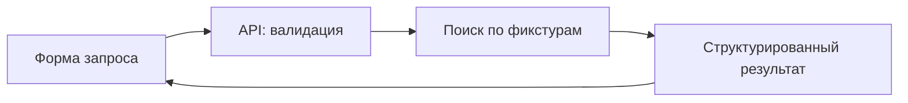

Этот blueprint описывает предлагаемый учебный проект. Это не готовый репозиторий, который достаточно склонировать, и не работающая система бронирований. В прежней версии были неподходящие SDK-импорты и фрагменты с отсутствующими реализациями; они удалены вместо обещания «копируйте и запускайте».

## Минимальный результат

Пользователь задаёт города, даты и бюджет. Сервис возвращает подходящие варианты из тестового набора и объясняет, какие ограничения удалось проверить. Он не бронирует, не списывает деньги и не выдаёт учебные цены за реальные предложения.



Начните с этого пути без LLM. Если обычный обработчик не умеет отличать неверную дату от отсутствия маршрута, агент только усложнит диагностику.

## Предлагаемая структура

```text
apps/web/          форма и отображение результата
apps/api/          валидация, авторизация, оркестрация
packages/shared/   схемы запросов и ответов
packages/trips/    поиск по фикстурам
fixtures/          тестовые маршруты с явной маркировкой
```

Это имена будущих каталогов. Команды сборки и тестирования нужно определить в собственном package.json; курс не предполагает, что они уже существуют.

## Контракт до интерфейса

В запросе нужны начальный и конечный пункт, даты и бюджет с валютой. В ответе — варианты, источник данных и ограничения проверки. Ошибки валидации отделите от временной недоступности источника. Пустой результат должен означать, что поиск выполнен и подходящих вариантов нет.

Создайте тесты для корректного диапазона дат, обратного диапазона, неизвестного города, неподдерживаемой валюты и пустого набора. Эти проверки останутся полезными после подключения модели.

## Добавление MCP и модели

Вынесите поиск в MCP только когда нужен общий интерфейс для нескольких клиентов. Сначала проверьте клиент без модели по [уроку MCP](/courses/claude-code-guide/06-mcp/). Затем добавьте ограниченный [agent loop](/courses/claude-code-guide/08-tool-calls-and-loop/).

Сохраните серверную валидацию: текст модели не является доверенным источником аргументов. Наблюдайте каждый переход: запрос пользователя, вызов инструмента, его результат и итог. В журналах достаточно идентификаторов и диагностических сведений; содержимое персональных документов не должно попадать туда по умолчанию.

## Перед реальным поставщиком

Понадобятся актуальная интеграция, управление секретами, правила доступа, таймауты, лимиты, отмена и защита повторных операций. При бронировании отдельно проектируются подтверждение пользователя и идемпотентность. Это задачи следующего этапа, а не скрытые свойства приведённой схемы.

Критерий завершения учебного проекта: каждый сценарий из тестового набора имеет предсказуемый ответ, система останавливается при сбое, а читатель видит, какие данные учебные.

Далее: [ежедневная проверка](/courses/claude-code-guide/13-best-practices/).
