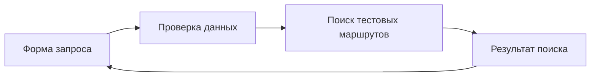

В предыдущих уроках мы отдельно разобрали инструкции, инструменты и помощников. Теперь объединим их в небольшой планировщик поездок. Пользователь вводит города, даты и бюджет, а приложение показывает подходящие варианты.

Начнём с подготовленных данных. Варианты и цены в них учебные: приложение ничего не бронирует и не списывает деньги. Это план самостоятельной разработки, а не готовый репозиторий для запуска.

## Первый этап: работа без модели

Сначала сделайте обычную форму и обработчик. Он проверяет ввод, ищет маршруты в тестовом наборе и возвращает результат.



Так проще убедиться, что основная логика работает. Например, неверный диапазон дат должен давать ошибку, а правильный запрос без подходящих вариантов — пустой результат. Это разные ситуации.

## Как разложить код

Один из возможных вариантов:

```text
apps/web/          форма и показ результата
apps/api/          проверка запросов и управление поиском
packages/shared/   общие описания запросов и ответов
packages/trips/    поиск по тестовым данным
fixtures/          подготовленные маршруты
```

Имена каталогов условные. Папка `fixtures` хранит заранее известные данные для повторяемых проверок. Команды сборки и тестирования определите в своём package.json.

## Согласуйте запрос и ответ

В запросе нужны начальный и конечный пункт, даты, бюджет и валюта. В ответе — варианты, источник и ограничения данных. Не показывайте тестовую цену как предложение, доступное для покупки.

Подготовьте проверки для правильного диапазона дат, обратного диапазона, неизвестного города, неподдерживаемой валюты и отсутствия вариантов. Успешный поиск, ошибка ввода и недоступность источника должны различаться и в коде, и на экране.

## Второй этап: подключаем модель

Теперь модель может переводить свободный запрос пользователя в аргументы поиска и объяснять найденные варианты. При этом проверку аргументов на сервере нужно сохранить: модель тоже может передать неправильную дату.

Если один поиск нужен нескольким клиентам, его можно предоставить через [MCP](/courses/claude-code-guide/06-mcp/). Для единственного приложения это не обязательный промежуточный слой. В любом случае ограничьте [цикл работы агента](/courses/claude-code-guide/08-tool-calls-and-loop/) числом шагов и временем.

Сохраняйте достаточно сведений, чтобы объяснить результат: какой поиск вызван, завершился ли он и какие варианты вернул. Не записывайте в журналы личные документы пользователей.

## Что понадобится для настоящих поездок

Подключение поставщика — отдельный этап. Потребуются действующие условия доступа, управление ключами, обработка сбоев и отмены. Бронирование дополнительно требует подтверждения пользователя и защиты от повторного заказа. Последнее называют идемпотентностью: повтор одного запроса не должен создавать второй результат действия.

Учебная версия готова, когда все подготовленные случаи дают предсказуемый ответ, а пользователь понимает происхождение данных. Дальше разберём [повседневную работу над такими изменениями](/courses/claude-code-guide/13-best-practices/).
