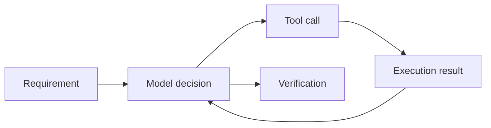

Ask Claude Code to fix a date check and it may read files, edit a handler and run tests. Understanding those steps makes failures easier to diagnose. Separate the work into three parts: the model proposes actions, tools read and change the environment, and the application manages execution. A model name alone does not describe that workflow. The [Claude Code architecture guide](https://code.claude.com/docs/en/how-claude-code-works) explains this distinction.

## Locate the failure

An agent fixing trip-date validation might misunderstand the requirement, read the wrong file, encounter a denied tool call, or edit code without testing it. All look like “the task failed,” but each needs a different correction.

Preserve significant actions alongside the answer: files read, changes made, checks run and their results. Do not copy a complete log containing secrets into the report.

## A trip planner we can safely experiment with

Travel Agent is a teaching design for a trip-planning service. It starts with prepared itinerary fixtures. These fixtures are prepared test data, not live offers. The exercises describe a project you can build yourself; the course does not supply a ready-to-run booking repository.

The example lets us discuss a concrete task without placing real orders. A user supplies cities, dates and a budget; the service returns options and explains constraints. Missing information should remain explicit rather than becoming an invented price or seat availability.

## First exercise

Choose a small repository you know. Record `claude --version`, the starting commit and verification commands from its README. Ask the agent to locate one feature’s handler, explain its inputs and propose a check without changing files.

Compare the answer with the source. It should cite real paths, distinguish observations from assumptions and avoid claiming unexecuted tests. Investigate invented references before expanding the task.

Then request a small change with an acceptance criterion: invalid date ranges are rejected while an existing valid request still succeeds. Review the diff and run the check yourself.

## What a finished exercise looks like

Code generation is an intermediate step. The outcome is verified behavior with a clear boundary: what was checked, against which data, and what remains outside the task. Context size and a more expensive model cannot replace this evidence.

Next: [context and caching](/en/courses/claude-code-guide/02-context-and-cache/).
