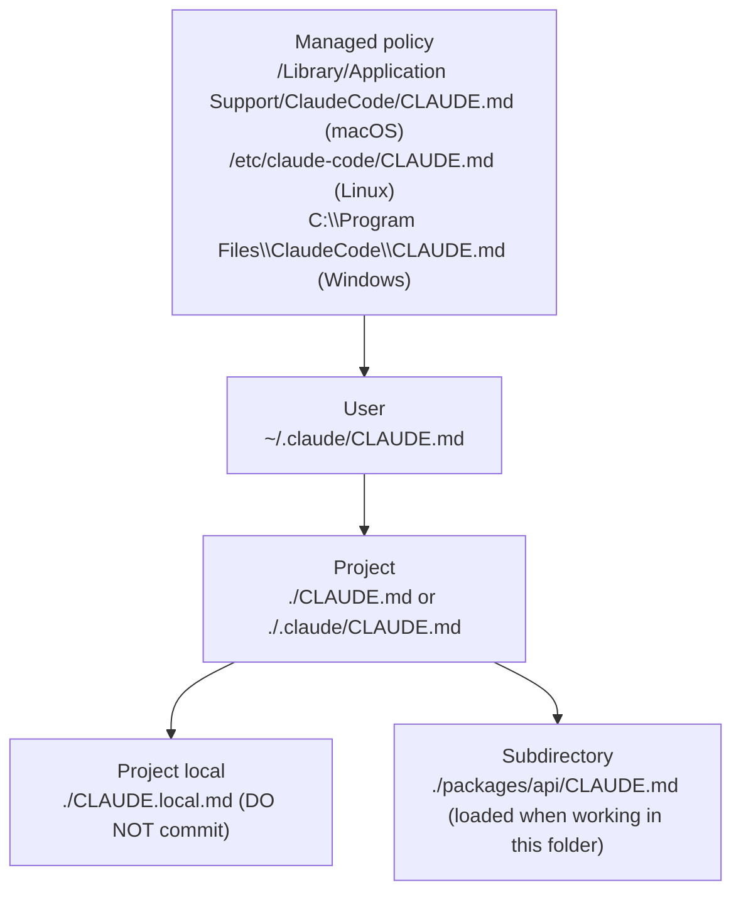

> CLAUDE.md is a "paste this every time" in a nice wrapper. A file that automatically gets pasted into the system prompt of every session. Used correctly — it saves tens of thousands of tokens and makes the model suddenly smart about your project. Used incorrectly — it bloats the context and contradicts itself.

---

## 3.1. What it is and why you need it

📘 From docs (`memory`): "CLAUDE.md files are markdown files that give Claude persistent instructions. Claude reads them at the start of every session".

If your project has quirks ("we use Hono, not Express", "we use pnpm", "pg schema in `db/migrations/`") — without CLAUDE.md the model will spend time reading files and guessing each time. With CLAUDE.md — it knows this from the start.

⚠️ The claim "reduces file reads" is sound practice, but the docs don't state it directly. The documentation talks about "persistent instructions" and "context guidance". The effect — yes, fewer reads; but that's a consequence, not a quote.

---

## 3.2. All levels of CLAUDE.md and their priority

Claude Code has **four levels** + **subdirectory** level:



📘 From docs: "More specific locations take precedence over broader ones, all discovered files are concatenated rather than overriding".

That is, **more specific ones don't overwrite, they add on top**. If user CLAUDE.md says "always use TypeScript strict", and project says "we have strictNullChecks disabled" — the model will see both phrases, and the more local one (project) will be perceived as more authoritative just because of position and context.

---

## 3.3. How Claude discovers CLAUDE.md

When a session starts in directory `cwd`, the harness looks for:

1. `./CLAUDE.md`
2. `./.claude/CLAUDE.md`
3. `./CLAUDE.local.md` (if it exists)
4. Through all parent directories up to the filesystem root — all found files are also picked up.

**Subdirectory CLAUDE.md** is loaded **on demand** — when the model starts working in that folder (reading files from it, running Bash in its root). This allows you to have a huge monorepo with local "notes" in each package without bloating the base context.

🔧 **For Travel Agent** (monorepo):

```
travel-agent/
├── CLAUDE.md                  # глобальные правила проекта
├── .claude/
│   └── settings.json          # шеры настройки команды
├── apps/
│   ├── web/
│   │   └── CLAUDE.md          # подгружается при работе во frontend
│   └── api/
│       └── CLAUDE.md          # подгружается при работе в backend
├── packages/
│   ├── mcp-flights/
│   │   └── CLAUDE.md          # специфика MCP-сервера для авиа
│   └── shared/
│       └── CLAUDE.md          # типы, валидаторы
└── CLAUDE.local.md            # личные заметки разработчика (в .gitignore)
```

---

## 3.4. Imports via `@`

📘 From docs: "Imports use `@path/to/import` (relative or absolute, recursive up to 5 hops)".

Inside CLAUDE.md you can pull in other files:

```markdown
# Travel Agent: глобальные правила

## Стек

- Backend: @docs/architecture/backend-stack.md
- Frontend: @docs/architecture/frontend-stack.md

## Команды

@docs/dev/commands.md

## Соглашения по коду

@.editorconfig
@docs/conventions/typescript.md
@docs/conventions/git-commits.md
```

When Claude reads this CLAUDE.md, it automatically inlines the contents of all imports (recursively, up to 5 levels of nesting). For the model, all of this looks like one big document.

💡 **Why do this:**

1. Decompose a large CLAUDE.md into thematic chunks.
2. Reuse the same documents in multiple CLAUDE.md files.
3. You can keep "real" documents (`docs/architecture/...`) for people and just reference them from CLAUDE.md.

⚠️ The 5 hops limit: if you have A → B → C → D → E → F, then F won't be picked up. And the model won't warn you about it.

---

## 3.5. What to put in CLAUDE.md (and what not to)

**Do put:**

✅ Stack (Hono, not Express. Vite, not Webpack. pnpm, not npm.)
✅ Repo structure in one diagram (mermaid or ASCII).
✅ Commands for main tasks (`pnpm dev`, `pnpm test`, `pnpm db:migrate`).
✅ Code conventions specific to your project (how to name handlers, where migrations live).
✅ Prohibitions ("don't touch files in `legacy/`", "don't use `console.log`, we have pino").
✅ Tips for frequent tasks ("before changing the API — update `packages/shared/types`").

**Don't put:**

❌ README. If you need context — link via `@README.md`.
❌ License.
❌ Long ADRs in full. Better: "we chose Postgres, rationale in @docs/adr/0003-postgres.md" — the model will read it if needed.
❌ Full list of dependencies with versions. This changes often, and `package.json` is there anyway.
❌ Stories "why it was like this and became like that". It adds noise.

💡 **Size heuristic:** one CLAUDE.md per level — no more than **300 lines** or **5000 tokens** (`/context` will show). Larger — move to imports or subdirectory CLAUDE.md.

---

## 3.6. Template for Travel Agent (project-level)

🔧 `./CLAUDE.md`:

```markdown
# Travel Agent

AI-сервис планирования путешествий. Backend на Node + Hono + TS, frontend на React + Vite + TS, агент использует Anthropic SDK + 4 MCP-сервера.

## Структура репозитория

travel-agent/
├── apps/
│ ├── web/ — React SPA (Vite)
│ └── api/ — Hono backend, эндпоинты /chat, /trips
├── packages/
│ ├── mcp-flights/ — MCP server (Amadeus)
│ ├── mcp-hotels/ — MCP server (Duffel)
│ ├── mcp-weather/ — MCP server (OpenMeteo)
│ ├── mcp-docs/ — MCP server для нашей wiki
│ └── shared/ — типы, zod-схемы, общие утилиты
├── infra/ — docker-compose, k8s манифесты
└── docs/

## Команды

- `pnpm dev` — поднять api + web одновременно
- `pnpm test` — vitest для всех пакетов
- `pnpm typecheck` — tsc --noEmit по всему монорепо
- `pnpm lint` — eslint + prettier --check
- `pnpm db:migrate` — применить миграции drizzle

## Соглашения

- TypeScript strict, никаких `any`. Если нужно — `unknown` + type guard.
- React: только функциональные компоненты, hooks. Без классов.
- Backend: Hono routers в `apps/api/src/routes/`, бизнес-логика в `apps/api/src/services/`.
- MCP-серверы в `packages/mcp-*` следуют единому шаблону: `src/server.ts` экспортирует `createServer()`.
- Импортируем через workspace: `@travel/shared`, `@travel/mcp-flights`.

## Запреты

- Не трогать `apps/api/src/legacy/` — старая интеграция, удаляется в Q2.
- Не использовать `console.*` — везде `logger` из `@travel/shared/logger` (pino).
- Не писать сырой SQL — только через drizzle query builder.

## Перед коммитом

@docs/dev/precommit-checklist.md

## Конкретика по подсистемам

@docs/architecture/mcp-servers.md
```

And in subfolders:

🔧 `./apps/api/CLAUDE.md`:

```markdown
# Backend (api)

Hono + TS, минимальный middleware-стек.

## Точки входа

- `src/index.ts` — startup, регистрация роутов.
- `src/routes/chat.ts` — основной чат-эндпоинт со стримингом (SSE).
- `src/routes/trips.ts` — CRUD сохранённых маршрутов.

## Anthropic SDK

Использовать `@anthropic-ai/sdk` с моделью `claude-opus-4-7` для агентного цикла.
MCP-серверы подключаются через локальный stdio-transport — конфиг в `src/mcp/config.ts`.

## База

drizzle + postgres-js. Схема в `src/db/schema.ts`. Все запросы через `src/db/repositories/`.

## Тесты

vitest + supertest. Каждый роут должен иметь happy path + 1 ошибочный сценарий.
```

🔧 `./apps/web/CLAUDE.md`:

```markdown
# Frontend (web)

React 19 + Vite + Tailwind + shadcn/ui + TanStack Query.

## Структура

- `src/pages/` — top-level страницы (router-aware).
- `src/components/` — shadcn-обёртки и доменные компоненты.
- `src/lib/api.ts` — типизированный клиент к /api (источник истины — типы из `@travel/shared`).
- `src/hooks/` — переиспользуемые hooks.

## SSE для чата

Используем `@microsoft/fetch-event-source` — пример в `src/hooks/useChatStream.ts`.

## Стилизация

Только Tailwind utility-классы. Кастомный CSS — только в `src/index.css` для глобальных переменных.
shadcn/ui компоненты копируем через CLI, лежат в `src/components/ui/`.
```

---

## 3.7. CLAUDE.local.md and private settings

📘 `CLAUDE.local.md` — for **personal** developer notes. Not committed (better add it to `.gitignore`).

What can be there:

```markdown
# Личное

## Мои текущие тикеты

- TRV-145 — рефакторинг хука useChatStream, без изменения API
- TRV-152 — добавить retry в mcp-flights при 503 от Amadeus

## Окружение

- Использую pnpm 9.x, node 22.
- Postgres локальный, миграции через `pnpm db:migrate:dev`.

## Заметки

- При работе с mcp-flights: тестовый ключ Amadeus в `.env.local`, прод-ключ — только в Vault.
```

This is the "4th edition" — it exists only for you. Very convenient so Claude knows your current context without you having to tell it every time.

---

## 3.8. Auto-memory

📘 From docs: "Claude also creates auto memory as it works, persisting knowledge … across sessions".

Besides CLAUDE.md, the harness can **itself** add notes to a special memory file. This is needed, for example, to remember "I already checked a specific edge case for the user". These notes also go into the system prefix.

⚠️ Auto-memory is a relatively young feature, behavior may change from version to version. If deterministic context matters to you — disable it in settings or explicitly review it.

---

## 3.9. Commands for working with CLAUDE.md

| Command    | What it does                                                              |
| ---------- | ------------------------------------------------------------------------- |
| `/init`    | Create a starter CLAUDE.md in the current directory by analyzing the repo |
| `/memory`  | Open CLAUDE.md in editor for editing                                      |
| `/context` | See how many tokens CLAUDE.md and its imports take up                     |

💡 `/init` — really a good starting point for a new project. Run it, see what Claude suggests, edit to your reality.

---

## 3.10. Antipatterns that come up most often

❌ **"CLAUDE.md as README"** — people copy README with all promotional sections and changelog. → Bloats the prefix, the model sees extra noise.

❌ **"CLAUDE.md as ADR repository"** — all architectural decisions with rationales dumped in. → Better: briefly "chose Postgres because of X, details in @docs/adr/..." and a link.

❌ **Contradictions between levels** — user CLAUDE.md says "use tabs", project says "use spaces", subdirectory says "we have mixed". → Model gets confused. Unify, keep project as the single source of truth for the project.

❌ **Missing subdirectory CLAUDE.md in monorepo** — one huge root CLAUDE.md with 800 lines. → Move package specifics to `apps/*/CLAUDE.md` and `packages/*/CLAUDE.md`.

❌ **Ignoring `/context`** — never check how much your memory weighs. Miss it until you hit a cache problem.

---

**Next →** [04. Skills: SKILL.md, scripts, references](./04-skills)
