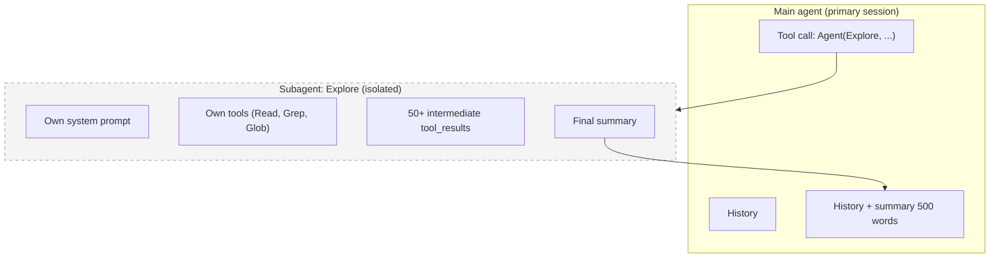
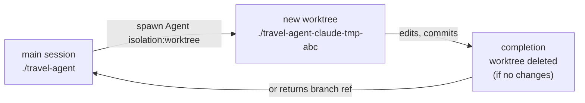
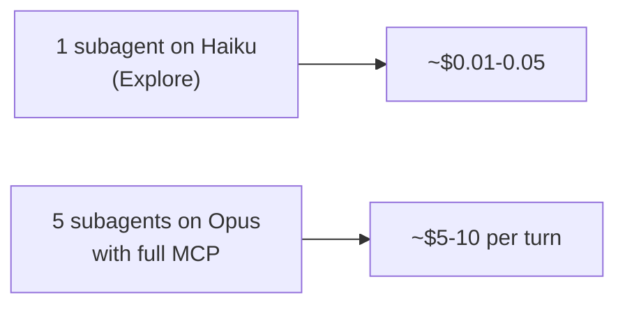

> Subagent — a mini-session of Claude Code launched from the main one. With its own context, its own system prompt, its own set of tools. Only the final result is returned to the main context. This is both salvation from context window overflow and the reason for unexpected bills.

---

## 9.1. What it is and why

📘 From docs (`sub-agents`): "Each subagent runs in its own context window with a custom system prompt, specific tool access, and independent permissions".

Main use case: **isolation of browse-heavy tasks**.

Example from Travel Agent: you ask Claude Code "find all places where we use the Amadeus API, and tell me which ones need to be refactored for their new v3 endpoint".

Without subagent: model `Grep` across the repo → 200 matches → reads 30 files → analyzes → solution. All intermediate tool_results stay in the main context. After such a task, the window is 60% full.

With subagent: the main agent makes one tool call `Agent(subagent_type="Explore", prompt="...")`. The subagent searches and reads everything in **its own** window, returns a 500-word summary. The main context grew by 500 words.



---

## 9.2. How Claude calls a subagent

Through the built-in **`Agent`** tool (formerly called `Task`).

Inside the agent loop, the model does:

```json
{
  "type": "tool_use",
  "name": "Agent",
  "input": {
    "subagent_type": "Explore",
    "description": "Find Amadeus usages",
    "prompt": "Find all places in the repo that import or call the Amadeus client, list them with line numbers and short context. Return as a markdown table."
  }
}
```

Harness:

1. Creates a new session with `subagent_type` system prompt + tools.
2. Passes `prompt` as a user message.
3. Runs the subagent's agent loop until `end_turn`.
4. Returns the final text in `tool_result` of the main session.

The main session sees only `tool_result`. **Does not see** any intermediate steps of the subagent.

---

## 9.3. Where subagents are defined

📘 Markdown files in:

- `~/.claude/agents/<name>.md` — user-defined (available in all projects)
- `.claude/agents/<name>.md` — project-specific (committed to the repo)
- `<plugin>/agents/<name>.md` — packaged in a plugin
- In managed settings — enterprise

File name = agent name (used as `subagent_type`).

---

## 9.4. Subagent frontmatter

📘 Complete list of fields (Claude Code v2.1.89):

```markdown
---
name: trip-architect
description: |
  Use this agent when the user asks to plan a multi-city trip or design an itinerary.

  <example>
  Context: User wants a 10-day Europe trip
  user: "Спланируй мне маршрут Рим → Париж → Амстердам на 10 дней с бюджетом $3000"
  assistant: "I'll use trip-architect to design the itinerary."
  <commentary>Multi-city trip planning is exactly this agent's job.</commentary>
  </example>
model: opus
color: cyan
tools: ["Read", "Grep", "mcp__flights__*", "mcp__hotels__*", "mcp__weather__*"]
disallowedTools: ["Bash", "Write", "Edit"]
permissionMode: ask
mcpServers: ["flights", "hotels", "weather"]
maxTurns: 30
skills: ["budget-optimizer"]
memory: read-only
effort: high
isolation: worktree
background: false
initialPrompt: |
  Always start by clarifying budget, dates, and pace preference (relaxed/intense).
hooks:
  PostToolUse:
    - matcher: "mcp__flights__*"
      hooks:
        - type: command
          command: "bash .claude/hooks/cache-flight.sh"
---

You are a senior travel architect. Your job is to compose multi-city itineraries...

## Methodology

1. Clarify constraints (dates, budget, pace, must-have cities).
2. Build skeleton (city → days → vibe).
3. For each leg: search flights / trains, find lodging in desired neighborhood,
   note 2-3 anchor activities + 1 free evening.
4. Sanity check budget across all legs.
5. Return a markdown itinerary with: per-day plan, transit list with prices, total cost.

## Output format

Markdown table per day + cost breakdown. No prose-style narratives.
```

| Field             | Meaning                                                      |
| ----------------- | ------------------------------------------------------------ |
| `name`            | Identifier (slug)                                            |
| `description`     | Model uses this to decide which agent to call                |
| `model`           | `sonnet` / `opus` / `haiku` / `claude-opus-4-7` / `inherit`  |
| `color`           | UI color in `/agents` manager                                |
| `tools`           | Whitelist built-in/MCP tools                                 |
| `disallowedTools` | Blacklist (applied on top of tools)                          |
| `permissionMode`  | `default` / `ask` / `bypassPermissions`                      |
| `mcpServers`      | Which MCP servers to start for this subagent                 |
| `hooks`           | Inline hooks only for this subagent                          |
| `maxTurns`        | Limit on agent loop iterations                               |
| `skills`          | Additional skills available to the subagent                  |
| `memory`          | `none` / `read-only` / `read-write` (access to CLAUDE.md)    |
| `effort`          | `low` / `medium` / `high`                                    |
| `background`      | Run in background (without blocking the main agent)          |
| `isolation`       | `none` / `worktree` (create a git worktree copy of the repo) |
| `initialPrompt`   | Additional message that harness adds to the prompt           |

---

## 9.5. Built-in subagents

📘 Out of the box in Claude Code v2.1.89:

| Subagent              | Model    | What it does                               | When to use                                                                   |
| --------------------- | -------- | ------------------------------------------ | ----------------------------------------------------------------------------- |
| **Explore**           | Haiku    | Read-only search/analysis of codebase      | Browse-heavy tasks: "find all occurrences of X", "how is module Y structured" |
| **Plan**              | inherits | Plan creation (read-only)                  | Before complex changes — plan the steps                                       |
| **General-purpose**   | inherits | Universal, all tools                       | Long multi-step tasks that don't fit other categories                         |
| **statusline-setup**  | Sonnet   | Configures statusline in CLI               | Only when user asks for statusline config                                     |
| **Claude Code Guide** | Haiku    | Answers questions about Claude Code itself | When user asks "how to do X in Claude Code"                                   |

📘 Example call from chat:

"Use Explore to find all places where we send requests to Amadeus".

The model will make `Agent(subagent_type="Explore", prompt="...")` call.

---

## 9.6. Parallel subagents

📘 From docs: "Subagents only report results back to the main agent and never talk to each other".

You can launch multiple subagents in one assistant turn:

```json
{
  "content": [
    {
      "type": "tool_use",
      "name": "Agent",
      "input": { "subagent_type": "Explore", "prompt": "find frontend usages" }
    },
    {
      "type": "tool_use",
      "name": "Agent",
      "input": { "subagent_type": "Explore", "prompt": "find backend usages" }
    }
  ]
}
```

They will execute in parallel. The main agent will get **two** independent summaries.

⚠️ They **do not communicate**. If the task requires information exchange — that's already an **agent team** (see [10-agent-teams.md](./10-agent-teams)).

---

## 9.7. Isolation via `worktree`

📘 `isolation: worktree` creates a temporary git worktree — an isolated copy of your working directory on a separate branch. The subagent works in it without touching the main workspace.



💡 Use case: you want a subagent to try a large refactoring — but without risking breaking the main workspace. If the subagent doesn't commit anything — the worktree is deleted automatically. If it commits — it returns the branch name, and you decide whether to merge or not.

---

## 9.8. Economics of subagents

⚠️ This is where newcomers lose money.

**Each subagent is a separate session with its own prefix.** It has:

- Its own subagent system prompt (often smaller than the main one, but still tokens).
- Its own CLAUDE.md (if `memory != none`).
- Its own tools (including MCP, if specified).
- Its own agent loop = another prefix on each turn.

📘 The claim "a subagent doesn't have the cached prefix of the main session — all base tokens are billed again" — **is essentially true**: the subagent starts with its own prefix, which on first run goes as a cache write. **But** within the subagent itself, caching works normally on subsequent turns.

**Calculation:** subagent on Haiku (Explore) with system_prompt of 3k tokens doing 5 turns:

- Turn 1: 3k cache write + 2k input + N output → cache write at \$1.25/M = \$0.004.
- Turn 2-5: 3k cache read + N input + N output → cheap.

Total one subagent ≈ \$0.01-0.05 depending on workload. Not "pennies", but not bankruptcy either.

⚠️ Dangerous situation: you launch **5 subagents in parallel** on Opus with large CLAUDE.md and lots of MCP. Each — \$0.50-2 → total \$5-10 per assistant turn. Calculate before launching.



💡 Economy rules:

- Browse tasks → **Explore** (Haiku) or **General-purpose** (Sonnet).
- Architectural thinking → **Plan** (inherits) or subagent with `model: opus`.
- Don't connect all MCP servers to a subagent — only needed ones via `mcpServers: [...]`.
- If a subagent is needed often — pin it to `model: haiku`, `effort: low`.

---

## 9.9. Subagents for Travel Agent

🔧 Minimal set of custom agents:

```
.claude/agents/
├── trip-architect.md       # планирование маршрутов (opus, MCP-only)
├── code-reviewer.md         # ревью PR (sonnet, read-only)
├── policy-checker.md        # проверка regulations (haiku)
└── cost-analyzer.md         # анализ цен flight/hotel (sonnet)
```

🔧 `code-reviewer.md`:

```markdown
---
name: code-reviewer
description: |
  Review a pull request, branch diff, or set of recent changes for code quality, type safety, security, and adherence to Travel Agent conventions. Use when user says "review PR", "check my changes", "проверь PR".
model: sonnet
color: blue
tools: ["Read", "Grep", "Glob", "Bash(git:*)", "Bash(gh:*)"]
disallowedTools: ["Write", "Edit", "Bash(rm:*)"]
permissionMode: default
maxTurns: 25
effort: high
memory: read-only
---

You are a senior code reviewer for the Travel Agent monorepo. Be specific, prioritize issues, and don't repeat what tests already enforce.

## Workflow

1. Identify the diff: either branch vs main (`git diff main...HEAD`) or PR (`gh pr diff <num>`).
2. For each changed file:
   - Type safety: any `any`, missing return types, schema mismatches.
   - API contract: changes to public types in `@travel/shared` are breaking unless versioned.
   - DB: any new query missing index? unbounded LIMIT?
   - Security: input validation, SQL injection (we use drizzle, but check raw SQL paths).
   - Performance: N+1 queries, large `Read`-heavy operations.
   - Tests: are happy paths + 1 error path covered for new logic?
3. Output sections: Critical / Important / Nit / Praise.
4. End with a 1-line verdict: APPROVE / REQUEST CHANGES.

## Style

- One bullet = one concrete issue with `file:line`.
- No "consider this" — say "do this" or skip.
```

---

## 9.10. Commands for working with subagents

| Command               | What it does                |
| --------------------- | --------------------------- |
| `/agents`             | UI agent manager            |
| `/agents create`      | Guide to creating a new one |
| `/agents list`        | List with locations         |
| `/agents test <name>` | Run agent on a test prompt  |

---

## 9.11. Antipatterns

❌ **Subagent for every task.** If the task is short (5-10 turns) — this is overspending. Subagent is justified when browse volume is large.

❌ **Give all tools to the subagent.** Waste of context and money. Give only what's really needed.

❌ **Duplicating the main agent.** Making a `general-purpose` subagent with the same CLAUDE.md and MCP — that's just two instances of the same thing. Use only if you really need isolation.

❌ **Subagent with `permissionMode: bypassPermissions` on opus.** If it breaks something — no one will stop it.

❌ **Ignoring `maxTurns`.** Without a limit, a subagent can get stuck in an infinite loop if it gets confused.

❌ **Using subagents where you need an agent team.** If the task requires exchange between executors — that's a team. See the next chapter.

---

**Next →** [10. Agent Teams: coordinating multiple agents](./10-agent-teams)
