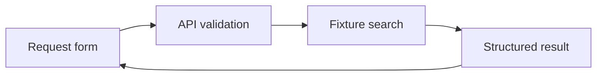

We have looked at instructions, tools and helpers separately. Now put them together in a small trip planner: a form, prepared route data, and later a model that can interpret requests. This is a plan for building your own project, not a ready-to-run booking repository.

## Smallest useful outcome

A user supplies cities, dates and a budget. The service returns suitable itinerary fixtures and explains which constraints were checked. It does not book, charge money or present fixture prices as live offers.



Build this path without an LLM first. If an ordinary handler cannot distinguish invalid dates from no results, an agent will make debugging harder.

## Proposed directories

```text
apps/web/          request form and results
apps/api/          validation, authorization and orchestration
packages/shared/   request and response schemas
packages/trips/    fixture search
fixtures/          clearly labeled itinerary data
```

The `fixtures` directory holds prepared data for repeatable tests. These are proposed directories. Define actual build and test commands in the project’s package.json rather than assuming the course provides them.

## Contract before interface

The request needs origin, destination, dates, budget and currency. The response needs options, data sources and verification limits. Separate validation failures from unavailable sources. An empty result should mean a completed search found no options.

Test valid and reversed date ranges, unknown cities, unsupported currencies and empty datasets. These tests remain useful after connecting a model.

## Add MCP and the model

Expose search through MCP when multiple clients need the same interface; a single application does not require that extra layer. Test the client without a model using the [MCP lesson](/en/courses/claude-code-guide/06-mcp/), then add the bounded [agent loop](/en/courses/claude-code-guide/08-tool-calls-and-loop/).

Keep server-side validation. Model output is not trusted input. Observe request, tool call, tool result and final response. Log identifiers and diagnostic fields rather than personal documents by default.

## Before using a real provider

Implement the current integration, secret handling, access rules, timeouts, limits, cancellation and duplicate-operation protection. Booking additionally needs user confirmation and idempotency: retrying the same request must not create a second booking. Those are explicit next-stage tasks, not hidden capabilities of the diagram.

The teaching project is complete when every fixture scenario has a predictable response, failures terminate and users can tell which data is synthetic.

Next: [daily verification](/en/courses/claude-code-guide/13-best-practices/).
