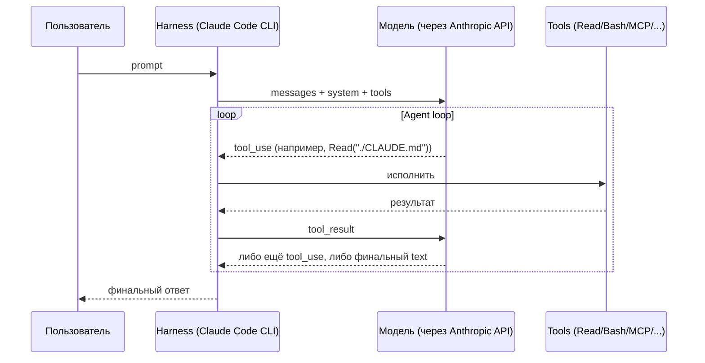
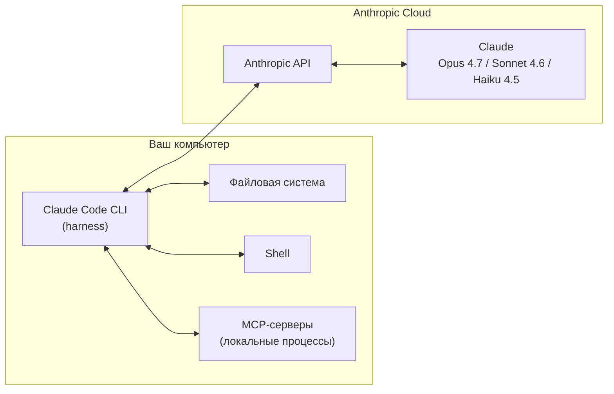
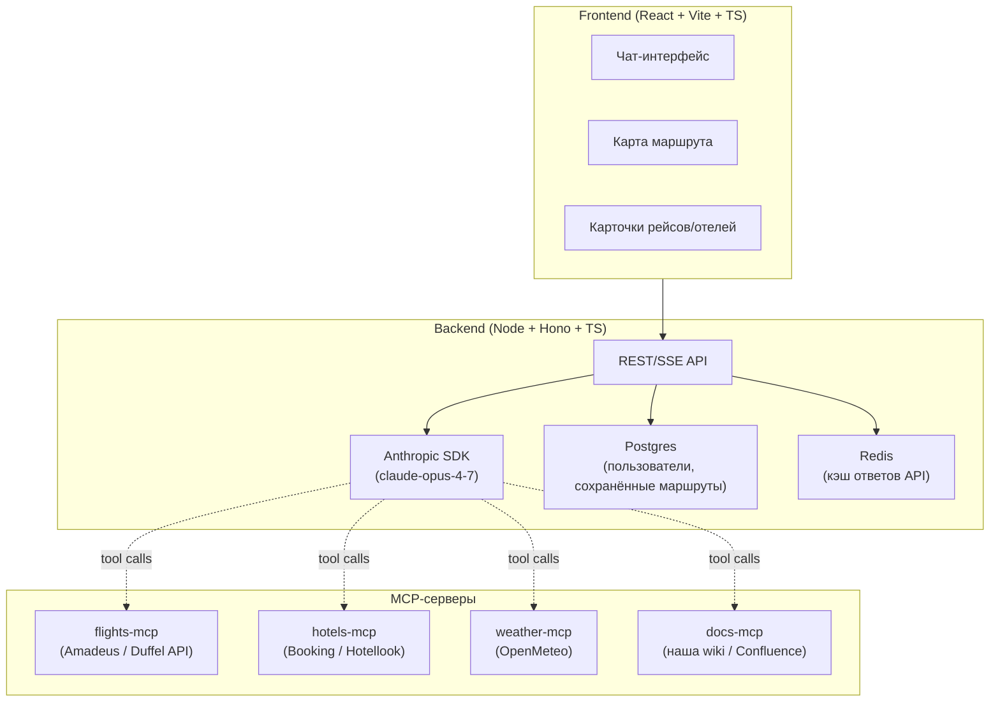

> Перед тем как разбирать `CLAUDE.md`, skills и subagents, надо договориться о терминах. Иначе обсуждение «кэша» и «контекста» превращается в спор про разные сущности.

---

## 1.1. Чат-бот vs агент

**Чат-бот** — это `model.complete(messages)`. Он принимает текст и возвращает текст. Если вы хотите, чтобы он что-то прочитал, вы сами копируете содержимое файла в промпт.

**Агент** — это цикл, в котором модель:

1. Получает запрос пользователя.
2. Решает, какой **tool** вызвать (Read файла, Bash-команда, поиск по коду).
3. Получает результат tool back.
4. Решает: либо вызвать ещё один tool, либо ответить пользователю.

Этот цикл и называется **agent loop**. В Claude Code он жёстко зашит в CLI (harness).



**Ключевая мысль:** модель сама по себе ничего не делает на вашей машине. Все действия — чтение файлов, запуск команд, вызовы MCP — это **tool calls**, которые исполняет harness. Модель только решает, _что_ вызвать.

---

## 1.2. Что такое harness

**Harness** — это локальная программа (Claude Code CLI или IDE-плагин), которая:

| Функция                | Что делает                                                            |
| ---------------------- | --------------------------------------------------------------------- |
| Сборка промпта         | Склеивает system prompt + CLAUDE.md + skills + историю + tool results |
| Tool dispatch          | Получает `tool_use` от модели, исполняет, возвращает результат        |
| Permission gating      | Спрашивает разрешения у пользователя на «опасные» tools (Bash, Edit)  |
| Cache management       | Помечает кэшируемые блоки, обновляет TTL                              |
| Subagent orchestration | Запускает дочерние сессии при `Agent` tool call                       |
| Hooks                  | Триггерит ваши скрипты на события lifecycle                           |
| MCP transport          | Поддерживает stdio/SSE/HTTP-соединения с MCP-серверами                |

Harness — это **не модель**. Модель находится в облаке Anthropic. Harness — это глаза, руки и память модели.



⚠️ Это важно понять: когда говорят «модель прочитала файл» — это языковая короткая запись для «модель сделала tool_use Read, harness прочитал файл, вернул содержимое в tool_result, модель увидела это в следующем шаге». Никакой прямой доступ к диску у модели не существует.

---

## 1.3. Из чего реально состоит «контекст» в каждом запросе

Каждый запрос к Anthropic API содержит:

```python
messages.create(
  model="claude-opus-4-7",
  system=[                       # ← кэшируемый префикс
    {"type": "text", "text": SYSTEM_PROMPT},                # ~4.2k токенов
    {"type": "text", "text": CLAUDE_MD_CONCAT},             # ваши memory-файлы
    {"type": "text", "text": LOADED_SKILLS},                # SKILL.md тех скиллов, что подгружены
  ],
  tools=[...],                   # ← кэшируемый префикс (определения всех tools)
  messages=[                     # ← НЕ кэшируется целиком, только префикс
    {"role": "user", "content": "..."},
    {"role": "assistant", "content": [{"type": "tool_use", ...}]},
    {"role": "user", "content": [{"type": "tool_result", ...}]},
    ...
  ],
)
```

📘 Из docs (`how-claude-code-works`): «Claude's context window holds your conversation history, file contents, command outputs, CLAUDE.md, auto memory, loaded skills, and system instructions».

Это всё — один длинный документ для модели. Размер этого документа измеряется в **токенах** и ограничен **контекстным окном** (200k у Haiku, 1M у Sonnet/Opus с beta-флагом).

См. подробно в [02-context-and-cache.md](./02-context-and-cache).

---

## 1.4. Версии и редакции

На 23.04.2026 актуальны:

- **Claude Code** v2.1.89 (CLI, IDE-плагины)
- **Модели по умолчанию на Anthropic API:**
  - `opus` → Opus 4.7 (релиз 16.04.2026)
  - `sonnet` → Sonnet 4.6
  - `haiku` → Haiku 4.5
- **На Bedrock/Vertex/Foundry** дефолт сдвинут: `opus`→4.6, `sonnet`→4.5 (новые модели подъезжают позже).

🧪 **Agent Teams** — экспериментальная фича, требует `CLAUDE_CODE_EXPERIMENTAL_AGENT_TEAMS=1`. См. [10-agent-teams.md](./10-agent-teams).

⚠️ **Opus 4.7** имеет новый токенизатор — на тех же текстах он расходует до 35% токенов больше, чем Opus 4.6. Если вы переходите с 4.6 — пересчитайте свои оценки лимитов.

---

## 1.5. Сквозной пример: Travel Agent

Через весь гайд проходит один проект — **Travel Agent**. Это AI-сервис планирования путешествий:



В каждой главе мы будем отвечать на вопрос: **«А как это применить к Travel Agent?»** — с конкретным фрагментом конфига, кодом или CLAUDE.md.

В [12-travel-agent-blueprint.md](./12-travel-agent-blueprint) собирается финальная структура репозитория с всеми артефактами.

---

## 1.6. Шорт-лист команд CLI, которые встречаются в гайде

| Команда                 | Что делает                                        | Глава                                                       |
| ----------------------- | ------------------------------------------------- | ----------------------------------------------------------- |
| `/context`              | Визуализирует текущее заполнение окна             | [02](./02-context-and-cache)                                |
| `/compact [hint]`       | Сжимает историю, освобождая место                 | [02](./02-context-and-cache)                                |
| `/clear`                | Полный сброс сессии (пере-стартует, кэш теряется) | [02](./02-context-and-cache)                                |
| `/model [name]`         | Сменить модель в текущей сессии                   | [02](./02-context-and-cache), [10](./11-models-and-pricing) |
| `/agents`               | Менеджер subagent'ов                              | [09](./09-subagents)                                        |
| `/plugin install <ref>` | Установить плагин из marketplace                  | [07](./07-plugins)                                          |
| `/mcp`                  | Список подключённых MCP-серверов                  | [06](./06-mcp)                                              |
| `/permissions`          | Текущие правила allow/deny                        | [05](./05-hooks)                                            |
| `/release-notes`        | Изменения в версии                                | —                                                           |

---

**Дальше →** [02. Контекстное окно и prompt cache](./02-context-and-cache)
