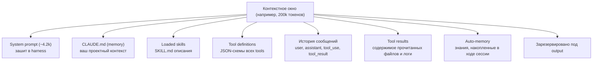
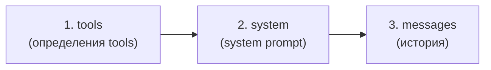
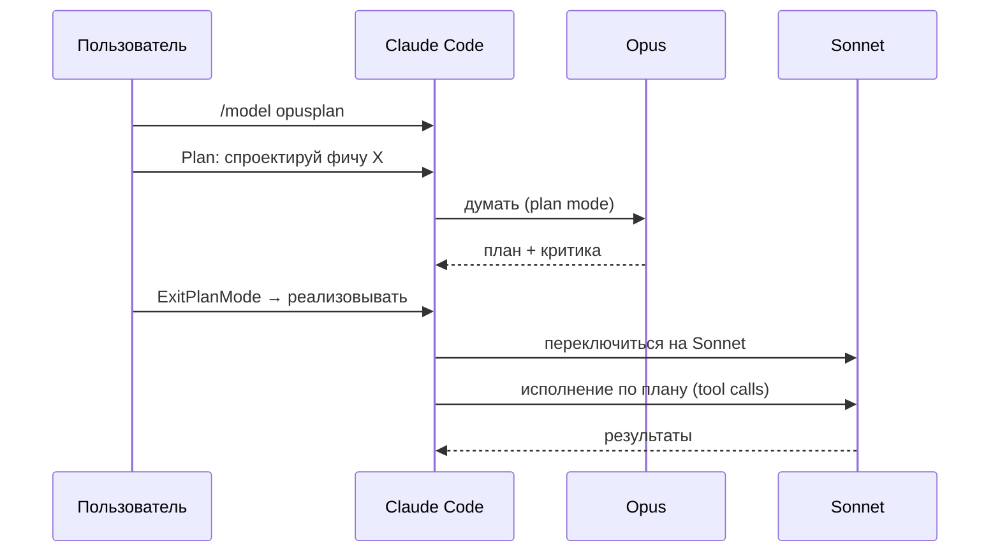
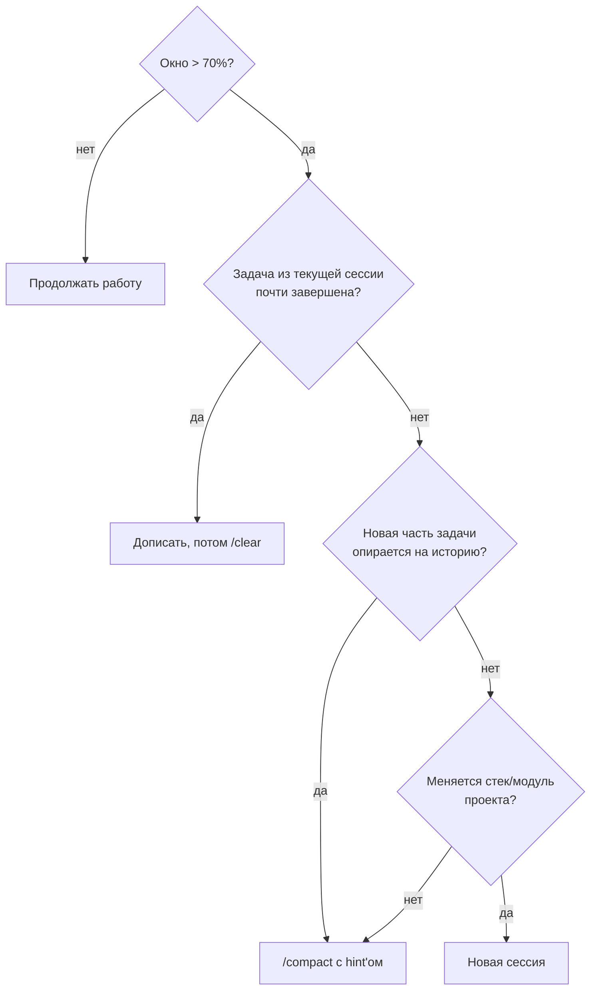

# 02. Контекстное окно и prompt cache

> Самая частая причина «Claude вдруг стал тупее» — переполненное окно. Самая частая причина «вдруг стало дорого» — потерянный кэш. Эта глава — про то, как этого избегать.

---

## 2.1. Что такое контекстное окно

**Контекстное окно** — максимальное количество токенов, которое модель видит за один запрос. Это и input (всё, что вы ей послали), и место для output (то, что она напишет).

Лимиты на 23.04.2026:

| Модель            | Стандартное окно | 1M-режим                    |
| ----------------- | ---------------- | --------------------------- |
| Claude Opus 4.7   | 200k             | ✅ через alias `opus[1m]`   |
| Claude Opus 4.6   | 200k             | ✅ через alias `opus[1m]`   |
| Claude Sonnet 4.6 | 200k             | ✅ через alias `sonnet[1m]` |
| Claude Haiku 4.5  | 200k             | ❌                          |

📘 Из docs (`model-config#extended-context`): «Opus 4.7, Opus 4.6, and Sonnet 4.6 support a 1 million token context window».

**Включить 1M на Max/Team/Enterprise:**

- Opus 1M входит в подписку.
- Sonnet 1M идёт как extra usage (доплата).
- Отключить можно через env: `CLAUDE_CODE_DISABLE_1M_CONTEXT=1`.

⚠️ **`opusplan` режим (опишем ниже) НЕ поддерживает 1M-окно** — даже если вы включили `sonnet[1m]`, plan-фаза с Opus отработает в стандартных 200k.

---

## 2.2. Из чего состоит контекст

Каждый запрос содержит несколько слоёв. Их можно увидеть в CLI командой `/context`:



📘 `/context` (из docs `commands`): «Visualize current context usage as a colored grid. Shows optimization suggestions for context-heavy tools, memory bloat, and capacity warnings».

**Что обычно занимает больше всего токенов в реальной сессии:**

1. **Tool results** — особенно `Read` больших файлов и `Bash` с verbose-output. Лидер по «съеданию» окна.
2. **Большой CLAUDE.md** — если вы туда положили README, ADR'ы и changelog «на всякий случай».
3. **Длинная история** — каждый предыдущий tool call с результатом остаётся в окне.
4. **Tool definitions** — определения всех tools (включая MCP) могут весить 3-15k. Особенно если у вас подключено 5+ MCP-серверов с десятками tools каждый.

💡 Перед сложной задачей запустите `/context` — увидите разбивку и поймёте, что выкинуть.

---

## 2.3. Prompt cache: как работает

Anthropic API поддерживает **prompt caching** — механизм, при котором повторяющийся **префикс** запроса не пересчитывается заново.

📘 Из platform docs (`build-with-claude/prompt-caching`): «By default, the cache has a 5-minute lifetime». Можно явно поставить TTL = **1 час**, но за это берут **2× от input-цены** на write (read остаётся таким же).

**Иерархия кэша (что считается «префиксом»):**



Если вы изменили **более ранний** слой — все более поздние тоже пересчитываются. Например, добавили один MCP-сервер → `tools` поменялся → весь кэш аннулирован.

**Сколько стоит cache vs no-cache** (на примере Sonnet 4.6, $3 за 1M input-токенов):

| Операция                   | Цена                              | Когда                                   |
| -------------------------- | --------------------------------- | --------------------------------------- |
| Cache **write** (5min TTL) | 1.25 × input = $3.75 / 1M токенов | Первый запрос с этим префиксом          |
| Cache **read** (hit)       | 0.10 × input = $0.30 / 1M токенов | Все последующие в окне TTL              |
| Cache **write** (1h TTL)   | 2 × input = $6 / 1M токенов       | Если попросили `cache_control.ttl="1h"` |
| No-cache (обычный input)   | $3 / 1M токенов                   | Если кэша нет вовсе                     |

**Расчёт экономии в реальной сессии Travel Agent:**

Допустим, system + CLAUDE.md + tools = 25k токенов. Вы делаете 10 запросов за 5 минут.

- **Без кэша:** 10 × 25k × $3/M = **$0.75**
- **С кэшем:** 1 × 25k × $3.75/M (write) + 9 × 25k × $0.30/M (read) = $0.094 + $0.067 = **$0.16**

Экономия — **80%**. Это и есть причина, по которой prompt cache — must-have, а его потеря — ощутимая боль.

---

## 2.4. Когда кэш ломается

Кэш аннулируется (или истекает), когда:

| Событие                                                       | Что происходит                                                       | Как избежать                                                                   |
| ------------------------------------------------------------- | -------------------------------------------------------------------- | ------------------------------------------------------------------------------ |
| Прошло 5 минут без запросов                                   | TTL истёк, при следующем запросе — write заново                      | Поднять TTL до 1h (`cache_control.ttl: "1h"`) или работать без пауз            |
| Изменили `tools` (добавили MCP, плагин)                       | Cache invalidated на уровне tools                                    | Не подключать MCP в середине сессии                                            |
| Изменили `system` (отредактировали CLAUDE.md, добавили skill) | Cache invalidated на уровне system                                   | Финализировать CLAUDE.md до старта работы                                      |
| Сменили модель через `/model`                                 | Кэш относится к конкретной модели                                    | Использовать `opusplan` (он управляет переключением) или начинать новую сессию |
| `/clear` или новая сессия                                     | Префикс пересоздаётся с нуля                                         | Это нормально, кэш-write — однократная плата                                   |
| `/compact`                                                    | Старая история заменяется на summary, далее — новый префикс messages | Тоже нормально, экономит окно ценой одного cache-write                         |

⚠️ **Миф:** «переключение модели ломает prompt cache навсегда». Реальность: следующий запрос будет cache miss (один раз дороже), а потом всё снова кэшируется на новой модели.

📘 Из docs `/model`: «opens a picker that asks for confirmation when the conversation has prior output, since the next response re-reads the full history without cached context».

То есть смена модели — это **разовая** доплата. Не «навсегда» и не «нельзя». Просто учитывайте.

---

## 2.5. `opusplan` — фича, которую неправильно называют «Advisor mode»

В треде, с которого мы начинали, упоминался «Advisor mode». В официальных docs такой фичи **нет**. Реальная фича называется **`opusplan`**.

📘 Из docs `model-config#opusplan-model-setting`: «Special mode that uses `opus` during plan mode, then switches to `sonnet` for execution».

```bash
# В CLI
/model opusplan
```

Что происходит:



**Ограничения `opusplan`:**

- ⚠️ Opus-фаза работает в **обычных 200k**, даже если вы включили `sonnet[1m]`.
- ⚠️ Переход — это всё ещё две разные модели → один cache-miss на стыке (но дальше каждая модель кэшируется отдельно).
- 💡 Подходит для архитектурных задач: «спланируй большой рефакторинг» → детальный план от Opus → дешёвое исполнение Sonnet'ом.

🔧 **Для Travel Agent:** включаем `opusplan`, когда переписываем интеграцию с Amadeus или меняем схему БД. Не нужно — для рутинных правок React-компонентов.

---

## 2.6. `/compact`, `/clear` и автокомпакция

**`/compact [hint]`** — Claude сам пересказывает текущую сессию в кратком виде, заменяя длинную историю summary'ем. `hint` — что особенно сохранить.

```bash
/compact "сохрани решения по архитектуре MCP-серверов и текущий список открытых TODO"
```

**`/clear`** — полный сброс. Оставляет только system + CLAUDE.md. Кэш messages полностью теряется.

**Автокомпакция** — harness сам запускает `/compact`, когда окно заполняется выше порога (по умолчанию ~95%).

📘 Управляется env-переменной **`CLAUDE_AUTOCOMPACT_PCT_OVERRIDE`** (1–100). Не `CLAUDE_CODE_AUTO_COMPACT_THRESHOLD`, как иногда пишут.

```bash
# В .zshrc / .bashrc
export CLAUDE_AUTOCOMPACT_PCT_OVERRIDE=80   # запускать компакцию на 80% заполнения
```

Также есть `CLAUDE_CODE_AUTO_COMPACT_WINDOW` — позволяет «соврать» harness'у про размер окна (например, на 1M-моделях считать как 500k, чтобы качество не падало). Из практики:

```bash
export CLAUDE_CODE_AUTO_COMPACT_WINDOW=400000  # держать сессию в "виртуальных" 400k
```

⚠️ **Эмпирика, не из docs:** многие практики (включая исходный твиттер-тред) утверждают, что «после 300–400k качество падает». Точных бенчмарков от Anthropic на эту тему публично нет, но симптомы знакомы: модель начинает забывать ранние решения, противоречить себе, повторно читать те же файлы. Если вы дошли до 400k — всерьёз думайте про `/compact` или новую сессию.

---

## 2.7. Когда `/compact`, когда `/clear`, когда новая сессия



**Правило большого пальца для Travel Agent:**

- Доделываете один React-компонент → закончили → `/clear` перед следующим.
- Долгая отладка одной фичи (несколько часов) → `/compact "сохрани контекст про SSE-стрим и текущий баг"`.
- Переключаетесь с frontend на backend → новая сессия (контексты разные, общего мало).

---

## 2.8. Чек-лист «как не сжечь окно и кэш»

✅ Перед длинной задачей запустите `/context` — оцените стартовое заполнение.
✅ CLAUDE.md держите ≤ 5k токенов. Большее — рассыпайте по subdirectory CLAUDE.md (см. [03](./03-claude-md)).
✅ MCP-серверы подключайте до старта работы, не в середине.
✅ Если задача длится > 5 минут с паузами — попросите harness использовать 1h TTL (флаг настройки или передача `cache_control.ttl="1h"` через SDK).
✅ Не читайте `Read` целиком огромные файлы (логи на 50k строк) — используйте `Grep` или offset/limit.
✅ После каждой завершённой задачи — `/clear`.
✅ Для архитектурных решений включайте `opusplan` (план Opus'ом, реализация Sonnet'ом).
✅ Если поймали «модель тупит после долгой сессии» — сделайте `/compact` или начните новую.

⚠️ **Чего НЕ надо делать:**
❌ Использовать 1M-окно «потому что есть» — это и дорого, и хуже по качеству.
❌ Подключать все MCP-серверы «на всякий случай» — каждый раздувает `tools`.
❌ Пихать в CLAUDE.md весь README, лицензию, changelog и список зависимостей.
❌ Менять модель в середине сложной задачи без необходимости (либо используйте `opusplan`).

---

**Дальше →** [03. CLAUDE.md: уровни, импорты, авто-память](./03-claude-md)
