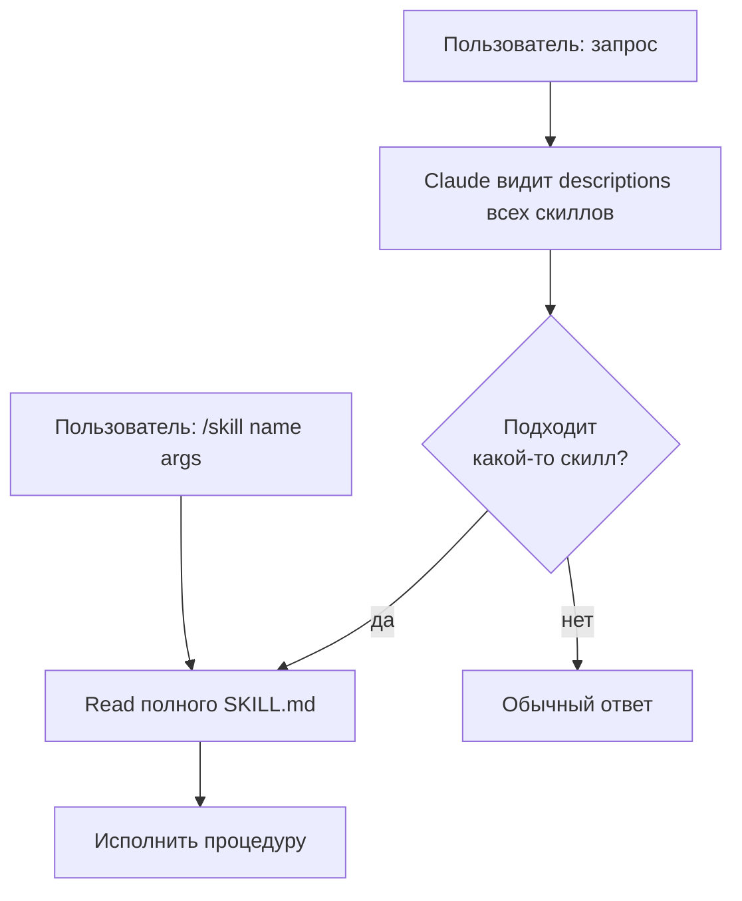
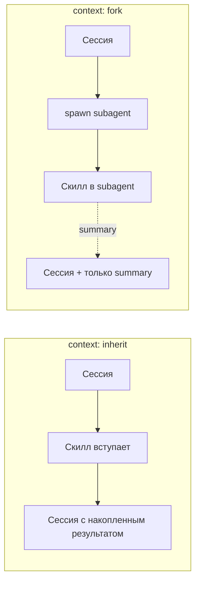
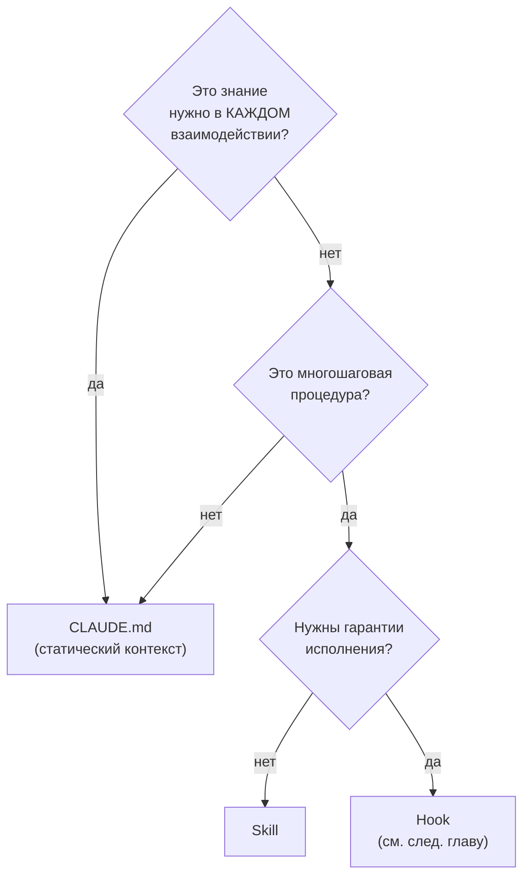

# 04. Skills: SKILL.md, scripts, references

> Skill — это переиспользуемая «процедура для модели». Не gut-feeling «вот так делай» в чате, а зафиксированный в файле плейбук, который Claude сам выбирает, когда задача подходит под описание.

---

## 4.1. Что это и чем отличается от CLAUDE.md

**CLAUDE.md** — статический префикс, который влетает в каждый запрос. «Контекст всегда».

**Skill** — модульный плейбук, который **подгружается по необходимости**. Когда задача похожа на описание скилла, Claude сам решает его «открыть» (model-invoked) или вы вызываете явно (user-invoked).

Это принципиальная экономия токенов: у вас может быть 50 скиллов в проекте, и в основной контекст попадают только их **краткие описания** (`name + description` из frontmatter). Сам SKILL.md «раскрывается» только когда нужен.

📘 Skills появились как фича Claude Code и Anthropic API в **октябре 2025** (`skills-2025-10-02` beta). В **декабре 2025** Anthropic опубликовал спецификацию как открытый стандарт.

---

## 4.2. Структура SKILL.md

📘 Из docs (`skills`): «Every skill needs a `SKILL.md` file with two parts: YAML frontmatter (between `---` markers)... and markdown content».

```markdown
---
name: backend-add-route
description: Add a new Hono route to apps/api with handler, schema validation, and a vitest test. Use when the user asks to "add an endpoint", "create a route", or "expose a new API method".
when_to_use: When user wants a new HTTP endpoint added to apps/api
allowed-tools: ["Read", "Write", "Edit", "Bash", "Grep"]
model: sonnet
effort: medium
---

# Add Hono route

You are creating a new HTTP endpoint in `apps/api`. Follow this procedure exactly.

## Steps

1. Read `apps/api/src/routes/` to understand existing routing pattern.
2. Create `apps/api/src/routes/<feature>.ts` with:
   - zod schema for input/output (or import from `@travel/shared` if exists)
   - Hono handler that uses `c.req.valid("json")`
   - Service-layer call (logic in `apps/api/src/services/`)
3. Register the route in `apps/api/src/index.ts`.
4. Add a vitest in `apps/api/test/routes/<feature>.test.ts`:
   - Happy path
   - One validation error path
5. Run `pnpm typecheck && pnpm test apps/api`.

## Output format

Brief PR-style summary: file list, route signature, test coverage.

## References

- @docs/architecture/api.md
- @scripts/route-template.ts
```

### Ключевые поля frontmatter

| Поле                       | Обязательное | Что значит                                                                               |
| -------------------------- | ------------ | ---------------------------------------------------------------------------------------- |
| `name`                     | ✅           | Уникальный идентификатор скилла (slug)                                                   |
| `description`              | ✅           | **Самое важное поле.** На его основе Claude решает, подгружать скилл или нет             |
| `when_to_use`              | —            | Уточнение к description, когда именно скилл уместен                                      |
| `allowed-tools`            | —            | Whitelist tools для скилла. Если задано, скилл может вызывать только их                  |
| `disable-model-invocation` | —            | Если `true`, скилл **только** user-invocable (нужно явно `/skill <name>`)                |
| `user-invocable`           | —            | Можно ли вызвать через `/skill name`                                                     |
| `argument-hint`            | —            | Подсказка для `argument-hint`, отображается в slash-меню                                 |
| `arguments`                | —            | Описание ожидаемых аргументов (для CLI)                                                  |
| `model`                    | —            | Скилл всегда исполнять на этой модели (`sonnet`, `opus`, `haiku`)                        |
| `effort`                   | —            | `low` / `medium` / `high` — управляет количеством reasoning                              |
| `context`                  | —            | `inherit` (по умолчанию — в текущем контексте) или `fork` (subagent с чистым контекстом) |
| `agent`                    | —            | Запустить через конкретный subagent                                                      |
| `hooks`                    | —            | Inline hooks для скилла                                                                  |
| `paths`                    | —            | Привязать активацию к определённым директориям                                           |
| `shell`                    | —            | Передать в скилл shell-окружение (env vars)                                              |

---

## 4.3. Где живут скиллы (4 уровня)

📘 Из docs:

| Уровень    | Путь                                     | Когда использовать                   |
| ---------- | ---------------------------------------- | ------------------------------------ |
| Enterprise | Managed settings (зависит от ОС)         | Корпоративные политики               |
| Personal   | `~/.claude/skills/<skill-name>/SKILL.md` | Ваши личные скиллы для всех проектов |
| Project    | `.claude/skills/<skill-name>/SKILL.md`   | Скиллы текущего репо (коммитятся)    |
| Plugin     | `<plugin>/skills/<skill-name>/SKILL.md`  | Скиллы, упакованные в плагин         |

**Приоритет при коллизии имён:** enterprise > personal > project > plugin.

Также: **subdirectory-скиллы** — `.claude/skills/<name>/SKILL.md` внутри подпапок проекта подхватываются автоматически. То есть в `apps/web/.claude/skills/` можно держать скиллы только для frontend.

---

## 4.4. Skill — это директория, а не файл

⚠️ **Это критическая поправка к популярному мифу.**

«Skill — markdown-файл» — упрощение, которое вводит в заблуждение. На самом деле skill — это **директория**, в которой обязательно есть `SKILL.md`, а опционально может быть всё, что вам нужно:

```
.claude/skills/release-deploy/
├── SKILL.md                    # обязательно: описание + инструкции
├── scripts/                    # bash/python-скрипты, исполняемые скиллом
│   ├── pre-deploy-check.sh
│   └── rollback.py
├── references/                 # справочные материалы (модель может Read)
│   ├── runbook.md
│   └── env-mapping.md
├── examples/                   # примеры успешных применений
│   ├── 2026-q1-release.md
│   └── hotfix-pattern.md
└── templates/                  # шаблоны файлов
    └── changelog.md.template
```

📘 Из docs: «Skills can bundle and run scripts in any language, giving Claude capabilities beyond what's possible in a single prompt».

**Поэтому утверждение «skill — это просто шаблон промпта» ❌ неверно.** Skill может:

- Запускать произвольные scripts через `Bash`.
- Читать собственные references как контекст.
- Использовать собственные templates для генерации файлов.
- Иметь свой `allowed-tools` (например, всё кроме `WebFetch`).
- Запускать subagent через `context: fork`.

---

## 4.5. Model-invoked vs user-invoked

**Model-invoked** (по умолчанию). Claude видит **descriptions** всех доступных скиллов в системном промпте. Когда задача похожа на описание — он сам решает «открыть» этот скилл (Read SKILL.md, вернуть себе его содержимое, выполнить).

**User-invoked** — явный вызов:

```bash
/skill backend-add-route "POST /trips/:id/duplicate"
```

Если в frontmatter `disable-model-invocation: true` — скилл становится **только** user-invocable. Полезно для деструктивных или редких операций («релиз», «миграция БД» — не давайте модели запускать самой).



⚠️ **Skills — это вероятностно, а не детерминированно.** Claude _может_ пропустить скилл, даже когда он идеально подходит. Если вам нужна гарантия — используйте hooks (см. [05-hooks.md](./05-hooks)).

---

## 4.6. Как Claude выбирает, какой скилл подгрузить

Решение принимается в нескольких шагах:

1. **Описание матчит запрос?** Слова, паттерны в `description` и `when_to_use` сравниваются с пользовательским сообщением.
2. **Не противоречит другим скиллам?** Если матчит несколько — Claude выбирает наиболее специфичный.
3. **Не запрещено `paths`?** Если в frontmatter указано `paths: ["apps/api/**"]`, скилл активируется только когда модель работает в этих файлах.

💡 **Поэтому `description` — это самая важная часть скилла.** Хороший description:

✅ Начинается с глагола или явного «Use when...».
✅ Перечисляет триггерные слова, которые пользователь может сказать.
✅ Конкретен: «Add a Hono route to apps/api», а не «Help with backend».
✅ Содержит примеры запросов.

❌ Размытый: «Helps with code».
❌ Слишком общий: «Use this when working on the backend».

---

## 4.7. Полная цепочка примеров для Travel Agent

Минимальный набор скиллов, которые имеет смысл сразу завести:

```
.claude/skills/
├── backend-add-route/SKILL.md
├── backend-add-migration/SKILL.md
├── frontend-add-page/SKILL.md
├── frontend-add-component/SKILL.md
├── mcp-add-server/SKILL.md
├── prepare-pr/SKILL.md
├── debug-mcp-failure/SKILL.md
└── release-deploy/SKILL.md
```

🔧 Пример: **`prepare-pr`** — что делать перед коммитом и PR.

```markdown
---
name: prepare-pr
description: Prepare a pull request for review. Run all checks (typecheck, lint, test), update the changelog, and write a PR description. Use when user says "make a PR", "create PR", "open PR", or asks to finalize changes for review.
allowed-tools: ["Read", "Write", "Edit", "Bash", "Grep"]
model: sonnet
effort: medium
---

# Prepare PR

Procedure for finalizing changes and opening a PR in the Travel Agent monorepo.

## Steps

1. Run `git status` and confirm only intended changes are staged.
2. Run `pnpm typecheck` — fix any errors before continuing.
3. Run `pnpm test` — fix any failures.
4. Run `pnpm lint` — auto-fix or report.
5. Update `CHANGELOG.md` with one bullet under `## Unreleased`.
6. Generate PR title (≤ 70 chars, scope prefix: `web:`, `api:`, `mcp-flights:`, etc.).
7. Generate PR body using @templates/pr-body.md.
8. Run `gh pr create --title ... --body ...` with the generated content.

## Verification

After running, confirm:

- typecheck/test/lint passed
- CHANGELOG updated
- PR URL printed

## References

- @templates/pr-body.md
- @scripts/check-staged-files.sh
```

🔧 Пример: **`debug-mcp-failure`** — отладка падений MCP-серверов.

```markdown
---
name: debug-mcp-failure
description: Diagnose why an MCP server (flights/hotels/weather/docs) is failing. Look at recent logs, check transport state, identify if the issue is auth, network, or schema mismatch. Use when user reports "MCP timeout", "flights MCP not responding", or similar.
allowed-tools: ["Read", "Bash", "Grep"]
model: sonnet
effort: high
---

# Debug MCP failure

Systematic diagnosis for MCP server failures.

## Quick triage

1. Identify which MCP server is failing (user mentions name, or check recent /mcp output).
2. Tail logs: `tail -n 200 logs/mcp-<name>.log`.
3. Check process: `ps aux | grep mcp-<name>`.
4. If stdio transport: try restart via `pnpm dev:mcp:<name>`.

## Categories

| Symptom               | Likely cause              | Action                                                            |
| --------------------- | ------------------------- | ----------------------------------------------------------------- |
| Connection refused    | Process not running       | Restart                                                           |
| Timeout > 30s         | Upstream API slow / down  | Check provider status page (link in @references/api-providers.md) |
| Schema mismatch error | Tool definitions diverged | Compare `src/server.ts` exports vs `apps/api/src/mcp/expected.ts` |
| 401/403 in logs       | Token expired             | Refresh in Vault, restart                                         |

## References

- @references/api-providers.md
- @references/mcp-protocol-cheatsheet.md
- @scripts/restart-mcp.sh
```

---

## 4.8. `context: inherit` vs `context: fork`

🧪 Поле frontmatter `context` управляет, _где_ выполняется скилл:

- **`context: inherit`** (по умолчанию) — скилл исполняется в текущем контексте сессии. Видит всю историю, добавляет результаты в основной контекст.
- **`context: fork`** — скилл запускается в отдельном subagent'е. Не наследует историю, не видит её, основной контекст получает только финальный результат.



💡 **Когда `fork`:**

- Скилл делает большое сканирование (Read десятков файлов, Grep по всему репо) — результаты не должны раздувать основной контекст.
- Деструктивные операции, которые вы хотите изолировать.
- Ризонинг-тяжёлые задачи — можно дать им свой effort/model.

**`debug-mcp-failure`** — кандидат на `fork`: он смотрит много логов, основной контекст не должен ими забиваться.

```yaml
---
name: debug-mcp-failure
context: fork
agent: explore # запустить через built-in Explore subagent с Haiku
---
```

---

## 4.9. Команды для работы со скиллами

| Команда                   | Что делает                                           |
| ------------------------- | ---------------------------------------------------- |
| `/skill <name> [args]`    | Явно вызвать user-invocable skill                    |
| `/skills`                 | Список всех доступных скиллов с descriptions         |
| `Skill` (внутренний tool) | Используется самой моделью, не вы вызываете напрямую |

💡 Если хотите проверить, как Claude видит ваш скилл — посмотрите `/skills`. Если description выглядит размытым в этом списке — он будет размытым и для модели.

---

## 4.10. Когда писать skill, а когда CLAUDE.md



**Простое правило:**

- Факт о проекте → CLAUDE.md
- Процедура «пользователь говорит X — делать Y, Z, W» → Skill
- «Всегда после X надо Y» → Hook

---

## 4.11. Антипаттерны

❌ **Skill с размытым description** (`"Use this for any work"`). → Никогда не активируется или активируется не там.

❌ **Skill, дублирующий CLAUDE.md.** Если знание нужно всегда — это CLAUDE.md.

❌ **Skill без `allowed-tools` для деструктивных операций.** Если скилл может удалять данные — ограничьте набор tools.

❌ **Огромный SKILL.md на 2000 строк.** Разбейте на references и линкуйте через `@`.

❌ **Игнорирование `context: fork` для browse-heavy скиллов.** Зря раздуваете основной контекст.

❌ **Использование skills для гарантий.** Если нужно «всегда после Edit запустить linter» — это не skill, это hook.

---

**Дальше →** [05. Hooks: 30+ событий, exit codes, JSON-протокол](./05-hooks)
