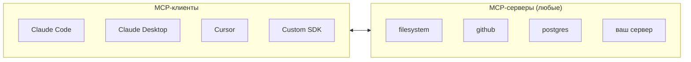
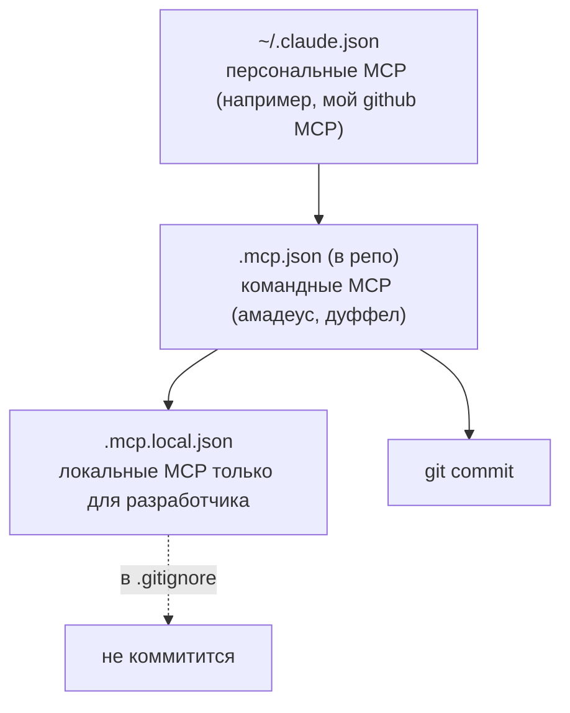

> MCP (Model Context Protocol) — открытый протокол для подключения к Claude Code внешних tools, ресурсов и данных. Claude Code умеет говорить с MCP-серверами по трём транспортам: stdio, SSE и HTTP. Для Travel Agent это критическая часть архитектуры — все интеграции с авиа/отелями/погодой реализованы как MCP-серверы.

---

## 6.1. Что такое MCP (на пальцах)

MCP — это «USB-C для AI-интеграций». Вместо того чтобы каждый раз изобретать функции для конкретной модели, вы один раз пишете MCP-сервер, и его могут использовать любые MCP-клиенты: Claude Code, Claude Desktop, Cursor, Continue, ваш собственный SDK-агент и т.д.



**MCP-сервер** экспортирует:

- **Tools** — функции, которые модель может вызвать (`book_flight`, `search_hotels`).
- **Resources** — данные, которые модель может прочитать (`config://app/settings`, `db://users/123`).
- **Prompts** — преднастроенные промпты-шаблоны (`/prompts/summarize_trip`).
- **Elicitation** — серверо-инициированные диалоги с пользователем.

Claude Code потребляет **tools** и **resources** активнее всего. Prompts становятся доступны как slash-команды.

---

## 6.2. Транспорты

MCP поддерживает три способа коммуникации:

| Транспорт | Когда использовать                                        | Плюсы                       | Минусы                  |
| --------- | --------------------------------------------------------- | --------------------------- | ----------------------- |
| **stdio** | Локальный сервер запускается harness'ом как child process | Просто, быстро, без сети    | Только локально         |
| **SSE**   | Удалённый сервер, persistent connection                   | Streaming, удалённый доступ | Сложнее в развёртывании |
| **HTTP**  | Удалённый сервер, request/response                        | Stateless, легко scaleит    | Нет server-initiated    |

Для Travel Agent в локальной разработке — **stdio**. Для production multi-tenant SaaS — **HTTP** через ваш API gateway.

---

## 6.3. Подключение MCP в Claude Code

Конфигурация MCP-серверов хранится в `.mcp.json` (project) или `~/.claude.json` (user).

🔧 `.mcp.json` для Travel Agent:

```json
{
  "mcpServers": {
    "flights": {
      "type": "stdio",
      "command": "node",
      "args": ["packages/mcp-flights/dist/server.js"],
      "env": {
        "AMADEUS_API_KEY": "${AMADEUS_API_KEY}",
        "AMADEUS_API_SECRET": "${AMADEUS_API_SECRET}"
      }
    },
    "hotels": {
      "type": "stdio",
      "command": "node",
      "args": ["packages/mcp-hotels/dist/server.js"],
      "env": {
        "DUFFEL_API_KEY": "${DUFFEL_API_KEY}"
      }
    },
    "weather": {
      "type": "stdio",
      "command": "node",
      "args": ["packages/mcp-weather/dist/server.js"]
    },
    "docs": {
      "type": "http",
      "url": "https://docs-mcp.internal.travel-agent.local/mcp",
      "headers": {
        "Authorization": "Bearer ${INTERNAL_DOCS_TOKEN}"
      }
    }
  }
}
```

После этого:

- `claude` подхватит конфиг при старте,
- покажет в `/mcp` список подключённых серверов и их tools,
- модель сможет вызывать эти tools как обычные.

---

## 6.4. Scope: project / user / local



💡 Логика та же, что у CLAUDE.md: общее в репо, личное — в local или user.

---

## 6.5. Свой MCP-сервер на Node (TypeScript)

Самая простая реализация — через официальный SDK `@modelcontextprotocol/sdk`.

🔧 `packages/mcp-flights/src/server.ts`:

```typescript
import { Server } from "@modelcontextprotocol/sdk/server/index.js";
import { StdioServerTransport } from "@modelcontextprotocol/sdk/server/stdio.js";
import { CallToolRequestSchema, ListToolsRequestSchema } from "@modelcontextprotocol/sdk/types.js";
import { z } from "zod";
import { searchFlights, bookFlight } from "./amadeus.js";

// Schemas
const SearchInput = z.object({
  origin: z.string().length(3), // IATA код
  destination: z.string().length(3),
  date: z.string().regex(/^\d{4}-\d{2}-\d{2}$/),
  adults: z.number().int().min(1).max(9).default(1),
});

const BookInput = z.object({
  offerId: z.string(),
  passengers: z.array(
    z.object({
      firstName: z.string(),
      lastName: z.string(),
      dob: z.string().regex(/^\d{4}-\d{2}-\d{2}$/),
    }),
  ),
});

const server = new Server(
  { name: "travel-agent-flights", version: "1.0.0" },
  { capabilities: { tools: {} } },
);

// Объявление tools
server.setRequestHandler(ListToolsRequestSchema, async () => ({
  tools: [
    {
      name: "flights_search",
      description:
        "Search for flights between two airports on a given date. Returns up to 10 offers with price, airline, duration. Use IATA codes (e.g., JFK, LHR).",
      inputSchema: SearchInput.toJsonSchema?.() ?? {
        type: "object",
        properties: {
          origin: { type: "string", description: "IATA airport code" },
          destination: { type: "string", description: "IATA airport code" },
          date: { type: "string", description: "ISO date YYYY-MM-DD" },
          adults: { type: "number", default: 1 },
        },
        required: ["origin", "destination", "date"],
      },
    },
    {
      name: "flights_book",
      description:
        "Book a flight by offerId returned from flights_search. Confirms within 30 seconds.",
      inputSchema: {
        type: "object",
        properties: {
          offerId: { type: "string" },
          passengers: { type: "array" },
        },
        required: ["offerId", "passengers"],
      },
    },
  ],
}));

// Реализация
server.setRequestHandler(CallToolRequestSchema, async (req) => {
  if (req.params.name === "flights_search") {
    const args = SearchInput.parse(req.params.arguments);
    const offers = await searchFlights(args);
    return {
      content: [{ type: "text", text: JSON.stringify(offers, null, 2) }],
    };
  }
  if (req.params.name === "flights_book") {
    const args = BookInput.parse(req.params.arguments);
    const booking = await bookFlight(args);
    return {
      content: [{ type: "text", text: JSON.stringify(booking, null, 2) }],
    };
  }
  throw new Error(`Unknown tool: ${req.params.name}`);
});

const transport = new StdioServerTransport();
await server.connect(transport);
```

Скомпилировали → положили в `packages/mcp-flights/dist/` → подключили в `.mcp.json` → готово.

⚠️ **Описания tools — это половина успеха.** Модель видит только `name + description + inputSchema`. Если описание размытое — модель не поймёт когда и зачем вызывать. Хорошее описание включает:

- Что делает.
- Когда применять (ключевые слова).
- Что возвращает (формат, объём).
- Edge cases (валидация входов).

---

## 6.6. Как Claude видит ваши MCP-tools

Когда подключён MCP-сервер `flights`, в системном промпте появляется блок tool definitions с именами:

- `mcp__flights__flights_search`
- `mcp__flights__flights_book`

(Префикс `mcp__<server-name>__<tool-name>` — стандартное соглашение.)

В CLI вы можете посмотреть, какие tools предоставлены:

```bash
/mcp
```

Это покажет: `flights` (status: ✅), tools: 2, resources: 0.

---

## 6.7. MCP внутри Anthropic SDK (для бэкенда Travel Agent)

В Travel Agent есть свой Node-бэкенд (`apps/api`), который сам общается с моделью через Anthropic SDK. Чтобы переиспользовать те же MCP-серверы, что и в Claude Code, нужно подключить их вручную:

🔧 `apps/api/src/agent/index.ts`:

```typescript
import Anthropic from "@anthropic-ai/sdk";
import { spawn } from "node:child_process";
import { ClientSession } from "@modelcontextprotocol/sdk/client/session.js";
import { StdioClientTransport } from "@modelcontextprotocol/sdk/client/stdio.js";

const anthropic = new Anthropic({ apiKey: process.env.ANTHROPIC_API_KEY });

// 1. Поднимаем MCP-клиенты
async function connectMcp(name: string, command: string, args: string[]) {
  const transport = new StdioClientTransport({
    command,
    args,
    env: process.env as Record<string, string>,
  });
  const session = new ClientSession(transport);
  await session.initialize();
  return session;
}

const flights = await connectMcp("flights", "node", ["packages/mcp-flights/dist/server.js"]);
const hotels = await connectMcp("hotels", "node", ["packages/mcp-hotels/dist/server.js"]);

// 2. Преобразуем MCP-tools в Anthropic-tools
async function buildTools() {
  const flightsTools = await flights.listTools();
  const hotelsTools = await hotels.listTools();
  return [
    ...flightsTools.tools.map((t) => ({
      name: `mcp__flights__${t.name}`,
      description: t.description,
      input_schema: t.inputSchema,
    })),
    ...hotelsTools.tools.map((t) => ({
      name: `mcp__hotels__${t.name}`,
      description: t.description,
      input_schema: t.inputSchema,
    })),
  ];
}

// 3. Agent loop
export async function runAgent(userMessage: string) {
  const tools = await buildTools();
  const messages: Anthropic.MessageParam[] = [{ role: "user", content: userMessage }];

  while (true) {
    const response = await anthropic.messages.create({
      model: "claude-opus-4-7",
      max_tokens: 4096,
      system: [{ type: "text", text: SYSTEM_PROMPT, cache_control: { type: "ephemeral" } }],
      tools,
      messages,
    });

    if (response.stop_reason === "end_turn") {
      return response.content;
    }

    if (response.stop_reason === "tool_use") {
      messages.push({ role: "assistant", content: response.content });
      const toolResults: Anthropic.ToolResultBlockParam[] = [];

      for (const block of response.content) {
        if (block.type !== "tool_use") continue;
        const [, server, toolName] = block.name.split("__");
        const session = server === "flights" ? flights : hotels;
        const result = await session.callTool({
          name: toolName,
          arguments: block.input as Record<string, unknown>,
        });
        toolResults.push({
          type: "tool_result",
          tool_use_id: block.id,
          content: result.content,
        });
      }

      messages.push({ role: "user", content: toolResults });
    }
  }
}
```

📝 Это упрощённая версия. В реальном бэкенде добавьте: streaming, error handling per tool, лимиты на количество iterations, prompt caching markers, telemetry.

---

## 6.8. Resources: чтение данных через MCP

Помимо tools, MCP может выставлять **resources** — статические или динамические данные:

```typescript
server.setRequestHandler(ListResourcesRequestSchema, async () => ({
  resources: [
    { uri: "flights://airports/list", name: "All IATA airports", mimeType: "application/json" },
    { uri: "flights://current-deals", name: "Today's deals", mimeType: "application/json" },
  ],
}));

server.setRequestHandler(ReadResourceRequestSchema, async (req) => {
  if (req.params.uri === "flights://airports/list") {
    const airports = await fetchAirportsList();
    return {
      contents: [
        {
          uri: req.params.uri,
          mimeType: "application/json",
          text: JSON.stringify(airports),
        },
      ],
    };
  }
  // ...
});
```

В Claude Code resources становятся доступны через `@`-mention в промпте: `@flights:airports/list`.

---

## 6.9. Безопасность MCP

⚠️ MCP-сервер выполняется на вашей машине (для stdio) или на доверенном сервере (для HTTP/SSE). Он имеет полный доступ к тому, что ему дадут (env, сетевой доступ).

**Чек-лист безопасности:**

✅ Никогда не подключайте MCP-серверы из непроверенных источников. Это эквивалент `npm install random-package`.
✅ Используйте `.mcp.local.json` для серверов с реальными ключами (не коммитить).
✅ Для HTTP-MCP проверяйте TLS и Authorization.
✅ Ограничивайте scope MCP env-переменными — давайте только нужные секреты.
✅ Для production — деплойте MCP в отдельные процессы/контейнеры с минимальными правами.

❌ Не используйте `npx <unknown-mcp-package>` без аудита. Это исполнит чужой код в вашей среде.

---

## 6.10. Built-in MCP-серверы Anthropic / community

Несколько часто используемых:

- **@modelcontextprotocol/server-filesystem** — доступ к директориям. Аккуратно с правами!
- **@modelcontextprotocol/server-github** — issues, PRs, repos.
- **@modelcontextprotocol/server-postgres** — read-only SQL.
- **@modelcontextprotocol/server-puppeteer** — управление браузером.
- **@anthropic-ai/mcp-server-fetch** — HTTP запросы (как fallback к WebFetch).

Полный реестр: <https://github.com/modelcontextprotocol/servers> и community marketplace.

---

## 6.11. Команды для работы с MCP

| Команда                           | Что делает                                        |
| --------------------------------- | ------------------------------------------------- |
| `/mcp`                            | Список подключённых серверов и их tools/resources |
| `/mcp <server>`                   | Детали конкретного сервера (status, tools list)   |
| `claude mcp add <name> <command>` | Быстро добавить MCP в текущую конфигурацию        |
| `claude mcp test <name>`          | Проверить, что сервер поднимается и отвечает      |

---

## 6.12. Антипаттерны

❌ **Подключение 10+ MCP-серверов «на всякий случай».** Каждый раздувает tools-секцию (может быть +20-50k токенов). Кэш ломается при добавлении/удалении.

❌ **Tool без description.** Модель не понимает, когда вызывать.

❌ **Возврат огромного JSON.** Если ваш `flights_search` возвращает 100 предложений с полями по 30 каждый — это убийца окна. Возвращайте топ-5 с краткими полями, остальное — отдельным `flights_get_details(offerId)`.

❌ **Хранение секретов в `.mcp.json`.** Используйте env-substitution `${VAR}`.

❌ **MCP без таймаутов в коде.** Сервер зависает — модель ждёт, контекст забивается. Жёсткие таймауты обязательны.

❌ **Совмещение в одном MCP несвязанных доменов.** Лучше 3 узких сервера, чем один «do everything».

---

**Дальше →** [07. Plugins: упаковка skills + hooks + agents + MCP](./07-plugins)
