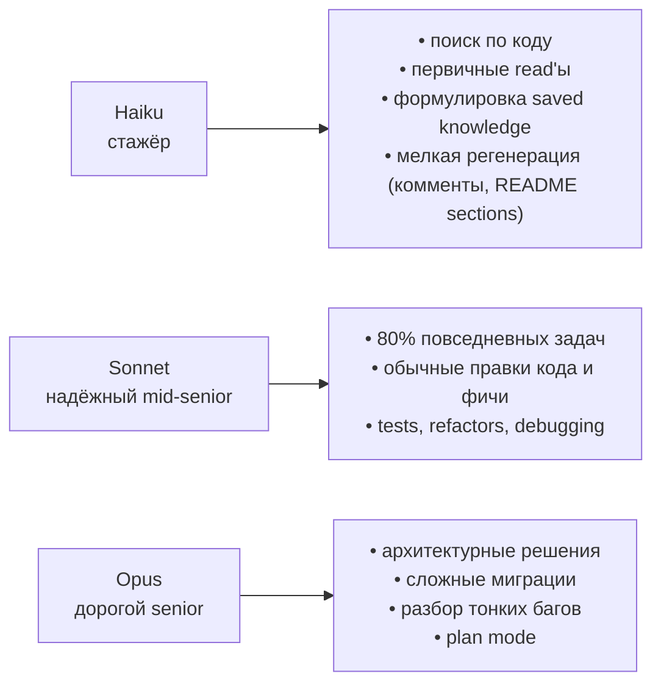
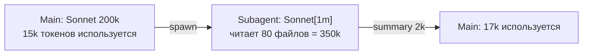

# 11. Модели и pricing

> Выбор модели — это не «всегда Opus, потому что лучший». Это компромисс между скоростью / стоимостью / качеством под конкретную задачу. Эта глава — таблицы, бюджеты, стратегии комбинирования.

---

## 11.1. Доступные модели на 23.04.2026

| Модель                | Алиас в API                          | Контекст                     | Сильные стороны                                |
| --------------------- | ------------------------------------ | ---------------------------- | ---------------------------------------------- |
| **Claude Opus 4.7**   | `opus`, `claude-opus-4-7`            | 200k (1M через `opus[1m]`)   | Лучшее агентное кодирование, сложный reasoning |
| **Claude Opus 4.6**   | `claude-opus-4-6`                    | 200k (1M через `opus[1m]`)   | Legacy, тот же ценник, старый токенизатор      |
| **Claude Sonnet 4.6** | `sonnet`, `claude-sonnet-4-6`        | 200k (1M через `sonnet[1m]`) | Лучшее соотношение скорости и качества         |
| **Claude Haiku 4.5**  | `haiku`, `claude-haiku-4-5-20251001` | 200k                         | Быстрый и дешёвый, near-frontier intelligence  |

⚠️ **На Bedrock / Vertex / Foundry дефолтные алиасы сдвинуты на одну версию назад.** `opus` там → 4.6, `sonnet` → 4.5. Если вам нужна самая свежая — указывайте полный имя модели.

⚠️ **Opus 4.7 имеет новый токенизатор** — на тех же текстах он расходует **до +35%** токенов по сравнению с Opus 4.6. Если у вас были оценки на 4.6 — пересчитайте.

---

## 11.2. Цены (April 2026)

| Модель         | Input ($/MTok) | Output ($/MTok) | Cache write 5min ($/MTok) | Cache write 1h ($/MTok) | Cache read ($/MTok) |
| -------------- | -------------- | --------------- | ------------------------- | ----------------------- | ------------------- |
| Opus 4.7 / 4.6 | $5             | $25             | $6.25                     | $10                     | $0.50               |
| Sonnet 4.6     | $3             | $15             | $3.75                     | $6                      | $0.30               |
| Haiku 4.5      | $1             | $5              | $1.25                     | $2                      | $0.10               |

Ключевые множители (одинаковы для всех моделей):

- Cache write 5min = **1.25×** input.
- Cache write 1h = **2×** input.
- Cache read = **0.1×** input (в 10 раз дешевле!).
- Output обычно **5×** input.

---

## 11.3. Психологическая модель «когда что»

Используйте метафоры из исходного твиттер-треда — они работают:



📘 Из docs: Opus 4.7 — «most capable for complex reasoning and agentic coding», Sonnet 4.6 — «best combination of speed and intelligence», Haiku 4.5 — «fastest model with near-frontier intelligence».

---

## 11.4. Стратегии комбинирования моделей

### 11.4.1. Default: Sonnet

Большинство сессий начинайте с Sonnet 4.6. Это разумный baseline.

### 11.4.2. opusplan для архитектуры

```bash
/model opusplan
```

Включается plan mode на Opus. После `ExitPlanMode` автоматически переключается на Sonnet для реализации. **Это и есть правильный паттерн «думаю Opus'ом, делаю Sonnet'ом».**

⚠️ В opusplan **plan-фаза работает в стандартных 200k**, даже если вы включили 1M-окно.

### 11.4.3. Subagents с разными моделями

Разные subagents можно держать на разных моделях:

```yaml
# trip-architect.md → opus (сложная декомпозиция маршрутов)
model: opus

# code-reviewer.md → sonnet
model: sonnet

# explore (built-in) → haiku
```

Это позволяет основной агент держать на Sonnet, а специализированные — поднимать модель только когда нужно.

### 11.4.4. Agent Teams: Lead = Opus, teammates = Sonnet/Haiku

Lead занимается планированием и координацией — там нужен Opus. Teammates исполняют простые таски — Sonnet или Haiku.

---

## 11.5. Расчёт типичной сессии Travel Agent

Одна сессия из 30 turn'ов на Sonnet:

```
Префикс (system + CLAUDE.md + skills + tools) ~ 25k токенов
Output на turn ~ 1k токенов
Tool results на turn ~ 2k токенов
```

**Без кэша:**

```
30 × (25k input × $3/M + 3k input × $3/M + 1k output × $15/M)
= 30 × ($0.075 + $0.009 + $0.015)
= 30 × $0.099
= $2.97
```

**С кэшем (TTL 5min, без пауз):**

```
1 × cache write (25k × $3.75/M = $0.094)
+ 29 × cache read (25k × $0.30/M = $0.0075)
+ 30 × non-cached input (3k × $3/M = $0.009)
+ 30 × output (1k × $15/M = $0.015)
= $0.094 + $0.218 + $0.27 + $0.45
= $1.03
```

Экономия — **65%**. И это на скромной сессии. На длинных и с большими CLAUDE.md эффект ещё сильнее.

---

## 11.6. 1M-контекст: когда оправдан

| Кейс                                               | 1M оправдан?                                                |
| -------------------------------------------------- | ----------------------------------------------------------- |
| Загрузить весь монорепо как контекст один раз      | ✅ Если потом много мелких задач по нему. Cache + 1M = окей |
| Длинная многочасовая сессия с накопленной историей | ⚠️ Лучше /compact, иначе качество падает                    |
| Парсить огромный лог за один запрос                | ✅ Один запрос лучше чем десять с пагинацией                |
| «Чтобы было»                                       | ❌ Платите больше, получаете хуже                           |

📘 Включается через alias `opus[1m]` или `sonnet[1m]`. На Max/Team/Enterprise.

⚠️ Помните про **`opusplan` НЕ поддерживает 1M-окно**.

⚠️ **Эмпирика:** многие практики говорят, что после **300-400k** в окне качество падает. Это не из docs Anthropic, но симптомы знакомы (модель забывает ранние решения, противоречит себе, повторно читает файлы).

---

## 11.7. Бюджеты и мониторинг

📘 Команды:

| Команда          | Что показывает                               |
| ---------------- | -------------------------------------------- |
| `/cost`          | Текущие и накопленные расходы текущей сессии |
| `/usage`         | Расходы за период, по моделям                |
| `/release-notes` | Новости версий (бывают ценовые обновления)   |

🔧 Env-переменные для алёртов:

```bash
export CLAUDE_CODE_BUDGET_USD_SESSION=5      # warn at $5/session
export CLAUDE_CODE_BUDGET_USD_DAILY=50       # daily ceiling
```

---

## 11.8. Стоит ли пересматривать `CLAUDE.md` и skills с новыми моделями?

⚠️ Утверждение «настройки со временем устаревают, с выходом новых моделей нужно пересматривать CLAUDE.md и skills» — **здравая практика, но не цитата из docs**. Прямой рекомендации в публичных docs нет.

Реальность:

- CLAUDE.md сам по себе обычно остаётся актуальным (стек проекта меняется реже моделей).
- Скиллы могут потерять актуальность, если вы туда понапихали «модель плохо понимает X, всегда напоминай ей» — а новая модель эти X понимает сама.
- Hooks обычно не зависят от модели.

💡 Раз в квартал бегло пройдитесь по CLAUDE.md и `/skills`, спросите себя: «не лишнее ли это для текущих моделей?». Особенно про подсказки вроде «не забывай возвращать `Promise<T>`» — Sonnet 4.6 уже не забывает.

---

## 11.9. Контекстные окна subagents

📝 Каждый subagent имеет **свой** лимит:

- На Haiku-subagent окно 200k.
- На Sonnet/Opus-subagent — 200k или 1M (если включено).

Это даёт удобный паттерн: **держите основной контекст на 200k Sonnet, а browse-heavy subagent на 1M Sonnet**. Subagent читает большую часть репо, возвращает summary, основной контекст не страдает.



---

## 11.10. Антипаттерны

❌ **Всегда Opus.** Дорого и не нужно. Sonnet справляется с 80% задач.

❌ **Всегда Haiku.** Быстро и дёшево, но в сложной задаче будет ходить кругами и в итоге дороже Sonnet'а.

❌ **Менять модель в середине задачи без opusplan.** Cache miss + потеря контекста доверия. Используйте opusplan, если нужен switching.

❌ **Включать 1M «по умолчанию».** Дорого, медленнее, и качество не лучше.

❌ **Не использовать prompt cache.** Проверьте, что ваш SDK-код добавляет `cache_control` маркеры. В CLAUDE Code это уже есть из коробки.

---

**Дальше →** [12. Travel Agent с нуля: blueprint](./12-travel-agent-blueprint.md)
