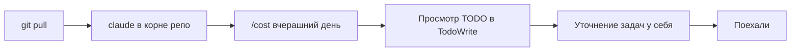
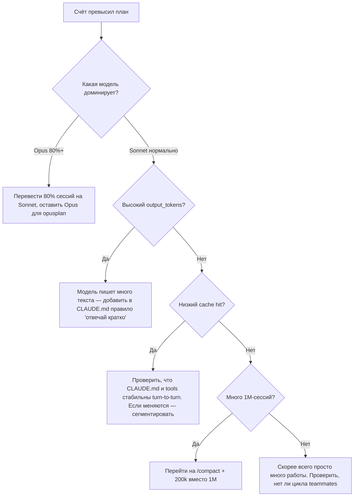

# 13. Best practices: ежедневная рутина и антипаттерны

> Все предыдущие главы — про механику. Эта — про дисциплину. Без неё даже идеальная конфигурация со временем превращается в свалку: кэш мимо, скиллы протухли, hooks падают молча, а вы не понимаете почему счёт за месяц вырос вдвое.

---

## 13.1. Ежедневная рутина разработчика с Claude Code

Это не догма, а ориентир. У каждого свой ритм. Но если ваш день выглядит сильно иначе и при этом вы не довольны результатами — попробуйте сравнить.

### Утро (10 минут)



📘 Конкретные шаги:

1. `git pull --rebase` — подтянуть изменения коллег.
2. Открыть Claude Code в корне репозитория. CLAUDE.md и MCP подцепятся автоматически.
3. `/cost` — посмотреть, сколько ушло вчера. Если резкий скачок — разобраться почему до начала новых задач.
4. `/usage` опционально — разбивка по моделям за неделю.
5. Если есть `TodoWrite`-список с прошлого дня — пройтись по нему, вычеркнуть устаревшее.
6. Сформулировать первую задачу дня **полностью**, не «давай начнём с X».

### Во время работы

✅ **Одна задача — одна сессия.** После завершения задачи делайте `/clear` или новую сессию. Контекст не должен накапливать «всё подряд за день».

✅ **Используйте plan mode для незнакомого.** Перед тем как сказать «реализуй», скажите «спланируй». Это `Shift+Tab` или `/model opusplan`.

✅ **Доверяйте, но проверяйте.** Каждый PR смотрите глазами, особенно diff в файлах, к которым Claude обращался. Не превращайтесь в rubber-stamp.

✅ **Ведите дневник промптов.** Когда промпт сработал особенно хорошо или особенно плохо — копируйте его в `notes/prompts.md`. Через месяц у вас будет личная коллекция работающих формулировок.

### Конец дня (5 минут)

📘 Шаги:

1. `/cost` — итог дня.
2. Если что-то сломалось и Claude не починил — записать в `notes/stuck.md`. Утром свежим взглядом часто видно решение.
3. Закоммитить незавершённое в WIP-ветку, чтобы завтра не начинать с нуля.
4. Закрыть Claude Code (это завершит подписку на MCP-серверы и освободит ресурсы).

---

## 13.2. Раз в неделю: гигиена

| Что                | Команда                     | Зачем                                           |
| ------------------ | --------------------------- | ----------------------------------------------- |
| Просмотр CLAUDE.md | `claude /memory`            | Не разрослось ли? Не противоречит ли само себе? |
| Просмотр skills    | `ls .claude/skills/`        | Все ли актуальны? Не дублируют ли друг друга?   |
| Просмотр hooks     | `cat .claude/settings.json` | Не висит ли hook, который давно не нужен?       |
| Расходы по моделям | `/usage`                    | Не ушло ли неожиданно много на Opus?            |
| MCP-серверы        | `/mcp`                      | Все ли подключены? Нет ли error-state?          |

💡 Раз в **месяц**: пройдитесь по `.claude/agents/` и спросите себя — нужен ли всё ещё каждый из subagent'ов. «Пусть будет, мало ли» — плохое обоснование.

---

## 13.3. Когда CLAUDE.md «переучился»

Симптомы:

- Claude чаще всего отвечает «я уже знаю» и игнорирует свежие подсказки.
- Странные паттерны кода: использует библиотеку, которая давно удалена.
- Не использует новые скиллы.

📘 Причина — CLAUDE.md разросся до 5-10 KB, и модель уже не может им управлять (помещается, но утопает в шуме).

Лечение:

1. Откройте CLAUDE.md, прочитайте сверху вниз. Сколько строк вы бы могли сейчас удалить, потому что «и так очевидно для современной модели»?
2. Перенесите длинные специфичные правила в `.claude/skills/<topic>/SKILL.md` — они будут грузиться только когда нужны.
3. Используйте @-imports для фрагментации.

⚠️ Для нового сотрудника CLAUDE.md выше 200 строк — анти-сигнал «здесь всё запутано». Стремитесь к 50-100 содержательных строк.

---

## 13.4. Когда счёт за месяц шокирует



📘 Главные «убийцы кошелька»:

1. **Запущенный teammate, который ушёл в цикл.** Hook `TeammateIdle` поможет это заметить.
2. **1M-окно «по умолчанию».** Каждая новая итерация payment scales linearly with input.
3. **Кэш мимо.** Например, если в CLAUDE.md есть `{{date}}` или другая динамика — каждый turn кэш инвалидируется.
4. **`gh pr diff` в начале каждой сессии.** Растёт PR — растёт префикс. Не заносите его в кэшируемую часть.

---

## 13.5. Антипаттерны: что НЕ делать

### 13.5.1. CLAUDE.md как «дамп всего что знаю про проект»

❌ 1500 строк описания архитектуры, истории решений, всех «не делай так».

✅ 80-150 строк: стек, команды, важные ограничения, ссылки на детальные docs.

### 13.5.2. Skills как «ну на всякий случай»

❌ 30 skills, каждый «может пригодится». Модель тратит токены на их description при каждом запросе.

✅ 5-10 целевых skills. Удалили — лучше, чем оставили unused.

### 13.5.3. Subagents для всего подряд

❌ Каждый код-ревью через subagent. Каждый поиск через subagent. Каждый файл через subagent.

✅ Subagent для **browse-heavy** задач, где summary важнее транскрипта. Прямые tool calls — для всего остального.

### 13.5.4. `bypassPermissions` как режим по умолчанию

❌ `claude --bypass-permissions` всегда. «Так быстрее».

✅ `bypassPermissions` только для конкретных безопасных задач, в худшем случае — для отдельной worktree-сессии.

### 13.5.5. Hooks без логирования

❌ Hook падает молча, и вы это видите только когда модель начинает делать странности.

✅ Каждый hook логирует свой запуск (хотя бы `echo "[hook:format] $(date)" >> .claude/hooks.log`).

### 13.5.6. Один большой prompt вместо итеративного диалога

❌ «Добавь auth, реализуй RBAC, напиши тесты, обнови docs, создай PR» — одной строкой.

✅ Разбейте на 4 промпта. После каждого посмотрите diff. Это не медленнее, потому что ошибки в первом шаге не успевают похоронить остальные.

### 13.5.7. Игнорирование `/cost`

❌ Узнаёте сумму счёта в конце месяца.

✅ Глядите `/cost` в конце каждой большой задачи. Это ноль усилий и формирует чувство пропорций.

### 13.5.8. Скиллы с `model: opus` для рутины

❌ Скилл `format-pr-description` с `model: opus`. Зачем? Это копировальная задача.

✅ `model: haiku` или `model: sonnet`. Opus — для скиллов, которые реально решают сложные задачи.

### 13.5.9. MCP-серверы со 100+ tools

❌ Подключённый Notion-MCP с 80 endpoints, из которых вы используете 3. Все 80 идут в префикс каждого запроса.

✅ Используйте `tools` в frontmatter скилла или в settings.json `permissions.allow`, чтобы модель видела только нужные.

### 13.5.10. Никогда не читать docs

❌ «Я в твиттере прочитал». Документация Anthropic меняется быстро (новые hooks events, новые env vars). Особенно — `release-notes`.

✅ Раз в две недели — `/release-notes`. Раз в месяц — `https://docs.claude.com/en/docs/claude-code/changelog`.

---

## 13.6. Чек-лист перед деплоем агента в production

Если ваш Travel Agent или другой LLM-проект уходит в продакшн (где его трогают пользователи, а не только вы) — пройдитесь:

```text
[ ] System prompt выделен в отдельный файл, версионируется
[ ] Tools описаны через JSON Schema с required-полями
[ ] Каждый tool возвращает компактный результат (нет 100KB JSON)
[ ] Все долгие tools имеют таймауты + чёткие сообщения об ошибке
[ ] Streaming реализован (UX) и есть graceful cancellation
[ ] Логирование: prompt, tool calls, tool results, final output, latency
[ ] Метрики: tokens_in, tokens_out, cache_read, cost, p50/p95 latency
[ ] Rate limit на пользователя (request/sec и tokens/day)
[ ] Защита от prompt injection (sanitize user input в system context)
[ ] Сценарии retry для transient API errors
[ ] Fallback на дешёвую модель при сбое основной
[ ] Audit log: что сделал агент от имени пользователя
[ ] Permissions: какие tools кому доступны (RBAC)
[ ] Тесты для типовых сценариев (vitest + recorded conversations)
[ ] Documentation: как пользоваться, какие limits, что делать если завис
```

---

## 13.7. Чек-лист для онбординга нового разработчика на проекте

Когда новичок приходит в проект, где Claude Code уже встроен в процесс:

```text
[ ] Прочитать CLAUDE.md
[ ] Прочитать README.md
[ ] Запустить bootstrap-команду из 12.13
[ ] Открыть Claude в корне, написать "Покажи структуру проекта и ключевые скиллы"
[ ] Прочитать каждый SKILL.md в .claude/skills/
[ ] Запустить /agents и понять каких есть готовых subagent'ов
[ ] Запустить /mcp и убедиться, что все серверы зелёные
[ ] Сделать первую задачу-разминку из onboarding-doc'а
[ ] Прочитать 13.5 (антипаттерны) и сразу осмотреться, нет ли их в проекте
```

---

## 13.8. Безопасность: правила без компромиссов

🔒 Правила, которые **нельзя нарушать никогда**, даже «временно для эксперимента»:

1. **Никогда не давать `Bash(*)` без deny-листа.** Минимум: `rm -rf *`, `curl * | sh`, `wget * | sh`, `dd if=*`.
2. **Никогда не давать `Edit(.env*)`.** Это утечка секретов.
3. **Никогда не запускать `bypassPermissions` в репо с production-credentials в `.env`.**
4. **Никогда не пушить ветки с `--force` через Claude.** Hook на запрет:
   ```bash
   if echo "$INPUT" | grep -qE 'git push.*--force'; then
     echo '{"action": "block", "reason": "Force push needs human approval"}'
     exit 0
   fi
   ```
5. **Никогда не давать MCP-серверу с file-write правами доступ к корню системы.** Только проектная папка.
6. **Никогда не доверять prompt injection из user input** в system context. Sanitize или escape перед подачей в LLM.

⚠️ Особый случай: **MCP-серверы с side-effects на платежи** (Stripe-MCP, кошельки). По умолчанию — `ask`, без исключений.

---

## 13.9. Когда Claude Code не нужен

Иногда стоит закрыть Claude Code и работать руками. Признаки:

- Задача — одна строка изменения в одном файле, который вы знаете наизусть.
- Вы пытаетесь чему-то учиться, и нужно прочувствовать материал.
- Системные операции (chmod, chown, system updates) — там нет стоимости копирования и есть полная стоимость ошибки.
- Эмоционально заряженный момент (паника после прода) — Claude не успокаивает, лучше сначала глубоко вдохнуть.
- Не понимаете задачу сами. Если вы не можете её сформулировать — не сформулируете и для Claude.

💡 «Использовать Claude Code» != «использовать всегда». Лучшее использование — это когда инструмент включают сознательно, а не на автопилоте.

---

## 13.10. Практика: ваша личная «капсула знаний»

📘 Постепенно собирайте свои собственные паттерны в `~/.claude/CLAUDE.md` (user-уровень). Через 3-6 месяцев у вас будет:

- Список любимых формулировок промптов.
- 3-5 универсальных skills (для типичных PR, для рефакторинга, для тестирования).
- Личные предпочтения по стилю кода (точка с запятой, кавычки, naming).
- Ваши «никогда не делай» — выводы из собственных факапов.

Это переносится между всеми проектами. Это и есть ваша персональная «прокачка» инструмента.

---

**Дальше →** [14. Проверка утверждений из исходного треда](./14-claims-verification)
