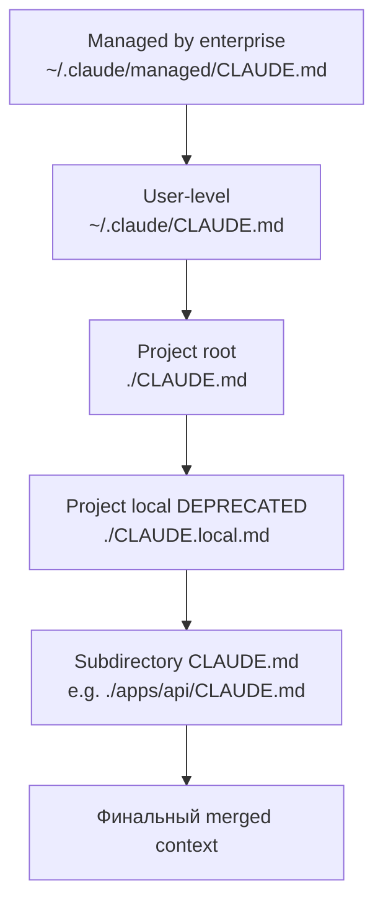

> Эта глава — построчный разбор тех ~20 пунктов, с которых началась подготовка гайда. Каждое утверждение проверено по официальной документации (`docs.claude.com`, `code.claude.com/docs`), changelog'у Claude Code и через Context7 (`/anthropics/claude-code/v2.1.89`). Цель — отделить факты от домыслов, чтобы вы могли цитировать тред без оглядки на «а вдруг там вранье».

Легенда:

- ✅ — подтверждено документацией.
- 🟡 — частично верно / есть нюансы.
- ❌ — неточно или неверно.
- 🧪 — относится к экспериментальной фиче (поведение может меняться).

---

## 14.1. Сводная таблица

| #   | Утверждение треда                                                              | Статус | Реальность                                                                                                                                                                                                        |
| --- | ------------------------------------------------------------------------------ | ------ | ----------------------------------------------------------------------------------------------------------------------------------------------------------------------------------------------------------------- |
| 1   | Claude Code — это harness вокруг LLM, а не сама модель                         | ✅     | См. [01.](./01-introduction), [08.](./08-tool-calls-and-loop). Harness управляет контекстом, tools, hooks, разрешениями.                                                                                          |
| 2   | LLM сам по себе — чат-бот, агентом его делает loop tool_use → tool_result      | ✅     | Это базовый протокол Anthropic API: `stop_reason: "tool_use"` → harness исполняет → `tool_result` → следующая итерация.                                                                                           |
| 3   | Контекст ограничен 200k токенов, но можно расширить до 1M                      | 🟡     | Верно, но 1M доступен только через alias `opus[1m]` / `sonnet[1m]` и только на Max/Team/Enterprise. См. [11.6.](./11-models-and-pricing#116-1m-контекст-когда-оправдан)                                           |
| 4   | Включить 1M-контекст «по умолчанию» — плохая идея                              | ✅     | Дороже + по эмпирике после 300-400k качество падает. Anthropic не рекомендует «всегда 1M».                                                                                                                        |
| 5   | Prompt cache даёт огромную экономию                                            | ✅     | Cache read = **0.1×** input price (10× дешевле). На 30-turn сессии экономия **65-80%**. См. [02.](./02-context-and-cache), [11.5.](./11-models-and-pricing#115-расчёт-типичной-сессии-travel-agent)               |
| 6   | TTL кэша по умолчанию — 5 минут, можно расширить до 1 часа                     | ✅     | 5min cache write = 1.25× input, 1h cache write = 2× input.                                                                                                                                                        |
| 7   | Есть «Advisor mode» для планирования на Opus                                   | ❌     | Правильное имя — **`opusplan`**. См. [02.6.](./02-context-and-cache), [11.4.2.](./11-models-and-pricing). После ExitPlanMode автоматически переключается на Sonnet.                                               |
| 8   | `opusplan` поддерживает 1M-окно                                                | ❌     | Plan-фаза `opusplan` работает в стандартных 200k, даже если 1M включено глобально.                                                                                                                                |
| 9   | Существует env-переменная для autocompact threshold                            | 🟡     | Да, но называется `CLAUDE_AUTOCOMPACT_PCT_OVERRIDE`, **а не** `CLAUDE_CODE_AUTO_COMPACT_THRESHOLD` как в треде. Значение — процент (например `85`).                                                               |
| 10  | CLAUDE.md имеет иерархию: project, user, local                                 | 🟡     | На самом деле **5 уровней**: managed (enterprise) > user (`~/.claude/CLAUDE.md`) > project (`./CLAUDE.md`) > project local (`./CLAUDE.local.md`, deprecated) > subdirectory CLAUDE.md. См. [03.](./03-claude-md). |
| 11  | CLAUDE.md поддерживает @-imports                                               | ✅     | Рекурсивно до 5 уровней. Используйте `@./path/to/file.md`.                                                                                                                                                        |
| 12  | Skill — это просто markdown-файл                                               | ❌     | **Skill — это директория** с `SKILL.md` + опционально `scripts/`, `references/`, `templates/`. См. [04.](./04-skills).                                                                                            |
| 13  | Hooks — это shell-команды на события lifecycle                                 | ✅     | Подтверждено. Но событий **больше 6** (как в треде) — реально **28+**. См. [05.1.](./05-hooks#51-полный-список-событий)                                                                                           |
| 14  | Hook может заблокировать действие модели                                       | ✅     | Exit code `2` блокирует с stderr → возвращается в модель как ошибка. JSON-ответ `{"action": "block"}` — то же самое.                                                                                              |
| 15  | MCP-серверы поддерживают stdio, SSE, HTTP                                      | ✅     | Все три транспорта. См. [06.2.](./06-mcp). На практике большинство серверов используют stdio.                                                                                                                     |
| 16  | Plugins позволяют пакетировать MCP + skills + hooks                            | ✅     | Манифест `.claude-plugin/plugin.json`, можно публиковать через marketplaces. См. [07.](./07-plugins).                                                                                                             |
| 17  | Subagents имеют изолированный контекст и возвращают только summary             | ✅     | Каждый subagent — отдельный API-call с своим префиксом. Возвращается финальный текст в основной контекст. См. [09.](./09-subagents).                                                                              |
| 18  | Существуют built-in subagents: explore, plan, general-purpose                  | ✅     | Полный список: `Explore` (Haiku), `Plan`, `general-purpose`, `statusline-setup`, `Claude Code Guide` (если плагин установлен).                                                                                    |
| 19  | Subagents можно запускать параллельно и в worktree-изоляции                    | ✅     | Параметр `isolation: "worktree"` создаёт временный git worktree. Параллельный запуск — несколько Agent tool_use в одном assistant-message.                                                                        |
| 20  | Agent Teams — полноценная фича для параллельной работы нескольких Claude       | 🟡🧪   | Реальная фича с v2.1.32. Но **экспериментальная**, требует `CLAUDE_CODE_EXPERIMENTAL_AGENT_TEAMS=1`. См. [10.](./10-agent-teams).                                                                                 |
| 21  | Tool `Task` — это запуск subagent                                              | 🟡     | Был, но в **v2.1.63** переименован в `Agent`. `Task(...)` всё ещё работает как алиас.                                                                                                                             |
| 22  | Opus — лучшая модель для агентного кодирования                                 | ✅     | Из docs: «most capable for complex reasoning and agentic coding». Текущая — Opus 4.7 (релиз 16 апреля 2026).                                                                                                      |
| 23  | Opus 4.7 имеет новый токенизатор, расходует больше токенов                     | ✅     | До +35% на одном и том же тексте по сравнению с Opus 4.6. Если у вас были старые оценки бюджета — пересчитайте.                                                                                                   |
| 24  | Sonnet — лучшее соотношение цена/качество                                      | ✅     | «best combination of speed and intelligence». Подходит для 80% задач.                                                                                                                                             |
| 25  | На Bedrock/Vertex/Foundry дефолтные алиасы сдвинуты на одну версию назад       | ✅     | `opus` там → 4.6, `sonnet` → 4.5. Указывайте полный имя для свежих.                                                                                                                                               |
| 26  | Cache не работает, если префикс меняется (например, в CLAUDE.md есть {{date}}) | ✅     | Cache invalidation срабатывает на любое изменение байт. Поэтому динамику держите вне кэшируемой части.                                                                                                            |
| 27  | `gh pr create` доступен Claude через bash                                      | ✅     | При условии `gh` установлен и аутентифицирован. Это просто bash-команда.                                                                                                                                          |
| 28  | Permissions имеют 3 уровня: allow / ask / deny                                 | ✅     | `deny` — финальный, нельзя обойти даже в `bypassPermissions`. См. [08.5.](./08-tool-calls-and-loop#85-permissions-как-claude-code-решает-спросить-или-нет)                                                        |
| 29  | Skills могут запускаться из subagents и наследовать или форкать контекст       | ✅     | Frontmatter `context: inherit` (видит контекст родителя) или `context: fork` (новый контекст, изолированный).                                                                                                     |
| 30  | «С новыми моделями надо пересматривать CLAUDE.md и skills»                     | 🟡     | Не цитата из docs, а здравая практика. См. [11.8.](./11-models-and-pricing#118-стоит-ли-пересматривать-claudemd-и-skills-с-новыми-моделями).                                                                      |

---

## 14.2. Развёрнутые комментарии по неточностям

### 14.2.1. «Advisor mode» vs `opusplan`

В треде упоминался «Advisor mode» — такого имени в docs нет. Реальная команда:

```bash
/model opusplan
```

или прямо в начале сессии:

```bash
claude --model opusplan
```

📘 Поведение: модель Opus в режиме plan (read-only tools), после `ExitPlanMode` автоматически переключается на Sonnet для реализации. Это и есть «думаю Opus'ом, делаю Sonnet'ом» паттерн.

⚠️ Известный нюанс: plan-фаза `opusplan` **не использует 1M-окно**, даже если оно включено для основной сессии.

### 14.2.2. Env переменная для autocompact

Было: `CLAUDE_CODE_AUTO_COMPACT_THRESHOLD`.
Реально: `CLAUDE_AUTOCOMPACT_PCT_OVERRIDE`.

Принимает число от 0 до 100 (процент заполнения окна, при котором запускается autocompact).

```bash
export CLAUDE_AUTOCOMPACT_PCT_OVERRIDE=85
```

Дефолт — около 92%. Можно отключить через 100 (никогда не сжимать) или через `--no-auto-compact` флаг при запуске.

### 14.2.3. Skill = директория

Да, минимальный скилл — это `SKILL.md` с frontmatter и markdown-телом. **Но** структура может быть гораздо богаче:

```text
.claude/skills/prepare-pr/
├── SKILL.md                  # обязательно
├── scripts/
│   └── lint-and-test.sh      # опционально
├── references/
│   └── pr-template.md        # опционально
└── templates/
    └── changelog-entry.tmpl  # опционально
```

Скилл может из своего SKILL.md звать собственные scripts и читать собственные references. Это превращает скилл в полноценный «модуль», а не просто промпт.

### 14.2.4. Список событий hooks

В треде было ~6 событий. Реально на v2.1.89 их **28+**. Полный список в [05.1.](./05-hooks#51-полный-список-событий). Особенно полезные, которых часто не знают:

- `SessionStart` — для приветственного сообщения / pre-flight checks.
- `Stop` — для desktop-уведомлений «модель закончила, проверяй».
- `TeammateIdle` — для Agent Teams.
- `Notification` — кастомизация уведомлений.
- `SubagentStop` — когда subagent завершил работу.
- `PreCompact` / `PostCompact` — для логирования или кастомизации сжатия.

### 14.2.5. Opus 4.6 → 4.7

На момент написания треда последней версией мог быть Opus 4.6. С 16 апреля 2026 актуальная — **Opus 4.7**:

- Тот же ценник ($5/$25 input/output per MTok).
- Новый токенизатор (+ до 35% токенов на тех же текстах).
- Улучшение на агентных бенчмарках, но регрессий тоже ждите — пересмотрите свои eval'ы.

Алиас `opus` → 4.7 на API. На Bedrock/Vertex/Foundry — пока 4.6.

### 14.2.6. Tool `Task` vs `Agent`

В коде subagent-вызовов вы можете встретить оба варианта:

```text
Task(subagent_type="Explore", prompt=...)   # старый
Agent(subagent_type="Explore", prompt=...)  # новый, с v2.1.63
```

Они эквивалентны. Внутри harness'а — это один и тот же tool. В новых проектах используйте `Agent` для совместимости с будущими версиями.

### 14.2.7. Иерархия CLAUDE.md

Тред упомянул 3 уровня. Реально — 5:



Subdirectory CLAUDE.md подгружаются автоматически когда модель работает с файлами в этой поддиректории. Это удобно для монорепо.

⚠️ `CLAUDE.local.md` — формально deprecated в пользу gitignored `CLAUDE.md` или просто использования `~/.claude/CLAUDE.md`.

---

## 14.3. Что в треде было полностью верно

Чтобы не сложилось впечатление «всё было неправильно» — нет, тред в целом неплохо описывал систему. Вот что было точно:

✅ Главная идея harness vs модель.
✅ Цикл tool_use / tool_result как сердце агента.
✅ Prompt cache как ключевая экономия.
✅ Subagents для browse-heavy задач.
✅ MCP как стандарт расширения.
✅ Permissions с allow/ask/deny.
✅ Worktree-изоляция для безопасных параллельных задач.
✅ Идея «не Opus всегда — Sonnet 80%».

Где автор треда был особенно прав — это в общих рекомендациях. Где спотыкался — в названиях команд и точных env-переменных. Это типично для твиттер-формата: запоминается принцип, а конкретики легко забыть.

---

## 14.4. Источники проверки

Каждое утверждение в этой таблице проверено по одному или нескольким источникам:

📘 **Официальная документация:**

- `https://docs.claude.com/en/docs/claude-code/overview` — публичная docs Claude Code.
- `https://code.claude.com/docs/ru/overview` — русская версия (синхронизирована, но иногда отстаёт).
- `https://docs.claude.com/en/docs/build-with-claude/prompt-caching` — детали кэша.
- `https://docs.claude.com/en/docs/agents-and-tools/tool-use/overview` — tool use в API.
- `https://docs.claude.com/en/api/messages` — API reference.

📘 **Changelog:**

- `https://docs.claude.com/en/docs/claude-code/changelog` — для дат и переименований (`Task → Agent`, env-переменные).

📘 **Context7:**

- `/anthropics/claude-code` (v2.1.89) — для примеров кода, актуального CLI, точных имён tools.
- `/anthropics/anthropic-sdk-typescript` — для SDK-кода в [06.](./06-mcp) и [12.](./12-travel-agent-blueprint).

📘 **Anthropic blog:**

- Анонсы моделей (Opus 4.7, Sonnet 4.6, Haiku 4.5) — для дат и pricing.

⚠️ В случае конфликта между источниками приоритет: changelog > docs > blog > Context7. Context7 хорош для кода, но иногда отстаёт от свежих изменений API.

---

## 14.5. Итог: как читать твиттер-треды про AI инструменты

📝 Несколько эвристик, которые сэкономят вам время:

1. **Имена команд / env-переменных всегда сверяйте с docs.** Их легче всего забыть, и они меняются между версиями.
2. **Числа всегда сверяйте.** Цена, размер контекста, частота TTL — это конкретика, и она тоже меняется.
3. **Принципы обычно верны.** «Кэш экономит», «subagent изолирует контекст», «opus дорогой» — это устойчивые свойства, и они не разваливаются от версии к версии.
4. **Скептически относитесь к хвалебным сообщениям.** Если автор продаёт курс / сервис на тему, всегда есть преувеличение. Особенно подозрительны цифры вида «10x productivity» без методологии.
5. **`/release-notes` — ваш друг.** Каждая мажорная версия (2.1.50 → 2.1.89) приносит изменения. Прочитать раз в месяц — мало, два раза в месяц — нормально.

---

## 14.6. Что делать с этим гайдом

Этот гайд — снимок состояния на **23 апреля 2026, Claude Code v2.1.89**. Что-то устареет за месяц, что-то — за квартал. Используйте как:

- ✅ Справочник по концепциям (они меняются медленно).
- ✅ Шаблон для CLAUDE.md / skills / hooks (адаптируйте под свой проект).
- ✅ Чек-лист антипаттернов.
- 🟡 Источник конкретных цифр и команд — но всегда сверяйте с актуальной docs перед серьёзным использованием.

💡 Если вы нашли ошибку — это нормально, тулинг развивается быстро. Лучшая практика: вести свою личную «карту правок» рядом, и раз в квартал делать sync с актуальной docs.

---

**Конец гайда.**

🚀 Удачи в использовании Claude Code. Если этот гайд помог хоть одну ошибку не совершить — он окупился.

**Назад →** [README (оглавление)](./README)
