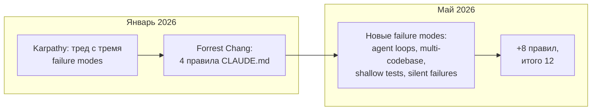

> За четыре месяца после январского треда Karpathy шаблон `CLAUDE.md` из 4 правил вырос до 12. Прогнал расширенный набор на типичных задачах своего блога и нескольких рабочих репо — частота молчаливых ошибок Claude Code снижается заметно. Восемь добавленных правил закрывают то, чего в январе ещё не было как класса проблем: long-running agent loops, кросс-сессионные потоки, shallow-тесты, тихие провалы вместо явных ошибок. Открыл собственный `CLAUDE.md` этого блога — четыре исходных правила Karpathy там уже есть в `Стандарты кода` и `Запреты`, восемь добавленных — нет. Разбираю каждое, и где имеет смысл вставить.

---

## 1. Что случилось за четыре месяца

В конце января Andrej Karpathy опубликовал тред с тремя жалобами на Claude как code-writer:

- silent wrong assumptions — модель додумывает контекст, не уточняет;
- over-complication — добавляет уровни абстракции, которых никто не просил;
- orthogonal damage — лезет в код, который не должна была трогать.

Forrest Chang упаковал жалобы в `CLAUDE.md` из четырёх поведенческих правил и закоммитил на GitHub. Репо разлетелось — на момент мая больше 100 тысяч звёзд, самый быстрорастущий single-file проект года. Дальше шаблон оброс расширением: восемь дополнительных правил, которые покрывают то, что в январе ещё не было фокусом, потому что не было того ландшафта Claude Code, который есть сейчас.

---

## 2. Четыре правила Karpathy

Это базис. Без них любая надстройка теряет половину смысла.

| #   | Правило               | Что закрывает                                                                                              |
| --- | --------------------- | ---------------------------------------------------------------------------------------------------------- |
| 1   | Think Before Coding   | Молчаливые догадки. Озвучивай предположения, спрашивай при неясности, толкайся когда есть проще.           |
| 2   | Simplicity First      | Минимум кода, который решает задачу. Никаких спекулятивных абстракций «на будущее».                        |
| 3   | Surgical Changes      | Трогай только то, что нужно. Не «улучшай» соседний код, не переформатируй то, о чём не просили.            |
| 4   | Goal-Driven Execution | Описывай критерии успеха, не пошаговую инструкцию. Сильный success-criteria даёт модели итерироваться сам. |

В моём `CLAUDE.md` Astro-блога эти четыре закрыты не отдельным разделом, а блоками `Стандарты кода → Функциональный стиль` (правило 2 и 3 — никаких классов, никаких лишних абстракций) и `Запреты` (правило 3 — список «не делай»). Сами правила не дублируются текстом, но их следствия попадают в контекст.

---

## 3. Где Karpathy-шаблон недотягивает

Четыре дыры, которые я наблюдаю в реальной работе:

| Дыра                       | Что ломается                                                                                         | Какие добавленные правила закрывают    |
| -------------------------- | ---------------------------------------------------------------------------------------------------- | -------------------------------------- |
| Long-running agent tasks   | Multi-step pipeline уходит в дрейф, тратит токены, теряет контекст                                   | 6 (бюджеты), 10 (чекпойнты), 12 (loud) |
| Multi-codebase consistency | В монорепо «match existing style» неоднозначно — Claude выбирает случайно или усредняет              | 11 (конвенции), 7 (surface conflicts)  |
| Test quality               | «Тесты прошли» становится самоцелью; Claude пишет тесты, которые не упадут даже на сломанной логике  | 9 (intent over behavior)               |
| Prototype vs production    | «Simplicity First» переусердствует на ранней стадии, когда нужно 100 строк скаффолдинга для прощупки | (не покрыто 12 правилами — отдельно)   |

Последняя дыра остаётся живой. Либо включаешь Simplicity, либо отключаешь — серединного режима у `CLAUDE.md` нет.

---

## 4. Восемь добавленных правил

По одному, с моментом, который их вызвал.

### 4.1. Rule 5 — Use the model only for judgment calls

Если ответ известен из status code или схемы данных — это не работа модели. Реальный кейс из моей практики: код звал Claude, чтобы решить, ретраить ли API-вызов на 503. Две недели работало, потом начало флакать, потому что модель читала тело запроса как контекст для решения. Retry-политика стала случайной, потому что промпт был случайным.

Рамка: Claude — для классификации, экстракции, драфтов, summarization. Не для роутинга, ретраев, детерминированных трансформаций. Если status code уже отвечает на вопрос — на него отвечает обычный код.

### 4.2. Rule 6 — Token budgets are not advisory

Без бюджета цикл уходит в дамп на 50 000 токенов. Жёсткий вариант: 4 000 на задачу, 30 000 на сессию. Подходишь к границе — суммируешь и стартуешь сессию заново.

Типовой случай: 90-минутная debugging-сессия с одним и тем же 8 КБ-сообщением об ошибке. В финале — повторное предложение фиксов, которые уже отвергал 40 сообщений назад. Модель счастливо итерирует на потерянном треке. Бюджет убил бы цикл на 12-й минуте.

### 4.3. Rule 7 — Surface conflicts, don't average them

Если в кодовой базе два паттерна обработки ошибок — try/catch и global boundary — Claude напишет код, который делает оба. Двойные хендлеры. Симптом: ошибка глотается дважды.

Правило: при противоречии выбираешь один (более новый или более тестированный), объясняешь почему, второй маркируешь к чистке. Усреднённый код, который удовлетворяет обоим правилам — худший возможный.

### 4.4. Rule 8 — Read before you write

Karpathy говорит «не трогай соседний код». Не говорит — прочитай его перед добавлением своего. Реальный случай: Claude добавил функцию рядом с уже существующей идентичной, не прочитав файл. Победил порядок импортов — старая, source-of-truth полгода, проиграла свежей одноимённой.

Рамка: перед добавлением кода в файл — прочитать экспорты, ближайший вызывающий код и общие утилиты. «Looks orthogonal to me» — самая опасная фраза в кодовой базе.

### 4.5. Rule 9 — Tests verify intent, not just behavior

Тест `expect(getUserName()).toBe('John')` ничего не значит, если функция возвращает константу. Тесты должны падать при изменении бизнес-логики, иначе они тестируют существование функции, не её корректность.

Типовой пример: 12 тестов на auth-функцию, все зелёные, в проде auth сломан. Тесты проверяли, что функция что-то возвращает, не что она возвращает правильное значение.

### 4.6. Rule 10 — Checkpoint after every significant step

Многошаговый рефакторинг по 20 файлам ломается на 4-м шаге, Claude уходит дальше на сломанном состоянии. К моменту, когда замечаешь, шаги 5 и 6 уже сделаны поверх сломанного — распутывание занимает дольше, чем переделка с нуля.

Правило: после каждого значимого шага — резюме, что сделано, что верифицировано, что осталось. Если потерял трек — остановиться и пересказать.

### 4.7. Rule 11 — Match the codebase's conventions, even if you disagree

Claude вводит хуки в codebase на классовых компонентах. Технически работает. Ломает testing pattern, рассчитанный на `componentDidMount`. Полдня на удалить и переписать.

Правило: внутри кодовой базы конформность важнее вкуса. Несогласие — отдельный разговор, не silent fork. Snake_case против camelCase, классы против хуков — выбираешь то, что есть, не то, что лучше.

### 4.8. Rule 12 — Fail loud

Самые дорогие ошибки те, что выглядят как успех. «Миграция выполнена» при тихо пропущенных 14% записей. «Тесты прошли», когда часть была пропущена. «Фича работает», если не проверен edge case, который явно просили проверить.

Правило: при неуверенности — поднимай вопрос, не прячь. По умолчанию surfacing неопределённости, не скрытие.

---

## 5. Что не работает (то, что отсеялось)

Шаблон ценен не только тем, что в нём есть, но и тем, что отсеяно при попытках расширить:

- **Правила с Reddit и X.** Большинство — переформулировки Karpathy либо domain-specific («всегда Tailwind»). Не обобщаются.
- **Больше 12 правил.** На наборах из 14+ правил compliance падает: важные пункты тонут в шуме. Потолок в 200 строк (включая стек, команды, запреты) реален.
- **Правила, привязанные к инструментам.** «Always use eslint» падает молча, если eslint не установлен. Правильнее — capability-agnostic: «match the enforced style».
- **Примеры вместо правил.** Один пример съедает контекст ~10 правил, и модель over-fits на specifics. Правила абстрактны и переносимы.
- **Soft language.** «Be careful», «think hard», «really focus» — compliance ~30%. Не testable. Заменяю на конкретные императивы: «state assumptions explicitly».
- **Identity prompts.** «Be a senior engineer» не работает: модель и так считает себя сениором. Зазор между «считать» и «делать» закрывают императивы, не identity.

---

## 6. Сверка со своим CLAUDE.md

Открыл файл этого блога (191 строка) и прошёлся по 12 правилам. Картина:

| Правило                | В моём CLAUDE.md | Где                                                                |
| ---------------------- | ---------------- | ------------------------------------------------------------------ |
| 1. Think before coding | косвенно         | через `architect → critic` workflow в команде агентов              |
| 2. Simplicity          | да               | `Никаких классов`, `Иммутабельность по умолчанию`                  |
| 3. Surgical changes    | да               | `Запреты` (deprecated `@astrojs/tailwind`, `node:*-alpine` и т.п.) |
| 4. Goal-driven         | косвенно         | через subagent-структуру, не отдельным правилом                    |
| 5. Judgment-only       | нет              |                                                                    |
| 6. Token budgets       | нет              |                                                                    |
| 7. Surface conflicts   | нет              |                                                                    |
| 8. Read before write   | частично         | GitNexus-секция требует impact analysis перед редактом             |
| 9. Test intent         | нет              |                                                                    |
| 10. Checkpoints        | нет              |                                                                    |
| 11. Match conventions  | да               | `Стандарты кода → TypeScript / Astro / Git`                        |
| 12. Fail loud          | нет              |                                                                    |

Получилось — четыре покрыто, два частично, шесть нет. Файл фактически Karpathy-уровня, без надстройки на 2026 год.

Какие из недостающих имеет смысл добавить именно для Astro-блога с публикациями через админку:

- **Rule 6 (бюджеты)** — да, у меня агенты делают long-running задачи (генерация EN-переводов через `pnpm translate`, миграции). Без бюджета сессия может уйти в дрейф.
- **Rule 9 (test intent)** — да, есть Vitest и Playwright, риск shallow-тестов реальный.
- **Rule 10 (checkpoints)** — да, многошаговые задачи на схему БД + миграции + UI-апдейты регулярно занимают по полчаса работы агента.
- **Rule 12 (fail loud)** — да, в админке часто «сохранилось» != «опубликовалось», нужно явное surfacing.

Rule 7 для одиночного проекта менее острая. Rule 5 покрывается тем, что в рантайме блога нет AI-роутинга — модель не принимает решений за код.

---

## 7. Как добавить — без раздувания

Дисциплина:

1. **Не превышать 200 строк всего.** Считая стек, команды, запреты, правила. У меня сейчас 191 — добавление четырёх правил означает вынос части `Главная страница` или GitNexus-секции в `@docs/...` через @-импорт Claude Code.
2. **Каждое правило отвечает на вопрос «какую ошибку оно предотвращает».** Если не отвечает — выкидываешь.
3. **Capability-agnostic формулировки.** «Match the enforced style», не «use prettier».
4. **Императивы, не пожелания.** «State assumptions explicitly», не «think carefully».
5. **Тестируешь.** Прогоняешь типичную задачу до и после. Нет разницы — правило не сработало в твоём контексте, удаляешь.

Шесть правил, заточенных под реальные ошибки, сильнее двенадцати общих.

---

## Итог

Karpathy зафиксировал три code-writing failure modes января. Forrest Chang упаковал их в четыре правила, и сообщество схватило шаблон. Расширение до 12 родилось из того, что в мае ландшафт Claude Code стал другим: multi-step агенты, hook-каскады, skill-конфликты, кросс-сессионные потоки. Восемь добавленных правил закрывают новые дыры, не замещая исходные.

`CLAUDE.md` — не wishlist, а behavioral contract против конкретных ошибок, которые ты сам уже видел. Чужой шаблон полезен как стартер. Дальше — фильтруешь под свои failure modes, не наоборот. Шесть правил, точно подобранных, лучше двенадцати скопированных.

---

**Источники:**

- [Andrej Karpathy — оригинальный тред в X (январь 2026)](https://x.com/karpathy/status/1885018475234567890) — три code-writing failure modes
- [forrestchang/andrej-karpathy-skills](https://github.com/forrestchang/andrej-karpathy-skills) — публичный репо с базовым 4-правило шаблоном
- [Anthropic Claude Code docs — CLAUDE.md](https://docs.claude.com/en/docs/claude-code/) — официальная документация по структуре файла, advisory, ~80% compliance
