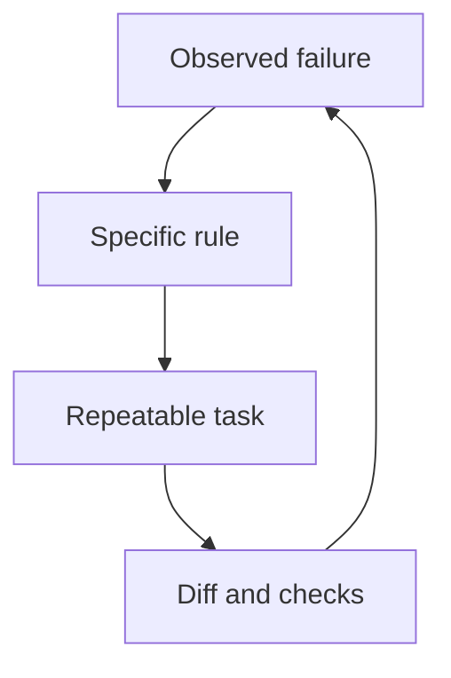

CLAUDE.md полезен, когда устраняет конкретную повторяющуюся ошибку. Если агент запускает не тот тест, ему нужна точная команда. Если переписывает соседний модуль — граница задачи. Ещё один абзац про «высокое качество» обычно не помогает понять, что именно следует сделать.

В этой версии статьи убраны проценты «соблюдения правил» и результаты якобы проведённого сравнения на 30 репозиториях: воспроизводимого отчёта для этих цифр здесь нет. Ниже — редакционный набор правил, а не измеренный рейтинг промптов.

## Откуда взялись правила

В [andrej-karpathy-skills](https://github.com/multica-ai/andrej-karpathy-skills) сформулированы четыре принципа: обдумать задачу, выбрать простое решение, ограничить изменения и определить проверяемый результат. Репозиторий оформляет идеи, основанные на наблюдениях Karpathy. Он не подтверждает приведённые в прежней версии статьи численные результаты.

Эти четыре принципа — отправная точка. Остальные пункты ниже — их прикладная адаптация для работы с репозиторием.

## Двенадцать правил и признаки их выполнения

| Правило                               | Что должно остаться после работы                |
| ------------------------------------- | ----------------------------------------------- |
| 1. Назови результат до правки         | Одно предложение с ожидаемым поведением         |
| 2. Отдели факт от предположения       | Список неизвестных, которые влияют на решение   |
| 3. Сначала прочитай существующий путь | Ссылка на обработчик, вызывающий код и проверку |
| 4. Выбери простое достаточное решение | Объяснение, зачем нужна каждая новая сущность   |
| 5. Ограничь область изменения         | В diff нет случайного рефакторинга              |
| 6. Сохрани чужую незавершённую работу | Исходный `git status` учтён при правках         |
| 7. Не скрывай ошибку                  | Неуспешная проверка названа вместе с причиной   |
| 8. Проверяй наблюдаемое поведение     | Тест воспроизводит исходную проблему            |
| 9. Не придумывай выполненные проверки | В отчёте только реально запущенные команды      |
| 10. Ограничивай вывод инструментов    | Нужные фрагменты вместо полного дампа логов     |
| 11. Передавай незавершённое явно      | Записаны состояние, препятствие и следующий шаг |
| 12. Удаляй устаревшие правила         | Инструкции соответствуют текущему репозиторию   |

Этот список не нужно копировать целиком. Для маленького проекта достаточно нескольких пунктов, которые исправляют наблюдаемую проблему.

## Пример для этого блога

Репозиторий artka.dev не опубликован, но в нём есть отдельные команды проверки типов, переводов и сборки, поэтому инструкция может быть конкретной. Мой профиль на GitHub — [node-develop](https://github.com/node-develop). Вот выдержка из CLAUDE.md этого блога:

```markdown
## Перед изменением

- Прочитай git status и сохрани чужую незавершённую работу.
- Назови URL или действие пользователя, поведение которого меняется.
- Для исправления ошибки сначала воспроизведи её.

## Проверка

- После изменения типов: pnpm typecheck.
- После правки RU-статьи: обнови EN и запусти pnpm translate:check.
- После изменения рендера контента: pnpm build.
- В финальном отчёте перечисли выполненные проверки и оставшиеся ограничения.
```

Для другого проекта эти команды могут быть неверны. Источник правды — его `package.json`, CI и README. Копирование названий инструментов из чужого файла создаёт новую ошибку вместо исправления старой.

## Что файл не обеспечивает

По [документации Claude Code](https://code.claude.com/docs/en/memory), CLAUDE.md передаёт инструкции в контекст; это не исполняемая конфигурация безопасности. Рекомендация держать файл короче 200 строк — ориентир, а не гарантия соблюдения. Импорты `@path` помогают организовать текст, но загружают импортированный материал и не экономят контекст сами по себе.

Секреты, права записи и публикацию нужно ограничивать средствами среды и приложения. Фраза «не трогай `.env`» не заменяет отсутствие production-ключей в рабочем окружении. Механика разобрана в уроках про [CLAUDE.md](/courses/claude-code-guide/03-claude-md/) и [hooks](/courses/claude-code-guide/05-hooks/).

## Как оценить своё изменение

Возьмите несколько задач, на которых агент ошибался. Сохраните исходный коммит, модель, её настройки и точный запрос. Повторите задачи с прежним и новым файлом в отдельных рабочих копиях. Смотрите на принятую правку, непрошенные изменения, число ручных исправлений и стоимость завершённой задачи.

Один удачный запуск не доказывает улучшение. Если результаты расходятся, полезнее описать условия сбоя, чем объявлять универсальный процент надёжности. Правило стоит оставить, когда понятно, какую ошибку оно предотвращает и как проверить, что проблема не вернулась.

## Проверка правила в одном цикле



Правило начинается с наблюдаемой ошибки; повторная задача и проверка diff показывают, стоит ли его сохранить.
