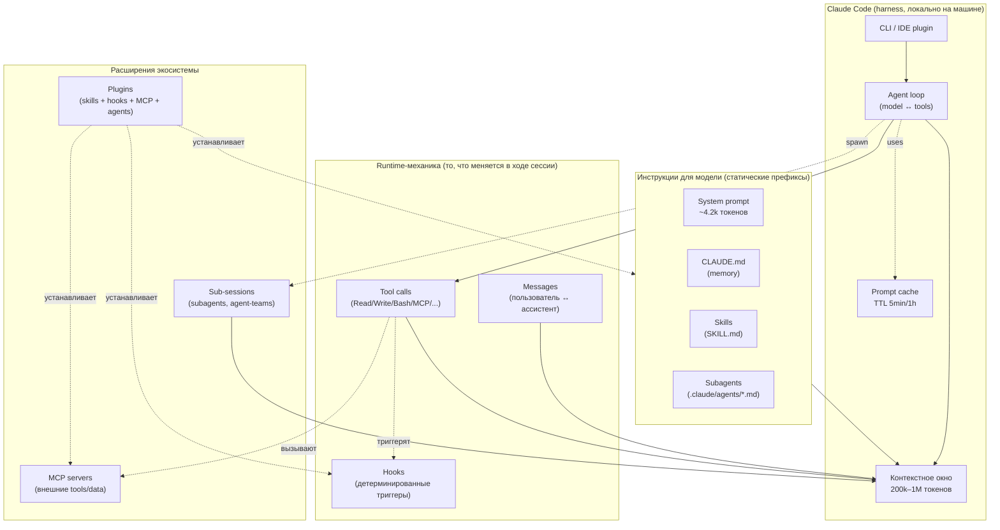

> Сквозной пример: **Travel Agent** — Node.js backend + React frontend + LLM + MCP-серверы для авиа/отелей/погоды.
>
> Все утверждения в этом гайде проверены по официальной документации `code.claude.com/docs` и Anthropic API docs (актуально на **23 апреля 2026**, Claude Code v2.1.89, Opus 4.7 / Sonnet 4.6 / Haiku 4.5).

---

## Зачем этот гайд

В сети много твиттер-тредов про Claude Code, в которых половина утверждений верна, четверть устарела, а ещё четверть — авторская эмпирика, поданная как факт. Этот гайд:

1. **Проверяет** популярные тезисы по docs и исходникам.
2. **Объясняет внутренности** — agent loop, prompt cache, harness, tool dispatch.
3. **Показывает на сквозном примере** (Travel Agent), как это всё собрать с нуля под реальный стек.
4. **Даёт готовые рецепты** — CLAUDE.md, skill, hook, subagent, MCP, plugin.

Если вы только начинаете — читайте по порядку. Если уже работаете с Claude Code — открывайте нужную главу из оглавления.

---

## Оглавление

| №   | Файл                                                        | О чём                                                                                     |
| --- | ----------------------------------------------------------- | ----------------------------------------------------------------------------------------- |
| 00  | [01-introduction.md](./01-introduction)                     | Что такое Claude Code: harness, agent loop, отличие от чат-бота                           |
| 01  | [02-context-and-cache.md](./02-context-and-cache)           | Контекстное окно, `/context`, prompt cache (TTL, инвалидация), `/compact`, env-переменные |
| 02  | [03-claude-md.md](./03-claude-md)                           | `CLAUDE.md`: уровни (managed/project/user/local), импорты `@`, авто-память                |
| 03  | [04-skills.md](./04-skills)                                 | Skills: SKILL.md frontmatter, scripts, references, model-invoked vs user-invoked          |
| 04  | [05-hooks.md](./05-hooks)                                   | Hooks: 30+ событий, exit codes, JSON-протокол, блокировка действий                        |
| 05  | [06-mcp.md](./06-mcp)                                       | MCP-серверы: stdio/SSE/HTTP, scope, для Travel Agent                                      |
| 06  | [07-plugins.md](./07-plugins)                               | Plugins: `plugin.json`, marketplaces, что упаковывать                                     |
| 07  | [08-tool-calls-and-loop.md](./08-tool-calls-and-loop)       | Tool call как механика agent loop, harness internals                                      |
| 08  | [09-subagents.md](./09-subagents)                           | Subagents: `.claude/agents/`, изоляция контекста, экономика                               |
| 09  | [10-agent-teams.md](./10-agent-teams)                       | Agent Teams (экспериментально): team lead, teammates, mailbox                             |
| 10  | [11-models-and-pricing.md](./11-models-and-pricing)         | Opus 4.7 / Sonnet 4.6 / Haiku 4.5: цены, окна, `opusplan`                                 |
| 11  | [12-travel-agent-blueprint.md](./12-travel-agent-blueprint) | **Travel Agent с нуля**: репо, CLAUDE.md, skills, agents, MCP, plugin                     |
| 12  | [13-best-practices.md](./13-best-practices)                 | Ежедневная рутина, антипаттерны, чек-листы                                                |
| 13  | [14-claims-verification.md](./14-claims-verification)       | Таблица проверки всех тезисов из исходного треда                                          |

---

## Карта концепций (одна диаграмма, чтобы не потеряться)

Ключевые принципы, которые повторяются во всём гайде:

1. **Контекст — это деньги и качество.** Чем больше токенов в окне, тем дороже и хуже отвечает модель. Управление контекстом — главный навык.
2. **Skills ≠ Hooks.** Skills — рекомендации модели (вероятностные), Hooks — программные триггеры (гарантированные).
3. **Subagent ≠ Agent Team.** Subagent — изолированный одноразовый помощник. Agent Team — координируемый экипаж с общим task list и mailbox.
4. **MCP ≠ Plugin.** MCP — протокол для подключения внешних tools. Plugin — упаковка локальных артефактов (skills/hooks/agents/MCP-конфигов).
5. **Кэш живёт 5 минут.** Любая пауза > 5 мин по умолчанию приводит к cache miss. Можно поднять до 1 часа за 2× input-токенов.

---

## Условные обозначения в гайде

- 📘 — выдержка из официальной документации
- ⚠️ — частая ошибка / подвох
- 💡 — совет из практики
- 🧪 — что-то экспериментальное (может измениться)
- 🔧 — конкретный фрагмент конфига для Travel Agent
- ✅ — проверенный факт (с источником)
- ❌ — миф / устаревшее

---

## Лицензия и обновления

Гайд написан 23 апреля 2026 для Claude Code **v2.1.89**, под модели **Opus 4.7 / Sonnet 4.6 / Haiku 4.5**.

Если вы читаете это спустя 6+ месяцев — проверьте релиз-ноты Claude Code (`/release-notes` в CLI) и заново сверьтесь с [14-claims-verification.md](./14-claims-verification).
