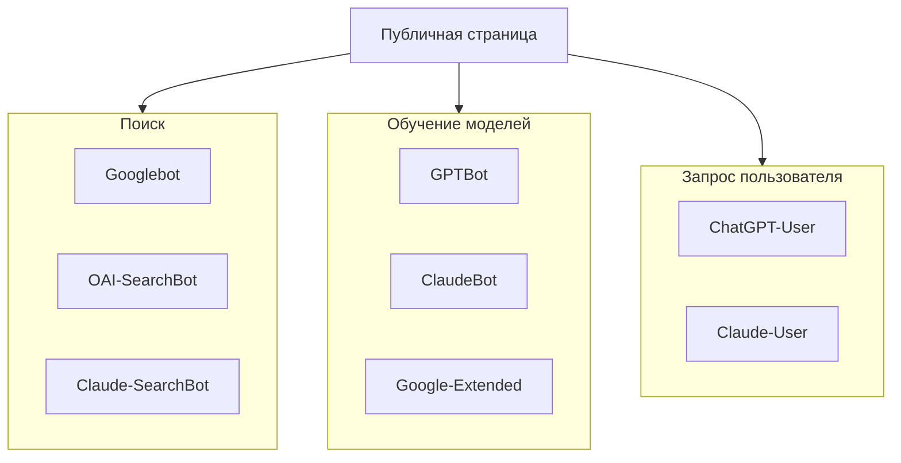
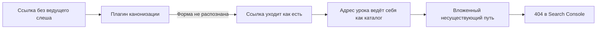

> В отчёте Search Console у artka.dev было 8 проиндексированных страниц и 177 непроиндексированных. Из них 112 в состоянии «просканирована, но пока не проиндексирована». Карты сайта обработаны успешно, все 70 адресов отдают 200, у каждой проверенной страницы сканирование разрешено и канонический адрес совпадает с выбранным Google. Я разобрал сайт по частям и нашёл три настоящие поломки, одна из которых жила в плагине обработки ссылок. Заодно выяснилось, чего этот разбор не лечит.

---

## 1. Отчёт: 112 страниц «просканирована, но пока не проиндексирована»

Цифры на 19 сентября 2026, ресурс `sc-domain:artka.dev`.

| Состояние                                   | Страниц |
| ------------------------------------------- | ------: |
| Проиндексировано                            |       8 |
| Просканирована, но пока не проиндексирована |     112 |
| Не найдено (404)                            |      30 |
| Вариант страницы с тегом canonical          |      13 |
| Страница с переадресацией                   |       9 |
| Обнаружена, не проиндексирована             |       9 |
| Заблокировано в robots.txt                  |       2 |
| Запрещено тегом noindex                     |       1 |

За 90 дней: 8 кликов, 35 показов, средняя позиция 9,9, два запроса в отчёте, оба по названию бренда.

Сто двенадцать страниц в состоянии «просканирована, но пока не проиндексирована» означают ровно одно: робот пришёл, прочитал и отказался. Проверка URL по каждой из них давала одинаковую картину: сканирование разрешено, получение успешно, индексирование разрешено, канонический адрес пользователя совпадает с выбранным Google. Препятствий нет ни на одной.

Одна деталь оказалась важнее всех остальных. Страница `/blog/`, список статей, последний раз сканировалась 25 мая. Разбор я делал 19 сентября: почти четыре месяца робот на неё не заходил.

Это и задало порядок работы. Сначала исключить доступ, потом искать, что робот видит вместо материала.

---

## 2. Доступ: три задачи, которые часто путают

Первое, что проверяют при жалобе на индексацию, это robots.txt. И первое, что там обычно находят, это смешение трёх разных задач в одном файле.

| Задача                                     | Что проверять                                                   |
| ------------------------------------------ | --------------------------------------------------------------- |
| Появление в Google Search                  | Googlebot, HTTP-ответ, noindex, canonical и полезность страницы |
| Использование для обучения моделей         | Правила соответствующего обучающего бота                        |
| Получение страницы по запросу пользователя | Поведение конкретного сервиса и его бота-загрузчика             |



У [OpenAI](https://developers.openai.com/api/docs/bots) GPTBot относится к обучению, OAI-SearchBot к поиску, а ChatGPT-User получает страницы по действию пользователя, и для таких запросов robots.txt может не применяться. В [документации Anthropic](https://support.claude.com/en/articles/8896518-does-anthropic-crawl-data-from-the-web-and-how-can-site-owners-block-the-crawler) перечислены ClaudeBot, Claude-SearchBot и Claude-User. Google-Extended переключателем индексации в Google Search не работает: назначение токена нужно смотреть в [списке роботов Google](https://developers.google.com/crawling/docs/crawlers-fetchers/google-common-crawlers).

Разрешение одного бота ничего не говорит о настройке остальных. И ни одно из этих разрешений не отвечает на вопрос, почему Google выбрал или не выбрал страницу для индекса.

Отдельная ловушка: директиву noindex нельзя прятать за Disallow. Чтобы прочитать её в HTML, робот должен получить страницу. Если обход запрещён, директива остаётся непрочитанной, и [Google объясняет это ограничение](https://developers.google.com/search/docs/crawling-indexing/block-indexing) прямо. Поэтому внутренний поиск на сайте остаётся открытым для обхода и закрывается через noindex.

Проверять ответ сервера нужно обычным GET, не HEAD:

```bash
curl -sS -D /tmp/headers.txt https://artka.dev/blog/ -o /tmp/page.html
```

В заголовках смотрим статус и отсутствие нежелательного `X-Robots-Tag: noindex`, в HTML собственный canonical и отсутствие нежелательного meta robots. Если есть переадресация, проверяем и конечный адрес: первый 301 умеет вести на 404. Подмена User-Agent через curl показывает ответ сервера на выбранную строку, но не доказывает доступ настоящего Googlebot, потому что обратный прокси может отдельно проверять происхождение запроса.

Про `llms.txt` короткий ответ: [Google уточнил](https://developers.google.com/search/updates), что для Google Search он не требуется и на видимость не влияет. На artka.dev [этот файл](/llms.txt) живёт как каталог материалов для клиентов, которые умеют его читать, и всё. Действующая политика доступа лежит в [robots.txt](/robots.txt): именованные группы в ней повторяют ограничения закрытых маршрутов, потому что ограничения из группы для всех более конкретную группу не дополняют.

В моём случае этот раздел закрылся быстро: ни одной блокировки не нашлось, что подтверждается самим статусом «просканирована». Робот всё получил.

---

## 3. Где ломалось: ссылки, которых робот не видел

Три находки, по возрастанию неприятности.

### 3.1. Лента статей отдавала роботу две трети архива

Список `/blog/` рендерил на сервере четыре карточки, остальное подтягивалось скриптом из кусков `/blog/partials/<номер>/`. Куски отдавались с заголовком `X-Robots-Tag: noindex`, а обычной ссылки на вторую страницу в разметке не было вообще, как и блока `noscript`.

Для робота, который не исполняет скрипты, архив заканчивался на четвёртой статье. При шести опубликованных это стоило двух статей. Доля скрытого растёт линейно:

$$\text{доля скрытых статей} = 1 - \frac{\text{размер страницы}}{N}$$

При двадцати статьях и размере страницы четыре без ссылок остаются шестнадцать из двадцати. Спасали архивы тегов и блоки «похожее» внутри статей, то есть случайность, а не замысел.

### 3.2. Сорок адресов с тем же текстом

У каждой статьи и каждого урока есть markdown-двойник по тому же адресу с суффиксом `.md`, и ссылка на него стоит в шапке страницы. Двойники отдавались с кодом 200, типом `text/markdown`, без `X-Robots-Tag` и без указания канонического адреса. Комментарий в коде маршрута утверждал, что заголовок ответа несёт канонический адрес; функция, которая этот ответ собирает, ставила только тип содержимого.

Около сорока адресов с полной копией текста. Поскольку файлы раздаются как статика, заголовки к ним не прикрепить, и правило в robots.txt оказалось удобнее: у каждого ИИ-агента в файле своя группа, поэтому запрет в группе для всех закрывает двойники для Google и Bing и не трогает остальных.

### 3.3. Плагин канонизации ссылок пропускал голую относительную форму

Это самая интересная находка. В отчёте Search Console висели тридцать адресов вида:

```text
/courses/claude-code-guide/11-models-and-pricing/12-travel-agent-blueprint
/courses/claude-code-guide/08-tool-calls-and-loop/09-subagents
/en/courses/claude-code-guide/14-claims-verification/02-context-and-cache
```

Урок внутри урока. Источник нашёлся в плагине, который приводит внутренние ссылки к каноническому виду. Проверка на входе выглядела так:

```ts
if (!href.startsWith("/") && !href.startsWith("./") && !href.startsWith("../")) return href;
```

Ссылка `./09-subagents` обрабатывалась и превращалась в `../09-subagents/`. Голая `09-subagents` проваливалась мимо всех проверок и уходила в разметку как есть. При настройке `trailingSlash: "always"` адрес урока заканчивается слешем и ведёт себя как каталог, поэтому браузер и робот приклеивали цель к нему.



Разница между двумя написаниями одного и того же была случайной. Починка в одну строку: уравнять голую форму с `./` и проверять на собственную схему (`javascript:`, `data:`, `mailto:`), а не на три конкретных префикса.

Тридцать адресов при этом уже разошлись по чужим ссылкам и по памяти робота, поэтому к правке плагина добавилось правило восстановления: если два последних отрезка адреса оба являются известными слагами уроков, приклеенный хвост и есть цель. Одно правило вместо перечисления всех пар, которых при четырнадцати уроках и пяти формах приставки набирается 980.

Результат на живом сайте: 27 из 30 адресов теперь доходят до настоящей страницы. Оставшиеся три отдают 404 намеренно, включая `/terms`, которого никогда не было. Переадресация несуществующей страницы на похожую по смыслу это мягкий 404, а не исправление.

### 3.4. Что изменилось в цифрах

Все замеры сняты запросами к рабочему сайту, до выкладки и после неё.

| Проверка                                | До            | После                      |
| --------------------------------------- | ------------- | -------------------------- |
| Ссылок на статьи в HTML `/blog/`        | 4             | 6                          |
| Ссылок на статьи в HTML главной         | 4             | 6                          |
| Ответ `/blog/partials/2/`               | 200 с noindex | 404                        |
| Склеенный адрес урока                   | 404           | 301, конечная страница 200 |
| Markdown-двойники для поисковых роботов | открыты       | закрыты правилом в robots  |

Одна оговорка про переадресацию. Search Console хранит адреса в форме без завершающего слеша, а на такой форме получается два перехода: сначала сервер добавляет слеш, потом срабатывает правило восстановления. Роботы проходят оба без потерь, но «одного 301» для этой формы нет, и проверка со слешем этого не покажет. Проверять нужно ровно ту форму, которая лежит в отчёте.

---

## 4. Разметка: граф, который не сходился

У статьи есть автор, сайт и собственный адрес. Когда эти сведения собираются в разных компонентах, легко получить двух авторов с разными адресами или дату обновления, не совпадающую с видимой страницей. Единый граф JSON-LD удобен тем, что такие расхождения заметны.

Сам по себе `@graph` не гарантирует ни индексацию, ни расширенный сниппет, ни цитирование. Несколько отдельных корректных блоков тоже допустимы. Выбор одного графа это решение о сопровождении кода.

Сокращённый пример связей:

```json
{
  "@context": "https://schema.org",
  "@graph": [
    { "@type": "Person", "@id": "https://artka.dev/#person", "name": "Artyom Kashuta" },
    {
      "@type": "WebSite",
      "@id": "https://artka.dev/#website",
      "url": "https://artka.dev/",
      "name": "artka.dev"
    },
    {
      "@type": "WebPage",
      "@id": "https://artka.dev/blog/example/#webpage",
      "url": "https://artka.dev/blog/example/",
      "isPartOf": { "@id": "https://artka.dev/#website" }
    },
    {
      "@type": "BlogPosting",
      "@id": "https://artka.dev/blog/example/#article",
      "author": { "@id": "https://artka.dev/#person" },
      "mainEntityOfPage": { "@id": "https://artka.dev/blog/example/#webpage" }
    }
  ]
}
```

Инвариант: адрес страницы в графе, в canonical, в карте сайта и во внутренних ссылках обозначает одну и ту же форму URL. На этом сайте с завершающим слешем. У английской версии собственный адрес под `/en/`, языки связываются через hreflang, а не подменой canonical на русский оригинал.

Для вставки JSON внутрь HTML нужен сериализатор, который не даёт строке `</script>` закрыть элемент раньше времени. Склейка строк из frontmatter здесь не подходит.

Теперь про найденную поломку. На каждой странице статьи узел `BlogPosting` ссылался через `isPartOf` на узел блога с идентификатором `https://artka.dev/#blog-ru`. Сам этот узел выводился только на `/blog/`. То есть единственная связь статьи с изданием не разрешалась ни на одной статье обоих языков: ссылка висела в пустоте ровно там, ради чего граф и городился.

Похожая история на страницах проектов: у коллекции не было поля `breadcrumb`, хотя крошки на странице выводились, а у страницы проекта не было `mainEntity`, поэтому описание работы висело само по себе.

Вывод для проверок сборки: валидатор разметки такие вещи не ловит, потому что каждый отдельный узел корректен. Ловит обход графа с поиском ссылок `@id`, для которых в этом же документе нет узла. Такая проверка пишется за полчаса и поймала бы обе поломки сразу. Оговорка: ссылки на узел другого языка по замыслу указывают на другой документ и должны быть в списке разрешённых исключений, иначе проверка будет шуметь.

И честная граница. [Google описывает](https://developers.google.com/search/docs/appearance/structured-data/intro-structured-data) структурированные данные как способ объяснить содержимое и получить право на поддерживаемые формы показа; показ не гарантируется. Расширенный результат по `FAQPage` из галереи убран, и раздел вопросов остаётся полезным читателю и языковым моделям, но поискового бонуса за него обещать нельзя.

---

## 5. Что отдаётся роботу готовым

Робот, который не исполняет скрипты, должен получать содержание из разметки. Диаграммы на техническом сайте тут показательны: если готовить их при сборке, читателю не нужно грузить рендерер и превращать исходник в изображение, а роботу не нужно ничего исполнять.

На artka.dev это `rehype-mermaid` в пайплайне Astro 7:

```typescript
import { defineConfig } from "astro/config";
import { unified } from "@astrojs/markdown-remark";
import mdx from "@astrojs/mdx";
import rehypeMermaid from "rehype-mermaid";

export default defineConfig({
  integrations: [mdx()],
  markdown: {
    processor: unified({
      rehypePlugins: [[rehypeMermaid, { strategy: "img-svg", dark: true }]],
    }),
  },
});
```

Astro 7 сменил Markdown-процессор по умолчанию, поэтому для remark и rehype-плагинов пайплайн unified сохраняется явно; это описано в [руководстве миграции](https://docs.astro.build/en/guides/upgrade-to/v7/). Фрагмент сокращённый: рабочая конфигурация содержит ещё обработку внутренних ссылок, заголовков, изображений и формул.

После сборки диаграмму видно в HTML в `dist/client/`, и опубликованная страница с отключённым JavaScript её сохраняет. Цена схемы: рендерер работает в окружении сборки, значит браузер и его системные зависимости ставятся в CI до сборки, а версия браузера согласуется с версией Playwright из lockfile.

Если хочется измерить, сколько это стоит, измеряйте честно. Зафиксируйте коммит, версии Node и зависимостей, машину и число блоков. Сравните один и тот же набор страниц в двух копиях: с рендерингом и с заранее подготовленными SVG. Разделите установку зависимостей, первый запуск в новом окружении, повторную сборку и полное время CI. Один холодный и один тёплый запуск не позволяют приписать разницу диаграммам: меняются и другие кеши.

Альтернатива для явных файлов-артефактов, [mermaid-cli](https://github.com/mermaid-js/mermaid-cli), умеет собирать Mermaid-блоки Markdown в SVG и ссылки на них:

```bash
mmdc -i readme.template.md -o readme.md
```

Выбор между ним и rehype зависит от организации контента: диаграмма рядом с абзацем удобнее в пайплайне, отдельный набор схем удобнее файлами. Полный состав пайплайна этого сайта описан на [странице проекта](/projects/astro-blog/).

---

## 6. Чего всё это не лечит

Здесь честная часть, ради которой стоило писать разбор.

Все правки выше убрали помехи. Ни одна из них не отвечает на вопрос, почему 112 страниц просканированы и не проиндексированы. Ответ даёт другая цифра: из 35 адресов русской карты сайта ровно один содержит текст длиннее тысячи слов. Остальные это статьи короче пятисот слов и уроки [курса по Claude Code](/courses/claude-code-guide/) по 250 до 400 слов, которые занимают 30 адресов из 35.

Робот получил всё, прочитал и решил, что места в индексе это не стоит. Запрос индексирования через проверку URL ставит адрес в приоритетную очередь обхода, то есть заставляет робота прийти заново. Решение он примет по тому же материалу.

Отсюда рабочая последовательность, а не список «10 способов исправить»:

1. Убедиться, что доступ есть. Статус «просканирована» это уже доказательство.
2. Убедиться, что внутренние ссылки ведут на страницы, а робот видит их без скриптов.
3. Убрать дубли: копии текста по другим адресам, конкурирующие страницы на одну тему.
4. Починить разметку так, чтобы она описывала то, что на странице видно.
5. И только потом смотреть на объём и ценность материала, потому что предыдущие четыре пункта без пятого дают исправный сайт, которому нечего показать.

Порядок именно такой, потому что пункты с первого по четвёртый проверяются за день и дают однозначный ответ, а пятый занимает недели и ответа не гарантирует.

---

## Итог

Из 185 известных Google адресов в индексе было восемь. Разбор показал, что ни один из них не закрыт, ни один не отдаёт ошибку, карты сайта обработаны, канонические адреса совпадают. Три настоящие поломки нашлись не в настройках доступа, а в коде: список статей прятал две трети архива от робота, около сорока адресов дублировали текст в markdown, а плагин канонизации ссылок пропускал одну из двух эквивалентных форм относительной ссылки и порождал тридцать несуществующих адресов.

Все три починены, и это правильная работа. Но она не отвечает на исходный вопрос. Сайт, где один материал из тридцати пяти длиннее тысячи слов, получает от Google ровно тот ответ, который получил. Техническая часть убирает поводы отказать, причина согласиться появляется только вместе с текстом. Разбор индексации полезно начинать с доступа и ссылок, а заканчивать придётся содержанием.

---

**Источники:**

- [Google Search Central: структурированные данные](https://developers.google.com/search/docs/appearance/structured-data/intro-structured-data) — назначение разметки и границы гарантий
- [Google Search Central: блокировка индексации](https://developers.google.com/search/docs/crawling-indexing/block-indexing) — почему noindex нельзя прятать за Disallow
- [Google Search Central: запрос повторного сканирования](https://developers.google.com/search/docs/crawling-indexing/ask-google-to-recrawl) — что даёт и чего не даёт запрос индексирования
- [Список роботов Google](https://developers.google.com/crawling/docs/crawlers-fetchers/google-common-crawlers) — назначение токенов, включая Google-Extended
- [OpenAI: боты](https://developers.openai.com/api/docs/bots) — GPTBot, OAI-SearchBot, ChatGPT-User
- [Anthropic: обход веба](https://support.claude.com/en/articles/8896518-does-anthropic-crawl-data-from-the-web-and-how-can-site-owners-block-the-crawler) — ClaudeBot, Claude-SearchBot, Claude-User
- [Astro: руководство миграции на v7](https://docs.astro.build/en/guides/upgrade-to/v7/) — смена Markdown-процессора по умолчанию
- [mermaid-cli](https://github.com/mermaid-js/mermaid-cli) — сборка диаграмм Markdown в SVG-файлы
