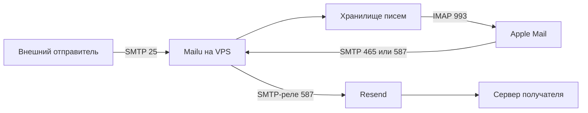
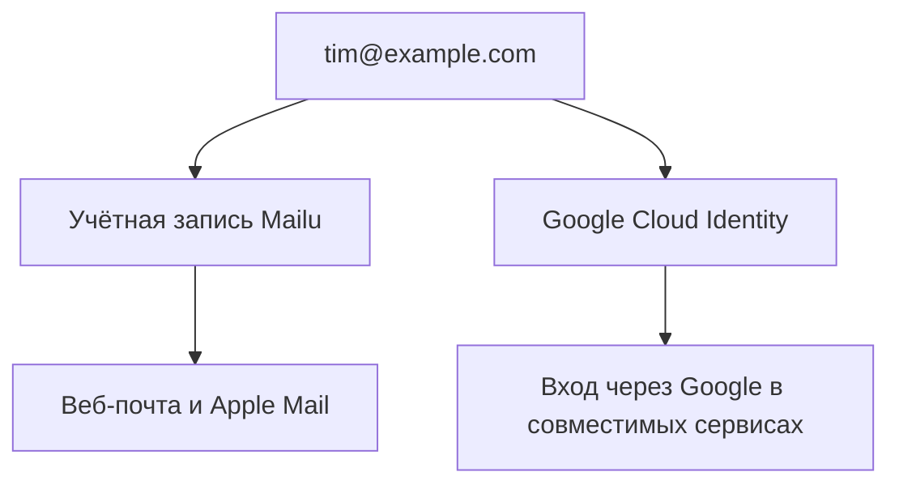

> Мне понадобилась почта на своём домене: получать письма, отвечать с Mac и позже добавить ещё пару человек. VPS у меня уже был, а через Lenny’s Product Pass были доступны Resend и другие сервисы. Хотелось обойтись этим набором, без новой подписки на каждый ящик. В итоге почта заработала на Mailu под Dokploy. Правда, по дороге пришлось разобраться с сетью контейнеров, сертификатами и тем, почему Google-аккаунт с нужным адресом ещё не означает наличие Gmail.

## 1. Сначала я посмотрел на то, что уже оплачено

Домен был зарегистрирован в Name.com. На первых порах им должны были пользоваться два-три человека. Мне нужен был обычный почтовый ящик: входящие, папки, отправленные сообщения и возможность нажать «Ответить». Читать всё это я хотел в штатной Почте на Mac.

В статье я использую `example.com`, адрес `tim@example.com` и условные названия проекта и сервисных файлов. Настоящие названия заменены, а настройки и история исправлений взяты из моей установки.

Часть сервисов у меня появилась через [Lenny’s Product Pass](https://www.lennysproductpass.com/). Для этой задачи были интересны Resend Transactional Pro, Railway Hobby и Google AI Pro. Отдельно уже был оплачен VPS в Hostinger, на котором стоял Dokploy. С этого и начался выбор: можно ли собрать почту из того, к чему у меня уже есть доступ?

На момент написания Product Pass предлагает год доступа к этим трём продуктам. Условия зависят от сервиса и уровня подписки, предложения могут закончиться. Продление рассылки не запускает уже использованный годовой оффер заново. Поэтому дальше речь о моей исходной ситуации; перед повторением стоит посмотреть текущие условия.

В результате обязанности разделились так: Mailu принимает и хранит письма, Resend доставляет исходящие, Cloudflare обслуживает DNS. Google понадобился позже, для отдельной управляемой учётной записи с тем же адресом.

Настраивал я всё вместе с Codex: через браузер работали с панелями, через API и доступ к серверу — с развёртыванием и проверками. Решения по аккаунтам и инфраструктуре принимал я, пароли вводил там, где это требовалось. Установка и описанные проверки выполнены 12 сентября 2026 года.

### Где здесь расходы

Дополнительную подписку на почтовые ящики я не подключал. Но домен, VPS и подписка, дающая доступ к Product Pass, у меня уже были оплачены.

| Компонент                | Для чего использую                  | Расходы в моей схеме                                      |
| ------------------------ | ----------------------------------- | --------------------------------------------------------- |
| Name.com                 | Регистрация и продление домена      | Уже оплаченный домен                                      |
| Cloudflare Free          | Авторитетные DNS-серверы            | Новая подписка не нужна                                   |
| Hostinger VPS            | Хранение почты и работа сервисов    | Уже оплаченный сервер                                     |
| Dokploy                  | Управление контейнерами             | Уже установлен                                            |
| Mailu                    | Почтовый сервер, админка, веб-почта | ПО с открытым исходным кодом                              |
| Resend Transactional Pro | Доставка исходящих                  | Уже активированный оффер Product Pass, лимиты сохраняются |
| Lenny’s Product Pass     | Доступ к предложениям партнёров     | Входит в подходящую платную подписку на рассылку          |
| Cloud Identity Free      | Управляемые Google-аккаунты         | Бесплатная редакция                                       |
| Apple Mail               | Почтовый клиент                     | Уже есть на Mac                                           |

Если начинать без этой инфраструктуры, придётся посчитать сервер, домен, отправку, резервные копии и своё время. У меня исчезла необходимость покупать ещё один сервис для ящиков, зато появилось обязательство обслуживать почтовый сервер.

## 2. Почему я выбрал Mailu, а отправку оставил Resend

В Mailu уже собраны приём SMTP, доступ по IMAP, управление пользователями, фильтрация спама и веб-почта. Можно было собрать Postfix, Dovecot и остальные компоненты отдельно, но тогда мне пришлось бы самому поддерживать больше конфигурации.

В моей установке используется ветка Mailu 2024.06: Roundcube для веб-почты, Rspamd для спама, ClamAV и Oletools для проверок, Unbound как DNS-резолвер. За основу я взял конфигурацию из [официальной инструкции Mailu для Compose](https://mailu.io/2024.06/compose/setup.html).

Resend уже был доступен через Product Pass. Я подключил его как SMTP-реле: клиент авторизуется в Mailu и передаёт письмо, а Mailu отправляет его через Resend. Это позволило использовать существующую инфраструктуру доставки. Проверенные отправители, записи аутентификации, лимиты аккаунта и содержимое писем всё равно остаются моей заботой. Успешная передача по SMTP сама по себе не обещает попадания во входящие.

Исходящие сообщения при этом обрабатывает внешний провайдер. Я храню ящики у себя, но не называю всю цепочку доставки независимой от сторонних сервисов.



Cloudflare Email Routing подошёл бы для пересылки на существующий адрес. Мне же требовался отдельный IMAP-ящик с папками. Приём писем в Resend я тоже оставил выключенным: входящие на мой домен должен обслуживать Mailu.

Railway я рассматривал, но остановился на VPS. На нём я уже управлял сетью, постоянными каталогами и Dokploy. Для почты мне было проще проверить доступность портов и размещение данных именно там. Сравнительных испытаний Mailu на Railway я не проводил.

## 3. Перенёс DNS в Cloudflare

Регистратором остался Name.com. Я заменил nameservers домена на пару, которую выдал Cloudflare, и этого хватило для управления DNS в новой панели. Трансфер регистрации — отдельная операция; к моменту настройки почты он ещё не был завершён.

Порядок действий был такой:

1. Добавил домен в Cloudflare на тарифе Free.
2. Сверил импортированные записи со старой зоной. Сохранил всё, что использовали сайт и другие сервисы.
3. Скопировал два nameserver, назначенных именно моей зоне.
4. Указал их в настройках домена в Name.com.
5. Дождался статуса Active в Cloudflare и проверил публичные ответы DNS.

Nameservers нужно брать из своей панели. Чужая пара из инструкции для вашего домена не подходит.

Если на домене уже включён DNSSEC, при смене DNS-провайдера нужно разобраться и с DS-записью у регистратора. Следуйте [инструкции миграции Cloudflare](https://developers.cloudflare.com/dns/zone-setups/full-setup/setup/): устаревшая DS-запись может сломать разрешение домена, даже если остальные записи выглядят правильно.

```bash
$ dig +short NS example.com
$ dig +short A mail.example.com
$ dig +short MX example.com
```

Во всех командах замените `example.com` на свой домен, а `YOUR_PUBLIC_IPV4` — на публичный IPv4 сервера.

### Записи для входящих писем

| Тип | Имя в Cloudflare | Значение           | Приоритет | Проксирование  |
| --- | ---------------- | ------------------ | --------- | -------------- |
| A   | `mail`           | `YOUR_PUBLIC_IPV4` | —         | DNS only       |
| MX  | `@`              | `mail.example.com` | 10        | Не применяется |

Для `mail` нужно серое облако, **DNS only**. Обычный веб-прокси Cloudflare не пропускает используемые здесь SMTP- и IMAP-подключения. Такая же схема приведена в [документации Cloudflare по почтовым записям](https://developers.cloudflare.com/dns/manage-dns-records/how-to/email-records/).

Сам MX я переключил после запуска Mailu и создания ящика. Если почта уже приходит к другому провайдеру, сначала подготовьте новый сервер. Две MX-записи разных провайдеров не заставляют их хранить одну общую переписку.

## 4. Развернул Mailu через Dokploy

Перед установкой проверил фактические ресурсы VPS: 2 vCPU, 8 ГБ RAM и диск 100 ГБ. На этой машине описанные проверки прошли. Сколько активных пользователей она выдержит, я не измерял.

Кроме свободной памяти и диска нужно проверить занятые порты, существующие Docker-сети и правила хостинга. Входящий TCP-порт 25 должен быть доступен извне. Resend помогает с исходящей доставкой, но чужим почтовым серверам всё равно нужно подключаться к VPS, чтобы передать входящие.

| Порт    | Назначение                                                   |
| ------- | ------------------------------------------------------------ |
| 25/TCP  | Приём от других почтовых серверов                            |
| 465/TCP | Отправка из клиента с авторизацией и TLS с начала соединения |
| 587/TCP | Отправка из клиента с авторизацией и STARTTLS                |
| 993/TCP | IMAP через TLS                                               |
| 443/TCP | Веб-почта и админка через Traefik                            |

Я использовал IPv4. AAAA-запись имеет смысл публиковать после проверки маршрутизации IPv6, файрвола и адресов, на которых слушает Mailu.

### Базовые файлы

Начал с [генератора конфигурации Mailu](https://setup.mailu.io/2024.06/). Он выдаёт Compose-файл и файл переменных. Полную конфигурацию лучше получать для выбранной версии там: небольшие фрагменты ниже показывают мои изменения, но не заменяют весь набор файлов.

В Dokploy я создал отдельный проект для почты, выбрал окружение production и добавил Compose-сервис Mailu. В примерах проект называется **Team Mail**, а каталог постоянных данных — `/opt/team-mail`. Рабочая конфигурация и секретные переменные хранятся в Dokploy.

| Параметр              | Значение в примере    |
| --------------------- | --------------------- |
| Почтовый домен        | `example.com`         |
| Публичное имя сервера | `mail.example.com`    |
| Веб-почта             | Roundcube             |
| Админка               | Включена              |
| Постоянные данные     | `/opt/team-mail`      |
| Внутренняя подсеть    | `192.168.203.0/24`    |
| Адрес резолвера       | `192.168.203.254`     |
| Исходящие             | Resend с авторизацией |

Подсеть не должна пересекаться с существующими сетями Docker и хоста. Адрес Unbound и подсеть в таблице соответствуют моей установке.

Отдельно пришлось убедиться, что переменные попадают внутрь сервисов. Файл Compose `.env` подставляет значения в конфигурацию, но сам по себе не передаёт каждую переменную каждому контейнеру. Ссылки `env_file` в сгенерированном Compose должны указывать на файл, который действительно предоставляет Dokploy. Проверяйте итоговую конфигурацию, не выводя секретные значения в общий лог.

### Где сломалась сеть

Первая попытка запуска упёрлась в обработку Compose со стороны Dokploy. Сохранённая конфигурация выглядела ожидаемо, но фактические подключения контейнеров отличались.

У Unbound пропал фиксированный IP. У Rspamd после отключения от общей сети Dokploy потерялось подключение к внутренней сети default. В результате появились жалобы на DNS, а антиспам ждал доступности admin-сервиса.

Исправление вынес в отдельный `network-override.yml`:

```yaml
services:
  resolver:
    networks:
      default:
        ipv4_address: 192.168.203.254

  antispam:
    networks:
      default: {}
```

Здесь предполагается, что в основном файле уже есть сеть default с нужной подсетью, а сервисы называются `resolver` и `antispam`. Сам по себе этот фрагмент полноценную сеть Mailu не создаёт.

Override лежит рядом с каталогом `code` в структуре Dokploy и подключается при каждом деплое. В поле пользовательской команды у меня указан эквивалент следующей строки:

```text
compose -p YOUR_DOKPLOY_APP_NAME -f docker-compose.yml -f ../network-override.yml up -d --remove-orphans
```

При ручном запуске из того же рабочего каталога команда начинается с `docker compose`. Имя проекта нужно взять у существующего Compose-проекта Dokploy: новое имя приведёт к созданию ещё одного набора контейнеров.

Доступ к общей `dokploy-network` для веб-трафика нужен только front-сервису Mailu. Внутренние компоненты остаются в необходимых им сетях. После исправления я проверил реальные подключения контейнеров: одного взгляда на текст в редакторе уже было недостаточно.

Перед применением такого обхода посмотрите, какие сети получились в вашей установке. Это исправление конкретного поведения, с которым столкнулся я. У разных версий и конфигураций результат может отличаться; отправная точка — [документация Dokploy по Compose](https://docs.dokploy.com/docs/core/docker-compose).

## 5. Развёл HTTPS сайта и TLS почтовых подключений

На VPS уже работал Traefik из Dokploy. Он занимал порты 80 и 443 и обслуживал сайты. Если отдать эти же порты Mailu, получится конфликт.

Я оставил веб-HTTPS на Traefik. Запросы к `mail.example.com` он передаёт на внутренний порт 80 контейнера front. Почтовые порты Mailu слушает напрямую.

После этого понадобилось отдельно передать сертификат в Mailu. Исправная страница веб-почты ещё ничего не говорит о сертификате, который клиент получит на IMAP-порту 993.

Фрагмент переменных для этой схемы:

```dotenv
DOMAIN=example.com
HOSTNAMES=mail.example.com
TLS_FLAVOR=mail
REAL_IP_HEADER=X-Forwarded-For
REAL_IP_FROM=YOUR_TRAEFIK_CONTAINER_IP
```

В `YOUR_TRAEFIK_CONTAINER_IP` подставляется фактический адрес доверенного Traefik в общей Docker-сети. После пересоздания прокси его нужно сверить снова. Доверие ко всем адресам я не включал.

Для сертификата настроил небольшую службу синхронизации:

1. Она читает хранилище ACME-сертификатов Traefik на хосте.
2. Выбирает только сертификат и приватный ключ для почтового имени.
3. Записывает их как `cert.pem` и `key.pem` в каталог сертификатов Mailu. Доступ к приватному ключу ограничен.
4. Перезапускает front только при изменении содержимого сертификата или ключа.
5. Запускается каждый час по таймеру systemd.

В примерах файлы находятся в `/opt/team-mail/certs`, таймер называется `team-mail-cert.timer`. Первичная синхронизация выполняется до подключения клиентов, чтобы Mailu сразу получил сертификат.

Это моя адаптация к существующему Traefik. В [руководстве Mailu по reverse proxy](https://mailu.io/2024.06/reverse.html) описан другой вариант: выпуском сертификатов занимается сам Mailu, а прокси использует proxy protocol. На новом сервере стоит сначала прочитать эту инструкцию и выбрать владельца сертификата. В моей схеме служба копирования стала ещё одним компонентом, за которым нужно следить.

Проверять нужно сами почтовые подключения:

```bash
$ openssl s_client -connect mail.example.com:993 -servername mail.example.com -verify_hostname mail.example.com -verify_return_error </dev/null
$ openssl s_client -connect mail.example.com:465 -servername mail.example.com -verify_hostname mail.example.com -verify_return_error </dev/null
$ openssl s_client -starttls smtp -connect mail.example.com:587 -servername mail.example.com -verify_hostname mail.example.com -verify_return_error </dev/null
```

Ожидается доверенная цепочка и сертификат для указанного имени. Если проверка не проходит, сначала исправляется серверная сторона.

## 6. Подключил Resend и настроил записи отправителя

В Resend добавил домен, перенёс предложенные записи в Cloudflare и дождался подтверждения. Для отправки создал ключ с правами Sending access, ограниченный этим доменом. Здесь я называю его **Team Mail SMTP**.

В закрытой конфигурации Mailu используются такие переменные:

```dotenv
RELAYHOST=[smtp.resend.com]:587
RELAYUSER=resend
RELAYPASSWORD=YOUR_DOMAIN_SCOPED_RESEND_KEY
OUTBOUND_TLS_LEVEL=secure
```

Скобки вокруг имени хоста и порт соответствуют формату Mailu. В качестве пароля используется API-ключ Resend. Он хранится на сервере; в статью, публичный репозиторий и настройки почтового клиента его переносить не нужно. Описание параметров есть у [Mailu](https://mailu.io/2024.06/configuration.html), а параметры SMTP и TLS — у [Resend](https://resend.com/docs/send-with-smtp).

### Итоговый набор почтовых DNS-записей

| Тип | Имя                 | Значение или источник                                 |
| --- | ------------------- | ----------------------------------------------------- |
| A   | `mail`              | IPv4 VPS, DNS only                                    |
| MX  | `@`                 | `mail.example.com`, приоритет 10                      |
| TXT | `resend._domainkey` | Публичный DKIM-ключ из Resend                         |
| MX  | `send`              | `feedback-smtp.eu-west-1.amazonses.com`, приоритет 10 |
| TXT | `send`              | `v=spf1 include:amazonses.com ~all`                   |
| TXT | `@`                 | `v=spf1 include:amazonses.com -all`                   |
| TXT | `_dmarc`            | `v=DMARC1; p=none; rua=mailto:tim@example.com`        |

DKIM-ключ и региональный endpoint нужно брать из своей панели Resend. В таблице показаны роли записей и регион, использованный в моей установке.

Здесь два MX, но они относятся к разным именам. Корневой MX направляет обычную входящую почту в Mailu. MX на `send` обслуживает return-path и обратную связь доставки Resend. Если заменить корневой MX на feedback-endpoint, входящая переписка уйдёт не туда.

SPF проверяется по домену отправителя в SMTP-конверте. Поэтому SPF на `send` выполняет отдельную работу: одна запись в корне её не заменяет. DKIM добавляет доменную подпись, а DMARC проверяет согласованность SPF или DKIM с доменом в видимом поле From.

Корневой SPF в таблице относится к моей схеме отправки. Если у вас есть другие отправители, их нужно учесть в политике соответствующего DNS-имени. На одном имени должна быть одна SPF-запись. Добавление второй строки `v=spf1` рядом с существующей не объединяет их разрешения.

DMARC я начал с `p=none`, чтобы собирать отчёты. Такая политика сама по себе не требует отклонять сообщения или отправлять их в карантин. Прежде чем переходить к enforcement, нужно проверить всех легитимных отправителей.

## 7. Создал ящик и проверил переписку с внешней почтой

Первый ящик получил права администратора Mailu. Для `postmaster@example.com` и `abuse@example.com` я сделал алиасы на него: служебные письма попадают в уже существующий ящик.

| Интерфейс     | Адрес                               |
| ------------- | ----------------------------------- |
| Roundcube     | `https://mail.example.com/webmail/` |
| Админка Mailu | `https://mail.example.com/admin/`   |

Доступы сохранил в 1Password, после чего временный локальный файл с ними был удалён. В документации остались пути, названия служб и инструкции по восстановлению; секреты хранятся отдельно.

Дальше проверил весь путь снаружи VPS. Во [вводной инструкции Mailu](https://mailu.io/2024.06/setup.html) тоже предлагается проверять доставку и аутентификацию через внешний сервис.

| Проверка                                              | Результат моей установки  |
| ----------------------------------------------------- | ------------------------- |
| Вход в Roundcube                                      | Успешно                   |
| IMAP и SMTP с паролем                                 | Успешно                   |
| Письмо с доменного адреса в мой Gmail                 | Попало во входящие        |
| Ответ из Gmail                                        | Пришёл в Mailu            |
| Аутентификация исходящего тестового письма            | SPF, DKIM и DMARC прошли  |
| Попытка отправить внешнему получателю без авторизации | `554 Relay access denied` |
| Письмо несуществующему локальному пользователю        | `550 User unknown`        |
| Существующий сайт на VPS                              | По-прежнему HTTP 200      |

Для повторения отправьте короткое письмо на внешний аккаунт, который контролируете, и ответьте с него. Посмотрите результаты аутентификации полученного письма, затем найдите ответ в веб-почте. Обмен между двумя локальными ящиками не проверяет этот маршрут.

Открытое реле проверяют без авторизации и вне доверенных сетей, используя свои адреса. Если сервер принимает отправку любому внешнему получателю от незнакомого неавторизованного клиента, конфигурацию нужно исправить.

## 8. Добавил Google-аккаунт с тем же адресом

После почты понадобился ещё и управляемый Google-аккаунт. Хотелось использовать `tim@example.com` в сервисах с кнопкой входа через Google, сохранив почту на VPS.

Для этого подошла Cloud Identity Free. Я начал с [инструкции Google по регистрации бесплатной редакции](https://docs.cloud.google.com/identity/docs/how-to/set-up-cloud-identity-admin); она ведёт на [страницу регистрации Identity Basic](https://workspace.google.com/gcpidentity/signup?sku=identitybasic).

Указал данные организации, подходящую страну и отдельный существующий контактный адрес. Первым администратором стал аккаунт с адресом `tim@example.com`. Страну нужно указывать свою, соответствующую организации или деятельности.

В процессе регистрации встречались логотип и формулировки Google Workspace. Я проверил именно название подключённой подписки в Admin Console, а не стал судить по оформлению формы.

Для подтверждения домена Google выдал TXT-значение. Я добавил отдельную запись в корень зоны Cloudflare:

```text
Type: TXT
Name: @
Content: google-site-verification=YOUR_GOOGLE_VERIFICATION_VALUE
```

Затем вернулся в Google и нажал Verify. Домен подтвердился, а в панели появились Cloud Identity Free, статус Active, Free plan и 50 доступных лицензий. Это показания моей организации после регистрации. MX-записи продолжили указывать на Mailu.

### Один адрес, две независимые учётные записи



Пароль Mailu открывает почтовый ящик. Пароль Google или настроенный для него passkey открывает Google-аккаунт. Создание одной записи не создаёт вторую и не синхронизирует их пароли.

В Cloud Identity Free есть базовое управление каталогом пользователей, средства двухэтапной проверки и SAML SSO для совместимых приложений. Gmail в эту редакцию не входит. Автоматическое создание пользователей в сторонних приложениях относится к Premium. Границы перечислены в [сравнении редакций Google](https://docs.cloud.google.com/identity/docs/editions).

Аккаунт и подписка у меня проверены. Вход во все сторонние сервисы я не тестировал и корпоративный SSO с конкретным приложением ещё не связывал. Приложение должно поддерживать нужный способ входа; принудительный корпоративный SSO может требовать отдельного тарифа на его стороне.

Личные подписки Google и уже существующие аккаунты в других сервисах остаются привязаны к прежним учётным записям. Новый адрес не переносит покупки автоматически.

Для следующего сотрудника нужны три отдельных действия: создать ящик в Mailu, создать соответствующего пользователя Google и пригласить его в рабочие сервисы. При отключении сотрудника придётся пройти по тем же системам. Блокировка Google-аккаунта не удаляет почту в Mailu и не обязательно завершает все сессии, которые уже выдал сторонний сервис.

## 9. Подключил ящик к Почте на Mac

В Apple Mail я открыл добавление аккаунта и выбрал **Other Mail Account**. Провайдером для этого ящика служит Mailu, хотя отдельно существует Google-аккаунт с таким же адресом.

Ввёл полный email и пароль Mailu из 1Password. Входящий и исходящий серверы одинаковые: `mail.example.com`.

| Настройка               | Значение                                 |
| ----------------------- | ---------------------------------------- |
| Тип аккаунта            | IMAP                                     |
| Имя пользователя        | Полный адрес, например `tim@example.com` |
| Пароль                  | Пароль ящика Mailu                       |
| Входящий сервер         | `mail.example.com`                       |
| Порт и защита входящих  | 993, SSL/TLS                             |
| Исходящий сервер        | `mail.example.com`                       |
| Порт и защита исходящих | 465, SSL/TLS; либо 587, STARTTLS         |
| Авторизация исходящих   | Обязательна, с теми же данными ящика     |

Отправка из Apple Mail тоже идёт в Mailu. Уже сервер использует свой ключ Resend. Раздавать ключ на весь домен отдельным почтовым клиентам не требуется.

Автоматическая проверка соединения затянулась, и я отдельно проверил сервер. Защищённые порты отвечали; спустя некоторое время добавление аккаунта завершилось. Я оставил включённой только Почту, отключил Заметки, и ящик появился в боковой панели.

Сообщения загрузились. В **Window → Connection Doctor** обе строки, IMAP и SMTP, показали успешное подключение и вход. Дополнительное тестовое письмо именно из Apple Mail на этом этапе я не отправлял: внешний обмен до этого был проверен через веб-почту и сервер.

При создании письма можно выбрать доменный адрес в поле From. Папки ящика доступны и через IMAP, и через Roundcube.

## 10. Что теперь нужно обслуживать

После успешного запуска у меня остались обычные задачи эксплуатации: место на диске, сертификаты, обновления, ошибки доставки и доступы пользователей.

Я записал расположение данных и конфигурации, отдельно отметил сетевой override. Если потерять его при следующем деплое, можно снова получить прежнюю ошибку. В заметках также остались таймер сертификата, адрес доверенного прокси и параметры исходящего реле.

| Симптом                                            | Что проверять сначала                                      |
| -------------------------------------------------- | ---------------------------------------------------------- |
| Не приходит новая почта                            | Корневой MX, A-запись `mail`, входящий порт 25, логи Mailu |
| Приём работает, отправка нет                       | Очередь SMTP, ключ и статус домена Resend, ошибки TLS реле |
| Веб-почта открывается, IMAP ругается на сертификат | Файлы сертификата Mailu и таймер синхронизации             |
| Rspamd ждёт admin                                  | Внутреннюю сеть и Compose override                         |
| Mailu жалуется на резолвер                         | Адрес Unbound и подключение к сети                         |
| Ошибки начались после деплоя                       | Имя Compose-проекта, каталоги, сети и IP прокси            |

В Hostinger уже было включено еженедельное резервное копирование VPS. Отдельные ежедневные копии почты я за время установки не настроил и пробное восстановление не проводил. Если откатиться к недельному снимку, писем, пришедших после его создания, в нём не будет. Интервал копирования нужно выбирать по допустимой потере переписки.

Для восстановления нужны постоянные данные Mailu, Compose-конфигурация, приватные переменные, сетевой override и настройка синхронизации сертификатов. Независимая копия вне VPS и согласованное состояние данных во время копирования тоже относятся к этой задаче.

Пока не проверено восстановление ящика и его папок в отдельном окружении, у меня есть работающая установка и расписание бэкапов. Проверенного времени и порядка восстановления у меня ещё нет.

## Источники

- [Mailu 2024.06: Docker Compose setup](https://mailu.io/2024.06/compose/setup.html)
- [Mailu 2024.06: Configuration reference](https://mailu.io/2024.06/configuration.html)
- [Mailu 2024.06: Reverse proxies](https://mailu.io/2024.06/reverse.html)
- [Mailu 2024.06: Setup and external checks](https://mailu.io/2024.06/setup.html)
- [Cloudflare: Set up a full DNS zone](https://developers.cloudflare.com/dns/zone-setups/full-setup/setup/)
- [Cloudflare: Email DNS records](https://developers.cloudflare.com/dns/manage-dns-records/how-to/email-records/)
- [Dokploy: Docker Compose](https://docs.dokploy.com/docs/core/docker-compose)
- [Resend: Send with SMTP](https://resend.com/docs/send-with-smtp)
- [Resend: Account quotas and limits](https://resend.com/docs/knowledge-base/account-quotas-and-limits)
- [Google: Set up Cloud Identity](https://docs.cloud.google.com/identity/docs/how-to/set-up-cloud-identity-admin)
- [Google: Compare Cloud Identity editions](https://docs.cloud.google.com/identity/docs/editions)
- [Lenny’s Product Pass: partner offers and eligibility](https://www.lennysproductpass.com/)
