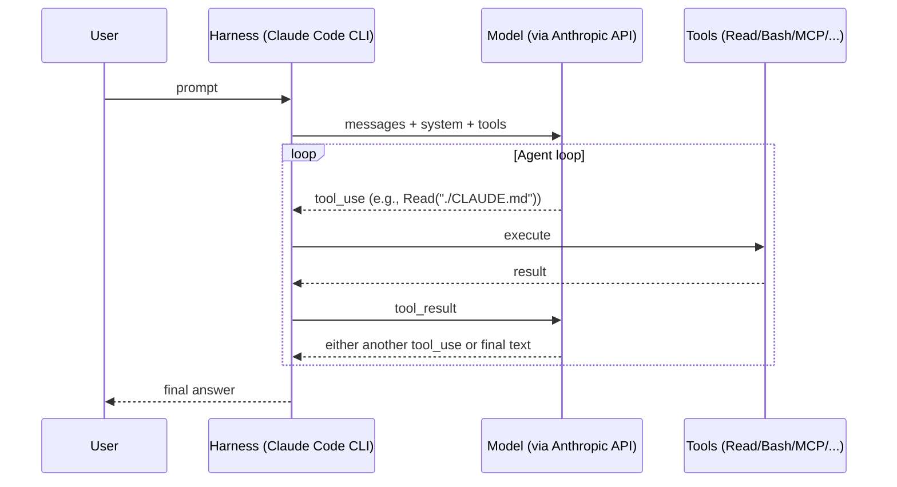
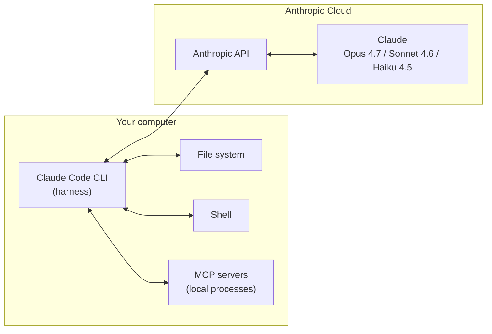
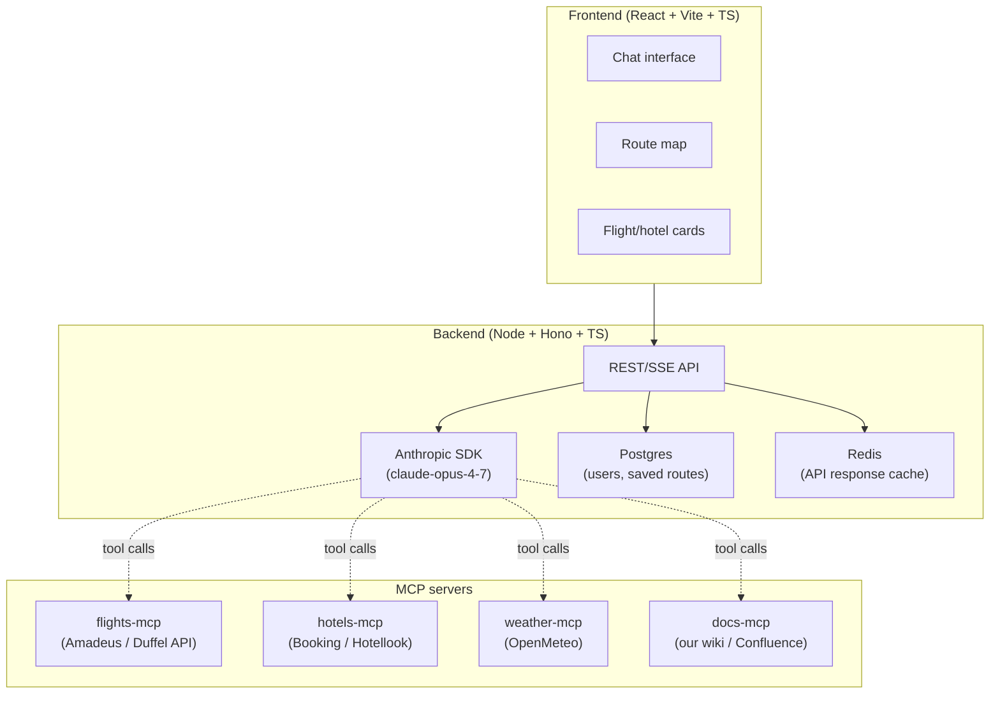

# 01. What is Claude Code: harness, agent loop, and your place in it

> Before diving into `CLAUDE.md`, skills, and subagents, we need to agree on terminology. Otherwise, discussions about "cache" and "context" turn into arguments about different things.

---

## 1.1. Chatbot vs agent

**Chatbot** — this is `model.complete(messages)`. It takes text and returns text. If you want it to read something, you copy the file contents into the prompt yourself.

**Agent** — this is a loop where the model:

1. Receives a user request.
2. Decides which **tool** to call (Read a file, Bash command, code search).
3. Gets the tool result back.
4. Decides: either call another tool or answer the user.

This loop is called the **agent loop**. In Claude Code, it's hardcoded into the CLI (harness).



**Key insight:** the model doesn't do anything on your machine by itself. All actions — reading files, running commands, calling MCPs — are **tool calls** executed by the harness. The model only decides _what_ to call.

---

## 1.2. What is harness

**Harness** — a local program (Claude Code CLI or IDE plugin) that:

|     |     |
| --- | --- |
|     |     |
|     |     |
|     |     |
|     |     |
|     |     |
|     |     |
|     |     |

Harness is **not the model**. The model is in Anthropic's cloud. Harness is the model's eyes, hands, and memory.



⚠️ This is important to understand: when we say "the model read a file" — this is shorthand for "the model made a tool_use Read, the harness read the file, returned the contents in tool_result, the model saw this in the next step". The model has no direct disk access.

---

## 1.3. What really makes up the "context" in each request

Each request to the Anthropic API contains:

```python
messages.create(
  model="claude-opus-4-7",
  system=[                       # ← кэшируемый префикс
    {"type": "text", "text": SYSTEM_PROMPT},                # ~4.2k токенов
    {"type": "text", "text": CLAUDE_MD_CONCAT},             # ваши memory-файлы
    {"type": "text", "text": LOADED_SKILLS},                # SKILL.md тех скиллов, что подгружены
  ],
  tools=[...],                   # ← кэшируемый префикс (определения всех tools)
  messages=[                     # ← НЕ кэшируется целиком, только префикс
    {"role": "user", "content": "..."},
    {"role": "assistant", "content": [{"type": "tool_use", ...}]},
    {"role": "user", "content": [{"type": "tool_result", ...}]},
    ...
  ],
)
```

📘 From docs (`how-claude-code-works`): "Claude's context window holds your conversation history, file contents, command outputs, CLAUDE.md, auto memory, loaded skills, and system instructions".

This is all — one long document for the model. The size of this document is measured in **tokens** and limited by the **context window** (200k for Haiku, 1M for Sonnet/Opus with beta flag).

See details in [02-context-and-cache.md](./02-context-and-cache.md).

---

## 1.4. Versions and editions

As of 23.04.2026, current:

- **Claude Code** v2.1.89 (CLI, IDE plugins)
- **Default models on Anthropic API:**
  - `opus` → Opus 4.7 (released 16.04.2026)
  - `sonnet` → Sonnet 4.6
  - `haiku` → Haiku 4.5
- **On Bedrock/Vertex/Foundry** defaults are shifted: `opus`→4.6, `sonnet`→4.5 (new models arrive later).

🧪 **Agent Teams** — experimental feature, requires `CLAUDE_CODE_EXPERIMENTAL_AGENT_TEAMS=1`. See [10-agent-teams.md](./10-agent-teams.md).

⚠️ **Opus 4.7** has a new tokenizer — on the same texts it uses up to 35% more tokens than Opus 4.6. If you're upgrading from 4.6 — recalculate your limit estimates.

---

## 1.5. End-to-end example: Travel Agent

One project runs through the entire guide — **Travel Agent**. It's an AI service for travel planning:



In each chapter we'll answer the question: **"How do I apply this to Travel Agent?"** — with a concrete config snippet, code, or CLAUDE.md.

In [12-travel-agent-blueprint.md](./12-travel-agent-blueprint.md) the final repository structure with all artifacts comes together.

---

## 1.6. Quick reference of CLI commands used in the guide

|                         |     |     |
| ----------------------- | --- | --- |
| `/context`              |     |     |
| `/compact [hint]`       |     |     |
| `/clear`                |     |     |
| `/model [name]`         |     |     |
| `/agents`               |     |     |
| `/plugin install <ref>` |     |     |
| `/mcp`                  |     |     |
| `/permissions`          |     |     |
| `/release-notes`        |     |     |

---

**Next →** [02. Context window and prompt cache](./02-context-and-cache)
