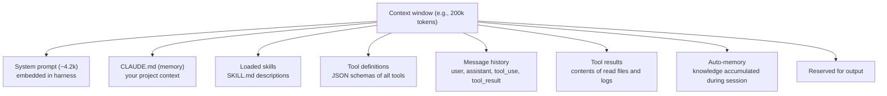
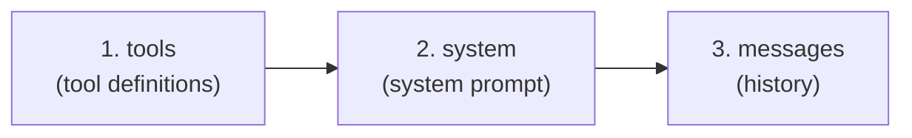
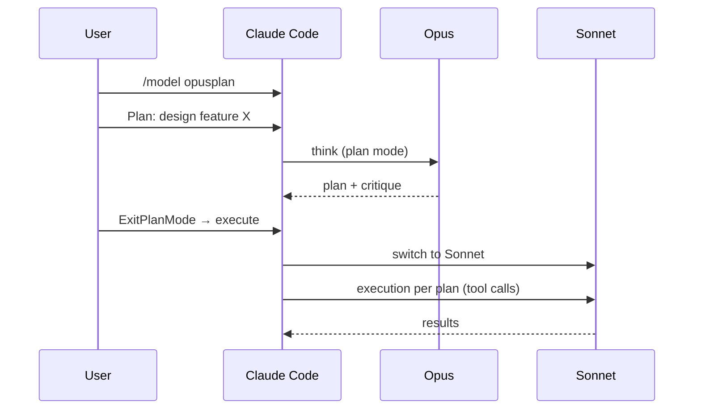
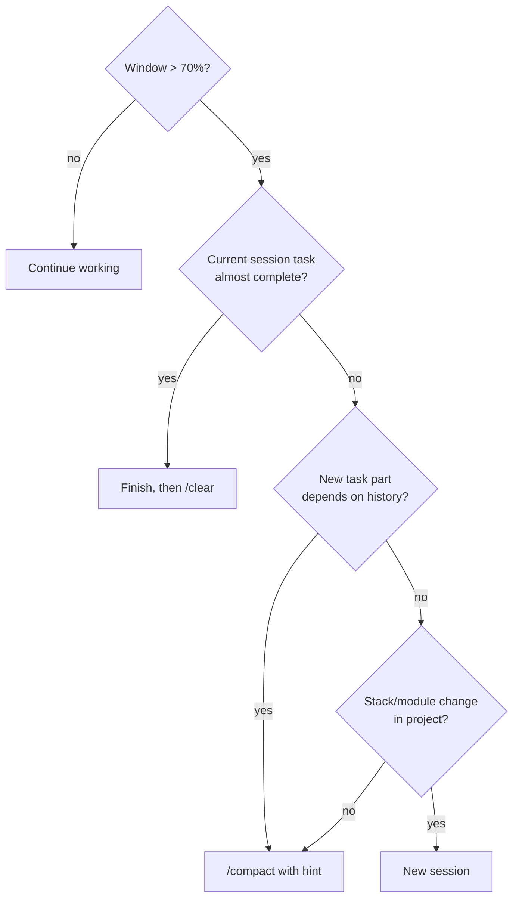

# 02. Context window and prompt cache

> The most common reason "Claude suddenly got dumber" is a full context window. The most common reason "it suddenly got expensive" is a lost cache. This chapter is about how to avoid both.

---

## 2.1. What is a context window

**Context window** — the maximum number of tokens a model sees in a single request. This includes both input (everything you send it) and space for output (what it will write).

Limits as of 23.04.2026:

| Model             | Standard window | 1M mode                   |
| ----------------- | --------------- | ------------------------- |
| Claude Opus 4.7   | 200k            | ✅ via alias `opus[1m]`   |
| Claude Opus 4.6   | 200k            | ✅ via alias `opus[1m]`   |
| Claude Sonnet 4.6 | 200k            | ✅ via alias `sonnet[1m]` |
| Claude Haiku 4.5  | 200k            | ❌                        |

📘 From docs (`model-config#extended-context`): "Opus 4.7, Opus 4.6, and Sonnet 4.6 support a 1 million token context window".

**Enable 1M on Max/Team/Enterprise:**

- Opus 1M is included in the subscription.
- Sonnet 1M comes as extra usage (additional charge).
- Can be disabled via env: `CLAUDE_CODE_DISABLE_1M_CONTEXT=1`.

⚠️ **`opusplan` mode (described below) does NOT support 1M window** — even if you enabled `sonnet[1m]`, the plan phase with Opus will run in standard 200k.

---

## 2.2. What makes up the context

Each request contains several layers. You can see them in the CLI with the `/context` command:



📘 `/context` (from docs `commands`): "Visualize current context usage as a colored grid. Shows optimization suggestions for context-heavy tools, memory bloat, and capacity warnings".

**What usually takes up the most tokens in a real session:**

1. **Tool results** — especially `Read` of large files and `Bash` with verbose output. The leader in "consuming" the window.
2. **Large CLAUDE.md** — if you put README, ADRs, and changelog there "just in case".
3. **Long history** — each previous tool call with its result stays in the window.
4. **Tool definitions** — definitions of all tools (including MCP) can weigh 3-15k. Especially if you have 5+ MCP servers connected with dozens of tools each.

💡 Before a complex task, run `/context` — you'll see the breakdown and understand what to remove.

---

## 2.3. Prompt cache: how it works

The Anthropic API supports **prompt caching** — a mechanism where a repeating **prefix** of a request is not recalculated from scratch.

📘 From platform docs (`build-with-claude/prompt-caching`): "By default, the cache has a 5-minute lifetime". You can explicitly set TTL = **1 hour**, but this costs **2× the input price** on write (read stays the same).

**Cache hierarchy (what counts as a "prefix"):**



If you change an **earlier** layer — all later ones are also recalculated. For example, you add one MCP server → `tools` changes → the entire cache is invalidated.

**How much cache vs no-cache costs** (using Sonnet 4.6 as example, $3 per 1M input tokens):

| Operation                  | Price                            | When                                      |
| -------------------------- | -------------------------------- | ----------------------------------------- |
| Cache **write** (5min TTL) | 1.25 × input = $3.75 / 1M tokens | First request with this prefix            |
| Cache **read** (hit)       | 0.10 × input = $0.30 / 1M tokens | All subsequent within TTL window          |
| Cache **write** (1h TTL)   | 2 × input = $6 / 1M tokens       | If you requested `cache_control.ttl="1h"` |
| No-cache (regular input)   | $3 / 1M tokens                   | If there's no cache at all                |

**Savings calculation in a real Travel Agent session:**

Say system + CLAUDE.md + tools = 25k tokens. You make 10 requests in 5 minutes.

- **Without cache:** 10 × 25k × $3/M = **$0.75**
- **With cache:** 1 × 25k × $3.75/M (write) + 9 × 25k × $0.30/M (read) = $0.094 + $0.067 = **$0.16**

Savings — **80%**. This is why prompt cache is a must-have, and losing it is a real pain.

---

## 2.4. When cache breaks

Cache is invalidated (or expires) when:

| Event                                           | What happens                                                    | How to avoid                                                       |
| ----------------------------------------------- | --------------------------------------------------------------- | ------------------------------------------------------------------ |
| 5 minutes pass without requests                 | TTL expires, next request — write anew                          | Raise TTL to 1h (`cache_control.ttl: "1h"`) or work without pauses |
| You change `tools` (add MCP, plugin)            | Cache invalidated at tools level                                | Don't connect MCP in the middle of a session                       |
| You change `system` (edit CLAUDE.md, add skill) | Cache invalidated at system level                               | Finalize CLAUDE.md before starting work                            |
| You switch models via `/model`                  | Cache is specific to each model                                 | Use `opusplan` (it manages switching) or start a new session       |
| `/clear` or new session                         | Prefix is recreated from scratch                                | This is normal, cache write is a one-time cost                     |
| `/compact`                                      | Old history replaced with summary, then new prefix for messages | Also normal, saves window at cost of one cache write               |

⚠️ **Myth:** "switching models breaks prompt cache forever". Reality: the next request will be a cache miss (one-time more expensive), then everything caches again on the new model.

📘 From docs `/model`: "opens a picker that asks for confirmation when the conversation has prior output, since the next response re-reads the full history without cached context".

That is, model switching is a **one-time** extra charge. Not "forever" and not "impossible". Just account for it.

---

## 2.5. `opusplan` — a feature often wrongly called "Advisor mode"

In the thread we started with, "Advisor mode" was mentioned. In official docs, there's **no such feature**. The real feature is called **`opusplan`**.

📘 From docs `model-config#opusplan-model-setting`: "Special mode that uses `opus` during plan mode, then switches to `sonnet` for execution".

```bash
# В CLI
/model opusplan
```

What happens:



**Limitations of `opusplan`:**

- ⚠️ Opus phase runs in **standard 200k**, even if you enabled `sonnet[1m]`.
- ⚠️ The switch is still two different models → one cache miss at the boundary (but then each model caches separately).
- 💡 Good for architectural tasks: "plan a big refactor" → detailed plan from Opus → cheap execution by Sonnet.

🔧 **For Travel Agent:** enable `opusplan` when rewriting Amadeus integration or changing DB schema. Not needed for routine React component fixes.

---

## 2.6. `/compact`, `/clear`, and auto-compaction

**`/compact [hint]`** — Claude retells the current session in brief form, replacing long history with a summary. `hint` — what to especially preserve.

```bash
/compact "сохрани решения по архитектуре MCP-серверов и текущий список открытых TODO"
```

**`/clear`** — full reset. Keeps only system + CLAUDE.md. Message cache is completely lost.

**Auto-compaction** — the harness itself runs `/compact` when the window fills above a threshold (default ~95%).

📘 Controlled by env variable **`CLAUDE_AUTOCOMPACT_PCT_OVERRIDE`** (1–100). Not `CLAUDE_CODE_AUTO_COMPACT_THRESHOLD`, as sometimes written.

```bash
# В .zshrc / .bashrc
export CLAUDE_AUTOCOMPACT_PCT_OVERRIDE=80   # запускать компакцию на 80% заполнения
```

There's also `CLAUDE_CODE_AUTO_COMPACT_WINDOW` — lets you "lie" to the harness about window size (e.g., on 1M models count as 500k so quality doesn't drop). From practice:

```bash
export CLAUDE_CODE_AUTO_COMPACT_WINDOW=400000  # держать сессию в "виртуальных" 400k
```

⚠️ **Empirical, not from docs:** many practitioners (including the original Twitter thread) claim that "after 300–400k quality drops". Anthropic has no public benchmarks on this, but the symptoms are familiar: the model starts forgetting early decisions, contradicting itself, re-reading the same files. If you hit 400k — seriously think about `/compact` or a new session.

---

## 2.7. When to `/compact`, when to `/clear`, when to start a new session



**Rule of thumb for Travel Agent:**

- Finishing one React component → done → `/clear` before the next.
- Long debugging of one feature (several hours) → `/compact "keep context about SSE stream and current bug"`.
- Switching from frontend to backend → new session (different contexts, little in common).

---

## 2.8. Checklist: "how not to burn the window and cache"

✅ Before a long task, run `/context` — assess starting fill.
✅ Keep CLAUDE.md ≤ 5k tokens. Larger — split into subdirectory CLAUDE.md (see [03](./03-claude-md.md)).
✅ Connect MCP servers before starting work, not in the middle.
✅ If a task lasts > 5 minutes with pauses — ask harness to use 1h TTL (setting flag or passing `cache_control.ttl="1h"` via SDK).
✅ Don't `Read` entire huge files (50k-line logs) — use `Grep` or offset/limit.
✅ After each completed task — `/clear`.
✅ For architectural decisions enable `opusplan` (plan by Opus, execution by Sonnet).
✅ If you catch "model acting dumb after long session" — do `/compact` or start fresh.

⚠️ **What NOT to do:**
❌ Use 1M window "because it exists" — it's both expensive and worse quality.
❌ Connect all MCP servers "just in case" — each bloats `tools`.
❌ Dump entire README, license, changelog, and dependency list into CLAUDE.md.
❌ Switch models mid-complex-task without reason (or use `opusplan`).

---

**Next →** [03. CLAUDE.md: levels, imports, auto-memory](./03-claude-md)
