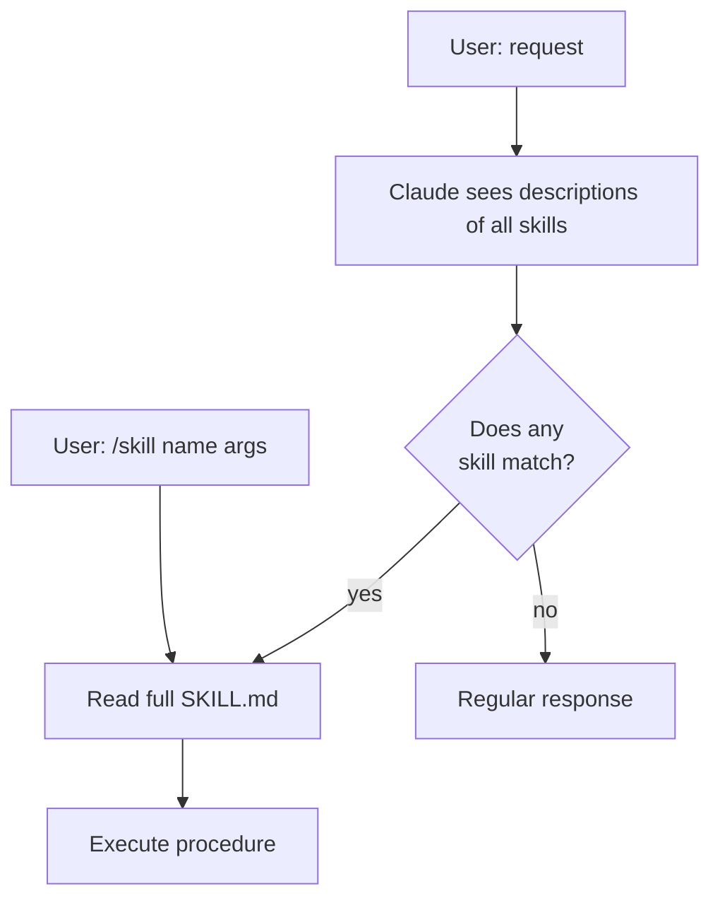
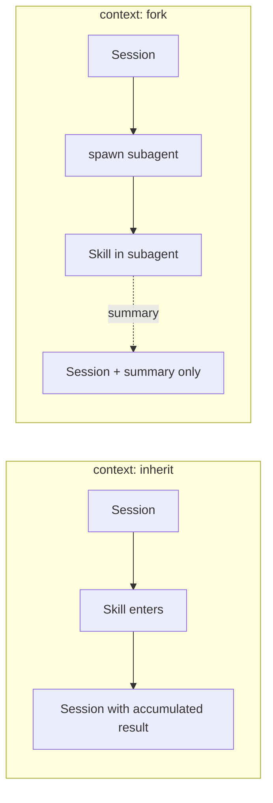
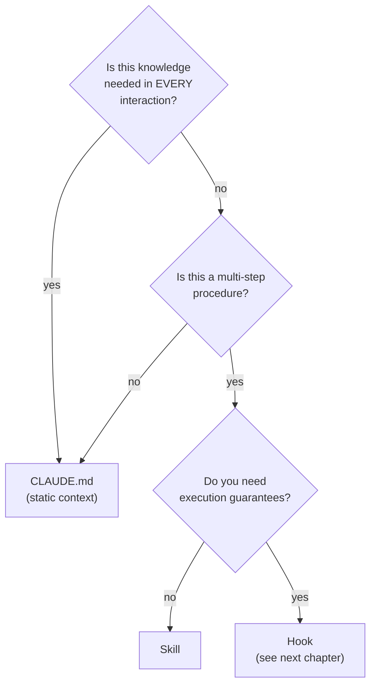

# 04. Skills: SKILL.md, scripts, references

> Skill is a reusable "procedure for the model". Not a gut-feeling "do it this way" in chat, but a playbook fixed in a file that Claude himself chooses when the task matches the description.

---

## 4.1. What it is and how it differs from CLAUDE.md

**CLAUDE.md** — a static prefix that gets injected into every request. "Context always".

**Skill** — a modular playbook that **loads on demand**. When a task matches the skill description, Claude himself decides to "open" it (model-invoked) or you call it explicitly (user-invoked).

This is a fundamental token economy: you might have 50 skills in a project, and only their **brief descriptions** (`name + description` from frontmatter) go into the main context. The SKILL.md itself "unfolds" only when needed.

📘 Skills appeared as a feature of Claude Code and Anthropic API in **October 2025** (`skills-2025-10-02` beta). In **December 2025**, Anthropic published the specification as an open standard.

---

## 4.2. SKILL.md structure

📘 From docs (`skills`): "Every skill needs a `SKILL.md` file with two parts: YAML frontmatter (between `---` markers)... and markdown content".

```markdown
---
name: backend-add-route
description: Add a new Hono route to apps/api with handler, schema validation, and a vitest test. Use when the user asks to "add an endpoint", "create a route", or "expose a new API method".
when_to_use: When user wants a new HTTP endpoint added to apps/api
allowed-tools: ["Read", "Write", "Edit", "Bash", "Grep"]
model: sonnet
effort: medium
---

# Add Hono route

You are creating a new HTTP endpoint in `apps/api`. Follow this procedure exactly.

## Steps

1. Read `apps/api/src/routes/` to understand existing routing pattern.
2. Create `apps/api/src/routes/<feature>.ts` with:
   - zod schema for input/output (or import from `@travel/shared` if exists)
   - Hono handler that uses `c.req.valid("json")`
   - Service-layer call (logic in `apps/api/src/services/`)
3. Register the route in `apps/api/src/index.ts`.
4. Add a vitest in `apps/api/test/routes/<feature>.test.ts`:
   - Happy path
   - One validation error path
5. Run `pnpm typecheck && pnpm test apps/api`.

## Output format

Brief PR-style summary: file list, route signature, test coverage.

## References

- @docs/architecture/api.md
- @scripts/route-template.ts
```

### Key frontmatter fields

| Field                      | Required | What it means                                                                               |
| -------------------------- | -------- | ------------------------------------------------------------------------------------------- |
| `name`                     | ✅       | Unique skill identifier (slug)                                                              |
| `description`              | ✅       | **The most important field.** Claude decides whether to load the skill based on it          |
| `when_to_use`              | —        | Clarification to description, when exactly the skill is appropriate                         |
| `allowed-tools`            | —        | Whitelist of tools for the skill. If set, the skill can only call them                      |
| `disable-model-invocation` | —        | If `true`, the skill is **only** user-invocable (must be called explicitly `/skill <name>`) |
| `user-invocable`           | —        | Can it be called via `/skill name`                                                          |
| `argument-hint`            | —        | Hint for `argument-hint`, displayed in slash-menu                                           |
| `arguments`                | —        | Description of expected arguments (for CLI)                                                 |
| `model`                    | —        | Always execute the skill on this model (`sonnet`, `opus`, `haiku`)                          |
| `effort`                   | —        | `low` / `medium` / `high` — controls the amount of reasoning                                |
| `context`                  | —        | `inherit` (default — in current context) or `fork` (subagent with clean context)            |
| `agent`                    | —        | Run through a specific subagent                                                             |
| `hooks`                    | —        | Inline hooks for the skill                                                                  |
| `paths`                    | —        | Bind activation to specific directories                                                     |
| `shell`                    | —        | Pass shell environment to the skill (env vars)                                              |

---

## 4.3. Where skills live (4 levels)

📘 From docs:

| Level      | Path                                     | When to use                           |
| ---------- | ---------------------------------------- | ------------------------------------- |
| Enterprise | Managed settings (OS-dependent)          | Corporate policies                    |
| Personal   | `~/.claude/skills/<skill-name>/SKILL.md` | Your personal skills for all projects |
| Project    | `.claude/skills/<skill-name>/SKILL.md`   | Skills for current repo (committed)   |
| Plugin     | `<plugin>/skills/<skill-name>/SKILL.md`  | Skills bundled in a plugin            |

**Priority on name collision:** enterprise > personal > project > plugin.

Also: **subdirectory-skills** — `.claude/skills/<name>/SKILL.md` inside project subfolders are picked up automatically. That is, you can keep skills only for frontend in `apps/web/.claude/skills/`.

---

## 4.4. Skill is a directory, not a file

⚠️ **This is a critical correction to a popular myth.**

"Skill is a markdown file" — a simplification that's misleading. Actually, a skill is a **directory** that must contain `SKILL.md`, and optionally can contain anything you need:

```
.claude/skills/release-deploy/
├── SKILL.md                    # обязательно: описание + инструкции
├── scripts/                    # bash/python-скрипты, исполняемые скиллом
│   ├── pre-deploy-check.sh
│   └── rollback.py
├── references/                 # справочные материалы (модель может Read)
│   ├── runbook.md
│   └── env-mapping.md
├── examples/                   # примеры успешных применений
│   ├── 2026-q1-release.md
│   └── hotfix-pattern.md
└── templates/                  # шаблоны файлов
    └── changelog.md.template
```

📘 From docs: "Skills can bundle and run scripts in any language, giving Claude capabilities beyond what's possible in a single prompt".

**So the claim "skill is just a prompt template" ❌ is wrong.** A skill can:

- Run arbitrary scripts via `Bash`.
- Read its own references as context.
- Use its own templates for file generation.
- Have its own `allowed-tools` (for example, everything except `WebFetch`).
- Run a subagent via `context: fork`.

---

## 4.5. Model-invoked vs user-invoked

**Model-invoked** (default). Claude sees **descriptions** of all available skills in the system prompt. When a task matches a skill description — he decides to "open" that skill himself (Read SKILL.md, return its content to himself, execute).

**User-invoked** — explicit call:

```bash
/skill backend-add-route "POST /trips/:id/duplicate"
```

If frontmatter has `disable-model-invocation: true` — the skill becomes **only** user-invocable. Useful for destructive or rare operations ("release", "database migration" — don't let the model run them on its own).



⚠️ **Skills are probabilistic, not deterministic.** Claude _might_ skip a skill even when it's a perfect fit. If you need a guarantee — use hooks (see [05-hooks.md](./05-hooks)).

---

## 4.6. How Claude chooses which skill to load

The decision is made in several steps:

1. **Does the description match the request?** Words, patterns in `description` and `when_to_use` are compared with the user message.
2. **Doesn't contradict other skills?** If multiple match — Claude picks the most specific one.
3. **Not forbidden by `paths`?** If frontmatter specifies `paths: ["apps/api/**"]`, the skill activates only when the model works in these files.

💡 **That's why `description` is the most important part of a skill.** A good description:

✅ Starts with a verb or explicit "Use when...".
✅ Lists trigger words the user might say.
✅ Is concrete: "Add a Hono route to apps/api", not "Help with backend".
✅ Contains example requests.

❌ Vague: "Helps with code".
❌ Too general: "Use this when working on the backend".

---

## 4.7. Full example chain for Travel Agent

A minimal set of skills worth setting up right away:

```
.claude/skills/
├── backend-add-route/SKILL.md
├── backend-add-migration/SKILL.md
├── frontend-add-page/SKILL.md
├── frontend-add-component/SKILL.md
├── mcp-add-server/SKILL.md
├── prepare-pr/SKILL.md
├── debug-mcp-failure/SKILL.md
└── release-deploy/SKILL.md
```

🔧 Example: **`prepare-pr`** — what to do before commit and PR.

```markdown
---
name: prepare-pr
description: Prepare a pull request for review. Run all checks (typecheck, lint, test), update the changelog, and write a PR description. Use when user says "make a PR", "create PR", "open PR", or asks to finalize changes for review.
allowed-tools: ["Read", "Write", "Edit", "Bash", "Grep"]
model: sonnet
effort: medium
---

# Prepare PR

Procedure for finalizing changes and opening a PR in the Travel Agent monorepo.

## Steps

1. Run `git status` and confirm only intended changes are staged.
2. Run `pnpm typecheck` — fix any errors before continuing.
3. Run `pnpm test` — fix any failures.
4. Run `pnpm lint` — auto-fix or report.
5. Update `CHANGELOG.md` with one bullet under `## Unreleased`.
6. Generate PR title (≤ 70 chars, scope prefix: `web:`, `api:`, `mcp-flights:`, etc.).
7. Generate PR body using @templates/pr-body.md.
8. Run `gh pr create --title ... --body ...` with the generated content.

## Verification

After running, confirm:

- typecheck/test/lint passed
- CHANGELOG updated
- PR URL printed

## References

- @templates/pr-body.md
- @scripts/check-staged-files.sh
```

🔧 Example: **`debug-mcp-failure`** — debugging MCP server crashes.

```markdown
---
name: debug-mcp-failure
description: Diagnose why an MCP server (flights/hotels/weather/docs) is failing. Look at recent logs, check transport state, identify if the issue is auth, network, or schema mismatch. Use when user reports "MCP timeout", "flights MCP not responding", or similar.
allowed-tools: ["Read", "Bash", "Grep"]
model: sonnet
effort: high
---

# Debug MCP failure

Systematic diagnosis for MCP server failures.

## Quick triage

1. Identify which MCP server is failing (user mentions name, or check recent /mcp output).
2. Tail logs: `tail -n 200 logs/mcp-<name>.log`.
3. Check process: `ps aux | grep mcp-<name>`.
4. If stdio transport: try restart via `pnpm dev:mcp:<name>`.

## Categories

| Symptom               | Likely cause              | Action                                                            |
| --------------------- | ------------------------- | ----------------------------------------------------------------- |
| Connection refused    | Process not running       | Restart                                                           |
| Timeout > 30s         | Upstream API slow / down  | Check provider status page (link in @references/api-providers.md) |
| Schema mismatch error | Tool definitions diverged | Compare `src/server.ts` exports vs `apps/api/src/mcp/expected.ts` |
| 401/403 in logs       | Token expired             | Refresh in Vault, restart                                         |

## References

- @references/api-providers.md
- @references/mcp-protocol-cheatsheet.md
- @scripts/restart-mcp.sh
```

---

## 4.8. `context: inherit` vs `context: fork`

🧪 The frontmatter field `context` controls _where_ the skill executes:

- **`context: inherit`** (default) — the skill executes in the current session context. Sees the entire history, adds results to the main context.
- **`context: fork`** — the skill runs in a separate subagent. Doesn't inherit history, doesn't see it, the main context receives only the final result.



💡 **When to use `fork`:**

- The skill does heavy scanning (Read dozens of files, Grep across the entire repo) — results shouldn't bloat the main context.
- Destructive operations you want to isolate.
- Reasoning-heavy tasks — you can give them their own effort/model.

**`debug-mcp-failure`** — a candidate for `fork`: it reads many logs, the main context shouldn't be cluttered with them.

```yaml
---
name: debug-mcp-failure
context: fork
agent: explore # запустить через built-in Explore subagent с Haiku
---
```

---

## 4.9. Commands for working with skills

| Command                 | What it does                                         |
| ----------------------- | ---------------------------------------------------- |
| `/skill <name> [args]`  | Explicitly call a user-invocable skill               |
| `/skills`               | List all available skills with descriptions          |
| `Skill` (internal tool) | Used by the model itself, you don't call it directly |

💡 If you want to check how Claude sees your skill — look at `/skills`. If the description looks vague in that list — it will be vague for the model too.

---

## 4.10. When to write a skill vs CLAUDE.md



**Simple rule:**

- Project fact → CLAUDE.md
- Procedure "user says X — do Y, Z, W" → Skill
- "Always after X do Y" → Hook

---

## 4.11. Antipatterns

❌ **Skill with vague description** (`"Use this for any work"`). → Never activates or activates in the wrong place.

❌ **Skill duplicating CLAUDE.md.** If knowledge is needed always — it's CLAUDE.md.

❌ **Skill without `allowed-tools` for destructive operations.** If a skill can delete data — restrict the set of tools.

❌ **Huge SKILL.md with 2000 lines.** Break it into references and link via `@`.

❌ **Ignoring `context: fork` for browse-heavy skills.** You're unnecessarily bloating the main context.

❌ **Using skills for guarantees.** If you need "always run linter after Edit" — that's not a skill, that's a hook.

---

**Next →** [05. Hooks: 30+ events, exit codes, JSON protocol](./05-hooks)
