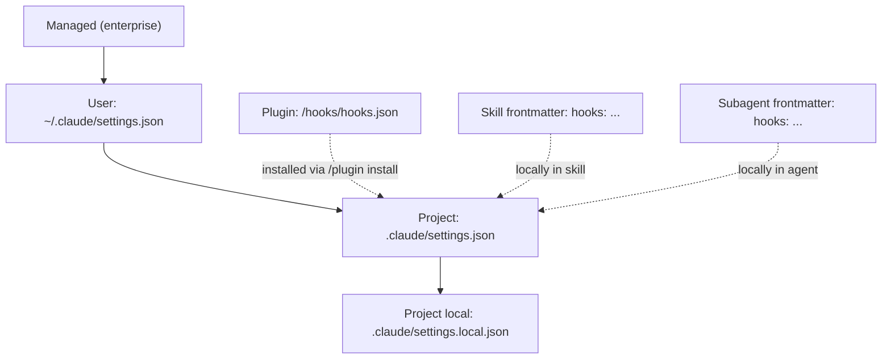

> Hooks are git hooks, but for Claude Code. Points in the lifecycle where the harness executes your script. If a skill is a model recommendation, a hook is a mandatory harness step that **is guaranteed** to happen.

---

## 5.1. Why you need hooks

📘 From docs (`hooks-guide`): «Hooks provide deterministic control over Claude Code's behavior, ensuring certain actions always happen rather than relying on the LLM to choose to run them».

Comparison of "the same thing via skill vs hook":

| Task                       | Via skill                                                    | Via hook                                                    |
| -------------------------- | ------------------------------------------------------------ | ----------------------------------------------------------- |
| Run linter after edit      | Skill "after Edit run `pnpm lint`", description in CLAUDE.md | `PostToolUse` matcher: `Edit\|Write` → bash command         |
| Forbid editing `secrets/`  | "Don't touch secrets folder" in CLAUDE.md                    | `PreToolUse` matcher: `Edit\|Write` → exit 2 on `secrets/*` |
| Sync with CI after Stop    | Skill "after task run CI"                                    | `Stop` hook → bash "push branch + open PR"                  |
| Notify Slack on completion | This isn't a skill at all, it's an operation                 | `Stop` or `Notification` hook → curl webhook                |

⚠️ The model _can_ ignore skills. Hooks — no. This is both a plus and a minus: hooks give you iron discipline, but also slow things down if you attach them to every little thing.

---

## 5.2. Where hooks are defined



All sources are merged. If multiple hooks match the same event — they all execute **in registration order**.

---

## 5.3. Complete list of events

📘 The actual list in Claude Code v2.1.89 is much richer than what most tutorials mention:

| Event                 | When it fires                                           |
| --------------------- | ------------------------------------------------------- |
| `SessionStart`        | On session start                                        |
| `SessionEnd`          | On session end                                          |
| `UserPromptSubmit`    | User submitted a message                                |
| `UserPromptExpansion` | Shortcut expansion in prompt                            |
| `InstructionsLoaded`  | After loading CLAUDE.md / skills / agents               |
| `PreToolUse`          | Before calling any tool                                 |
| `PostToolUse`         | After successful tool call                              |
| `PostToolUseFailure`  | After failed tool call                                  |
| `PermissionRequest`   | When tool requires confirmation                         |
| `PermissionDenied`    | When user denied                                        |
| `SubagentStart`       | Before subagent launch                                  |
| `SubagentStop`        | After subagent completion                               |
| `TaskCreated`         | Task created (TaskCreate)                               |
| `TaskCompleted`       | Task completed                                          |
| `TeammateIdle`        | Teammate in Agent Team idle                             |
| `Notification`        | System notification                                     |
| `Stop`                | End of "model ↔ tools" loop (model finished responding) |
| `StopFailure`         | Session ended with error                                |
| `PreCompact`          | Before auto-compaction                                  |
| `PostCompact`         | After auto-compaction                                   |
| `ConfigChange`        | Configuration changed                                   |
| `CwdChanged`          | Working directory changed                               |
| `FileChanged`         | File changed (filesystem watch)                         |
| `WorktreeCreate`      | Git worktree created                                    |
| `WorktreeRemove`      | Git worktree removed                                    |
| `Elicitation`         | MCP elicitation request                                 |
| `ElicitationResult`   | MCP elicitation response                                |

---

## 5.4. Structure of hooks.json

📘 Canonical example from docs:

```json
{
  "hooks": {
    "PreToolUse": [
      {
        "matcher": "Write|Edit|MultiEdit",
        "hooks": [
          {
            "type": "command",
            "command": "bash ${CLAUDE_PLUGIN_ROOT}/scripts/scan-secrets.sh",
            "timeout": 30
          }
        ]
      },
      {
        "matcher": "Bash",
        "hooks": [
          {
            "type": "prompt",
            "prompt": "Evaluate if this bash command is safe for production. Check destructive ops, missing safeguards, security issues.",
            "timeout": 20
          }
        ]
      }
    ],
    "PostToolUse": [
      {
        "matcher": "Edit|Write",
        "hooks": [
          {
            "type": "command",
            "command": "bash ${CLAUDE_PLUGIN_ROOT}/scripts/run-linter.sh"
          }
        ]
      }
    ],
    "Stop": [
      {
        "matcher": ".*",
        "hooks": [
          {
            "type": "command",
            "command": "bash ${CLAUDE_PLUGIN_ROOT}/scripts/notify-team.sh",
            "timeout": 30
          }
        ]
      }
    ]
  }
}
```

**Fields:**

- **`matcher`** — regex by tool name (for `PreToolUse`/`PostToolUse`) or pattern by context. `.*` or `*` means "everything".
- **`type`** — `command` (run shell command) or `prompt` (separate model prompt as "second opinion").
- **`command`** / **`prompt`** — what to execute.
- **`timeout`** — seconds; if hook doesn't fit, it fails.

---

## 5.5. Type `command`: what the script receives and what it should return

**Stdin:** JSON with event information:

```json
{
  "session_id": "...",
  "transcript_path": "/tmp/claude-session-xxx/transcript.jsonl",
  "cwd": "/home/me/travel-agent",
  "tool_name": "Edit",
  "tool_input": {
    "file_path": "apps/api/src/routes/trips.ts",
    "old_string": "...",
    "new_string": "..."
  }
}
```

**Stdout:** normal output. For `PostToolUse` — can be feedback that gets added to the model's context.

**Exit code:**

| Code  | Effect                                                                                                   |
| ----- | -------------------------------------------------------------------------------------------------------- |
| `0`   | OK, continue                                                                                             |
| `2`   | Block action. **Stderr is shown to the model** as the reason. Used for `PreToolUse` to forbid tool call. |
| other | Hook failed, harness will report error, but action continues                                             |

**JSON protocol** (for fine control):

```json
{
  "hookSpecificOutput": {
    "permissionDecision": "deny",
    "permissionDecisionReason": "File matches deny rule for secrets/*"
  }
}
```

Possible `permissionDecision` values: `allow`, `deny`, `ask`, `defer`.

⚠️ `PreToolUse` hook with `deny` blocks action **even in `bypassPermissions` mode**. This is not "you can bypass it if you really want" — this is the final gate.

---

## 5.6. Type `prompt`: hook as a separate model request

📘 Example:

```json
{
  "type": "prompt",
  "prompt": "Analyze edit result for potential issues: syntax errors, security vulnerabilities, breaking changes. Provide feedback.",
  "timeout": 20
}
```

What happens: the harness makes an additional request to the model with this prompt and tool result. The response is returned to the main session as "inspector says ...".

💡 This is convenient for AI second opinion. Downside: each such hook costs additional tokens.

---

## 5.7. Concrete examples for Travel Agent

### 5.7.1. Auto-format after code edit

🔧 `.claude/settings.json`:

```json
{
  "hooks": {
    "PostToolUse": [
      {
        "matcher": "Edit|Write",
        "hooks": [
          {
            "type": "command",
            "command": "bash .claude/hooks/format.sh"
          }
        ]
      }
    ]
  }
}
```

🔧 `.claude/hooks/format.sh`:

```bash
#!/bin/bash
input=$(cat)
file_path=$(echo "$input" | jq -r '.tool_input.file_path')

# Только TS/TSX/JS/JSON
if [[ "$file_path" =~ \.(ts|tsx|js|jsx|json|md)$ ]]; then
  pnpm prettier --write "$file_path" 2>&1 || true
  if [[ "$file_path" =~ \.(ts|tsx)$ ]]; then
    pnpm eslint --fix "$file_path" 2>&1 || true
  fi
fi
```

Effect: after each code edit by Claude, prettier/eslint runs. The model can't "forget" — it's guaranteed.

### 5.7.2. Forbid editing secrets

🔧 `.claude/settings.json`:

```json
{
  "hooks": {
    "PreToolUse": [
      {
        "matcher": "Edit|Write|MultiEdit",
        "hooks": [
          {
            "type": "command",
            "command": "bash .claude/hooks/no-secrets.sh"
          }
        ]
      }
    ]
  }
}
```

🔧 `.claude/hooks/no-secrets.sh`:

```bash
#!/bin/bash
input=$(cat)
file_path=$(echo "$input" | jq -r '.tool_input.file_path')

case "$file_path" in
  *.env*|*secrets/*|*credentials*|*.pem|*.key)
    echo "Edits to secret files are blocked by policy: $file_path" >&2
    exit 2
    ;;
esac
exit 0
```

Effect: the model will never edit `.env`, secrets, keys. Even if it really wants to.

### 5.7.3. Sanity-check Bash commands

🔧 `.claude/settings.json`:

```json
{
  "hooks": {
    "PreToolUse": [
      {
        "matcher": "Bash",
        "hooks": [
          {
            "type": "command",
            "command": "bash .claude/hooks/bash-guard.sh"
          }
        ]
      }
    ]
  }
}
```

🔧 `.claude/hooks/bash-guard.sh`:

```bash
#!/bin/bash
input=$(cat)
cmd=$(echo "$input" | jq -r '.tool_input.command')

# Запрет деструктивных команд
if echo "$cmd" | grep -qE '(rm -rf /|:(){ :|:& };:|dd if=/dev/zero|mkfs\.|drop database)'; then
  echo "Destructive command blocked: $cmd" >&2
  exit 2
fi

# Предупреждение про прод-окружение
if echo "$cmd" | grep -q 'NODE_ENV=production'; then
  echo "Warning: command uses production env" >&2
  # exit 0 — пропускаем, но в логах остаётся
fi

exit 0
```

### 5.7.4. Slack notification at end of session

🔧 `.claude/settings.json`:

```json
{
  "hooks": {
    "Stop": [
      {
        "matcher": ".*",
        "hooks": [
          {
            "type": "command",
            "command": "bash .claude/hooks/notify-stop.sh",
            "timeout": 10
          }
        ]
      }
    ]
  }
}
```

🔧 `.claude/hooks/notify-stop.sh`:

```bash
#!/bin/bash
[[ -z "$SLACK_WEBHOOK_URL" ]] && exit 0

input=$(cat)
session_id=$(echo "$input" | jq -r '.session_id')
cwd=$(echo "$input" | jq -r '.cwd')

curl -s -X POST -H 'Content-type: application/json' \
  --data "{\"text\":\"Claude session done in \`$cwd\` (id: $session_id)\"}" \
  "$SLACK_WEBHOOK_URL" > /dev/null
```

### 5.7.5. Auto-commit checkpoints

🔧 Script that after every 3 successful PostToolUse does `git add . && git commit -m "wip: claude checkpoint"`:

```bash
#!/bin/bash
COUNT_FILE="/tmp/claude-checkpoint-$(echo "$CLAUDE_SESSION_ID" | head -c 8)"
count=$(cat "$COUNT_FILE" 2>/dev/null || echo 0)
count=$((count + 1))
echo "$count" > "$COUNT_FILE"

if (( count % 3 == 0 )); then
  git add -A
  git commit -m "wip: claude checkpoint #$count" --no-verify > /dev/null 2>&1 || true
fi
```

💡 Useful for long sessions — you have something to roll back to.

---

## 5.8. Hooks inside plugin

📘 When packaging a hook in a plugin — add `hooks/hooks.json` to the plugin:

```
travel-agent-plugin/
├── .claude-plugin/plugin.json
├── hooks/
│   ├── hooks.json              # маппинг событий
│   └── scripts/
│       ├── format.sh
│       └── no-secrets.sh
└── ...
```

In hooks.json inside the plugin, use `${CLAUDE_PLUGIN_ROOT}` — this variable points to the root of the installed plugin:

```json
{
  "PostToolUse": [
    {
      "matcher": "Edit|Write",
      "hooks": [
        {
          "type": "command",
          "command": "bash ${CLAUDE_PLUGIN_ROOT}/hooks/scripts/format.sh"
        }
      ]
    }
  ]
}
```

See chapter [07-plugins.md](./07-plugins) for the full plugin structure.

---

## 5.9. Hooks vs slash-commands vs MCP tools

| Mechanism           | When invoked         | Who invokes           |
| ------------------- | -------------------- | --------------------- |
| Hook                | On lifecycle event   | Harness automatically |
| Slash-command       | User `/cmd`          | User manually         |
| Skill               | By description match | Model decides         |
| Tool (MCP/built-in) | By model decision    | Model in agent loop   |

Hooks are the only one of these mechanisms that **is guaranteed** to fire without the model's involvement.

---

## 5.10. How to debug hooks

```bash
# Включить debug-логи hooks
export CLAUDE_HOOKS_DEBUG=1
claude

# Логи hooks
tail -f ~/.claude/logs/hooks.log
```

💡 In a hook's bash script, it's useful to duplicate stdin to a file for inspection:

```bash
#!/bin/bash
input=$(cat)
echo "$input" >> /tmp/claude-hook-input.jsonl
# ...
```

---

## 5.11. Antipatterns

❌ **Hook on every `Read`.** You attached a hook to `PostToolUse: .*` and now after every file read the shell gets called. Slowdown.

❌ **Hook without timeout.** Your script hangs — the session hangs.

❌ **`exit 2` without stderr.** Hook blocks action, but the model doesn't understand why. Always write the reason to `stderr`.

❌ **Long operations in hook.** Hook on `Stop` that runs a 5-minute deploy — that's anti-UX. Run in background (`&`) or via queue.

❌ **Hook breaking permissions.** `PreToolUse` with `permissionDecision: allow` — bypasses all checks. Dangerous.

❌ **Duplicating skills with hooks.** If a procedure is multi-step and situation-dependent — that's a skill. Hook is for atomic "always do this".

---

**Next →** [06. MCP servers: stdio/SSE/HTTP, scope](./06-mcp)
