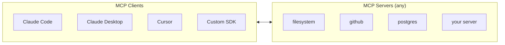
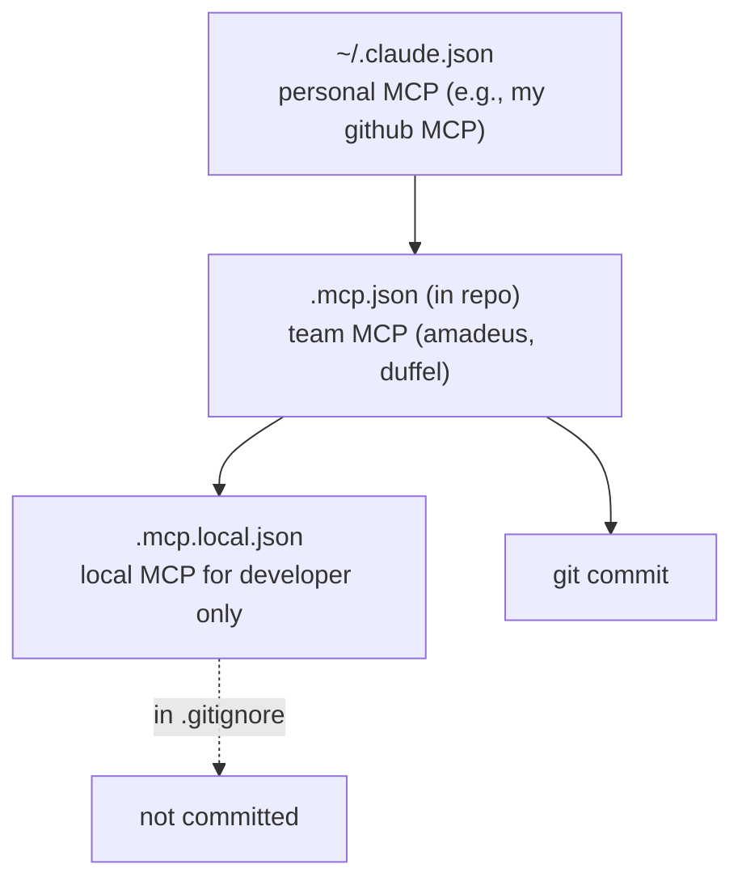

# 06. MCP Servers

> MCP (Model Context Protocol) is an open protocol for connecting external tools, resources, and data to Claude Code. Claude Code can communicate with MCP servers over three transports: stdio, SSE, and HTTP. For Travel Agent, this is a critical part of the architecture — all integrations with airlines/hotels/weather are implemented as MCP servers.

---

## 6.1. What is MCP (in a nutshell)

MCP is the "USB-C for AI integrations." Instead of inventing functions for a specific model each time, you write an MCP server once, and any MCP client can use it: Claude Code, Claude Desktop, Cursor, Continue, your own SDK agent, etc.



**MCP server** exports:

- **Tools** — functions that the model can call (`book_flight`, `search_hotels`).
- **Resources** — data that the model can read (`config://app/settings`, `db://users/123`).
- **Prompts** — pre-configured prompt templates (`/prompts/summarize_trip`).
- **Elicitation** — server-initiated dialogs with the user.

Claude Code consumes **tools** and **resources** most actively. Prompts become available as slash commands.

---

## 6.2. Transports

MCP supports three ways to communicate:

| Transport | When to use                                       | Pros                     | Cons                    |
| --------- | ------------------------------------------------- | ------------------------ | ----------------------- |
| **stdio** | Local server launched by harness as child process | Simple, fast, no network | Local only              |
| **SSE**   | Remote server, persistent connection              | Streaming, remote access | More complex deployment |
| **HTTP**  | Remote server, request/response                   | Stateless, scales easily | No server-initiated     |

For Travel Agent in local development — **stdio**. For production multi-tenant SaaS — **HTTP** through your API gateway.

---

## 6.3. Connecting MCP in Claude Code

MCP server configuration is stored in `.mcp.json` (project) or `~/.claude.json` (user).

🔧 `.mcp.json` for Travel Agent:

```json
{
  "mcpServers": {
    "flights": {
      "type": "stdio",
      "command": "node",
      "args": ["packages/mcp-flights/dist/server.js"],
      "env": {
        "AMADEUS_API_KEY": "${AMADEUS_API_KEY}",
        "AMADEUS_API_SECRET": "${AMADEUS_API_SECRET}"
      }
    },
    "hotels": {
      "type": "stdio",
      "command": "node",
      "args": ["packages/mcp-hotels/dist/server.js"],
      "env": {
        "DUFFEL_API_KEY": "${DUFFEL_API_KEY}"
      }
    },
    "weather": {
      "type": "stdio",
      "command": "node",
      "args": ["packages/mcp-weather/dist/server.js"]
    },
    "docs": {
      "type": "http",
      "url": "https://docs-mcp.internal.travel-agent.local/mcp",
      "headers": {
        "Authorization": "Bearer ${INTERNAL_DOCS_TOKEN}"
      }
    }
  }
}
```

After that:

- `claude` will pick up the config on startup,
- show in `/mcp` the list of connected servers and their tools,
- the model will be able to call these tools as usual.

---

## 6.4. Scope: project / user / local



💡 The logic is the same as CLAUDE.md: shared in the repo, personal — in local or user.

---

## 6.5. Your own MCP server on Node (TypeScript)

The simplest implementation is through the official SDK `@modelcontextprotocol/sdk`.

🔧 `packages/mcp-flights/src/server.ts`:

```typescript
import { Server } from "@modelcontextprotocol/sdk/server/index.js";
import { StdioServerTransport } from "@modelcontextprotocol/sdk/server/stdio.js";
import { CallToolRequestSchema, ListToolsRequestSchema } from "@modelcontextprotocol/sdk/types.js";
import { z } from "zod";
import { searchFlights, bookFlight } from "./amadeus.js";

// Schemas
const SearchInput = z.object({
  origin: z.string().length(3), // IATA код
  destination: z.string().length(3),
  date: z.string().regex(/^\d{4}-\d{2}-\d{2}$/),
  adults: z.number().int().min(1).max(9).default(1),
});

const BookInput = z.object({
  offerId: z.string(),
  passengers: z.array(
    z.object({
      firstName: z.string(),
      lastName: z.string(),
      dob: z.string().regex(/^\d{4}-\d{2}-\d{2}$/),
    }),
  ),
});

const server = new Server(
  { name: "travel-agent-flights", version: "1.0.0" },
  { capabilities: { tools: {} } },
);

// Объявление tools
server.setRequestHandler(ListToolsRequestSchema, async () => ({
  tools: [
    {
      name: "flights_search",
      description:
        "Search for flights between two airports on a given date. Returns up to 10 offers with price, airline, duration. Use IATA codes (e.g., JFK, LHR).",
      inputSchema: SearchInput.toJsonSchema?.() ?? {
        type: "object",
        properties: {
          origin: { type: "string", description: "IATA airport code" },
          destination: { type: "string", description: "IATA airport code" },
          date: { type: "string", description: "ISO date YYYY-MM-DD" },
          adults: { type: "number", default: 1 },
        },
        required: ["origin", "destination", "date"],
      },
    },
    {
      name: "flights_book",
      description:
        "Book a flight by offerId returned from flights_search. Confirms within 30 seconds.",
      inputSchema: {
        type: "object",
        properties: {
          offerId: { type: "string" },
          passengers: { type: "array" },
        },
        required: ["offerId", "passengers"],
      },
    },
  ],
}));

// Реализация
server.setRequestHandler(CallToolRequestSchema, async (req) => {
  if (req.params.name === "flights_search") {
    const args = SearchInput.parse(req.params.arguments);
    const offers = await searchFlights(args);
    return {
      content: [{ type: "text", text: JSON.stringify(offers, null, 2) }],
    };
  }
  if (req.params.name === "flights_book") {
    const args = BookInput.parse(req.params.arguments);
    const booking = await bookFlight(args);
    return {
      content: [{ type: "text", text: JSON.stringify(booking, null, 2) }],
    };
  }
  throw new Error(`Unknown tool: ${req.params.name}`);
});

const transport = new StdioServerTransport();
await server.connect(transport);
```

Compiled → placed in `packages/mcp-flights/dist/` → connected in `.mcp.json` → done.

⚠️ **Tool descriptions are half the battle.** The model only sees `name + description + inputSchema`. If the description is vague — the model won't understand when and why to call it. A good description includes:

- What it does.
- When to apply (keywords).
- What it returns (format, volume).
- Edge cases (input validation).

---

## 6.6. How Claude sees your MCP tools

When the `flights` MCP server is connected, a tool definitions block appears in the system prompt with names:

- `mcp__flights__flights_search`
- `mcp__flights__flights_book`

(The prefix `mcp__<server-name>__<tool-name>` is a standard convention.)

In the CLI you can see what tools are provided:

```bash
/mcp
```

This will show: `flights` (status: ✅), tools: 2, resources: 0.

---

## 6.7. MCP inside Anthropic SDK (for Travel Agent backend)

Travel Agent has its own Node backend (`apps/api`) that communicates with the model through the Anthropic SDK. To reuse the same MCP servers as in Claude Code, you need to connect them manually:

🔧 `apps/api/src/agent/index.ts`:

```typescript
import Anthropic from "@anthropic-ai/sdk";
import { spawn } from "node:child_process";
import { ClientSession } from "@modelcontextprotocol/sdk/client/session.js";
import { StdioClientTransport } from "@modelcontextprotocol/sdk/client/stdio.js";

const anthropic = new Anthropic({ apiKey: process.env.ANTHROPIC_API_KEY });

// 1. Поднимаем MCP-клиенты
async function connectMcp(name: string, command: string, args: string[]) {
  const transport = new StdioClientTransport({
    command,
    args,
    env: process.env as Record<string, string>,
  });
  const session = new ClientSession(transport);
  await session.initialize();
  return session;
}

const flights = await connectMcp("flights", "node", ["packages/mcp-flights/dist/server.js"]);
const hotels = await connectMcp("hotels", "node", ["packages/mcp-hotels/dist/server.js"]);

// 2. Преобразуем MCP-tools в Anthropic-tools
async function buildTools() {
  const flightsTools = await flights.listTools();
  const hotelsTools = await hotels.listTools();
  return [
    ...flightsTools.tools.map((t) => ({
      name: `mcp__flights__${t.name}`,
      description: t.description,
      input_schema: t.inputSchema,
    })),
    ...hotelsTools.tools.map((t) => ({
      name: `mcp__hotels__${t.name}`,
      description: t.description,
      input_schema: t.inputSchema,
    })),
  ];
}

// 3. Agent loop
export async function runAgent(userMessage: string) {
  const tools = await buildTools();
  const messages: Anthropic.MessageParam[] = [{ role: "user", content: userMessage }];

  while (true) {
    const response = await anthropic.messages.create({
      model: "claude-opus-4-7",
      max_tokens: 4096,
      system: [{ type: "text", text: SYSTEM_PROMPT, cache_control: { type: "ephemeral" } }],
      tools,
      messages,
    });

    if (response.stop_reason === "end_turn") {
      return response.content;
    }

    if (response.stop_reason === "tool_use") {
      messages.push({ role: "assistant", content: response.content });
      const toolResults: Anthropic.ToolResultBlockParam[] = [];

      for (const block of response.content) {
        if (block.type !== "tool_use") continue;
        const [, server, toolName] = block.name.split("__");
        const session = server === "flights" ? flights : hotels;
        const result = await session.callTool({
          name: toolName,
          arguments: block.input as Record<string, unknown>,
        });
        toolResults.push({
          type: "tool_result",
          tool_use_id: block.id,
          content: result.content,
        });
      }

      messages.push({ role: "user", content: toolResults });
    }
  }
}
```

📝 This is a simplified version. In a real backend, add: streaming, error handling per tool, iteration limits, prompt caching markers, telemetry.

---

## 6.8. Resources: reading data through MCP

Besides tools, MCP can expose **resources** — static or dynamic data:

```typescript
server.setRequestHandler(ListResourcesRequestSchema, async () => ({
  resources: [
    { uri: "flights://airports/list", name: "All IATA airports", mimeType: "application/json" },
    { uri: "flights://current-deals", name: "Today's deals", mimeType: "application/json" },
  ],
}));

server.setRequestHandler(ReadResourceRequestSchema, async (req) => {
  if (req.params.uri === "flights://airports/list") {
    const airports = await fetchAirportsList();
    return {
      contents: [
        {
          uri: req.params.uri,
          mimeType: "application/json",
          text: JSON.stringify(airports),
        },
      ],
    };
  }
  // ...
});
```

In Claude Code, resources become available through `@`-mention in the prompt: `@flights:airports/list`.

---

## 6.9. MCP Security

⚠️ MCP server runs on your machine (for stdio) or on a trusted server (for HTTP/SSE). It has full access to what you give it (env, network access).

**Security checklist:**

✅ Never connect MCP servers from untrusted sources. This is equivalent to `npm install random-package`.
✅ Use `.mcp.local.json` for servers with real keys (don't commit).
✅ For HTTP-MCP, verify TLS and Authorization.
✅ Limit MCP scope with env variables — give only necessary secrets.
✅ For production — deploy MCP in separate processes/containers with minimal privileges.

❌ Don't use `npx <unknown-mcp-package>` without audit. This will execute foreign code in your environment.

---

## 6.10. Built-in MCP servers from Anthropic / community

A few commonly used ones:

- **@modelcontextprotocol/server-filesystem** — directory access. Be careful with permissions!
- **@modelcontextprotocol/server-github** — issues, PRs, repos.
- **@modelcontextprotocol/server-postgres** — read-only SQL.
- **@modelcontextprotocol/server-puppeteer** — browser control.
- **@anthropic-ai/mcp-server-fetch** — HTTP requests (as fallback to WebFetch).

Full registry: <https://github.com/modelcontextprotocol/servers> and community marketplace.

---

## 6.11. Commands for working with MCP

| Command                           | What it does                                        |
| --------------------------------- | --------------------------------------------------- |
| `/mcp`                            | List of connected servers and their tools/resources |
| `/mcp <server>`                   | Details of a specific server (status, tools list)   |
| `claude mcp add <name> <command>` | Quickly add MCP to current configuration            |
| `claude mcp test <name>`          | Check that the server starts and responds           |

---

## 6.12. Antipatterns

❌ **Connecting 10+ MCP servers "just in case".** Each inflates the tools section (can be +20-50k tokens). Cache breaks when adding/removing.

❌ **Tool without description.** Model doesn't understand when to call it.

❌ **Returning huge JSON.** If your `flights_search` returns 100 offers with 30 fields each — this kills the window. Return top-5 with brief fields, rest — via separate `flights_get_details(offerId)`.

❌ **Storing secrets in `.mcp.json`.** Use env-substitution `${VAR}`.

❌ **MCP without timeouts in code.** Server hangs — model waits, context fills up. Hard timeouts are mandatory.

❌ **Mixing unrelated domains in one MCP.** Better 3 narrow servers than one "do everything".

---

**Next →** [07. Plugins: packaging skills + hooks + agents + MCP](./07-plugins.md)
