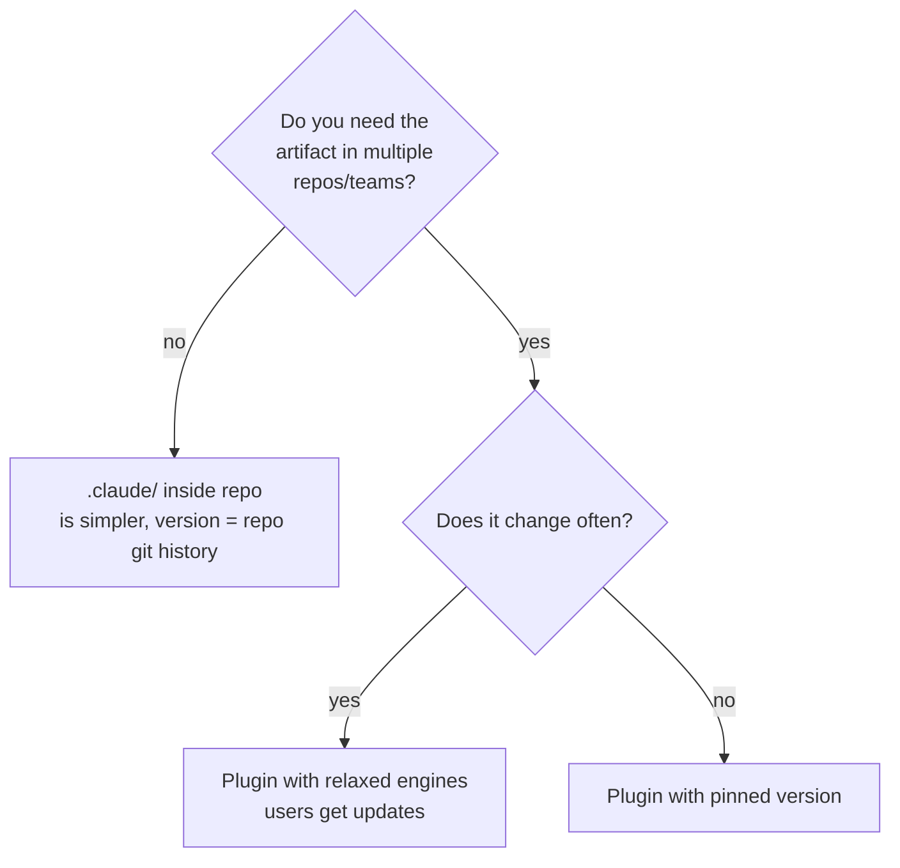

# 07. Plugins: packaging skills + hooks + agents + MCP

> Plugin — this is an "npm package for Claude Code". If you have several related artifacts (skills + hooks + agents + MCP config) that you want to share between projects or with your team — package them into a plugin.

---

## 7.1. Why plugins

📘 From docs (`plugins`): "Plugins are packages that extend Claude Code with custom commands, hooks, MCP servers, agents, and skills".

Without plugins, you write everything in `.claude/` of each project and copy-paste between repositories. With plugins:

✅ Single source of truth.
✅ Versioning via semver.
✅ Installation via `/plugin install`.
✅ Marketplace (internal or public).
✅ Update in one click.

---

## 7.2. Plugin structure

```
travel-agent-plugin/
├── .claude-plugin/
│   └── plugin.json              # обязательный manifest
├── skills/
│   ├── prepare-pr/SKILL.md
│   ├── debug-mcp/SKILL.md
│   └── deploy-staging/SKILL.md
├── agents/
│   ├── trip-architect.md         # subagent: планирует структуру маршрута
│   └── policy-checker.md         # subagent: проверяет regulations
├── commands/
│   └── trip-status.md            # slash-command /trip-status
├── hooks/
│   ├── hooks.json
│   └── scripts/
│       ├── format.sh
│       └── no-secrets.sh
├── .mcp.json                     # рекомендуемые MCP для пользователей плагина
├── settings.json                 # дефолтные настройки (модель, TTL, и т.д.)
├── bin/                          # CLI-утилиты (если нужны)
└── README.md
```

---

## 7.3. plugin.json

Minimal manifest:

```json
{
  "$schema": "https://claude.com/schemas/plugin.json",
  "name": "travel-agent-toolkit",
  "version": "0.4.0",
  "description": "Skills, agents, hooks and MCP configs for the Travel Agent monorepo",
  "author": {
    "name": "Travel Agent Team",
    "email": "team@travel-agent.local"
  },
  "homepage": "https://github.com/travel-agent/claude-plugin",
  "repository": {
    "type": "git",
    "url": "https://github.com/travel-agent/claude-plugin.git"
  },
  "license": "MIT",
  "engines": {
    "claude-code": ">=2.1.0"
  }
}
```

📘 Optional fields: `homepage`, `repository`, `license`, `keywords`, `engines`. All of them help the marketplace show your plugin and prevent installation on incompatible versions.

---

## 7.4. Plugins and marketplaces

📘 Marketplaces — these are plugin catalog repositories. They come in:

- **Anthropic Official** — `anthropics/claude-plugins-official` on GitHub.
- **Community** — public repos with a list of community plugins.
- **Internal/private** — your corporate registry (for example, a GitHub Enterprise repo with a listing file).

**Marketplace anatomy:**

```
my-corp-marketplace/
├── marketplace.json           # листинг плагинов
└── plugins/
    ├── travel-agent-toolkit/
    │   └── (манифест плагина)
    └── another-plugin/
```

🔧 `marketplace.json`:

```json
{
  "name": "Travel Agent Internal",
  "description": "Plugins for the travel-agent platform team",
  "plugins": [
    {
      "name": "travel-agent-toolkit",
      "ref": "github:travel-agent/claude-plugin@v0.4.0",
      "description": "Core toolkit"
    },
    {
      "name": "travel-agent-staging-helpers",
      "ref": "github:travel-agent/staging-plugin@latest",
      "description": "Staging-only helpers (db reset, seed)"
    }
  ]
}
```

---

## 7.5. Installing a plugin

```bash
# Из marketplace
/plugin install travel-agent-toolkit

# Напрямую из git
/plugin install github:travel-agent/claude-plugin@v0.4.0

# Локально (для разработки)
claude --plugin-dir ./travel-agent-plugin
```

After installation:

- skills are visible in `/skills`,
- agents — in `/agents`,
- hooks — are active,
- MCP servers — in `/mcp` (if the plugin has `.mcp.json`).

Plugins are installed in `~/.claude/plugins/<name>/`.

---

## 7.6. Features of plugin hooks

Inside a plugin in `hooks/hooks.json`, use the `${CLAUDE_PLUGIN_ROOT}` variable:

```json
{
  "PostToolUse": [
    {
      "matcher": "Edit|Write",
      "hooks": [
        {
          "type": "command",
          "command": "bash ${CLAUDE_PLUGIN_ROOT}/hooks/scripts/format.sh"
        }
      ]
    }
  ]
}
```

This is the path to the root of the installed plugin. Always use it — paths will work regardless of where the plugin is installed.

---

## 7.7. Plugin vs project-level `.claude/`



💡 Travel heuristic: as long as there are fewer than 5 artifacts and you're working in one repo — use `.claude/`. Once a second project appears that wants the same thing — it's time to move to a plugin.

---

## 7.8. Versioning

Use semver (`MAJOR.MINOR.PATCH`):

- **MAJOR** — breaking change in some skill, hook, or agent.
- **MINOR** — new artifact.
- **PATCH** — fix / description / docs.

Specify `engines.claude-code` — otherwise a CLI update can break your plugin and you won't understand why.

---

## 7.9. What to put in the Travel Agent plugin

If you have Travel Agent — the only project on this stack, you can live in `.claude/`. But as soon as you want a second project using the same approaches (for example, Booking Agent or Cargo Logistics Agent) — it makes sense to create a **`travel-stack-toolkit`** plugin with:

- Skills for typical patterns (Hono+drizzle backend, React+TanStack frontend, MCP server template).
- `code-reviewer` agent tailored to your style.
- Hooks for format / lint / typecheck.
- Slash commands `/scaffold-mcp <name>`, `/migration <description>`.

Then a new project just does `/plugin install travel-stack-toolkit` and gets all the infrastructure at once.

---

## 7.10. Commands for working with plugins

|                            |     |
| -------------------------- | --- |
| `/plugin list`             |     |
| `/plugin install <ref>`    |     |
| `/plugin uninstall <name>` |     |
| `/plugin update <name>`    |     |
| `/plugin info <name>`      |     |
| `/plugin search <query>`   |     |

---

## 7.11. Anti-patterns

❌ **You put secrets in a plugin.** A plugin is open code. Secrets go in env, in local config.

❌ **One giant plugin for everything.** Better to have several narrow ones.

❌ **Plugin without `engines`.** In six months the CLI will update, the plugin will break without diagnostics.

❌ **Plugin with MCP config that requires your private API.** You published it — no one but you can use it. Make such MCPs optional.

❌ **Plugin without README.** No one will understand how to use it.

---

**Next →** [08. Tool calls and agent loop under the hood](./08-tool-calls-and-loop.md)
