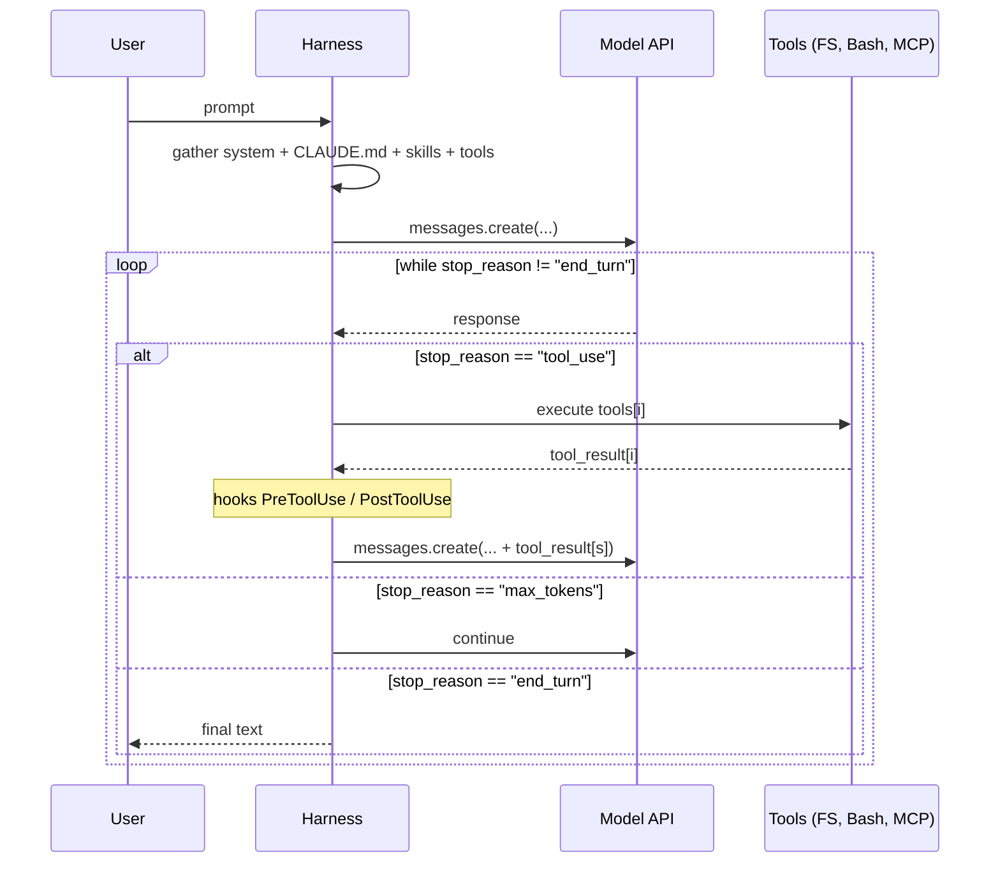
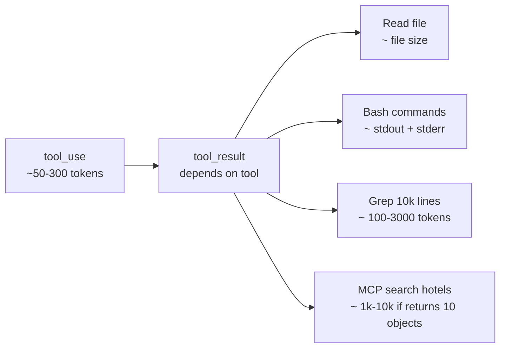

# 08. Tool calls and agent loop under the hood

> Tool call — this is not a "Claude Code feature", it's a fundamental mechanism that transforms a model from a chatbot into an agent. By understanding the tool loop, you understand 80% of how any AI agent works.

---

## 8.1. Tool call as a protocol

In the Anthropic API, a request with tools looks like this:

```python
response = client.messages.create(
    model="claude-opus-4-7",
    tools=[
        {
            "name": "read_file",
            "description": "Read a file from the local filesystem",
            "input_schema": {
                "type": "object",
                "properties": {
                    "path": {"type": "string", "description": "Absolute path"}
                },
                "required": ["path"],
            },
        }
    ],
    messages=[{"role": "user", "content": "Что в /etc/hostname?"}]
)
```

The model sees tool descriptions and decides whether it needs to call something. If it does — it returns not text, but a **`tool_use` block**:

```json
{
  "stop_reason": "tool_use",
  "content": [
    {
      "type": "tool_use",
      "id": "toolu_01ABC...",
      "name": "read_file",
      "input": { "path": "/etc/hostname" }
    }
  ]
}
```

Harness (Claude Code in our case) sees this, executes `read_file`, and sends the next request with `tool_result`:

```json
{
  "messages": [
    /* предыдущие сообщения... */
    {
      "role": "assistant",
      "content": [{"type": "tool_use", "id": "toolu_01ABC", ...}]
    },
    {
      "role": "user",
      "content": [{
        "type": "tool_result",
        "tool_use_id": "toolu_01ABC",
        "content": "my-laptop\n"
      }]
    }
  ]
}
```

And so on until the model returns `stop_reason: "end_turn"` — this is its signal "that's it, I'm done, you can respond to the user".

---

## 8.2. Full agent loop in one image



Important nuances:

- In a single `assistant` message, the model can request **multiple tool_use blocks in parallel**. Harness can execute them in parallel (if safe).
- `stop_reason: "max_tokens"` means the model didn't fit within `max_tokens`. Harness increases the limit and continues.
- Each iteration — is a **separate API request** with **full history**. That's why prompt cache is critical.

---

## 8.3. What harness gives the model "for free" (built-in tools)

Claude Code comes with preset tools (without MCP):

| Tool                      | What it does                                  |
| ------------------------- | --------------------------------------------- |
| `Read`                    | Read file (with offset/limit for large files) |
| `Write`                   | Create / overwrite file                       |
| `Edit`                    | Pinpoint replacement in file                  |
| `MultiEdit`               | Multiple Edits in one tool call               |
| `Bash`                    | Execute shell command                         |
| `Glob`                    | Find files by pattern                         |
| `Grep`                    | Search content (under the hood — ripgrep)     |
| `WebFetch`                | Fetch URL                                     |
| `WebSearch`               | Search the web                                |
| `Agent` (formerly `Task`) | Run subagent                                  |
| `TodoWrite`               | Manage built-in task list                     |
| `NotebookEdit`            | Edit Jupyter notebooks                        |

📘 In version **2.1.63**, the `Task` tool was renamed to `Agent`. Old `Task(...)` calls still work as an alias. If you see `Task tool` in other guides — it's about subagents.

---

## 8.4. Model vs harness: who decides what

| Decision                         | Who decides                                   |
| -------------------------------- | --------------------------------------------- |
| Which tool to call               | Model                                         |
| What arguments                   | Model                                         |
| Can it be executed (permissions) | Harness (by rules + asking user)              |
| How to deliver result back       | Harness (formats tool_result)                 |
| When to stop                     | Model (`end_turn`) or harness (budget limits) |
| What goes in context             | Harness (manages window)                      |
| What gets cached                 | Harness (places `cache_control`)              |

⚠️ This separation explains why **hooks work**: you intervene at the harness level, bypassing the model.

---

## 8.5. Permissions: how Claude Code decides "ask or not"

Each tool has a permission level. By default, for destructive ones (`Bash`, `Edit`, `Write`) — the user is asked.

📘 Config in `.claude/settings.json`:

```json
{
  "permissions": {
    "allow": [
      "Read",
      "Grep",
      "Glob",
      "Bash(pnpm test:*)",
      "Bash(pnpm typecheck)",
      "Edit(apps/api/src/routes/**)",
      "mcp__flights__*"
    ],
    "deny": ["Edit(.env*)", "Bash(rm -rf *)", "Bash(curl * | sh)"],
    "ask": ["Edit(packages/shared/**)", "Bash(pnpm db:migrate*)"]
  }
}
```

`allow` / `ask` / `deny` — three types of decisions. You can use patterns (`*`, `**`).

⚠️ `deny` — final gate. Impossible to bypass even in `bypassPermissions` mode. This is your "red button".

`/permissions` — view/edit.

---

## 8.6. Parallel tool calls

The model can request multiple tools to run simultaneously — you often see this during large analysis:

```
assistant.content = [
  {type: "tool_use", name: "Read", input: {file_path: "a.ts"}},
  {type: "tool_use", name: "Read", input: {file_path: "b.ts"}},
  {type: "tool_use", name: "Grep", input: {pattern: "TODO"}},
]
```

Harness executes them **in parallel** (if they have no dependencies and don't conflict with permissions). This greatly speeds up the browse phase.

💡 If your skill says "do steps sequentially" — the model will do that. But if there's no hard sequence, leave room for freedom — parallelism pays off.

---

## 8.7. Context: how much space does one tool call take



Bad example: `Bash(cat huge.log)` → returns 80k lines → entire context is filled. Good: `Bash(tail -200 huge.log)` or `Grep(pattern=..., path=huge.log)`.

💡 Teach the model to be economical. In CLAUDE.md or skill: "When working with logs, use `tail`, `head`, `grep`, not `cat` entirely".

---

## 8.8. Timings and retry

Harness keeps timeouts on each tool call. By default:

- `Bash` — 2 minutes (can be raised to 10).
- `Read`, `Edit`, `Write` — instant (these are file operations).
- `WebFetch`, `WebSearch` — a few seconds.
- MCP tools — defined by server, but harness also imposes a limit.

⚠️ If your MCP tool regularly exceeds timeout — the model will see an error and try again. This burns tokens. Better to explicitly return `tool_result` with "in progress, check later" status and implement polling.

---

## 8.9. Streaming

For UX, harness streams the model's response token-by-token. If your backend also uses Anthropic SDK (like in Travel Agent), use `stream: true`:

```typescript
const stream = await anthropic.messages.stream({
  model: "claude-opus-4-7",
  tools,
  messages,
});

for await (const event of stream) {
  if (event.type === "content_block_delta") {
    // отправить frontend через SSE
    sse.send(event.delta.text ?? "");
  }
}

const final = await stream.finalMessage();
```

⚠️ Tool calls also come in the stream — you need to collect them before execution. SDK provides convenient helpers for this.

---

## 8.10. What makes a good "agent" different from a bad one

After everything above, an important practical takeaway:

**Good agent:**

- Has a narrow, meaningful set of tools (not 50 "just in case").
- Each tool with clear description and schema.
- Returns compact tool_results (doesn't dump gigabytes).
- Has system prompt that sets goal and work style.
- Has hooks that limit damage.
- Uses subagents for browse-heavy tasks to save main context.

**Bad agent:**

- 50 tools, half are duplicates.
- Descriptions like "Helper for X".
- One Read returns 200KB JSON.
- System prompt: "You are a helper".
- No permissions.
- All operations in one bloated context.

---

**Next →** [09. Subagents: isolation and economics](./09-subagents.md)
