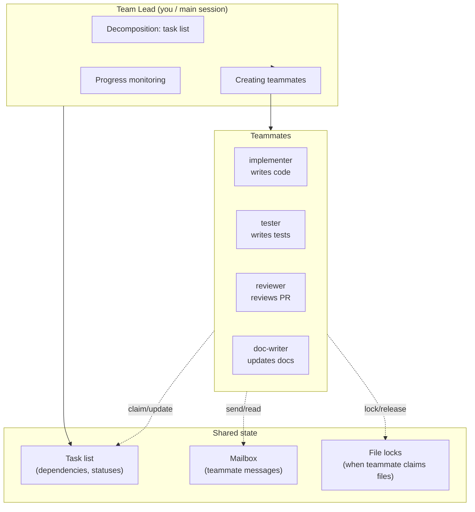
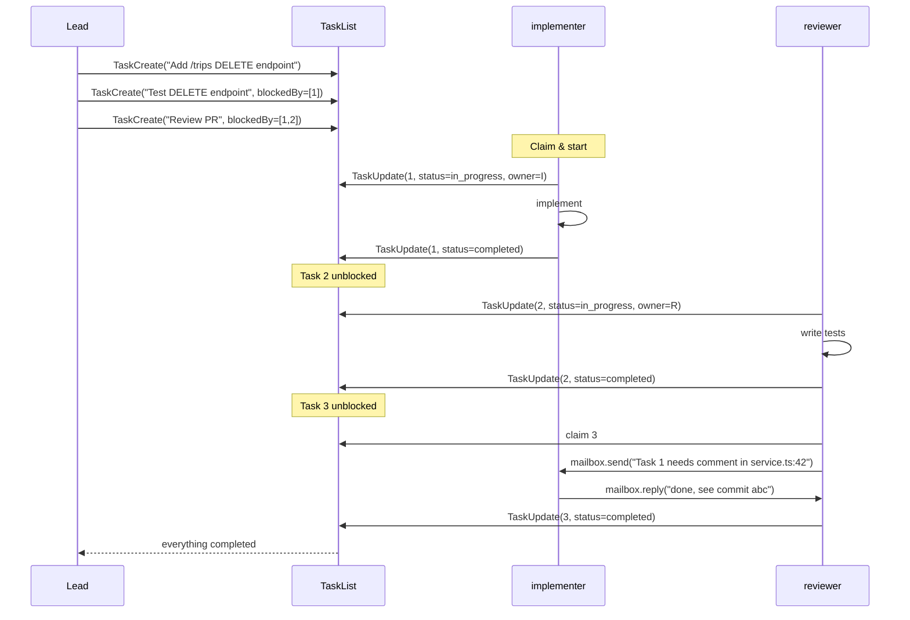

# 10. Agent Teams (experimental)

> If subagents are "send an assistant on a business trip and wait for results", then Agent Teams are "assemble a team of several developers, give them a task list, and they work in parallel, communicating with each other". A fundamentally different architecture. As of April 2026 — an experimental feature of Claude Code.

---

## 10.1. What this is and how it differs from subagents

🧪 From docs (`agent-teams`): "Agent teams let you coordinate multiple Claude Code instances working together. One session acts as the team lead … Teammates work independently … and communicate directly with each other".

|                   | Subagents                       | Agent Teams                                                                   |
| ----------------- | ------------------------------- | ----------------------------------------------------------------------------- |
| Who launches whom | Main → subagent (one direction) | Lead creates teammates, teammates communicate with each other                 |
| Context           | Isolated, returns only summary  | Each teammate has their own, but there's **shared task list** and **mailbox** |
| Duration          | One task → answer → end         | Long-lived, until entire task list is completed                               |
| Communication     | None                            | Mailbox (direct messages) + shared task list                                  |
| Parallelism       | Yes, but independently          | Yes, with dependencies (Task A blocks Task B)                                 |
| Cost              | Medium                          | High (each teammate — separate Claude instance)                               |
| Release           | Stable                          | Experimental (`CLAUDE_CODE_EXPERIMENTAL_AGENT_TEAMS=1`)                       |

📘 Version: appeared in Claude Code v2.1.32 (released with Opus 4.6, February 2026).

⚠️ This is a **real feature**, not made up. In the original Twitter thread it's named correctly. But the status is experimental, behavior and API may change.

---

## 10.2. How to enable

```bash
export CLAUDE_CODE_EXPERIMENTAL_AGENT_TEAMS=1
claude
```

After that, the `/team` command appears.

---

## 10.3. Architecture



---

## 10.4. Task lifecycle



---

## 10.5. How teammates are created

In the Lead session, the command:

```bash
/team add implementer --description "writes code per spec"
/team add tester --description "writes vitest"
/team add reviewer --description "code review"
```

Each teammate is a **separate Claude Code process** with its own session, model, MCP, tools. Lead initiates them through a special harness mechanism, passing a reference to shared state (task list, mailbox).

Teammates can be based on subagent definitions (use existing `.claude/agents/*.md` as a profile).

---

## 10.6. Mailbox: communication between teammates

📘 Each teammate has an "inbox". Through UpdateMailbox (internal tool) they can send direct messages:

```text
implementer → tester:
  "Я закончил DELETE-эндпоинт в apps/api/src/routes/trips.ts:120.
   Идемпотентность не реализована — намеренно, обсудили в PR."

tester → implementer:
  "Тест 'returns 404 on missing id' падает: возвращается 500.
   Можешь глянуть?"
```

The `TeammateIdle` hook fires when a teammate is waiting for a message (no open tasks). Lead can intervene, reassign, or add a task.

---

## 10.7. File locks

To avoid conflicts, a teammate can "lock" files before editing:

```text
implementer.lock(["apps/api/src/routes/trips.ts"])
implementer.edit(...)
implementer.unlock(["apps/api/src/routes/trips.ts"])
```

If another teammate tries to Edit a locked file — they get an error and must either wait or send a mailbox request.

---

## 10.8. Hooks for teams

Additional lifecycle events appear:

- `TaskCreated` — someone created a task.
- `TaskCompleted` — task is done.
- `TeammateIdle` — teammate is idle.

You can use these for notifications, auto-redistribution, metrics.

---

## 10.9. Cost

⚠️ Each teammate is a separate Claude instance with its own prefix. 4 teammates on Opus with large CLAUDE.md = 4× subagent cost × N turns each.

📘 The documentation directly warns: "token usage scales with the number of active teammates … For routine tasks, a single session is more cost-effective".

💡 When a team is justified:

✅ Large feature with clearly parallel parts (frontend + backend + migration + tests).
✅ Long refactoring, broken down into independent blocks.
✅ Really need many hands at once (e.g., migrate 30 files by one pattern).

❌ **Not justified:**

- Small fix ("add a field to the form") — a regular session is enough.
- Browse / analysis — that's a subagent.
- When you don't understand how to decompose — Lead is forced to run all teammates sequentially, losing the point.

---

## 10.10. Example: Travel Agent feature via team

Task: "add route sharing via short links (`/t/abc123`)".

Lead's decomposition into task list:

```
Task 1: schema migration "shareable_links" table
Task 2: backend endpoints POST/GET /share, POST /trips/:id/share, blockedBy=[1]
Task 3: frontend share button + modal, blockedBy=[]
Task 4: e2e test для шаринга, blockedBy=[2,3]
Task 5: PR description + changelog, blockedBy=[2,3,4]
```

Teammates:

- `db-eng` — Task 1 (model: sonnet, tools: Read/Edit/Bash for drizzle).
- `backend-eng` — Task 2 (sonnet, MCP: postgres, hooks: format).
- `frontend-eng` — Task 3 (sonnet, no MCP needed for flights/hotels).
- `qa` — Task 4 (sonnet, Bash access for playwright).
- `pr-writer` — Task 5 (haiku, only Read + git).

```mermaid
gantt
  title Parallel execution
  dateFormat HH:mm
  axisFormat %H:%M

  section db-eng
  Migration :a1, 10:00, 5m
  section backend-eng
  Endpoints :a2, after a1, 25m
  section frontend-eng
  UI :a3, 10:00, 30m
  section qa
  E2E test :a4, after a2, 15m
  section pr-writer
  PR + changelog :a5, after a4, 5m
```



Lead monitors, gives small follow-up tasks when idle (`TeammateIdle`). Once Task 5 is done — `gh pr create` is ready.

⚠️ For such a feature in a regular session you could spend 15-20 minutes on ~$2-5. Via team — same 15-20 minutes of real time, but $10-20 bill. You're buying parallelization of people, not machine time.

---

## 10.11. Debugging team scenarios

| Command             | What it shows                                        |
| ------------------- | ---------------------------------------------------- |
| `/team status`      | Live teammates, their current tasks, mailbox inboxes |
| `/team tasks`       | Full task list with statuses                         |
| `/team logs <name>` | Transcript of specific teammate's session            |
| `/team kill <name>` | Terminate teammate (if hung)                         |
| `/team disband`     | Disband team (but keep artifacts)                    |

---

## 10.12. Best practices

✅ **Decomposition by Lead.** Lead uses `opus` (or enable `opusplan` in Lead session) — it plans best.

✅ **Teammates on `sonnet` or `haiku`.** They're executors, expensive model is overkill.

✅ **Set dependencies.** Without `blockedBy` everyone starts in parallel and may conflict on shared state.

✅ **Small tasks.** The more atomic, the fewer lock conflicts and less loss if a teammate fails.

✅ **Use `TeammateIdle` hook** for logging / metrics.

✅ **Lock files.** Without locks, two teammates can overwrite each other.

❌ **Don't use teams for browse/analysis** — subagents are cheaper for that.

❌ **Don't give all teammates `bypassPermissions`** — that's "5 hands with write-anything rights". At least one should have `ask`.

❌ **Don't run >4-5 teammates** — coordination becomes more expensive than work.

---

**Next →** [11. Models and pricing](./11-models-and-pricing.md)
