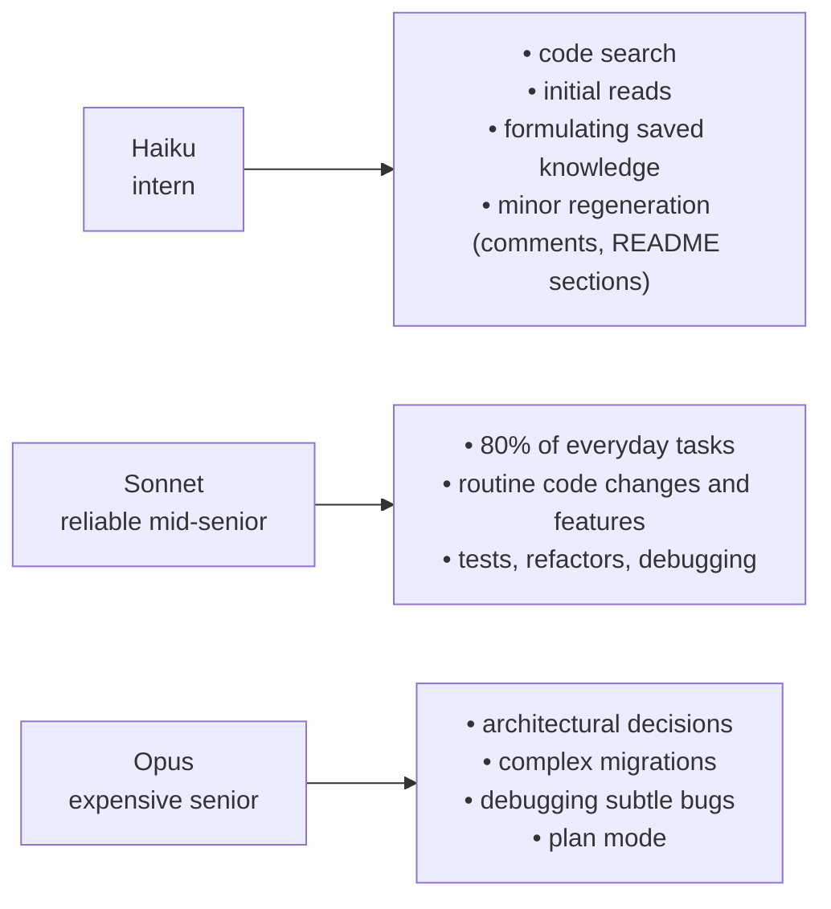
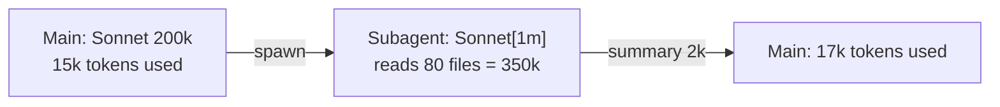

> Model selection is not "always Opus because it's better". It's a trade-off between speed / cost / quality for a specific task. This chapter covers tables, budgets, and strategies for combining models.

---

## 11.1. Available models as of 23.04.2026

| Model                 | API Alias                            | Context                    | Strengths                                  |
| --------------------- | ------------------------------------ | -------------------------- | ------------------------------------------ |
| **Claude Opus 4.7**   | `opus`, `claude-opus-4-7`            | 200k (1M via `opus[1m]`)   | Best agentic coding, complex reasoning     |
| **Claude Opus 4.6**   | `claude-opus-4-6`                    | 200k (1M via `opus[1m]`)   | Legacy, same pricing, old tokenizer        |
| **Claude Sonnet 4.6** | `sonnet`, `claude-sonnet-4-6`        | 200k (1M via `sonnet[1m]`) | Best speed-to-quality ratio                |
| **Claude Haiku 4.5**  | `haiku`, `claude-haiku-4-5-20251001` | 200k                       | Fast and cheap, near-frontier intelligence |

⚠️ **On Bedrock / Vertex / Foundry, default aliases are shifted back one version.** `opus` there → 4.6, `sonnet` → 4.5. If you need the latest — specify the full model name.

⚠️ **Opus 4.7 has a new tokenizer** — on the same texts it consumes **up to +35%** tokens compared to Opus 4.6. If you had estimates for 4.6 — recalculate.

---

## 11.2. Pricing (April 2026)

| Model          | Input ($/MTok) | Output ($/MTok) | Cache write 5min ($/MTok) | Cache write 1h ($/MTok) | Cache read ($/MTok) |
| -------------- | -------------- | --------------- | ------------------------- | ----------------------- | ------------------- |
| Opus 4.7 / 4.6 | $5             | $25             | $6.25                     | $10                     | $0.50               |
| Sonnet 4.6     | $3             | $15             | $3.75                     | $6                      | $0.30               |
| Haiku 4.5      | $1             | $5              | $1.25                     | $2                      | $0.10               |

Key multipliers (same for all models):

- Cache write 5min = **1.25×** input.
- Cache write 1h = **2×** input.
- Cache read = **0.1×** input (10 times cheaper!).
- Output usually **5×** input.

---

## 11.3. Psychological model "when to use what"

Use metaphors from the original Twitter thread — they work:



📘 From docs: Opus 4.7 — "most capable for complex reasoning and agentic coding", Sonnet 4.6 — "best combination of speed and intelligence", Haiku 4.5 — "fastest model with near-frontier intelligence".

---

## 11.4. Strategies for combining models

### 11.4.1. Default: Sonnet

Start most sessions with Sonnet 4.6. It's a sensible baseline.

### 11.4.2. opusplan for architecture

```bash
/model opusplan
```

Enables plan mode on Opus. After `ExitPlanMode` automatically switches to Sonnet for implementation. **This is the correct pattern: "think with Opus, build with Sonnet".**

⚠️ In opusplan, the **plan phase runs in standard 200k**, even if you enabled a 1M window.

### 11.4.3. Subagents with different models

Different subagents can run on different models:

```yaml
# trip-architect.md → opus (сложная декомпозиция маршрутов)
model: opus

# code-reviewer.md → sonnet
model: sonnet

# explore (built-in) → haiku
```

This lets you keep the main agent on Sonnet and upgrade the model only for specialized subagents when needed.

### 11.4.4. Agent Teams: Lead = Opus, teammates = Sonnet/Haiku

Lead handles planning and coordination — needs Opus. Teammates execute simple tasks — Sonnet or Haiku.

---

## 11.5. Calculating a typical Travel Agent session

One session of 30 turns on Sonnet:

```
Префикс (system + CLAUDE.md + skills + tools) ~ 25k токенов
Output на turn ~ 1k токенов
Tool results на turn ~ 2k токенов
```

**Without cache:**

```
30 × (25k input × $3/M + 3k input × $3/M + 1k output × $15/M)
= 30 × ($0.075 + $0.009 + $0.015)
= 30 × $0.099
= $2.97
```

**With cache (TTL 5min, no pauses):**

```
1 × cache write (25k × $3.75/M = $0.094)
+ 29 × cache read (25k × $0.30/M = $0.0075)
+ 30 × non-cached input (3k × $3/M = $0.009)
+ 30 × output (1k × $15/M = $0.015)
= $0.094 + $0.218 + $0.27 + $0.45
= $1.03
```

Savings — **65%**. And that's on a modest session. On longer ones with large CLAUDE.md the effect is even stronger.

---

## 11.6. 1M context: when it's justified

| Case                                             | 1M justified?                                      |
| ------------------------------------------------ | -------------------------------------------------- |
| Load entire monorepo as context once             | ✅ If many small tasks follow. Cache + 1M = okay   |
| Long multi-hour session with accumulated history | ⚠️ Better to use /compact, otherwise quality drops |
| Parse huge log in one request                    | ✅ One request better than ten with pagination     |
| "Just in case"                                   | ❌ Pay more, get worse results                     |

📘 Enabled via alias `opus[1m]` or `sonnet[1m]`. On Max/Team/Enterprise.

⚠️ Remember that **`opusplan` does NOT support 1M window**.

⚠️ **Empirically:** many practitioners report that after **300-400k** in the window, quality drops. This isn't from Anthropic docs, but the symptoms are familiar (model forgets early decisions, contradicts itself, re-reads files).

---

## 11.7. Budgets and monitoring

📘 Commands:

| Command          | What it shows                                  |
| ---------------- | ---------------------------------------------- |
| `/cost`          | Current and accumulated costs for this session |
| `/usage`         | Costs for a period, by model                   |
| `/release-notes` | Version news (sometimes pricing updates)       |

🔧 Environment variables for alerts:

```bash
export CLAUDE_CODE_BUDGET_USD_SESSION=5      # warn at $5/session
export CLAUDE_CODE_BUDGET_USD_DAILY=50       # daily ceiling
```

---

## 11.8. Should you revisit `CLAUDE.md` and skills with new models?

⚠️ The claim "settings become outdated over time, with new models you need to revisit CLAUDE.md and skills" — **is sound practice, but not a quote from docs**. There's no direct recommendation in public docs.

Reality:

- CLAUDE.md itself usually stays relevant (project stack changes less often than models).
- Skills can become outdated if you stuffed them with "model understands X poorly, always remind it" — but the new model understands X on its own.
- Hooks usually don't depend on the model.

💡 Once a quarter, quickly review CLAUDE.md and `/skills`, ask yourself: "is this still needed for current models?". Especially for hints like "don't forget to return `Promise<T>`" — Sonnet 4.6 already doesn't forget.

---

## 11.9. Context windows for subagents

📝 Each subagent has **its own** limit:

- On Haiku-subagent, window is 200k.
- On Sonnet/Opus-subagent — 200k or 1M (if enabled).

This gives a convenient pattern: **keep main context on 200k Sonnet, and a browse-heavy subagent on 1M Sonnet**. The subagent reads most of the repo, returns a summary, main context doesn't suffer.



---

## 11.10. Antipatterns

❌ **Always Opus.** Expensive and unnecessary. Sonnet handles 80% of tasks.

❌ **Always Haiku.** Fast and cheap, but on a complex task it will loop and end up costing more than Sonnet.

❌ **Switch models mid-task without opusplan.** Cache miss + loss of context trust. Use opusplan if you need switching.

❌ **Enable 1M by default.** Expensive, slower, and quality isn't better.

❌ **Don't use prompt cache.** Check that your SDK code adds `cache_control` markers. In Claude Code this is already built-in.

---

**Next →** [12. Travel Agent from scratch: blueprint](./12-travel-agent-blueprint)
