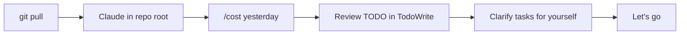
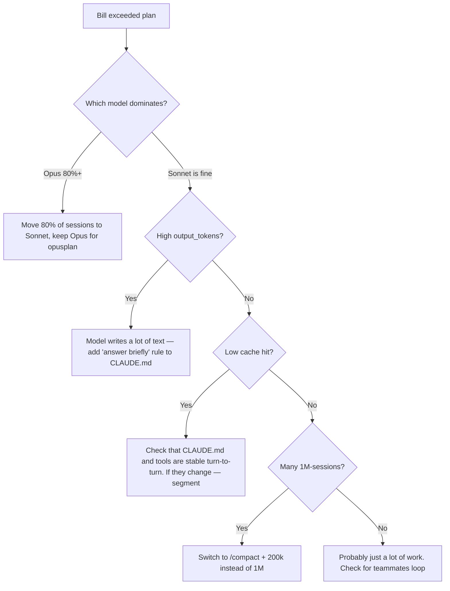

# 13. Best practices: daily routine and anti-patterns

> All previous chapters are about mechanics. This one is about discipline. Without it, even a perfect configuration eventually turns into a mess: cache misses, skills go stale, hooks fail silently, and you don't understand why your monthly bill doubled.

---

## 13.1. Daily routine for a developer using Claude Code

This isn't dogma, just a guideline. Everyone has their own rhythm. But if your day looks very different and you're not happy with the results — try comparing.

### Morning (10 minutes)



📘 Concrete steps:

1. `git pull --rebase` — pull your colleagues' changes.
2. Open Claude Code in the repo root. CLAUDE.md and MCP will be picked up automatically.
3. `/cost` — check how much was spent yesterday. If there's a sharp spike — figure out why before starting new tasks.
4. `/usage` optionally — breakdown by models for the week.
5. If there's a `TodoWrite` list from yesterday — go through it, cross out what's outdated.
6. Formulate the first task of the day **completely**, not "let's start with X".

### During work

✅ **One task — one session.** After completing a task, do `/clear` or start a new session. Context shouldn't accumulate "everything from the day".

✅ **Use plan mode for the unfamiliar.** Before saying "implement", say "plan". That's `Shift+Tab` or `/model opusplan`.

✅ **Trust, but verify.** Look at every PR with your own eyes, especially diffs in files Claude touched. Don't become a rubber stamp.

✅ **Keep a prompt diary.** When a prompt works especially well or especially poorly — copy it to `notes/prompts.md`. In a month you'll have a personal collection of working formulations.

### End of day (5 minutes)

📘 Steps:

1. `/cost` — day's total.
2. If something broke and Claude didn't fix it — write it in `notes/stuck.md`. Tomorrow with fresh eyes you'll often see the solution.
3. Commit unfinished work to a WIP branch so you don't start from scratch tomorrow.
4. Close Claude Code (this will end the subscription to MCP servers and free up resources).

---

## 13.2. Once a week: hygiene

| What               | Command                     | Why                                      |
| ------------------ | --------------------------- | ---------------------------------------- |
| Review CLAUDE.md   | `claude /memory`            | Has it grown? Does it contradict itself? |
| Review skills      | `ls .claude/skills/`        | Are they all current? Do they duplicate? |
| Review hooks       | `cat .claude/settings.json` | Is there a hook that's no longer needed? |
| Spending by models | `/usage`                    | Did Opus unexpectedly consume a lot?     |
| MCP servers        | `/mcp`                      | Are they all connected? Any error-state? |

💡 Once a **month**: go through `.claude/agents/` and ask yourself — do you still need each subagent? "Just in case" is bad reasoning.

---

## 13.3. When CLAUDE.md has "overlearned"

Symptoms:

- Claude mostly answers "I already know" and ignores fresh hints.
- Strange code patterns: uses a library that was deleted long ago.
- Doesn't use new skills.

📘 Reason — CLAUDE.md has grown to 5-10 KB, and the model can't manage it anymore (it fits, but drowns in noise).

Treatment:

1. Open CLAUDE.md, read top to bottom. How many lines could you delete right now because "it's obvious for a modern model anyway"?
2. Move long specific rules to `.claude/skills/<topic>/SKILL.md` — they'll load only when needed.
3. Use @-imports for fragmentation.

⚠️ For a new employee, CLAUDE.md over 200 lines is an anti-signal "everything here is confusing". Aim for 50-100 meaningful lines.

---

## 13.4. When your monthly bill shocks you



📘 Main "wallet killers":

1. **A runaway teammate that got stuck in a loop.** The `TeammateIdle` hook will help you notice this.
2. **1M window "by default".** Each new iteration scales payment linearly with input.
3. **Cache misses.** For example, if CLAUDE.md has `{{date}}` or other dynamics — every turn the cache is invalidated.
4. **`gh pr diff` at the start of each session.** PR grows — prefix grows. Don't put it in the cacheable part.

---

## 13.5. Anti-patterns: what NOT to do

### 13.5.1. CLAUDE.md as "a dump of everything I know about the project"

❌ 1500 lines of architecture description, decision history, all the "don't do this".

✅ 80-150 lines: stack, teams, important constraints, links to detailed docs.

### 13.5.2. Skills as "just in case"

❌ 30 skills, each "might be useful". The model spends tokens on their description with every request.

✅ 5-10 targeted skills. Deleting is better than leaving unused.

### 13.5.3. Subagents for everything

❌ Every code review through subagent. Every search through subagent. Every file through subagent.

✅ Subagent for **browse-heavy** tasks where summary matters more than transcript. Direct tool calls for everything else.

### 13.5.4. `bypassPermissions` as default mode

❌ `claude --bypass-permissions` always. "It's faster".

✅ `bypassPermissions` only for specific safe tasks, worst case — for a separate worktree session.

### 13.5.5. Hooks without logging

❌ Hook fails silently, and you only notice when the model starts doing weird things.

✅ Every hook logs its run (at least `echo "[hook:format] $(date)" >> .claude/hooks.log`).

### 13.5.6. One big prompt instead of iterative dialogue

❌ "Add auth, implement RBAC, write tests, update docs, create PR" — all in one line.

✅ Break it into 4 prompts. After each one, look at the diff. It's not slower because errors in the first step don't have time to bury the rest.

### 13.5.7. Ignoring `/cost`

❌ Find out the bill amount at the end of the month.

✅ Check `/cost` at the end of each big task. Zero effort and builds a sense of proportion.

### 13.5.8. Skills with `model: opus` for routine work

❌ Skill `format-pr-description` with `model: opus`. Why? It's a copying task.

✅ `model: haiku` or `model: sonnet`. Opus is for skills that really solve complex problems.

### 13.5.9. MCP servers with 100+ tools

❌ Connected Notion-MCP with 80 endpoints, of which you use 3. All 80 go into the prefix of every request.

✅ Use `tools` in skill frontmatter or in settings.json `permissions.allow` so the model only sees what's needed.

### 13.5.10. Never reading docs

❌ "I read it on Twitter". Anthropic documentation changes fast (new hook events, new env vars). Especially `release-notes`.

✅ Every two weeks — `/release-notes`. Once a month — `https://docs.claude.com/en/docs/claude-code/changelog`.

---

## 13.6. Checklist before deploying an agent to production

If your Travel Agent or other LLM project is going to production (where users touch it, not just you) — go through:

```text
[ ] System prompt выделен в отдельный файл, версионируется
[ ] Tools описаны через JSON Schema с required-полями
[ ] Каждый tool возвращает компактный результат (нет 100KB JSON)
[ ] Все долгие tools имеют таймауты + чёткие сообщения об ошибке
[ ] Streaming реализован (UX) и есть graceful cancellation
[ ] Логирование: prompt, tool calls, tool results, final output, latency
[ ] Метрики: tokens_in, tokens_out, cache_read, cost, p50/p95 latency
[ ] Rate limit на пользователя (request/sec и tokens/day)
[ ] Защита от prompt injection (sanitize user input в system context)
[ ] Сценарии retry для transient API errors
[ ] Fallback на дешёвую модель при сбое основной
[ ] Audit log: что сделал агент от имени пользователя
[ ] Permissions: какие tools кому доступны (RBAC)
[ ] Тесты для типовых сценариев (vitest + recorded conversations)
[ ] Documentation: как пользоваться, какие limits, что делать если завис
```

---

## 13.7. Checklist for onboarding a new developer to a project

When a newcomer joins a project where Claude Code is already built into the process:

```text
[ ] Прочитать CLAUDE.md
[ ] Прочитать README.md
[ ] Запустить bootstrap-команду из 12.13
[ ] Открыть Claude в корне, написать "Покажи структуру проекта и ключевые скиллы"
[ ] Прочитать каждый SKILL.md в .claude/skills/
[ ] Запустить /agents и понять каких есть готовых subagent'ов
[ ] Запустить /mcp и убедиться, что все серверы зелёные
[ ] Сделать первую задачу-разминку из onboarding-doc'а
[ ] Прочитать 13.5 (антипаттерны) и сразу осмотреться, нет ли их в проекте
```

---

## 13.8. Security: rules without compromise

🔒 Rules that **can never be broken**, even "temporarily for an experiment":

1. **Never give `Bash(*)` without a deny-list.** Minimum: `rm -rf *`, `curl * | sh`, `wget * | sh`, `dd if=*`.
2. **Never give `Edit(.env*)`.** That's a secrets leak.
3. **Never run `bypassPermissions` in a repo with production credentials in `.env`.**
4. **Never push branches with `--force` through Claude.** Hook to block it:
   ```bash
   if echo "$INPUT" | grep -qE 'git push.*--force'; then
     echo '{"action": "block", "reason": "Force push needs human approval"}'
     exit 0
   fi
   ```
5. **Never give an MCP server with file-write permissions access to the system root.** Only the project folder.
6. **Never trust prompt injection from user input** in system context. Sanitize or escape before feeding to LLM.

⚠️ Special case: **MCP servers with side-effects on payments** (Stripe-MCP, wallets). By default — `ask`, no exceptions.

---

## 13.9. When Claude Code isn't needed

Sometimes it's worth closing Claude Code and working by hand. Signs:

- Task is one line change in one file you know by heart.
- You're trying to learn something and need to feel the material.
- System operations (chmod, chown, system updates) — there's no copy cost and full cost of error.
- Emotionally charged moment (panic after prod) — Claude doesn't calm you down, better to take a deep breath first.
- You don't understand the task yourself. If you can't formulate it — you won't formulate it for Claude either.

💡 "Using Claude Code" != "using it always". Best use is when you consciously turn on the tool, not on autopilot.

---

## 13.10. Practice: your personal "knowledge capsule"

📘 Gradually build your own patterns in `~/.claude/CLAUDE.md` (user-level). In 3-6 months you'll have:

- List of favorite prompt formulations.
- 3-5 universal skills (for typical PRs, for refactoring, for testing).
- Your personal code style preferences (semicolons, quotes, naming).
- Your "never do this" — lessons from your own mistakes.

It transfers between all projects. This is your personal "leveling up" of the tool.

---

**Next →** [14. Verification of claims from the original thread](./14-claims-verification.md)
