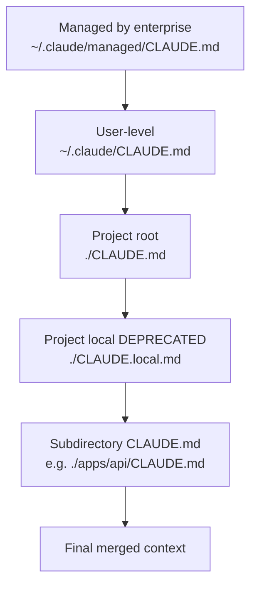

# 14. Verifying Claims from the Original Thread

> This chapter is a line-by-line breakdown of the ~20 points that started the guide's preparation. Each claim has been verified against official documentation (`docs.claude.com`, `code.claude.com/docs`), the Claude Code changelog, and through Context7 (`/anthropics/claude-code/v2.1.89`). The goal is to separate facts from speculation so you can cite the thread without worrying about "what if there's misinformation."

Legend:

- ✅ — confirmed by documentation.
- 🟡 — partially correct / has nuances.
- ❌ — inaccurate or incorrect.
- 🧪 — relates to experimental feature (behavior may change).

---

## 14.1. Summary Table

|     |     |     |     |
| --- | --- | --- | --- |
|     |     |     |     |
|     |     |     |     |
|     |     |     |     |
|     |     |     |     |
|     |     |     |     |
|     |     |     |     |
|     |     |     |     |
|     |     |     |     |
|     |     |     |     |
|     |     |     |     |
|     |     |     |     |
|     |     |     |     |
|     |     |     |     |
|     |     |     |     |
|     |     |     |     |
|     |     |     |     |
|     |     |     |     |
|     |     |     |     |
|     |     |     |     |
|     |     |     |     |
|     |     |     |     |
|     |     |     |     |
|     |     |     |     |
|     |     |     |     |
|     |     |     |     |
|     |     |     |     |
|     |     |     |     |
|     |     |     |     |
|     |     |     |     |
|     |     |     |     |

---

## 14.2. Detailed Comments on Inaccuracies

### 14.2.1. "Advisor mode" vs `opusplan`

The thread mentioned "Advisor mode" — there's no such name in the docs. The real command is:

```bash
/model opusplan
```

or right at the start of a session:

```bash
claude --model opusplan
```

📘 Behavior: Opus model in plan mode (read-only tools), after `ExitPlanMode` automatically switches to Sonnet for implementation. This is the "think with Opus, do with Sonnet" pattern.

⚠️ Known nuance: the plan phase of `opusplan` **does not use the 1M window**, even if it's enabled globally for the main session.

### 14.2.2. Env variable for autocompact

Was: `CLAUDE_CODE_AUTO_COMPACT_THRESHOLD`.
Actually: `CLAUDE_AUTOCOMPACT_PCT_OVERRIDE`.

Takes a number from 0 to 100 (percentage of window fill at which autocompact triggers).

```bash
export CLAUDE_AUTOCOMPACT_PCT_OVERRIDE=85
```

Default is around 92%. You can disable it via 100 (never compress) or via `--no-auto-compact` flag at startup.

### 14.2.3. Skill = directory

Yes, a minimal skill is `SKILL.md` with frontmatter and markdown body. **But** the structure can be much richer:

```text
.claude/skills/prepare-pr/
├── SKILL.md                  # обязательно
├── scripts/
│   └── lint-and-test.sh      # опционально
├── references/
│   └── pr-template.md        # опционально
└── templates/
    └── changelog-entry.tmpl  # опционально
```

A skill can call its own scripts from its SKILL.md and read its own references. This turns a skill into a full-fledged "module", not just a prompt.

### 14.2.4. List of hook events

The thread had ~6 events. Actually on v2.1.89 there are **28+**. Full list in [05.1.](./05-hooks.md#51-полный-список-событий). Especially useful ones that people often don't know about:

- `SessionStart` — for welcome message / pre-flight checks.
- `Stop` — for desktop notifications "model finished, check it".
- `TeammateIdle` — for Agent Teams.
- `Notification` — customize notifications.
- `SubagentStop` — when a subagent finishes.
- `PreCompact` / `PostCompact` — for logging or customizing compression.

### 14.2.5. Opus 4.6 → 4.7

At the time the thread was written, the latest version might have been Opus 4.6. Since April 16, 2026, the current version is **Opus 4.7**:

- Same pricing ($5/$25 input/output per MTok).
- New tokenizer (+ up to 35% tokens on the same texts).
- Improvements on agentic benchmarks, but expect regressions too — review your evals.

Alias `opus` → 4.7 on API. On Bedrock/Vertex/Foundry — still 4.6 for now.

### 14.2.6. Tool `Task` vs `Agent`

In subagent call code you may encounter both variants:

```text
Task(subagent_type="Explore", prompt=...)   # старый
Agent(subagent_type="Explore", prompt=...)  # новый, с v2.1.63
```

They're equivalent. Inside the harness — it's the same tool. In new projects, use `Agent` for compatibility with future versions.

### 14.2.7. CLAUDE.md Hierarchy

The thread mentioned 3 levels. Actually — 5:



Subdirectory CLAUDE.md files are loaded automatically when the model works with files in that subdirectory. This is convenient for monorepos.

⚠️ `CLAUDE.local.md` is formally deprecated in favor of gitignored `CLAUDE.md` or just using `~/.claude/CLAUDE.md`.

---

## 14.3. What Was Completely Correct in the Thread

So you don't get the impression "everything was wrong" — no, the thread overall described the system pretty well. Here's what was spot-on:

✅ Main idea of harness vs model.
✅ The tool_use / tool_result cycle as the heart of an agent.
✅ Prompt cache as key savings.
✅ Subagents for browse-heavy tasks.
✅ MCP as the extension standard.
✅ Permissions with allow/ask/deny.
✅ Worktree isolation for safe parallel tasks.
✅ The idea "not Opus always — Sonnet 80%".

Where the thread author was especially right — in general recommendations. Where they stumbled — in command names and exact env variables. This is typical for Twitter format: the principle sticks, but specifics are easy to forget.

---

## 14.4. Verification Sources

Each claim in this table has been verified against one or more sources:

📘 **Official Documentation:**

- `https://docs.claude.com/en/docs/claude-code/overview` — public Claude Code docs.
- `https://code.claude.com/docs/ru/overview` — Russian version (synchronized, but sometimes lags).
- `https://docs.claude.com/en/docs/build-with-claude/prompt-caching` — cache details.
- `https://docs.claude.com/en/docs/agents-and-tools/tool-use/overview` — tool use in API.
- `https://docs.claude.com/en/api/messages` — API reference.

📘 **Changelog:**

- `https://docs.claude.com/en/docs/claude-code/changelog` — for dates and renames (`Task → Agent`, env variables).

📘 **Context7:**

- `/anthropics/claude-code` (v2.1.89) — for code examples, current CLI, exact tool names.
- `/anthropics/anthropic-sdk-typescript` — for SDK code in [06.](./06-mcp.md) and [12.](./12-travel-agent-blueprint.md).

📘 **Anthropic Blog:**

- Model announcements (Opus 4.7, Sonnet 4.6, Haiku 4.5) — for dates and pricing.

⚠️ In case of source conflicts, priority: changelog > docs > blog > Context7. Context7 is good for code, but sometimes lags behind fresh API changes.

---

## 14.5. Takeaway: How to Read Twitter Threads About AI Tools

📝 A few heuristics that will save you time:

1. **Always verify command names / env variables against docs.** They're easiest to forget, and they change between versions.
2. **Always verify numbers.** Price, context size, TTL frequency — this is specifics, and it changes too.
3. **Principles are usually correct.** "Cache saves", "subagent isolates context", "opus is expensive" — these are stable properties, and they don't fall apart from version to version.
4. **Be skeptical of praise.** If the author is selling a course / service on the topic, there's always exaggeration. Especially suspicious are numbers like "10x productivity" without methodology.
5. **`/release-notes` is your friend.** Every major version (2.1.50 → 2.1.89) brings changes. Reading once a month — not enough, twice a month — normal.

---

## 14.6. What to Do With This Guide

This guide is a snapshot as of **April 23, 2026, Claude Code v2.1.89**. Some things will become outdated in a month, some in a quarter. Use it as:

- ✅ Reference for concepts (they change slowly).
- ✅ Template for CLAUDE.md / skills / hooks (adapt to your project).
- ✅ Checklist of antipatterns.
- 🟡 Source of specific numbers and commands — but always verify against current docs before serious use.

💡 If you find an error — that's normal, tooling evolves fast. Best practice: keep your own "corrections map" nearby, and sync with current docs once a quarter.

---

**End of guide.**

🚀 Good luck with Claude Code. If this guide helped you avoid even one mistake — it paid for itself.

**Back →** [README (table of contents)](./README.md)
