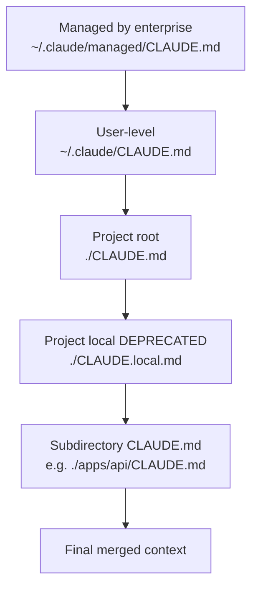

# 14. Verifying Claims from the Original Thread

> This chapter is a line-by-line breakdown of those ~20 points that started the guide's preparation. Each claim has been verified against official documentation (`docs.claude.com`, `code.claude.com/docs`), the Claude Code changelog, and through Context7 (`/anthropics/claude-code/v2.1.89`). The goal is to separate facts from speculation so you can cite the thread without worrying about "what if there's misinformation there."

Legend:

- ✅ — confirmed by documentation.
- 🟡 — partially correct / has nuances.
- ❌ — inaccurate or incorrect.
- 🧪 — relates to experimental feature (behavior may change).

---

## 14.1. Summary Table

| #   | Thread Claim                                                                     | Status | Reality                                                                                                                                                                                                     |
| --- | -------------------------------------------------------------------------------- | ------ | ----------------------------------------------------------------------------------------------------------------------------------------------------------------------------------------------------------- |
| 1   | Claude Code is a harness around an LLM, not the model itself                     | ✅     | See [01.](./01-introduction), [08.](./08-tool-calls-and-loop). The harness manages context, tools, hooks, permissions.                                                                                      |
| 2   | An LLM by itself is a chatbot; the loop tool_use → tool_result makes it an agent | ✅     | This is the basic Anthropic API protocol: `stop_reason: "tool_use"` → harness executes → `tool_result` → next iteration.                                                                                    |
| 3   | Context is limited to 200k tokens, but can be expanded to 1M                     | 🟡     | True, but 1M is only available via alias `opus[1m]` / `sonnet[1m]` and only on Max/Team/Enterprise. See [11.6.](./11-models-and-pricing#116-1m-контекст-когда-оправдан)                                     |
| 4   | Enabling 1M context "by default" is a bad idea                                   | ✅     | More expensive + empirically quality drops after 300-400k. Anthropic doesn't recommend "always 1M".                                                                                                         |
| 5   | Prompt cache gives huge savings                                                  | ✅     | Cache read = **0.1×** input price (10× cheaper). On a 30-turn session, savings are **65-80%**. See [02.](./02-context-and-cache), [11.5.](./11-models-and-pricing#115-расчёт-типичной-сессии-travel-agent)  |
| 6   | Cache TTL is 5 minutes by default, can be extended to 1 hour                     | ✅     | 5min cache write = 1.25× input, 1h cache write = 2× input.                                                                                                                                                  |
| 7   | There's an "Advisor mode" for planning on Opus                                   | ❌     | The correct name is **`opusplan`**. See [02.6.](./02-context-and-cache), [11.4.2.](./11-models-and-pricing). After ExitPlanMode, automatically switches to Sonnet.                                          |
| 8   | `opusplan` supports 1M window                                                    | ❌     | The plan phase of `opusplan` works in standard 200k, even if 1M is enabled globally.                                                                                                                        |
| 9   | There's an env variable for autocompact threshold                                | 🟡     | Yes, but it's called `CLAUDE_AUTOCOMPACT_PCT_OVERRIDE`, **not** `CLAUDE_CODE_AUTO_COMPACT_THRESHOLD` as in the thread. Value is a percentage (e.g., `85`).                                                  |
| 10  | CLAUDE.md has a hierarchy: project, user, local                                  | 🟡     | Actually **5 levels**: managed (enterprise) > user (`~/.claude/CLAUDE.md`) > project (`./CLAUDE.md`) > project local (`./CLAUDE.local.md`, deprecated) > subdirectory CLAUDE.md. See [03.](./03-claude-md). |
| 11  | CLAUDE.md supports @-imports                                                     | ✅     | Recursively up to 5 levels. Use `@./path/to/file.md`.                                                                                                                                                       |
| 12  | Skill is just a markdown file                                                    | ❌     | **Skill is a directory** with `SKILL.md` + optionally `scripts/`, `references/`, `templates/`. See [04.](./04-skills).                                                                                      |
| 13  | Hooks are shell commands on lifecycle events                                     | ✅     | Confirmed. But there are **more than 6** events (as in the thread) — actually **28+**. See [05.1.](./05-hooks#51-полный-список-событий)                                                                     |
| 14  | A hook can block a model action                                                  | ✅     | Exit code `2` blocks with stderr → returned to model as error. JSON response `{"action": "block"}` — same thing.                                                                                            |
| 15  | MCP servers support stdio, SSE, HTTP                                             | ✅     | All three transports. See [06.2.](./06-mcp). In practice, most servers use stdio.                                                                                                                           |
| 16  | Plugins allow packaging MCP + skills + hooks                                     | ✅     | Manifest `.claude-plugin/plugin.json`, can be published via marketplaces. See [07.](./07-plugins).                                                                                                          |
| 17  | Subagents have isolated context and return only summary                          | ✅     | Each subagent is a separate API call with its own prefix. Final text is returned to main context. See [09.](./09-subagents).                                                                                |
| 18  | There are built-in subagents: explore, plan, general-purpose                     | ✅     | Full list: `Explore` (Haiku), `Plan`, `general-purpose`, `statusline-setup`, `Claude Code Guide` (if plugin installed).                                                                                     |
| 19  | Subagents can run in parallel and in worktree isolation                          | ✅     | Parameter `isolation: "worktree"` creates a temporary git worktree. Parallel execution — multiple Agent tool_use in one assistant message.                                                                  |
| 20  | Agent Teams is a full-featured capability for parallel work of multiple Claude   | 🟡🧪   | Real feature since v2.1.32. But **experimental**, requires `CLAUDE_CODE_EXPERIMENTAL_AGENT_TEAMS=1`. See [10.](./10-agent-teams).                                                                           |
| 21  | Tool `Task` is running a subagent                                                | 🟡     | Was, but in **v2.1.63** renamed to `Agent`. `Task(...)` still works as an alias.                                                                                                                            |
| 22  | Opus is the best model for agentic coding                                        | ✅     | From docs: "most capable for complex reasoning and agentic coding". Current — Opus 4.7 (released April 16, 2026).                                                                                           |
| 23  | Opus 4.7 has a new tokenizer, consumes more tokens                               | ✅     | Up to +35% on the same text compared to Opus 4.6. If you had old budget estimates — recalculate.                                                                                                            |
| 24  | Sonnet is the best price/quality ratio                                           | ✅     | "best combination of speed and intelligence". Suitable for 80% of tasks.                                                                                                                                    |
| 25  | On Bedrock/Vertex/Foundry, default aliases are shifted back one version          | ✅     | `opus` there → 4.6, `sonnet` → 4.5. Specify full name for latest.                                                                                                                                           |
| 26  | Cache doesn't work if prefix changes (e.g., CLAUDE.md has {{date}})              | ✅     | Cache invalidation triggers on any byte change. So keep dynamics outside the cached part.                                                                                                                   |
| 27  | `gh pr create` is available to Claude via bash                                   | ✅     | Provided `gh` is installed and authenticated. It's just a bash command.                                                                                                                                     |
| 28  | Permissions have 3 levels: allow / ask / deny                                    | ✅     | `deny` is final, can't be bypassed even in `bypassPermissions`. See [08.5.](./08-tool-calls-and-loop#85-permissions-как-claude-code-решает-спросить-или-нет)                                                |
| 29  | Skills can run from subagents and inherit or fork context                        | ✅     | Frontmatter `context: inherit` (sees parent context) or `context: fork` (new context, isolated).                                                                                                            |
| 30  | "With new models, you need to review CLAUDE.md and skills"                       | 🟡     | Not a docs quote, but sound practice. See [11.8.](./11-models-and-pricing#118-стоит-ли-пересматривать-claudemd-и-skills-с-новыми-моделями).                                                                 |

---

## 14.2. Detailed Comments on Inaccuracies

### 14.2.1. "Advisor mode" vs `opusplan`

The thread mentioned "Advisor mode" — there's no such name in the docs. The real command is:

```bash
/model opusplan
```

or directly at the start of a session:

```bash
claude --model opusplan
```

📘 Behavior: Opus model in plan mode (read-only tools), after `ExitPlanMode` automatically switches to Sonnet for implementation. This is the "think with Opus, do with Sonnet" pattern.

⚠️ Known nuance: the plan phase of `opusplan` **does not use the 1M window**, even if it's enabled for the main session.

### 14.2.2. Env variable for autocompact

Was: `CLAUDE_CODE_AUTO_COMPACT_THRESHOLD`.
Actually: `CLAUDE_AUTOCOMPACT_PCT_OVERRIDE`.

Takes a number from 0 to 100 (percentage of window fill at which autocompact triggers).

```bash
export CLAUDE_AUTOCOMPACT_PCT_OVERRIDE=85
```

Default is around 92%. You can disable it via 100 (never compress) or via `--no-auto-compact` flag when starting.

### 14.2.3. Skill = directory

Yes, a minimal skill is `SKILL.md` with frontmatter and markdown body. **But** the structure can be much richer:

```text
.claude/skills/prepare-pr/
├── SKILL.md                  # обязательно
├── scripts/
│   └── lint-and-test.sh      # опционально
├── references/
│   └── pr-template.md        # опционально
└── templates/
    └── changelog-entry.tmpl  # опционально
```

A skill can call its own scripts and read its own references from its SKILL.md. This turns a skill into a full-fledged "module", not just a prompt.

### 14.2.4. List of hook events

The thread had ~6 events. Actually on v2.1.89 there are **28+**. Full list in [05.1.](./05-hooks#51-полный-список-событий). Especially useful ones that people often don't know about:

- `SessionStart` — for welcome message / pre-flight checks.
- `Stop` — for desktop notifications "model finished, check it".
- `TeammateIdle` — for Agent Teams.
- `Notification` — notification customization.
- `SubagentStop` — when a subagent completes.
- `PreCompact` / `PostCompact` — for logging or compression customization.

### 14.2.5. Opus 4.6 → 4.7

At the time the thread was written, the latest version might have been Opus 4.6. Since April 16, 2026, the current version is **Opus 4.7**:

- Same pricing ($5/$25 input/output per MTok).
- New tokenizer (+ up to 35% tokens on the same texts).
- Improvement on agentic benchmarks, but expect regressions too — review your evals.

Alias `opus` → 4.7 on API. On Bedrock/Vertex/Foundry — still 4.6 for now.

### 14.2.6. Tool `Task` vs `Agent`

In subagent call code you may encounter both variants:

```text
Task(subagent_type="Explore", prompt=...)   # старый
Agent(subagent_type="Explore", prompt=...)  # новый, с v2.1.63
```

They're equivalent. Inside the harness — it's the same tool. In new projects, use `Agent` for compatibility with future versions.

### 14.2.7. CLAUDE.md Hierarchy

The thread mentioned 3 levels. Actually — 5:



Subdirectory CLAUDE.md files are loaded automatically when the model works with files in that subdirectory. This is convenient for monorepos.

⚠️ `CLAUDE.local.md` — formally deprecated in favor of gitignored `CLAUDE.md` or just using `~/.claude/CLAUDE.md`.

---

## 14.3. What Was Completely Correct in the Thread

To avoid the impression that "everything was wrong" — no, the thread described the system pretty well overall. Here's what was definitely accurate:

✅ Main idea of harness vs model.
✅ The tool_use / tool_result cycle as the heart of an agent.
✅ Prompt cache as key savings.
✅ Subagents for browse-heavy tasks.
✅ MCP as the extension standard.
✅ Permissions with allow/ask/deny.
✅ Worktree isolation for safe parallel tasks.
✅ The idea "not always Opus — Sonnet 80%".

Where the thread author was especially right — in general recommendations. Where they stumbled — in command names and exact env variables. This is typical for Twitter format: the principle sticks, but specifics are easy to forget.

---

## 14.4. Verification Sources

Each claim in this table has been verified against one or more sources:

📘 **Official documentation:**

- `https://docs.claude.com/en/docs/claude-code/overview` — public Claude Code docs.
- `https://code.claude.com/docs/ru/overview` — Russian version (synchronized, but sometimes lags).
- `https://docs.claude.com/en/docs/build-with-claude/prompt-caching` — cache details.
- `https://docs.claude.com/en/docs/agents-and-tools/tool-use/overview` — tool use in API.
- `https://docs.claude.com/en/api/messages` — API reference.

📘 **Changelog:**

- `https://docs.claude.com/en/docs/claude-code/changelog` — for dates and renames (`Task → Agent`, env variables).

📘 **Context7:**

- `/anthropics/claude-code` (v2.1.89) — for code examples, current CLI, exact tool names.
- `/anthropics/anthropic-sdk-typescript` — for SDK code in [06.](./06-mcp) and [12.](./12-travel-agent-blueprint).

📘 **Anthropic blog:**

- Model announcements (Opus 4.7, Sonnet 4.6, Haiku 4.5) — for dates and pricing.

⚠️ In case of source conflicts, priority: changelog > docs > blog > Context7. Context7 is good for code, but sometimes lags behind fresh API changes.

---

## 14.5. Conclusion: How to Read Twitter Threads About AI Tools

📝 A few heuristics that will save you time:

1. **Always verify command names / env variables against docs.** They're easiest to forget, and they change between versions.
2. **Always verify numbers.** Price, context size, TTL frequency — this is specifics, and it changes too.
3. **Principles are usually correct.** "Cache saves", "subagent isolates context", "opus is expensive" — these are stable properties, and they don't break from version to version.
4. **Be skeptical of praise.** If the author is selling a course / service on the topic, there's always exaggeration. Especially suspicious are numbers like "10x productivity" without methodology.
5. **`/release-notes` is your friend.** Every major version (2.1.50 → 2.1.89) brings changes. Reading once a month — not enough, twice a month — normal.

---

## 14.6. What to Do With This Guide

This guide is a snapshot of the state as of **April 23, 2026, Claude Code v2.1.89**. Some things will become outdated in a month, some in a quarter. Use it as:

- ✅ Reference for concepts (they change slowly).
- ✅ Template for CLAUDE.md / skills / hooks (adapt to your project).
- ✅ Checklist of antipatterns.
- 🟡 Source of specific numbers and commands — but always verify against current docs before serious use.

💡 If you find an error — that's normal, tooling evolves fast. Best practice: keep your own "corrections map" nearby, and sync with current docs once a quarter.

---

**End of guide.**

🚀 Good luck with Claude Code. If this guide helped you avoid even one mistake — it paid for itself.

**Back →** [Blog index](/en/blog)
