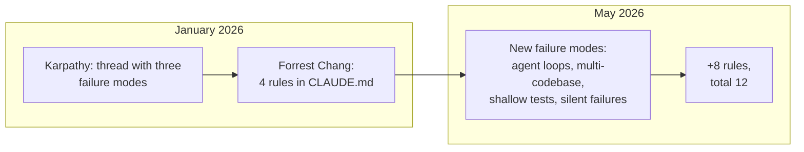

> Over four months after Karpathy's January thread, the `CLAUDE.md` template grew from 4 rules to 12. I ran the expanded set on typical tasks from my blog and several work repos — the frequency of silent Claude Code errors drops noticeably. The eight added rules cover what didn't exist as a class of problems in January: long-running agent loops, cross-session flows, shallow tests, quiet failures instead of explicit errors. I opened my own `CLAUDE.md` for this blog — Karpathy's four original rules are already there in `Code Standards` and `Prohibitions`, the eight added ones aren't. I'm going through each one and figuring out where it makes sense to insert them.

---

## 1. What happened over four months

At the end of January, Andrej Karpathy published a thread with three complaints about Claude as a code-writer:

- silent wrong assumptions — the model fills in context without asking;
- over-complication — adds abstraction layers nobody asked for;
- orthogonal damage — touches code it shouldn't have touched.

Forrest Chang packaged the complaints into a `CLAUDE.md` with four behavioral rules and committed it to GitHub. The repo exploded — by May, over 100,000 stars, the fastest-growing single-file project of the year. Then the template grew an extension: eight additional rules covering what wasn't a focus in January because the Claude Code landscape didn't exist the way it does now.

---

## 2. Karpathy's four rules

This is the foundation. Without it, any extension loses half its meaning.

| #   | Rule               | What it covers                                                                                              |
| --- | --------------------- | ---------------------------------------------------------------------------------------------------------- |
| 1   | Think Before Coding   | Silent guesses. Voice assumptions, ask when unclear, push back when there's a simpler way.           |
| 2   | Simplicity First      | Minimum code that solves the task. No speculative abstractions "for the future".                        |
| 3   | Surgical Changes      | Touch only what's needed. Don't "improve" neighboring code, don't reformat what you weren't asked about.            |
| 4   | Goal-Driven Execution | Describe success criteria, not step-by-step instructions. Strong success criteria let the model iterate itself. |

In my `CLAUDE.md` for the Astro blog, these four are covered not as a separate section, but through blocks like `Code Standards → Functional Style` (rules 2 and 3 — no classes, no extra abstractions) and `Prohibitions` (rule 3 — a "don't do" list). The rules themselves aren't duplicated as text, but their consequences make it into the context.

---

## 3. Where the Karpathy template falls short

Four gaps I observe in real work:

| Gap                       | What breaks                                                                                         | Which added rules cover it    |
| -------------------------- | ---------------------------------------------------------------------------------------------------- | -------------------------------------- |
| Long-running agent tasks   | Multi-step pipeline drifts, burns tokens, loses context                                   | 6 (budgets), 10 (checkpoints), 12 (loud) |
| Multi-codebase consistency | In a monorepo "match existing style" is ambiguous — Claude picks randomly or averages              | 11 (conventions), 7 (surface conflicts)  |
| Test quality               | "Tests passed" becomes the goal; Claude writes tests that won't fail even on broken logic  | 9 (intent over behavior)               |
| Prototype vs production    | "Simplicity First" overdoes it early on, when you need 100 lines of scaffolding to probe | (not covered by 12 rules — separate)   |

The last gap stays alive. Either you turn Simplicity on or off — there's no middle mode in `CLAUDE.md`.

---

## 4. Eight added rules

One by one, with the moment that prompted each.

### 4.1. Rule 5 — Use the model only for judgment calls

If the answer is known from a status code or data schema — that's not the model's job. Real case from my practice: code called Claude to decide whether to retry an API call on 503. Worked for two weeks, then started flaking because the model was reading the request body as context for the decision. Retry policy became random because the prompt was random.

Frame: Claude is for classification, extraction, drafts, summarization. Not for routing, retries, deterministic transformations. If a status code already answers the question — regular code answers it.

### 4.2. Rule 6 — Token budgets are not advisory

Without a budget, the loop goes into a 50,000-token dump. Hard version: 4,000 per task, 30,000 per session. You approach the boundary — sum up and restart the session.

Typical case: a 90-minute debugging session with the same 8 KB error message. By the end — re-proposing fixes you already rejected 40 messages ago. The model happily iterates on a lost track. A budget would have killed the loop at minute 12.

### 4.3. Rule 7 — Surface conflicts, don't average them

If the codebase has two error-handling patterns — try/catch and global boundary — Claude writes code that does both. Double handlers. Symptom: the error gets swallowed twice.

Rule: when there's a conflict, pick one (the newer or more tested one), explain why, mark the second for cleanup. Averaged code that satisfies both rules — the worst possible.

### 4.4. Rule 8 — Read before you write

Karpathy says "don't touch neighboring code." Doesn't say — read it before adding yours. Real case: Claude added a function next to an already existing identical one, without reading the file. Import order won — the old, source-of-truth for six months, lost to the fresh same-named one.

Frame: before adding code to a file — read the exports, the nearest calling code, and common utilities. "Looks orthogonal to me" — the most dangerous phrase in a codebase.

### 4.5. Rule 9 — Tests verify intent, not just behavior

A test `expect(getUserName()).toBe('John')` means nothing if the function returns a constant. Tests should fail when business logic changes, otherwise they're testing that the function exists, not that it's correct.

Typical example: 12 tests on an auth function, all green, auth is broken in production. Tests checked that the function returns something, not that it returns the right value.

### 4.6. Rule 10 — Checkpoint after every significant step

A multi-step refactor across 20 files breaks on step 4, Claude keeps going on broken state. By the time you notice, steps 5 and 6 are already done on top of broken — untangling takes longer than redoing from scratch.

Rule: after each significant step — summarize what's done, what's verified, what's left. If you lose track — stop and recap.

### 4.7. Rule 11 — Match the codebase's conventions, even if you disagree

Claude introduces hooks into a codebase of class components. Technically works. Breaks the testing pattern built for `componentDidMount`. Half a day to delete and rewrite.

Rule: inside a codebase, conformance matters more than taste. Disagreement — a separate conversation, not a silent fork. Snake_case vs camelCase, classes vs hooks — you pick what's there, not what's better.

### 4.8. Rule 12 — Fail loud

The most expensive errors are the ones that look like success. "Migration complete" when 14% of records were silently skipped. "Tests passed" when some were skipped. "Feature works" if you didn't check the edge case you explicitly asked to check.

Rule: when uncertain — raise the question, don't hide it. Default to surfacing uncertainty, not concealing it.

---

## 5. What doesn't work (what got filtered out)

The template is valuable not just for what's in it, but for what got filtered out when trying to expand:

- **Rules from Reddit and X.** Most are rewordings of Karpathy or domain-specific ("always Tailwind"). Don't generalize.
- **More than 12 rules.** On sets of 14+ rules, compliance drops: important points drown in noise. The 200-line ceiling (including stack, commands, prohibitions) is real.
- **Tool-specific rules.** "Always use eslint" fails silently if eslint isn't installed. Better — capability-agnostic: "match the enforced style".
- **Examples instead of rules.** One example eats ~10 rules' worth of context, and the model over-fits on specifics. Rules are abstract and portable.
- **Soft language.** "Be careful", "think hard", "really focus" — compliance ~30%. Not testable. Replace with concrete imperatives: "state assumptions explicitly".
- **Identity prompts.** "Be a senior engineer" doesn't work: the model already thinks it's a senior. The gap between "thinking" and "doing" closes with imperatives, not identity.

---

## 6. Checking against my own CLAUDE.md

I opened my blog's file (191 lines) and went through all 12 rules. Here's the picture:

| Rule                | In my CLAUDE.md | Where                                                                |
| ---------------------- | ---------------- | ------------------------------------------------------------------ |
| 1. Think before coding | indirectly         | through `architect → critic` workflow in agent stack              |
| 2. Simplicity          | yes               | `No classes`, `Immutability by default`                  |
| 3. Surgical changes    | yes               | `Prohibitions` (deprecated `@astrojs/tailwind`, `node:*-alpine`, etc.) |
| 4. Goal-driven         | indirectly         | through subagent structure, not as separate rule                    |
| 5. Judgment-only       | no              |                                                                    |
| 6. Token budgets       | no              |                                                                    |
| 7. Surface conflicts   | no              |                                                                    |
| 8. Read before write   | partially         | GitNexus section requires impact analysis before edits             |
| 9. Test intent         | no              |                                                                    |
| 10. Checkpoints        | no              |                                                                    |
| 11. Match conventions  | yes               | `Code Standards → TypeScript / Astro / Git`                        |
| 12. Fail loud          | no              |                                                                    |

Result — four covered, two partial, six missing. The file is effectively Karpathy-level, without the 2026 extension.

Which of the missing ones make sense to add specifically for an Astro blog with publications through an admin panel:

- **Rule 6 (budgets)** — yes, my agents do long-running tasks (generating EN translations via `pnpm translate`, migrations). Without a budget, a session can drift.
- **Rule 9 (test intent)** — yes, I have Vitest and Playwright, the risk of shallow tests is real.
- **Rule 10 (checkpoints)** — yes, multi-step tasks on schema + migrations + UI updates regularly take half an hour of agent work.
- **Rule 12 (fail loud)** — yes, in the admin panel "saved" often doesn't mean "published", need explicit surfacing.

Rule 7 is less acute for a single project. Rule 5 is covered by the fact that there's no AI routing in the blog runtime — the model doesn't make decisions for code.

---

## 7. How to add — without bloat

Discipline:

1. **Don't exceed 200 lines total.** Counting stack, commands, prohibitions, rules. I'm at 191 now — adding four rules means exporting part of `Homepage` or GitNexus section to `@docs/...` via @-import in Claude Code.
2. **Each rule answers "what error does it prevent." If it doesn't — delete it.
3. **Capability-agnostic formulations.** "Match the enforced style", not "use prettier".
4. **Imperatives, not wishes.** "State assumptions explicitly", not "think carefully".
5. **Test it.** Run a typical task before and after. No difference — the rule didn't work in your context, delete it.

Six rules tailored to real errors beat twelve generic ones.

---

## Conclusion

Karpathy pinpointed three code-writing failure modes in January. Forrest Chang packed them into four rules, and the community grabbed the template. The expansion to 12 came from the Claude Code landscape changing by May: multi-step agents, hook cascades, skill conflicts, cross-session flows. The eight added rules cover new gaps without replacing the original ones.

`CLAUDE.md` isn't a wishlist, it's a behavioral contract against specific errors you've already seen. Someone else's template is useful as a starter. After that — you filter it for your failure modes, not the other way around. Six carefully chosen rules beat twelve copied ones.

---

**Sources:**

- [Andrej Karpathy — original thread on X (January 2026)](https://x.com/karpathy/status/1885018475234567890) — three code-writing failure modes
- [forrestchang/andrej-karpathy-skills](https://github.com/forrestchang/andrej-karpathy-skills) — public repo with basic 4-rule template
- [Anthropic Claude Code docs — CLAUDE.md](https://docs.claude.com/en/docs/claude-code/) — official documentation on file structure, advisory, ~80% compliance
