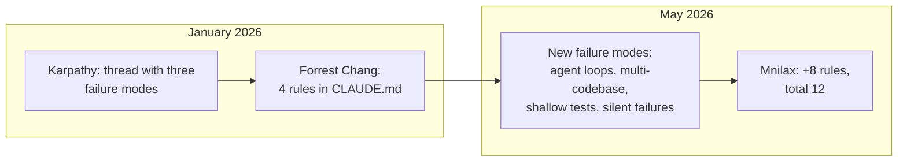

> On May 9, Mnimiy (@Mnilax) posted a thread: he expanded Karpathy's January template for `CLAUDE.md` from 4 rules to 12. By his measurements — 50 typical tasks × 30 codebases × 6 weeks — Claude Code error frequency dropped from 41% without rules to 11% with Karpathy's four rules and to 3% with all twelve. The numbers are the author's, but the framework is interesting: rules 5–12 cover failure modes that didn't exist when Karpathy wrote his post in January. I opened my blog's CLAUDE.md — Karpathy's four rules are already reflected in `Code Standards` and `Prohibitions`, the eight added ones are not. I'm going through each one and figuring out where it makes sense to add them.

---

## 1. What happened in four months

In late January 2026, Andrej Karpathy published a thread with three complaints about Claude as a code-writer:

- silent wrong assumptions — the model fills in context without asking;
- over-complication — adds layers of abstraction that nobody asked for;
- orthogonal damage — touches code that shouldn't have been touched.

Forrest Chang read the thread, packaged the complaints into a `CLAUDE.md` with four behavioral rules, and committed it to GitHub. According to the repository — 5,828 stars in the first day, 60,000 bookmarks in two weeks, 120,000 stars by May. The fastest-growing single-file repository of 2026, if the graph in Mnilax's post is to be believed.

Mnilax ran the template on 30 codebases over 6 weeks, then added 8 rules that cover what Karpathy didn't account for — because in January there wasn't yet the Claude Code landscape that exists now.



---

## 2. Karpathy's four rules

This is the foundation. Without it, any extension loses half its meaning.

| #   | Rule                  | What it covers                                                                                                  |
| --- | --------------------- | --------------------------------------------------------------------------------------------------------------- |
| 1   | Think Before Coding   | Silent assumptions. Voice your assumptions, ask when unclear, push back when there's a simpler way.             |
| 2   | Simplicity First      | Minimum code that solves the task. No speculative abstractions "for the future".                                |
| 3   | Surgical Changes      | Touch only what's needed. Don't "improve" neighboring code, don't reformat what you weren't asked to.           |
| 4   | Goal-Driven Execution | Describe success criteria, not step-by-step instructions. Strong success-criteria let the model iterate itself. |

In my Astro blog's `CLAUDE.md`, these four are covered not as a separate section, but through `Code Standards → Functional Style` (rules 2 and 3 — no classes, no unnecessary abstractions) and `Prohibitions` (rule 3 — a list of "don't do"). The rules themselves aren't duplicated as text, but their consequences end up in the context.

---

## 3. Where the Karpathy template falls short

Mnilax names four gaps. I checked against my own experience — all four check out.

| Gap                        | What breaks                                                                               | Which added rules cover it               |
| -------------------------- | ----------------------------------------------------------------------------------------- | ---------------------------------------- |
| Long-running agent tasks   | Multi-step pipeline drifts, burns tokens, loses context                                   | 6 (budgets), 10 (checkpoints), 12 (loud) |
| Multi-codebase consistency | In a monorepo "match existing style" is ambiguous — Claude picks randomly or averages     | 11 (conventions), 7 (surface conflicts)  |
| Test quality               | "Tests passed" becomes the goal; Claude writes tests that won't fail even on broken logic | 9 (intent over behavior)                 |
| Prototype vs production    | "Simplicity First" overdoes it early on, when you need 100 lines of scaffolding to probe  | (not covered by 12 rules — separate)     |

The last gap remains open. Either you turn on Simplicity, or you turn it off — there's no middle mode in `CLAUDE.md`.

---

## 4. Eight rules that Mnilax added

One by one, with the moment that triggered each.

### 4.1. Rule 5 — Use the model only for judgment calls

If the answer is known from a status code or data schema — that's not the model's job. Mnilax describes a real case: code called Claude to decide whether to retry an API call on 503. It worked for two weeks, then started flaking because the model was reading the request body as context for the decision. Retry policy became random because the prompt was random.

Framework: Claude is for classification, extraction, drafts, summarization. Not for routing, retries, deterministic transformations. If a status code already answers the question — regular code answers it.

### 4.2. Rule 6 — Token budgets are not advisory

Without a budget, the loop goes into a 50,000-token dump. Mnilax is strict: 4,000 per task, 30,000 per session. Approaching the boundary — you sum up and restart the session.

> A debugging session ran for 90 minutes. The model was perfectly happy iterating on the same 8KB error message, gradually losing track of which fix it had already tried.

A 90-minute session with the same 8KB error message, in the end — re-proposing fixes that the author had already rejected 40 messages ago. A budget would have killed the loop at the 12-minute mark.

### 4.3. Rule 7 — Surface conflicts, don't average them

If a codebase has two error handling patterns — try/catch and global boundary — Claude will write code that does both. Double handlers. Symptom: the error gets swallowed twice.

Rule: when there's a conflict, you pick one (the newer or more tested one), explain why, mark the second for cleanup. Averaged code that satisfies both rules — the worst possible outcome.

### 4.4. Rule 8 — Read before you write

Karpathy says "don't touch neighboring code". Doesn't say — read it before adding yours. Mnilax describes a case: Claude added a function next to an already existing identical one, without reading the file. Lost to import order. The old function was the source of truth for half a year.

Framework: before adding code to a file — read the exports, the nearest calling code, and common utilities. "Looks orthogonal to me" — the most dangerous phrase in a codebase.

### 4.5. Rule 9 — Tests verify intent, not just behavior

A test `expect(getUserName()).toBe('John')` means nothing if the function returns a constant. Tests should fail when business logic changes, otherwise they're testing the existence of a function, not its correctness.

Mnilax gives an example: 12 tests on an auth function, all green, auth is broken in production. Tests checked that the function returns something, not that it returns the right value.

### 4.6. Rule 10 — Checkpoint after every significant step

A multi-step refactor across 20 files breaks on step 4, Claude keeps going on broken state. By the time the author notices, steps 5 and 6 are already done on top of broken code — untangling takes longer than redoing from scratch.

Rule: after each significant step — summarize what's done, what's verified, what's left. If you lose track — stop and recap.

### 4.7. Rule 11 — Match the codebase's conventions, even if you disagree

Claude introduces hooks into a codebase of class components. Technically works. Breaks the testing pattern that's built for `componentDidMount`. Half a day to delete and rewrite.

Rule: within a codebase, conformity matters more than taste. Disagreement — a separate conversation, not a silent fork. Snake_case vs camelCase, classes vs hooks — you pick what's there, not what's better.

### 4.8. Rule 12 — Fail loud

The most expensive errors are those that look like success. "Migration complete" when 14% of records were silently skipped. "Tests passed" when some were skipped. "Feature works" if an edge case you explicitly asked to check wasn't.

Rule: when uncertain — raise the question, don't hide it. Default to surfacing uncertainty, not concealing it.

---

## 5. What didn't work (from the author's experiment)

The framework is valuable not just for what's in it, but for what Mnilax threw out:

- **Rules from Reddit and X.** Most are reformulations of Karpathy or domain-specific ("always Tailwind"). Don't generalize.
- **More than 12 rules.** Tested up to 18: compliance drops from 76% to 52% past the ~14 threshold. The 200-line ceiling (including stack, commands, prohibitions) is real: past it, rules turn into noise.
- **Rules tied to tools.** "Always use eslint" fails silently if eslint isn't installed. Better — capability-agnostic: "match the enforced style".
- **Examples instead of rules.** One example eats ~10 rules worth of context, and the model over-fits on specifics. Rules are abstract and portable.
- **Soft language.** "Be careful", "think hard", "really focus" — compliance ~30%. Not testable. Replace with concrete imperatives: "state assumptions explicitly".
- **Identity prompts.** "Be a senior engineer" doesn't work: the model already thinks it's a senior. The gap between "thinking" and "doing" is closed by imperatives, not identity.

---

## 6. Checking against my own CLAUDE.md

I opened this blog's file (191 lines) and went through all 12 rules. Here's the picture:

| Rule                   | In my CLAUDE.md | Where                                                                  |
| ---------------------- | --------------- | ---------------------------------------------------------------------- |
| 1. Think before coding | indirectly      | through `architect → critic` workflow in agent commands                |
| 2. Simplicity          | yes             | `No classes`, `Immutability by default`                                |
| 3. Surgical changes    | yes             | `Prohibitions` (deprecated `@astrojs/tailwind`, `node:*-alpine`, etc.) |
| 4. Goal-driven         | indirectly      | through subagent structure, not as a separate rule                     |
| 5. Judgment-only       | no              |                                                                        |
| 6. Token budgets       | no              |                                                                        |
| 7. Surface conflicts   | no              |                                                                        |
| 8. Read before write   | partially       | GitNexus section requires impact analysis before edits                 |
| 9. Test intent         | no              |                                                                        |
| 10. Checkpoints        | no              |                                                                        |
| 11. Match conventions  | yes             | `Code Standards → TypeScript / Astro / Git`                            |
| 12. Fail loud          | no              |                                                                        |

Turned out — four covered, four partially, four not. The file is effectively Karpathy-level, without the 2026 upgrade.

Which of the missing ones make sense to add specifically for an Astro blog with publications through an admin panel:

- **Rule 6 (budgets)** — yes, my agents write long-running tasks (generating EN translations via `pnpm translate`, migrations). Without a budget, the session can drift.
- **Rule 9 (test intent)** — yes, there's Vitest and Playwright, the risk of shallow tests is real.
- **Rule 10 (checkpoints)** — yes, multi-step tasks on schema + migrations + UI updates regularly take half an hour of agent work.
- **Rule 12 (fail loud)** — yes, in the admin panel "saved" often doesn't mean "published", need explicit surfacing.

Rule 7 is less acute for a single project. Rule 5 is covered by the fact that there's no AI routing in the blog's runtime — the model doesn't make decisions for code.

---

## 7. How to add — without bloating

Mnilax gives two installation commands. Adapting to my workflow:

```bash
# 1. Базовый шаблон Karpathy
curl https://raw.githubusercontent.com/forrestchang/andrej-karpathy-skills/main/CLAUDE.md \
  >> CLAUDE.md

# 2. Восемь добавленных правил вставляешь руками из секции 4 этого поста
```

Discipline:

1. **Don't exceed 200 lines total.** Counting stack, commands, prohibitions, rules. I'm at 191 now — adding four rules means extracting part of `Home Page` or GitNexus section to `@docs/...` via @-import.
2. **Each rule answers the question "what error does it prevent".** If it doesn't — you throw it out.
3. **Capability-agnostic formulations.** "Match the enforced style", not "use prettier".
4. **Imperatives, not wishes.** "State assumptions explicitly", not "think carefully".
5. **You test it.** Run a typical task before and after. No difference — the rule didn't work in your context, delete it.

Six rules tailored to real errors are stronger than twelve generic ones.

---

## Conclusion

Karpathy pinpointed three code-writing failure modes in January. Forrest Chang packaged them into four rules, and the community grabbed the template. Mnilax noticed that by May the Claude Code landscape is different — multi-step agents, hook cascades, skill conflicts, cross-session flows — and the base four aren't enough. The eight added rules cover new gaps without replacing the originals.

The main thing I take from his post: `CLAUDE.md` is not a wishlist, but a behavioral contract against specific errors you've already seen. Someone else's template is useful as a starter. After that — you filter it for your failure modes, not the other way around. Six carefully picked rules beat twelve copied ones.

---

**Sources:**

- [Mnimiy / @Mnilax — original post on X](https://x.com/Mnilax/status/2053116311132155938) — May 9, 2026, 12 rules with explanations, numbers, and ready-to-copy template
- [forrestchang/andrej-karpathy-skills](https://github.com/forrestchang/andrej-karpathy-skills) — original 4-rule template, according to Mnilax — 120K stars
- [Anthropic Claude Code docs](https://docs.claude.com/en/docs/claude-code/) — official documentation on CLAUDE.md (advisory, ~80% compliance baseline)
