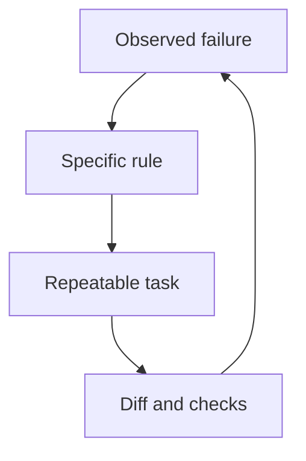

CLAUDE.md earns its place when it addresses a recurring mistake. An agent that runs the wrong test needs the actual command. An agent that rewrites a neighboring module needs a scope boundary. Another paragraph asking for “high quality” rarely explains what to do differently.

This revision removes compliance percentages and a claimed comparison across 30 repositories. There is no reproducible report here supporting those numbers. The rules below are an editorial checklist, not a measured ranking of prompts.

## Where the rules come from

The [andrej-karpathy-skills repository](https://github.com/multica-ai/andrej-karpathy-skills) describes four principles: think before coding, keep solutions simple, make surgical changes, and define verifiable goals. It packages ideas based on Karpathy’s observations. It does not substantiate the numerical results in the previous version of this article.

Those principles are the starting point. The remaining items are a practical adaptation for repository work.

## Twelve rules and their evidence

| Rule | Evidence left after the task |
| --- | --- |
| 1. State the outcome before editing | One sentence describing expected behavior |
| 2. Separate facts from assumptions | Unknowns that could change the decision |
| 3. Read the existing execution path | References to the handler, caller and check |
| 4. Pick the simplest sufficient solution | A reason for each new abstraction |
| 5. Keep changes within scope | No unrelated refactoring in the diff |
| 6. Preserve other unfinished work | The initial git status informed the edits |
| 7. Report failures explicitly | Failed checks and their causes are visible |
| 8. Test observable behavior | A test reproduces the original problem |
| 9. Report only checks actually run | Commands in the report have real results |
| 10. Bound tool output | Relevant excerpts replace complete log dumps |
| 11. Hand off unfinished work clearly | State, blocker and next step are recorded |
| 12. Remove obsolete instructions | Guidance matches the current repository |

A small project may need only a few of these. Keep the instructions that address observed problems.

## A template for this blog

The artka.dev repository is not published, but it has separate commands for types, translations and builds, which makes concrete instructions possible. My GitHub profile is [node-develop](https://github.com/node-develop). Here is an excerpt from this blog’s CLAUDE.md:

```markdown
## Before editing
- Read git status and preserve other unfinished work.
- Name the URL or user action whose behavior will change.
- Reproduce a reported bug before fixing it.

## Verification
- After type changes: pnpm typecheck.
- After a Russian article edit: update English and run pnpm translate:check.
- After content rendering changes: pnpm build.
- Report completed checks and remaining limitations.
```

These commands may be wrong for another project. Its package.json, CI and README should determine the template. Copying command names without checking them merely introduces another failure.

## What instructions cannot enforce

The [Claude Code memory documentation](https://code.claude.com/docs/en/memory) distinguishes contextual instructions from executable configuration. Keeping CLAUDE.md under 200 lines is guidance, not an enforcement guarantee. `@path` imports organize text; imported material still loads into context.

Use environment and application controls for secrets, write access and publishing. “Do not touch .env” cannot replace keeping production credentials out of an agent’s environment. The course explains [CLAUDE.md](/en/courses/claude-code-guide/03-claude-md/) and [hooks](/en/courses/claude-code-guide/05-hooks/) separately.

## Evaluate a change on your own tasks

Choose several tasks where the agent previously failed. Record the starting commit, model, settings and exact request. Run the old and new instructions in separate working copies. Compare accepted changes, unrelated edits, manual corrections and cost per completed task.

One successful run does not establish an improvement. When results vary, describing the failure conditions is more useful than publishing a universal reliability percentage. Keep a rule when you can name the mistake it addresses and check whether that mistake returns.

## Evaluate a rule in one cycle



Start with an observed failure. A repeated task and diff review show whether the instruction earns its place.
