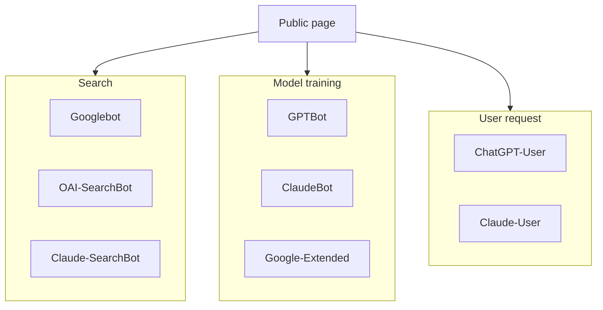
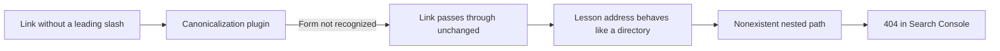

> Search Console reported 8 indexed pages and 177 non-indexed pages for artka.dev. Of those, 112 were in the "crawled, currently not indexed" state. Sitemaps were processed successfully, all 70 addresses return 200, every checked page has crawling allowed, and the canonical address matches Google's selected one. I took the site apart piece by piece and found three real bugs, one of them living inside a link-processing plugin. Along the way I also found out what this kind of audit doesn't fix.

---

## 1. The report: 112 pages "crawled, currently not indexed"

Numbers as of September 19, 2026, for the resource `sc-domain:artka.dev`.

| Status                            | Pages |
| --------------------------------- | ----: |
| Indexed                           |     8 |
| Crawled, currently not indexed    |   112 |
| Not found (404)                   |    30 |
| Alternate page with canonical tag |    13 |
| Page with redirect                |     9 |
| Discovered, not indexed           |     9 |
| Blocked by robots.txt             |     2 |
| Blocked by noindex tag            |     1 |

Over 90 days: 8 clicks, 35 impressions, average position 9.9, two queries in the report, both for the brand name.

A hundred and twelve pages in the "crawled, currently not indexed" state mean exactly one thing: the robot came, read the page, and passed. URL inspection on each of them showed the same picture: crawling allowed, fetch successful, indexing allowed, the user's canonical matches Google's selected one. No obstacles anywhere.

One detail turned out to matter more than all the rest. The `/blog/` page — the article list — was last crawled on May 25. I ran this audit on September 19: the robot hadn't visited it for almost four months.

That set the order of work. First rule out access, then look for what the robot is seeing instead of the content.

---

## 2. Access: three tasks people often mix up

The first thing you check when indexing is complained about is robots.txt. And the first thing you usually find there is three different tasks blended into one file.

| Task                              | What to check                                                     |
| --------------------------------- | ----------------------------------------------------------------- |
| Appearing in Google Search        | Googlebot, HTTP response, noindex, canonical, and page usefulness |
| Being used to train models        | The rules for the relevant training bot                           |
| Being fetched on a user's request | The behavior of the specific service and its fetcher bot          |



At [OpenAI](https://developers.openai.com/api/docs/bots), GPTBot belongs to training, OAI-SearchBot to search, and ChatGPT-User fetches pages on user action — for which robots.txt may not even apply. [Anthropic's documentation](https://support.claude.com/en/articles/8896518-does-anthropic-crawl-data-from-the-web-and-how-can-site-owners-block-the-crawler) lists ClaudeBot, Claude-SearchBot, and Claude-User. Google-Extended isn't a Google Search indexing switch: you need to check the token's actual purpose in [Google's list of crawlers](https://developers.google.com/crawling/docs/crawlers-fetchers/google-common-crawlers).

Allowing one bot says nothing about the configuration of the rest. And none of these permissions answer the question of why Google did or didn't select a page for the index.

A separate trap: you can't hide a noindex directive behind Disallow. For the robot to read it in the HTML, it has to fetch the page. If crawling is disallowed, the directive stays unread, and [Google explains this limitation](https://developers.google.com/search/docs/crawling-indexing/block-indexing) directly. That's why the site's internal search stays open to crawling and gets closed off via noindex instead.

Check the server response with a plain GET, not HEAD:

```bash
curl -sS -D /tmp/headers.txt https://artka.dev/blog/ -o /tmp/page.html
```

In the headers, look at the status and the absence of an unwanted `X-Robots-Tag: noindex`; in the HTML, check the page's own canonical and the absence of an unwanted meta robots tag. If there's a redirect, check the final address too: a first 301 can lead to a 404. Spoofing the User-Agent via curl shows the server's response to a given string, but it doesn't prove access for the real Googlebot, because a reverse proxy can verify request origin separately.

The short answer on `llms.txt`: [Google has clarified](https://developers.google.com/search/updates) that it isn't required for Google Search and has no effect on visibility. On artka.dev, [this file](/llms.txt) lives as a directory of material for clients that know how to read it, and nothing more. The actual access policy lives in [robots.txt](/robots.txt): the named groups in it repeat the restrictions on closed routes, because restrictions in the catch-all group don't add to a more specific group.

In my case, this section closed out quickly: no blocks were found at all, which the "crawled" status itself confirms. The robot got everything.

---

## 3. Where things broke: links the robot never saw

Three findings, in increasing order of unpleasantness.

### 3.1. The article feed served the robot two-thirds of the archive

The `/blog/` list rendered four cards server-side; the rest was pulled in by a script from `/blog/partials/<number>/` chunks. The chunks were served with an `X-Robots-Tag: noindex` header, and there was no ordinary link to page two in the markup at all — no `noscript` block either.

For a robot that doesn't execute scripts, the archive ended at the fourth article. With six published, that cost two articles. The hidden share grows linearly:

$$\text{hidden article share} = 1 - \frac{\text{page size}}{N}$$

With twenty articles and a page size of four, sixteen out of twenty are left without links. Tag archives and "related" blocks inside articles helped, but that's luck, not design.

### 3.2. Forty addresses with the same text

Every article and every lesson has a Markdown twin at the same address with a `.md` suffix, linked from the page header. The twins were served with a 200 status, `text/markdown` type, no `X-Robots-Tag`, and no canonical address. A comment in the route code claimed that the response header carried a canonical address; the function assembling that response only set the content type.

Around forty addresses carrying a full copy of the text. Since the files are served as static assets, you can't attach headers to them, and a rule in robots.txt turned out to be more practical: every AI agent has its own group in the file, so a disallow in the catch-all group closes the twins off for Google and Bing without touching the rest.

### 3.3. The link-canonicalization plugin skipped the bare relative form

This was the most interesting find. Search Console had thirty addresses like these hanging around:

```text
/courses/claude-code-guide/11-models-and-pricing/12-travel-agent-blueprint
/courses/claude-code-guide/08-tool-calls-and-loop/09-subagents
/en/courses/claude-code-guide/14-claims-verification/02-context-and-cache
```

A lesson inside a lesson. The source turned out to be in the plugin that normalizes internal links into their canonical form. The input check looked like this:

```ts
if (!href.startsWith("/") && !href.startsWith("./") && !href.startsWith("../")) return href;
```

The link `./09-subagents` got processed and turned into `../09-subagents/`. The bare `09-subagents` slipped past every check and went into the markup as-is. With `trailingSlash: "always"` configured, a lesson's address ends in a slash and behaves like a directory, so the browser and the robot both appended the target onto it.



The difference between the two spellings of the same thing was arbitrary. A one-line fix: treat the bare form the same as `./`, and check against known schemes (`javascript:`, `data:`, `mailto:`) instead of three specific prefixes.

By then, thirty addresses had already spread through other people's links and the robot's memory, so alongside the plugin fix I added a recovery rule: if the last two segments of an address are both known lesson slugs, the appended tail is the actual target. One rule instead of enumerating every pair — which, with fourteen lessons and five prefix forms, comes to 980.

The result on the live site: 27 of 30 addresses now reach the real page. The remaining three deliberately return 404, including `/terms`, which never existed. Redirecting a nonexistent page to something semantically similar is a soft 404, not a fix.

### 3.4. What changed in the numbers

All measurements were taken against the live site, before and after the deploy.

| Check                              | Before           | After                       |
| ---------------------------------- | ---------------- | --------------------------- |
| Article links in `/blog/` HTML     | 4                | 6                           |
| Article links in the homepage HTML | 4                | 6                           |
| Response for `/blog/partials/2/`   | 200 with noindex | 404                         |
| Appended lesson address            | 404              | 301, final page 200         |
| Markdown twins for search robots   | open             | closed by a robots.txt rule |

One caveat about the redirect. Search Console stores addresses without a trailing slash, and for that form there are actually two hops: first the server adds the slash, then the recovery rule kicks in. Robots pass through both without loss, but there's no "single 301" for that form, and checking with the slash won't show it. You need to check exactly the form that's in the report.

---

## 4. Markup: a graph that didn't add up

An article has an author, a site, and its own address. When that information is assembled across different components, it's easy to end up with two authors at different addresses, or an update date that doesn't match the visible page. A single JSON-LD graph is useful because such discrepancies become visible.

The `@graph` itself doesn't guarantee indexing, a rich snippet, or citation. Several separate, correct blocks are also fine. Choosing one graph is a maintenance decision.

An abbreviated example of the connections:

```json
{
  "@context": "https://schema.org",
  "@graph": [
    { "@type": "Person", "@id": "https://artka.dev/#person", "name": "Artyom Kashuta" },
    {
      "@type": "WebSite",
      "@id": "https://artka.dev/#website",
      "url": "https://artka.dev/",
      "name": "artka.dev"
    },
    {
      "@type": "WebPage",
      "@id": "https://artka.dev/blog/example/#webpage",
      "url": "https://artka.dev/blog/example/",
      "isPartOf": { "@id": "https://artka.dev/#website" }
    },
    {
      "@type": "BlogPosting",
      "@id": "https://artka.dev/blog/example/#article",
      "author": { "@id": "https://artka.dev/#person" },
      "mainEntityOfPage": { "@id": "https://artka.dev/blog/example/#webpage" }
    }
  ]
}
```

The invariant: the page address in the graph, in the canonical, in the sitemap, and in internal links all denote the same URL form. On this site, that's with a trailing slash. The English version has its own address under `/en/`; languages connect through hreflang, not by swapping the canonical for the Russian original.

Inserting JSON into HTML needs a serializer that doesn't let the string `</script>` close the element early. String concatenation from frontmatter doesn't cut it here.

Now for the bug I found. On every article page, the `BlogPosting` node referenced the blog node through `isPartOf` using the identifier `https://artka.dev/#blog-ru`. That node was only ever output on `/blog/`. So the only connection between an article and the publication itself never resolved on a single article in either language: the link hung in empty space, right where the graph was supposed to earn its keep.

A similar story on project pages: the collection had no `breadcrumb` field, even though breadcrumbs were rendered on the page, and a project page had no `mainEntity`, so the work description hung there on its own.

The takeaway for build checks: a markup validator doesn't catch this kind of thing, because each individual node is correct on its own. What catches it is walking the graph and looking for `@id` links with no matching node in the same document. That check takes half an hour to write and would have caught both bugs at once. One caveat: links to a node in another language are meant to point at a different document and should be on an allowlist of exceptions, or the check will just be noise.

And an honest boundary. [Google describes](https://developers.google.com/search/docs/appearance/structured-data/intro-structured-data) structured data as a way to explain content and become eligible for supported display formats; display isn't guaranteed. The rich result for `FAQPage` has been removed from the gallery, and the FAQ section stays useful to readers and language models, but you can't promise a search bonus for it.

---

## 5. What gets served to the robot ready-made

A robot that doesn't execute scripts has to get its content from the markup. Diagrams on a technical site make this vivid: if you prepare them at build time, the reader doesn't need to load a renderer and turn source text into an image, and the robot doesn't need to execute anything.

On artka.dev that's `rehype-mermaid` in the Astro 7 pipeline:

```typescript
import { defineConfig } from "astro/config";
import { unified } from "@astrojs/markdown-remark";
import mdx from "@astrojs/mdx";
import rehypeMermaid from "rehype-mermaid";

export default defineConfig({
  integrations: [mdx()],
  markdown: {
    processor: unified({
      rehypePlugins: [[rehypeMermaid, { strategy: "img-svg", dark: true }]],
    }),
  },
});
```

Astro 7 changed the default Markdown processor, so the unified pipeline for remark and rehype plugins is kept explicitly; this is described in the [migration guide](https://docs.astro.build/en/guides/upgrade-to/v7/). The snippet is abbreviated: the working configuration also handles internal links, headings, images, and formulas.

After the build, the diagram is visible in the HTML under `dist/client/`, and the published page keeps it even with JavaScript disabled. The cost of this scheme: the renderer runs in the build environment, so the browser and its system dependencies get installed in CI before the build, and the browser version needs to match the Playwright version from the lockfile.

If you want to measure what this costs, measure it honestly. Pin the commit, the Node and dependency versions, the machine, and the number of blocks. Compare the same set of pages in two copies: one with rendering, one with pre-built SVGs. Separate out dependency installation, the first run in a fresh environment, a rebuild, and total CI time. One cold and one warm run don't let you attribute the difference to the diagrams — other caches change too.

An alternative for explicit artifact files, [mermaid-cli](https://github.com/mermaid-js/mermaid-cli), can compile Mermaid blocks in Markdown into SVGs and links to them:

```bash
mmdc -i readme.template.md -o readme.md
```

The choice between it and rehype depends on how content is organized: a diagram sitting next to its paragraph is more convenient in the pipeline, a separate set of diagrams is more convenient as files. The full composition of this site's pipeline is described on the [project page](/en/projects/astro-blog/).

---

## 6. What none of this fixes

This is the honest part, the reason this audit was worth writing up.

Every fix above removed friction. None of it answers the question of why 112 pages are crawled and not indexed. The answer comes from a different number: out of 35 addresses in the Russian sitemap, exactly one contains text longer than a thousand words. The rest are articles under five hundred words and lessons from the [Claude Code course](/en/courses/claude-code-guide/) running 250 to 400 words, which account for 30 of the 35 addresses.

The robot got everything, read it, and decided it wasn't worth a spot in the index. Requesting indexing through URL inspection puts the address into a priority crawl queue, which just makes the robot come back sooner. It will make the same decision against the same material.

From here, a working sequence, not a "10 ways to fix it" list:

1. Confirm access exists. A "crawled" status is already proof.
2. Confirm internal links lead to pages, and that the robot can see them without scripts.
3. Remove duplicates: copies of the text at other addresses, competing pages on the same topic.
4. Fix the markup so it describes what's actually visible on the page.
5. Only then look at volume and value of the material, because steps one through four without step five give you a well-functioning site with nothing to show.

That order matters because steps one through four can be checked in a day and give an unambiguous answer, while the fifth takes weeks and doesn't guarantee one.

---

## Summary

Out of 185 known Google addresses, eight were indexed. The audit showed that none of them was blocked, none returned an error, sitemaps were processed, and canonical addresses matched. Three real bugs turned up — not in access settings, but in code: the article list hid two-thirds of the archive from the robot, around forty addresses duplicated text in Markdown, and a link-canonicalization plugin skipped one of two equivalent forms of a relative link, producing thirty nonexistent addresses.

All three are fixed, and that was the right work to do. But it doesn't answer the original question. A site where one piece of material out of thirty-five is longer than a thousand words gets exactly the response from Google that it got. The technical part removes reasons to say no; the reason to say yes only shows up along with the text. It's worth starting an indexing audit with access and links — but you'll have to finish it with content.

---

**Sources:**

- [Google Search Central: structured data](https://developers.google.com/search/docs/appearance/structured-data/intro-structured-data) — the purpose of markup and the limits of its guarantees
- [Google Search Central: blocking indexing](https://developers.google.com/search/docs/crawling-indexing/block-indexing) — why noindex can't be hidden behind Disallow
- [Google Search Central: requesting recrawling](https://developers.google.com/search/docs/crawling-indexing/ask-google-to-recrawl) — what an indexing request does and doesn't do
- [Google's list of crawlers](https://developers.google.com/crawling/docs/crawlers-fetchers/google-common-crawlers) — token purposes, including Google-Extended
- [OpenAI: bots](https://developers.openai.com/api/docs/bots) — GPTBot, OAI-SearchBot, ChatGPT-User
- [Anthropic: crawling the web](https://support.claude.com/en/articles/8896518-does-anthropic-crawl-data-from-the-web-and-how-can-site-owners-block-the-crawler) — ClaudeBot, Claude-SearchBot, Claude-User
- [Astro: v7 upgrade guide](https://docs.astro.build/en/guides/upgrade-to/v7/) — the default Markdown processor change
- [mermaid-cli](https://github.com/mermaid-js/mermaid-cli) — compiling Markdown diagrams to SVG files
