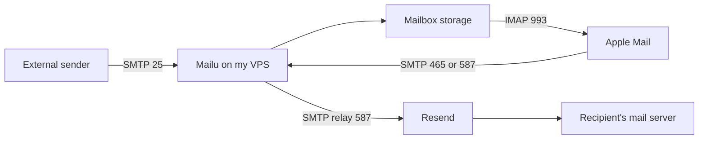
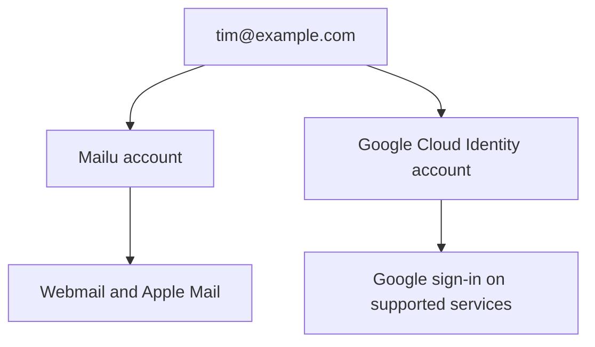

> I wanted to receive and send email from my own domain in Apple Mail. I already paid for a VPS and had Resend through Lenny’s Product Pass. Could I use those for two or three people without buying Google Workspace? I installed Mailu through Dokploy, configured Resend for outgoing messages, and added a separate Google Cloud Identity account. Below are the settings I used, the errors I had to fix, and the checks I completed.

## 1. I wanted one mailbox for a small team

I had a domain at Name.com and wanted an address on it. The requirements were ordinary: receive mail, reply from that address, keep the messages in folders, and use the Mail app on my Mac. Eventually, another one or two people would need their own accounts.

I use `example.com`, `tim@example.com`, and generic project names below because I am keeping the actual domain private. The configuration and the errors described here are from my installation.

I already had Resend Transactional Pro, Railway Hobby, and Google AI Pro through [Lenny’s Product Pass](https://www.lennysproductpass.com/). Separately, I paid for a Hostinger VPS with Dokploy installed. Before subscribing to a mail service, I wanted to see whether these would cover what I needed.

Product Pass lists one-year offers for those three products at the time of writing. Access depends on the membership and each partner’s terms. Renewing the newsletter does not renew an offer you have already used. Check the current terms and expiry dates if you plan to use the same subscriptions.

I initially thought a mailbox with my domain might also give me Google sign-in. It does not. Mailu receives and stores my mail, Resend sends it to other providers, and Cloudflare hosts the DNS records. I registered the Google account separately after the mailbox worked.

I used Codex to operate the dashboards, configure the server, and run checks. I chose the services, supplied the account information, and entered passwords when needed. This post describes the installation and checks completed on September 12, 2026.

### What the setup costs

I did not buy a new mailbox subscription. I was already paying for the domain, VPS, and the newsletter membership that included Product Pass.

| Component                | What I use it for                     | Cost in this setup                                    |
| ------------------------ | ------------------------------------- | ----------------------------------------------------- |
| Name.com                 | Domain registration and renewal       | Existing domain cost                                  |
| Cloudflare Free          | Authoritative DNS                     | No new subscription                                   |
| Hostinger VPS            | Mail storage and mail services        | Existing paid server                                  |
| Dokploy                  | Deploying and managing the containers | Already installed                                     |
| Mailu                    | Mail server, administration, webmail  | Open-source software                                  |
| Resend Transactional Pro | Outbound SMTP delivery                | Existing Product Pass offer; usage limits still apply |
| Lenny’s Product Pass     | Access to partner offers              | Included with an eligible paid newsletter membership  |
| Cloud Identity Free      | Managed Google accounts               | Free edition                                          |
| Apple Mail               | Desktop mail client                   | Already on my Mac                                     |

This calculation only works with my existing subscriptions. If you need a new VPS, include its cost. I also need to allow for the end of the Resend offer and for maintaining the server myself.

## 2. Why I chose Mailu and kept Resend

Mailu includes the services I needed: incoming SMTP, IMAP, an admin interface, spam filtering, and webmail. It runs them in Docker containers. Installing Postfix and Dovecot individually was possible, but I would also have had to configure and maintain the other components. I chose Mailu to reduce that work.

The installed stack uses the Mailu 2024.06 release line, Roundcube for webmail, Rspamd for spam filtering, ClamAV and Oletools for scanning, and Unbound as its resolver. I used the [official Mailu setup process](https://mailu.io/2024.06/compose/setup.html) as the starting point for the Compose configuration.

For outgoing mail, the client authenticates with Mailu, and Mailu sends the message through Resend using SMTP authentication. I had to verify the domain and configure its DNS records. Resend’s sender restrictions and account limits still apply. A message accepted by Resend can still be rejected or marked as spam by the recipient’s provider.

Resend processes outgoing messages, so this setup uses an external mail provider even though I store the mailboxes on my own VPS.



Cloudflare Email Routing could forward messages to an existing inbox. I wanted a separate mailbox with its own folders in Apple Mail. I also left Resend’s receiving feature disabled, since Mailu handles incoming mail for this domain.

I considered Railway, but used the VPS because I could configure its ports, Docker networks, and persistent storage directly. Dokploy was already installed there. I did not deploy Mailu on Railway or compare the two platforms in a test.

## 3. Move DNS management to Cloudflare

The domain stayed registered at Name.com. I changed its nameservers to the two assigned by Cloudflare, which let me manage the DNS records in Cloudflare. I had not completed the registrar transfer when I set up mail.

The sequence was:

1. Add `example.com` to Cloudflare and select the Free plan.
2. Review the imported records against the existing zone. Keep the records used by the website and other services.
3. Copy the two nameservers Cloudflare assigns to that specific zone.
4. Replace the nameservers in Name.com's domain settings.
5. Wait for Cloudflare to mark the zone active, then check public DNS.

Use the two nameservers assigned to your domain in Cloudflare. A pair copied from another account will not work for your zone.

For a domain that already has DNSSEC enabled, follow [Cloudflare's migration instructions](https://developers.cloudflare.com/dns/zone-setups/full-setup/setup/) for the registrar's DS record as part of the move. A stale DS record can break DNS resolution even when the ordinary records look right.

```bash
$ dig +short NS example.com
$ dig +short A mail.example.com
$ dig +short MX example.com
```

I use `example.com` and `YOUR_PUBLIC_IPV4` in the configuration examples below. Replace them with your domain and the public IPv4 address assigned to your server.

### The records for receiving mail

| Type | Name in Cloudflare | Value              | Priority | Proxy          |
| ---- | ------------------ | ------------------ | -------- | -------------- |
| A    | `mail`             | `YOUR_PUBLIC_IPV4` | —        | DNS only       |
| MX   | `@`                | `mail.example.com` | 10       | Not applicable |

The A record needs the gray-cloud **DNS only** setting. Cloudflare's ordinary web proxy does not carry the SMTP and IMAP connections used here. Its [email DNS instructions](https://developers.cloudflare.com/dns/manage-dns-records/how-to/email-records/) use the same arrangement.

I started Mailu and created the mailbox before changing the domain’s MX record. If another provider already receives your mail, keep that MX record until the new server is ready. Listing both providers in DNS does not synchronize their mailboxes.

## 4. Deploy Mailu through Dokploy

I checked the VPS and found 2 vCPUs, 8 GB of RAM, and a 100 GB disk. That is the machine used for the installation and tests in this article. I have not run a load test or measured its user capacity.

Before installing, check available memory and disk space, existing Docker networks, and port bindings. Confirm that your hosting provider permits incoming TCP port 25. Resend can handle your outbound delivery, but other mail servers still need to reach your VPS to deliver incoming mail.

| Port    | Purpose in this deployment                        |
| ------- | ------------------------------------------------- |
| 25/TCP  | Incoming mail from other servers                  |
| 465/TCP | Authenticated client submission with implicit TLS |
| 587/TCP | Authenticated client submission with STARTTLS     |
| 993/TCP | IMAP with implicit TLS                            |
| 443/TCP | Webmail and the admin interface through Traefik   |

I used IPv4 for this setup. Only publish an AAAA record when IPv6 routing, firewall rules, and Mailu's bindings have also been configured and checked.

### Generate the base files

I started with the [Mailu configuration generator](https://setup.mailu.io/2024.06/). It produces a Compose file and a Mailu environment file. Generate the complete set for your chosen version rather than trying to assemble a working deployment from the short fragments in this post.

In Dokploy I created a dedicated mail project, used its production environment, and added a Compose service named **Mailu**. I’ll call the project **Team Mail** in the examples. I kept persistent data under `/opt/team-mail` and stored the running configuration and private environment values in Dokploy.

The core choices were:

| Setting           | My choice                  |
| ----------------- | -------------------------- |
| Mail domain       | `example.com`              |
| Public hostname   | `mail.example.com`         |
| Webmail           | Roundcube                  |
| Admin interface   | Enabled                    |
| Persistent data   | `/opt/team-mail`           |
| Internal subnet   | `192.168.203.0/24`         |
| Resolver address  | `192.168.203.254`          |
| Outgoing delivery | Authenticated Resend relay |

Choose a subnet that does not overlap your existing Docker or host networks. The resolver address and subnet above are the values used in my installation.

Dokploy also needs to pass the environment file into the services. A Compose `.env` file supplies interpolation values; that alone does not inject every value into every container. Match the generated `env_file` references to the file Dokploy actually provides, and verify the deployed configuration without printing secret values into logs.

### Fix the deployed Docker networks

The first deployment failed because the containers’ network settings differed from the Compose file. Dokploy had normalized parts of the configuration. I found the discrepancy by inspecting the running containers.

Unbound was missing its fixed IP address. Rspamd had lost its connection to the default internal network after I detached it from the shared Dokploy network. This caused DNS errors in Mailu and left Rspamd waiting for the admin service.

I added a separate `network-override.yml` to restore those settings:

```yaml
services:
  resolver:
    networks:
      default:
        ipv4_address: 192.168.203.254

  antispam:
    networks:
      default: {}
```

The base file still defines the default network and its subnet. The override restores the two missing settings, using the generated service names `resolver` and `antispam`. Check those names and the subnet in your own file before applying it.

I placed the override next to Dokploy's `code` directory and included it in every deployment. The custom command field in my Dokploy setup contains the equivalent of:

```text
compose -p YOUR_DOKPLOY_APP_NAME -f docker-compose.yml -f ../network-override.yml up -d --remove-orphans
```

For a manual check from the same working directory, the full command starts with `docker compose`. The project name must be the existing Dokploy Compose project name. Picking a new name creates a second set of containers.

I left the front service on `dokploy-network` so Traefik could reach webmail. The other components kept their required internal networks. After redeploying, I checked the container attachments again. This time the resolver had its address and the spam filter could reach the admin service.

Inspect your deployed networks before adding this override. You only need it if the same settings are missing. Check the [Dokploy Compose documentation](https://docs.dokploy.com/docs/core/docker-compose) for the behavior of your installed version.

## 5. Configure certificates for webmail, IMAP, and SMTP

Traefik already served websites on the VPS using ports 80 and 443. Mailu could not bind the same host ports, so I configured Traefik to handle webmail HTTPS too.

I kept web HTTPS at Traefik, which forwarded requests for `mail.example.com` to the Mailu front container on its internal port 80. Mailu handled the public mail ports directly.

Mailu also needed a certificate for its direct IMAP and SMTP connections. A valid certificate in Traefik was enough for the browser, but did not make those mail connections work. I had to install the certificate in Mailu and test the mail ports separately.

The relevant environment fragment in my deployment was:

```dotenv
DOMAIN=example.com
HOSTNAMES=mail.example.com
TLS_FLAVOR=mail
REAL_IP_HEADER=X-Forwarded-For
REAL_IP_FROM=YOUR_TRAEFIK_CONTAINER_IP
```

`YOUR_TRAEFIK_CONTAINER_IP` is the actual address of the trusted proxy on the shared Docker network. It must be replaced with that address, and checked again if the proxy is recreated. I did not use a catch-all trusted range.

For certificates, I installed a small synchronization service:

1. Read Traefik's ACME certificate store on the host.
2. Select only the certificate and private key for `mail.example.com`.
3. Write them to Mailu's certificate directory as `cert.pem` and `key.pem`, with restricted access to the private key.
4. Restart the Mailu front container only when the certificate material changes.
5. Run the check hourly through a systemd timer.

The files live under `/opt/team-mail/certs`. I refer to the timer as `team-mail-cert.timer` here. The service performs an initial sync as well, so Mailu has a certificate before clients try to connect.

Read [Mailu’s reverse-proxy guide](https://mailu.io/2024.06/reverse.html) before choosing this configuration. The documented approach lets Mailu obtain certificates and uses proxy protocol. I kept certificate issuance in Traefik because it was already configured on my server. I therefore have to maintain the synchronization service as well.

I checked the mail endpoints themselves:

```bash
$ openssl s_client -connect mail.example.com:993 -servername mail.example.com -verify_hostname mail.example.com -verify_return_error </dev/null
$ openssl s_client -connect mail.example.com:465 -servername mail.example.com -verify_hostname mail.example.com -verify_return_error </dev/null
$ openssl s_client -starttls smtp -connect mail.example.com:587 -servername mail.example.com -verify_hostname mail.example.com -verify_return_error </dev/null
```

Each check should validate the certificate chain and hostname. If either fails, correct the certificate configuration on the server before connecting your mail client.

## 6. Configure Resend and the sending records

In Resend I added `example.com`, copied the DNS records it generated, and waited for the domain to verify. I created a sending-only API key restricted to that domain; **Team Mail SMTP** is the placeholder name used here.

Mailu's private environment uses this relay configuration:

```dotenv
RELAYHOST=[smtp.resend.com]:587
RELAYUSER=resend
RELAYPASSWORD=YOUR_DOMAIN_SCOPED_RESEND_KEY
OUTBOUND_TLS_LEVEL=secure
```

The bracketed host and port follow Mailu's relay configuration format. The password is the Resend API key, supplied through the private deployment configuration. It never goes into the article, the public repository, or the desktop mail client. [Mailu documents the relay variables](https://mailu.io/2024.06/configuration.html), and [Resend documents its SMTP credentials and TLS ports](https://resend.com/docs/send-with-smtp).

### My final email DNS records

These are the roles of the records in my setup. Copy your own Resend-provided DKIM value and regional endpoint when reproducing it.

| Type | Name                | Value or source                                      |
| ---- | ------------------- | ---------------------------------------------------- |
| A    | `mail`              | My VPS IPv4, DNS only                                |
| MX   | `@`                 | `mail.example.com`, priority 10                      |
| TXT  | `resend._domainkey` | Public DKIM value generated by Resend                |
| MX   | `send`              | `feedback-smtp.eu-west-1.amazonses.com`, priority 10 |
| TXT  | `send`              | `v=spf1 include:amazonses.com ~all`                  |
| TXT  | `@`                 | `v=spf1 include:amazonses.com -all`                  |
| TXT  | `_dmarc`            | `v=DMARC1; p=none; rua=mailto:tim@example.com`       |

The two MX records have different purposes. The root record delivers incoming correspondence to Mailu. The record on `send` is part of Resend’s return-path and feedback configuration. Do not replace the root MX with that feedback endpoint.

SPF checks the envelope sender domain. Resend’s `send` subdomain needs its own SPF record; a root SPF record does not replace it. DKIM adds a domain signature to the message. DMARC checks whether a passing SPF or DKIM result aligns with the domain in the visible From address.

The root SPF shown here records the policy for my own sending setup. If you already use other senders, reconcile them into the policy for the relevant name. Keep one SPF record per DNS name; do not paste a second `v=spf1` record alongside an existing one.

For DMARC I started with `p=none`. It lets me collect reports without asking receivers to reject or quarantine a message because of that policy. Before changing it to enforcement, I need to account for every service legitimately sending on the domain.

## 7. Create the mailbox and test external delivery

I created `tim@example.com` as the first mailbox and made it a Mailu administrator. I added `postmaster@example.com` and `abuse@example.com` as aliases of that mailbox, so messages to those addresses arrive in the same inbox.

The two web interfaces are:

| Interface            | Address                             |
| -------------------- | ----------------------------------- |
| Roundcube webmail    | `https://mail.example.com/webmail/` |
| Mailu administration | `https://mail.example.com/admin/`   |

Once the credentials were in 1Password, I deleted the temporary access file from my machine. I kept deployment notes, but those contain service names, file locations, and repair instructions. They do not contain the passwords.

Then I tested from outside the VPS. Mailu's own [setup checklist](https://mailu.io/2024.06/setup.html) calls for external delivery and authentication checks too.

| Check                                          | Observed result in my installation      |
| ---------------------------------------------- | --------------------------------------- |
| Roundcube login                                | Succeeded                               |
| Authenticated IMAP and SMTP                    | Succeeded                               |
| Message from `tim@example.com` to my Gmail     | Arrived in the inbox                    |
| Gmail reply to `tim@example.com`               | Arrived in Mailu                        |
| Authentication on the outgoing Gmail test      | SPF, DKIM, and DMARC passed             |
| Unauthenticated attempt to relay external mail | Rejected with `554 Relay access denied` |
| Delivery to an unknown local user              | Rejected with `550 User unknown`        |
| Existing website on the VPS                    | Still returned HTTP 200                 |

To repeat the delivery test, send a message to an external account you control. Inspect the authentication results there, reply, and check that the reply appears in webmail. Sending between two local users does not test delivery through Resend or incoming connections from another provider.

Run the relay check without authentication, from outside trusted networks, and use addresses you control. The server should reject unauthenticated attempts to send mail to external recipients. If it accepts them, correct the relay restrictions before continuing.

## 8. Add a Google account without buying Google Workspace

Once mail worked, I wanted to use the same address for a managed Google account. That would let me add team members in one Google admin console while continuing to receive email in Mailu.

Google Cloud Identity Free provided that account. I used the [Free signup route in Google's documentation](https://docs.cloud.google.com/identity/docs/how-to/set-up-cloud-identity-admin), which points to [this registration page](https://workspace.google.com/gcpidentity/signup?sku=identitybasic).

I entered the organization details, selected the appropriate country, supplied a separate existing contact address, and created `tim@example.com` as the first administrator. Use the country of your own organization or activity.

Parts of the signup form said Google Workspace even though I had followed the Cloud Identity Free registration link. After registration, I checked the subscription screen to confirm the edition.

Google supplied a TXT verification value. I added it as a separate root record in Cloudflare:

```text
Type: TXT
Name: @
Content: google-site-verification=YOUR_GOOGLE_VERIFICATION_VALUE
```

I returned to Google and clicked Verify. The domain was confirmed, and Google Admin showed **Cloud Identity Free**, **Active**, **Free plan**, and 50 available licenses. Those were the results displayed for my organization after setup. The mail MX records stayed pointed at Mailu.

### One address, two accounts



I now have a Mailu account and a Google account with the same username, `tim@example.com`. Their passwords are independent. Changing the Google password does not change the Mailu password. A passkey configured for Google would also authenticate only the Google account.

Cloud Identity Free includes core directory management, two-step verification controls, and SAML SSO for compatible applications. It does not include Gmail hosting. Automatic provisioning into third-party applications requires Premium. The [Google edition comparison](https://docs.cloud.google.com/identity/docs/editions) lists these differences.

I verified the Google account and the free subscription. I have not yet tested Google sign-in at a particular third-party service or configured enterprise SSO for an application. Check whether the service supports your chosen login method and whether it charges for enforced SSO.

My personal Google subscriptions did not move to the new account. Neither did existing accounts at other services. Those are still attached to the identities I used when I signed up.

To add another person, create their mailbox in Mailu, create a Google user with the same address, and invite them to the required applications. When they leave, disable access in both systems and check the connected applications. Blocking Google access does not delete the Mailu inbox or necessarily revoke existing sessions in other services.

## 9. Connect the mailbox to Apple Mail

In the Mac Mail app, I opened **Mail → Add Account** and entered `tim@example.com`. I selected **Other Mail Account** for the provider, because the mailbox lives in Mailu.

I used the existing Mailu password from 1Password. The username was the full email address, and both server fields were `mail.example.com`.

These are the manual settings for the same arrangement on another domain:

| Setting                    | Value                                        |
| -------------------------- | -------------------------------------------- |
| Account type               | IMAP                                         |
| Username                   | Full address, such as `tim@example.com`      |
| Password                   | Mailu mailbox password                       |
| Incoming server            | `mail.example.com`                           |
| Incoming port and security | 993, SSL/TLS                                 |
| Outgoing server            | `mail.example.com`                           |
| Outgoing port and security | 465, SSL/TLS; or 587, STARTTLS               |
| Outgoing authentication    | Required, using the same mailbox credentials |

The outgoing server field in Apple Mail is Mailu too. I did not put `smtp.resend.com` or the Resend API key into the client. That key stays on the server, which relays the messages after authenticating the mailbox user.

Apple Mail did not finish its account check immediately. I checked the mail ports separately while it was waiting; both TLS endpoints answered. The account setup then completed. I enabled Mail, disabled Notes, and the mailbox appeared in the sidebar.

Messages downloaded into the app. Under **Window → Connection Doctor**, both its IMAP and SMTP rows reported a successful connection and login. I did not send an additional test message from Apple Mail during that step; the external delivery exchange had already passed through webmail and the server.

When composing, I can choose `tim@example.com` in the From field. The same message folders are available through IMAP and Roundcube.

## 10. Maintenance and backups

With mail working in both directions, I wrote down what needs regular maintenance: backups, disk space, certificates, server updates, and delivery errors.

I documented the network override because a deployment without it could recreate the DNS error. I also recorded the certificate timer, trusted proxy address, relay settings, and data directory.

These are the first checks I would run when something stops working:

| Symptom                                            | First places to check                                     |
| -------------------------------------------------- | --------------------------------------------------------- |
| New mail does not arrive                           | Root MX, `mail` A record, inbound port 25, Mailu logs     |
| Receiving works but sending fails                  | SMTP queue, Resend key/domain status, relay TLS errors    |
| Webmail works but IMAP reports a certificate error | Mailu certificate files and the sync timer                |
| Rspamd waits for the admin service                 | Internal network attachment and the Compose override      |
| Mailu reports resolver problems                    | Unbound's address and its internal network                |
| Problems begin after redeploying                   | Effective Compose project, mounts, networks, and proxy IP |

Hostinger already had weekly VPS backups enabled. I did not configure separate daily mail backups or test a restore during this installation. Restoring a weekly snapshot would omit mail received since that snapshot. Choose the backup frequency according to how much correspondence you can afford to lose, and test the restore procedure.

A backup needs the persistent mail data, Compose configuration, private environment values, network override, and certificate synchronization configuration. I would also keep a copy outside the VPS and check that the backup process produces a consistent set of application data.

I still need to restore the mailbox and configuration in a separate environment, open the restored folders in a mail client, and record how long it takes. That test has not been completed.

## Sources

* [Mailu 2024.06: Docker Compose setup](https://mailu.io/2024.06/compose/setup.html)
* [Mailu 2024.06: Configuration reference](https://mailu.io/2024.06/configuration.html)
* [Mailu 2024.06: Reverse proxies](https://mailu.io/2024.06/reverse.html)
* [Mailu 2024.06: Setup and external checks](https://mailu.io/2024.06/setup.html)
* [Cloudflare: Set up a full DNS zone](https://developers.cloudflare.com/dns/zone-setups/full-setup/setup/)
* [Cloudflare: Email DNS records](https://developers.cloudflare.com/dns/manage-dns-records/how-to/email-records/)
* [Dokploy: Docker Compose](https://docs.dokploy.com/docs/core/docker-compose)
* [Resend: Send with SMTP](https://resend.com/docs/send-with-smtp)
* [Resend: Account quotas and limits](https://resend.com/docs/knowledge-base/account-quotas-and-limits)
* [Google: Set up Cloud Identity](https://docs.cloud.google.com/identity/docs/how-to/set-up-cloud-identity-admin)
* [Google: Compare Cloud Identity editions](https://docs.cloud.google.com/identity/docs/editions)
* [Lenny’s Product Pass: partner offers and eligibility](https://www.lennysproductpass.com/)
