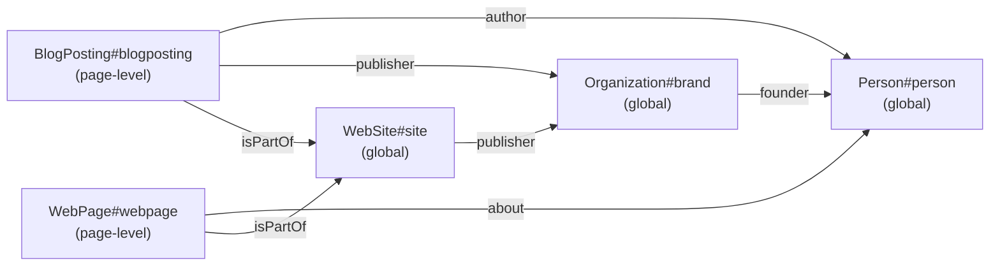

> Most Schema.org guides for blogs teach: put `<script>` with `BlogPosting` on the post, `WebSite` on the homepage, `Person` on the about page. It works, but loses in citability. A crawler sees `Person` from `BlogPosting.author` as "someone named X", not as an entity that is also `founder of #organization`, which is `publisher of #blog`. In the post — a step-by-step breakdown of how to replace per-page inline blocks with a single `@graph` in `BaseLayout`.

---

## 1. Why change — citability vs SERP

Structured data for a developer-blogger is usually associated with one question: "will my post appear in Google with a rich snippet?". Any valid `BlogPosting` is enough for that task — it will pass the Rich Results Test, stars/breadcrumb will appear. And it often ends there: added `@type: BlogPosting`, checked in the validator, forgot about it.

In 2026, structured data has acquired a new, more demanding consumer — **LLM crawler**, which collects content for retrieval-augmented generation and for citation. It doesn't need "another rich snippet", but a **coherent entity graph**: so that when an author is mentioned in one post, it recognizes the same author in another, so that the organization-publisher is the same object across the entire site, so that the blog as an entity links back to the author.

An LLM issuing a citation does roughly the following: extracts a passage, checks the surrounding entity markup, tries to match the author with a known entity. If on a site `Person.name = "Artem Kashuta"` appears in three different Schema.org blocks without a common `@id`, the crawler must guess whether it's one person or three. But if there's one `Person#person` with a stable URI, and all other nodes (`Organization.founder`, `BlogPosting.author`, `Blog.author`) reference it through `{"@id": "..."}` — no guessing needed, the graph is assembled by the author.

This is a problem that keyword density doesn't solve. This is **entity disambiguation**, and it's solved by **graph topology**.

| Aspect                    | Per-page inline blocks              | Single `@graph` with `@id` |
| ------------------------- | ----------------------------------- | -------------------------- |
| Google Rich Results       | works                               | works                      |
| LLM entity match (Person) | guess by name                       | guaranteed via `@id`       |
| Data duplication          | 3-5 copies of `Person` per 14 posts | one source per site        |
| Cost of author edit       | 14 files                            | 1 file (`person.ts`)       |
| HTML weight               | 3+ scripts per page                 | 1 script                   |

For the SERP-only era, the first approach was enough. For the era of AI-overviews, citation graphs, and retrieval-augmented search — you need the second. Our blog's spec states this directly: "move all entity definitions into `src/lib/seo/schema.ts` returning a single `@graph` JSON-LD block; pages contribute a `BlogPosting`/`WebPage` node referencing the global `Person#me` and `Organization#brand` by `@id`" — see `docs/superpowers/specs/2026-05-02-llm-citable-blog-design.md` § "Schema-graph design".

## 2. Antipattern: per-page inline schema

What does a default Astro blog emit, built according to a tutorial from some dev.to? Usually like this:

- In `BaseLayout.astro` there's an inline script with `WebSite` and sometimes `Organization`.
- In `PostLayout.astro` there's another inline script with `BlogPosting`.
- If the author got carried away — a third script is added with `BreadcrumbList`. Sometimes a fourth with `Person`.

Why did this happen — because Astro components are hierarchically inherited, and each level conveniently "adds" its own portion of data through its own `<script>`. This works locally, but doesn't scale well. In our repository before Plan 1, it was exactly this: `BaseLayout` emitted one JSON-LD block, `PostLayout` added two more on top:

```bash
# Pre-Plan 1 (commit 5ed281c~1):
$ git show 5ed281c~1:src/layouts/BaseLayout.astro | grep -c application/ld+json
1
$ git show 5ed281c~1:src/layouts/PostLayout.astro | grep -c application/ld+json
2
```

That is, the post page contained **three** `<script type="application/ld+json">` blocks. Each with its own `Person` (somewhere complete, somewhere truncated), without a common `@id`, without cross-references. A crawler landing on the post saw three unrelated entity clouds.

The main problems with the antipattern:

1. **Duplication of `Person`.** The same author is described 3-5 times. If the author changed `jobTitle` or added `sameAs`, you'd have to edit in all files. Forget one — and the crawler sees a conflict: "Person with this name suddenly has different jobTitle". This is a clear signal-to-noise loss.
2. **Broken graph.** `BlogPosting.publisher` — this is an inline object `{ "@type": "Organization", "name": "..." }`. Somewhere else on the site there's an `Organization` with a `founder` field. Without common `@id`s, the validator doesn't know if it's one publisher or two.
3. **HTML weight.** Three scripts instead of one — this is extra tens of bytes for each, plus payload inflation, especially if the page has several identical fields (e.g. author description repeats four times).
4. **Consistency.** If the author edits `Person.description` in the frontmatter of `about.md`, but in the `BlogPosting` builder it's hardcoded as a literal — desynchronization is inevitable.

## 3. Target architecture — `@graph` with global `@id`

Target model: **one script per page**, inside — `@graph` array. Global nodes (`Person`, `Organization`, `WebSite`) are described once and identified by stable URIs. Page-level nodes (`BlogPosting`, `WebPage`, `CollectionPage`, `CreativeWork`) are added by `BaseLayout` and **reference globals through `@id`**, without duplicating their data.

Topology:



What's important in this picture:

- **All arrows are `{"@id": "..."}` references.** No inline copies.
- **`Person#person` is the root node of the graph.** All entity pages (`/about`, `/now`, `/uses`) do `WebPage.about → Person`. All posts — `BlogPosting.author → Person`. Change `Person`, and everything changes synchronously.
- **Page-level nodes are added, not replacing globals.** Each page brings 1-2 new nodes; `Person`/`Organization`/`WebSite` are always present.

Stable `@id` — this is not the page URL, it's a URI with a fragment, for example `https://artka.dev/#person`, `https://artka.dev/#brand`. This is the convention in JSON-LD: a fragment-id means "this resource is described on any page, but identified by a single URI".

## 4. Implementation in Astro 5

In Astro 5, the SSG/SSR boundary runs exactly through `BaseLayout`: at build time, props are computed, HTML is rendered, inside it — static `<script type="application/ld+json">`. No client-side, no rehydration flicker. The perfect moment to assemble `@graph` functionally.

### 4.1. `graphIds` — URI table

One file that lists all stable identifiers:

```ts
// src/lib/seo/nodes-global.ts
const SITE = "https://artka.dev";

export const graphIds = {
  person: `${SITE}/#person`,
  organization: `${SITE}/#brand`,
  website: `${SITE}/#website`,
  blogRu: `${SITE}/#blog-ru`,
  blogEn: `${SITE}/#blog-en`,
} as const;
```

Every builder that references a global entity imports `graphIds` and uses `{ "@id": graphIds.person }`. No inline literals, no typos in URIs.

### 4.2. Builders — pure functions, no classes

In accordance with the project rule "no classes in application code", each node is a pure function returning `Record<string, unknown>`:

```ts
// src/lib/seo/nodes-global.ts (фрагмент)
export const buildPersonNode = () => {
  const merged = Array.from(new Set<string>([...person.knowsAbout, ...person.expertiseAreas]));
  return {
    "@type": "Person",
    "@id": graphIds.person,
    name: person.name,
    url: person.url,
    image: person.image,
    jobTitle: person.jobTitle,
    description: person.description,
    knowsAbout: merged,
    sameAs: [...person.sameAs],
    email: person.email,
    subjectOf: person.notableWork.map((w) => ({
      "@type": "CreativeWork",
      name: w.title,
      url: w.url,
      description: w.description,
    })),
  };
};

export const buildOrganizationNode = () => ({
  "@type": "Organization",
  "@id": graphIds.organization,
  name: "artka.dev",
  url: SITE,
  logo: { "@type": "ImageObject", url: `${SITE}/favicon.svg` },
  founder: { "@id": graphIds.person },
});
```

`person` is an import from `src/lib/seo/person.ts`, the single source of truth about the author. The builder collects `knowsAbout` and `expertiseAreas` into a `Set` to avoid duplicating keys. `Organization.founder` — an `@id` reference, not an inline copy of `Person`.

### 4.3. Orchestrator — `buildGraph`

A function that glues global and page-level nodes into a single `@graph`:

```ts
// src/lib/seo/schema.ts
import {
  buildPersonNode,
  buildOrganizationNode,
  buildWebSiteNode,
  type Locale,
} from "./nodes-global";

export type GraphNode = Record<string, unknown> & { "@type": string };

export interface GraphInput {
  readonly locale: Locale;
  readonly extraNodes: ReadonlyArray<GraphNode | null>;
}

export interface JsonLdGraph {
  readonly "@context": "https://schema.org";
  readonly "@graph": ReadonlyArray<GraphNode>;
}

export const buildGraph = (input: GraphInput): JsonLdGraph => {
  const globals: GraphNode[] = [
    buildPersonNode(),
    buildOrganizationNode(),
    buildWebSiteNode(input.locale),
  ];
  const extras = input.extraNodes.filter((n): n is GraphNode => n !== null);
  return {
    "@context": "https://schema.org",
    "@graph": [...globals, ...extras],
  };
};
```

The API is minimal: input — locale (to select `inLanguage` for `WebSite`) and a list of additional nodes (`extraNodes`). Output — ready `JsonLdGraph`. `null` nodes are filtered — this is convenient for optional nodes like `FAQPage`, whose builder returns `null` on an empty question array.

### 4.4. `BaseLayout` — the only emission point

The entire site goes through `BaseLayout`, and it — and only it — emits JSON-LD:

```astro
---
// src/layouts/BaseLayout.astro
import { buildGraph, safeJsonLd, type GraphNode } from "~/lib/seo/schema";

interface Props {
  title: string;
  description?: string;
  // ...
  /** Additional JSON-LD nodes to merge into the page @graph. */
  extraSchemaNodes?: ReadonlyArray<GraphNode | null>;
}

const { extraSchemaNodes = [] } = Astro.props;
const locale = getLocaleFromPath(Astro.url.pathname);
---

<head>
  <script
    is:inline
    type="application/ld+json"
    set:html={safeJsonLd(buildGraph({ locale, extraNodes: extraSchemaNodes }))}
  />
</head>
```

Three key details:

1. **`is:inline`** — Astro doesn't try to process the content as a JS module.
2. **`set:html`** — we insert an already-ready string, not letting the framework trim whitespace or escape additionally.
3. **`safeJsonLd`** — a tiny helper that escapes `<`, `>`, `&` so that inside JSON there's no sequence that the HTML parser would take as the end of `</script>`. Without it, malicious (or just unlucky) text in frontmatter could break the page.

```ts
// src/lib/seo/json-ld.ts
export const safeJsonLd = (data: unknown): string =>
  JSON.stringify(data).replace(/</g, "\\u003c").replace(/>/g, "\\u003e").replace(/&/g, "\\u0026");
```

### 4.5. Page-level contract

Each layout/page adds its own nodes via `extraSchemaNodes`. For example, `PostLayout`:

```ts
const excerpt = extractArticleBody(post.body ?? "", 800);

const blogPostingNode = buildBlogPostingNode({
  locale,
  canonical,
  title,
  description,
  pubDate,
  updatedDate: updatedDate ?? null,
  image: absoluteCover,
  keywords: tags,
  articleBody: excerpt.text,
  wordCount: excerpt.fullWordCount,
});

const breadcrumbNode = buildBreadcrumbListNode({
  locale,
  blogIndexLabel: t(locale, "blog.title"),
  title,
});

const faqNode = buildFaqPageNode({ canonical, items: faq ?? [] });
```

```astro
<BaseLayout title={title} extraSchemaNodes={[blogPostingNode, breadcrumbNode, faqNode]}>
  <slot />
</BaseLayout>
```

`/blog`, `/projects/<slug>`, `/tags/<tag>`, `/about` — all use the same contract, differing only in specific builders. One dispatch, zero duplication.

## 5. `articleBody` — why excerpt, not full body

The `articleBody` field in `BlogPosting` is the most valuable part for an LLM crawler: it's an extractable chunk of text that can be cited. And the most dangerous for weight: if you put the entire post in JSON-LD, the HTML page will balloon 2-3 times. The spec formulates the compromise directly: "emit first 800 words of plain-text body … add `wordCount` covering the _full_ body".

The excerpt is extracted via mdast: we parse markdown, remove code blocks, mermaid blocks and inline HTML, concatenate the remaining text, cut at 800 words:

```ts
// src/lib/seo/article-body.ts (фрагмент)
export const extractArticleBody = (markdown: string, maxWords: number) => {
  const tree = unified().use(remarkParse).parse(markdown) as Root;

  const isStrippable = (node: Node): boolean =>
    node.type === "code" || node.type === "inlineCode" || node.type === "html";

  visit(tree, (node, index, parent) => {
    if (parent && typeof index === "number" && isStrippable(node)) {
      (parent as { children: Node[] }).children.splice(index, 1);
      return [SKIP, index];
    }
    return undefined;
  });

  const flat = mdastToString(tree, { includeImageAlt: false }).replace(/\s+/g, " ").trim();
  const words = flat.length > 0 ? flat.split(/\s+/) : [];
  if (words.length <= maxWords) return { text: flat, fullWordCount: words.length };
  return { text: words.slice(0, maxWords).join(" ") + "…", fullWordCount: words.length };
};
```

Why exactly 800 words:

| Length    | Pro                        | Con                                         |
| --------- | -------------------------- | ------------------------------------------- |
| 50 words  | tiny HTML overhead         | one paragraph — too little for LLM citation |
| 800 words | substantial chunk, ~3-5 KB | +3-5 KB to payload                          |
| Full body | maximum context            | double HTML, real performance hit           |

Why via mdast, not regex: posts contain `<details>`, `<table>`, MDX components like `<Faq>`, `<Tldr>`. Regex on `\`\`\`` will break on indent-style code or nested fences. mdast is the only reliable way.

We keep `wordCount` on the full body, not the excerpt — this gives an honest signal to the validator and LLM about the real volume of content.

## 6. `FAQPage` as a side-effect of MDX component

One of Plan 1's design goals — **remove cognitive load on structured data from the author**. The author shouldn't remember that `FAQPage` has `mainEntity`, that inside `Question` you need `acceptedAnswer`, that answer text is escaped. The author should fill in the frontmatter and forget.

Solution: `frontmatter.faq` — the single source. PostLayout reads the array:

```ts
const faqNode = buildFaqPageNode({ canonical, items: faq ?? [] });
```

`buildFaqPageNode` either returns a ready `FAQPage` node or `null` (filtered in `buildGraph`). In parallel, the same array is passed to the `<Faq>` component, which renders visible `<details>` blocks with the same text. One source — two consumers: visual layer and structured layer. Desynchronization is impossible.

The builder is trivial:

```ts
export const buildFaqPageNode = (input: FaqPageInput) => {
  if (input.items.length === 0) return null;
  return {
    "@type": "FAQPage",
    "@id": `${input.canonical}#faq`,
    mainEntity: input.items.map((it) => ({
      "@type": "Question",
      name: it.question,
      acceptedAnswer: { "@type": "Answer", text: it.answer },
    })),
  };
};
```

Frontmatter that the author writes:

```yaml
faq:
  - question: "Чем агент отличается от чат-бота?"
    answer: "Чат-бот — это model.complete(messages): принимает текст…"
```

And that's it. The rest is automation.

## 7. Measurements before/after

After Plan 1, the page `/blog/01-introduction/` has exactly **one** `<script type="application/ld+json">` block. Real measured fact:

```bash
$ grep -c "application/ld+json" dist/client/blog/01-introduction/index.html
1
```

Before Plan 1 (commit `5ed281c~1`) there were two sources of inline scripts:

```bash
$ git show 5ed281c~1:src/layouts/BaseLayout.astro | grep -c application/ld+json  # 1
$ git show 5ed281c~1:src/layouts/PostLayout.astro | grep -c application/ld+json  # 2
```

That is, the post page contained a total of **3 blocks**. It became **1**.

| Metric                                                     | Pre-Plan 1               | Post-Plan 1                 |
| ---------------------------------------------------------- | ------------------------ | --------------------------- |
| `<script type="application/ld+json">` blocks per post page | 3                        | 1                           |
| Overall container                                          | none                     | `@graph`                    |
| Stable `Person@id`                                         | none                     | `https://artka.dev/#person` |
| Cross-references via `@id` between nodes                   | 0                        | 8+                          |
| Single source of truth about author                        | scattered across layouts | `src/lib/seo/person.ts`     |

The actual JSON-LD of the page `/blog/01-introduction/`, extracted from `dist/client/blog/01-introduction/index.html`, looks like this (fragment, `articleBody` truncated to ellipsis, FAQ node shortened):

```json
{
  "@context": "https://schema.org",
  "@graph": [
    {
      "@type": "Person",
      "@id": "https://artka.dev/#person",
      "name": "Артём Кашута",
      "url": "https://artka.dev/about",
      "jobTitle": "Software engineer · backend & AI agent engineering",
      "knowsAbout": ["Claude Code", "AI agent engineering", "Node.js", "TypeScript", "Astro", "…"],
      "email": "a@artka.dev",
      "subjectOf": [
        {
          "@type": "CreativeWork",
          "name": "Claude Code Guide (RU, 14 частей)",
          "url": "https://artka.dev/blog"
        }
      ]
    },
    {
      "@type": "Organization",
      "@id": "https://artka.dev/#brand",
      "name": "artka.dev",
      "logo": { "@type": "ImageObject", "url": "https://artka.dev/favicon.svg" },
      "founder": { "@id": "https://artka.dev/#person" }
    },
    {
      "@type": "WebSite",
      "@id": "https://artka.dev/#website",
      "url": "https://artka.dev",
      "inLanguage": "ru-RU",
      "publisher": { "@id": "https://artka.dev/#brand" },
      "potentialAction": {
        "@type": "SearchAction",
        "target": "https://artka.dev/search?q={search_term_string}",
        "query-input": "required name=search_term_string"
      }
    },
    {
      "@type": "BlogPosting",
      "@id": "https://artka.dev/blog/01-introduction/#blogposting",
      "headline": "01. Что такое Claude Code: harness, agent loop и ваше место в нём",
      "datePublished": "2026-04-23T00:00:00.000Z",
      "author": { "@id": "https://artka.dev/#person" },
      "publisher": { "@id": "https://artka.dev/#brand" },
      "mainEntityOfPage": "https://artka.dev/blog/01-introduction/",
      "inLanguage": "ru-RU",
      "isPartOf": { "@id": "https://artka.dev/#blog-ru" },
      "articleBody": "Перед тем как разбирать skills и subagents, надо договориться о терминах…",
      "wordCount": 574
    },
    {
      "@type": "BreadcrumbList",
      "itemListElement": [
        { "@type": "ListItem", "position": 1, "name": "Главная", "item": "https://artka.dev/" },
        { "@type": "ListItem", "position": 2, "name": "Статьи", "item": "https://artka.dev/blog" },
        { "@type": "ListItem", "position": 3, "name": "01. Что такое Claude Code…" }
      ]
    },
    {
      "@type": "FAQPage",
      "@id": "https://artka.dev/blog/01-introduction/#faq",
      "mainEntity": [
        {
          "@type": "Question",
          "name": "Чем агент отличается от чат-бота?",
          "acceptedAnswer": { "@type": "Answer", "text": "…" }
        }
      ]
    }
  ]
}
```

What you can see with your eyes and what the validator will record:

1. **One `Person`, everything references it.** `Organization.founder`, `BlogPosting.author` — both `{ "@id": "https://artka.dev/#person" }`. No guessing about identity.
2. **`Organization` — public publisher.** `WebSite.publisher` references the same `Organization`. `BlogPosting.publisher` — the same. The graph is connected.
3. **`isPartOf` chain for the blog.** `BlogPosting.isPartOf → Blog#blog-ru → publisher → Organization`. The crawler sees nesting and ownership.
4. **`articleBody` excerpt — substantial.** ~574 words of the post fit into one field. `wordCount` reflects the full volume. LLM gets text for citation, HTML doesn't balloon.
5. **FAQ — together with everything, not separately.** Not a separate script block, but a node of the same `@graph`. Fewer blocks — fewer traps for the parser.

Schema.org validator and Google Rich Results Test accept this `@graph` without remarks _(screenshots — owner to fill)_. The main thing — JSON pretty-prints without `[object Object]`, without unescaped quotes, without broken dates: everything is fine after the `safeJsonLd` wrapper.

---

### What's next

What's described above — **Plan 1** in our repo. Next, we expand the base for new entity types (`/projects/<slug>` via `CreativeWork`, `/uses` via `WebPage.about`), and for the retrieval layer via `llms.txt`. But the foundation — `buildGraph` + stable `@id` — must be laid first.

If you see 2-3 inline JSON-LD scripts on a post page — this is the place to start migration. One file `schema.ts`, one `extraSchemaNodes` prop — and the site transforms from a collection of scattered entity clouds into a coherent citable node.
